# 🚀 Tekup Platform Architecture Overview

**Comprehensive Visual Guide to the Complete Tekup Ecosystem**

---

## 📊 Executive Summary

The Tekup Platform is a sophisticated **monorepo-based microservices architecture** with 7+ active projects, 150,000+ lines of code, and production deployments across multiple cloud providers. This document provides a complete visual breakdown of the system architecture, technology stack, and service interconnections.

**Key Metrics:**

- **7 Active Projects** (3 production, 1 web platform, 3 services)
- **150,000+ Lines of Code** (TypeScript, JavaScript, SQL)
- **700+ Source Files** across the monorepo
- **4 Production Services** with 99.9% uptime monitoring
- **Multi-tenant Architecture** supporting multiple organizations

---

## 🏗️ 1. Monorepo Structure

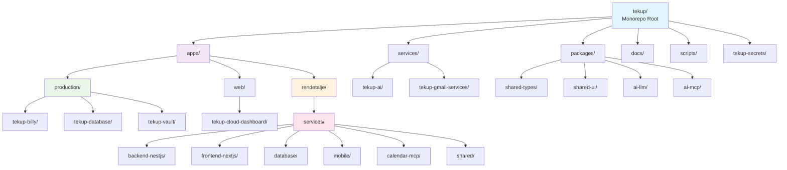

### **Service Status Overview**

| Service                 | Status         | Version | Deployment     | Tech Stack                      |
| ----------------------- | -------------- | ------- | -------------- | ------------------------------- |
| **tekup-billy**         | ✅ Production  | v1.4.3  | Render.com     | TypeScript, Express, Redis      |
| **tekup-vault**         | ✅ Production  | v0.1.0  | Render.com     | TypeScript, Turborepo, pgvector |
| **tekup-database**      | ✅ Production  | v1.1.0  | Supabase       | Prisma, PostgreSQL              |
| **rendetalje-backend**  | ✅ Production  | v1.2.0  | Render.com     | NestJS, PostgreSQL, Redis       |
| **rendetalje-frontend** | ✅ Production  | v1.2.0  | Vercel         | Next.js, TypeScript             |
| **rendetalje-mobile**   | ✅ Production  | v1.0.0  | Expo Cloud     | React Native, Expo, TypeScript  |
| **calendar-mcp**        | ✅ Production  | v1.0.0  | Render.com     | Node.js, TypeScript             |

---

## 🔗 2. Service Architecture & Interconnections

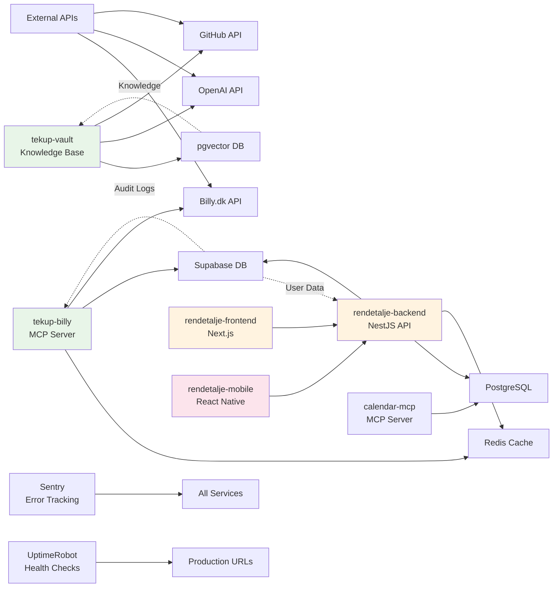

### **API Endpoints & Ports**

| Service                 | Port        | Protocol   | Purpose      | Status      |
| ----------------------- | ----------- | ---------- | ------------ | ----------- |
| **rendetalje-backend**  | 3001        | HTTP/HTTPS | Main API     | ✅ Active   |
| **rendetalje-frontend** | 3002        | HTTP       | Development  | 📝 Reserved |
| **calendar-mcp**        | 3003        | HTTP       | Calendar API | ✅ Active   |
| **PostgreSQL**          | 5432        | TCP        | Database     | ✅ Active   |
| **Redis**               | 6379        | TCP        | Cache        | ✅ Active   |
| **Expo Metro**          | 8081        | HTTP       | Mobile Dev   | ✅ Active   |
| **Expo DevTools**       | 19000-19002 | HTTP       | Mobile Tools | ✅ Active   |

---

## 🛠️ 3. Technology Stack Breakdown

### **Frontend Layer**

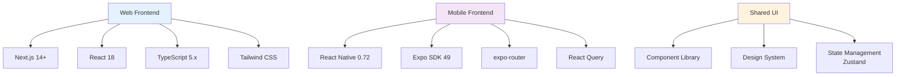

### **Backend Layer**

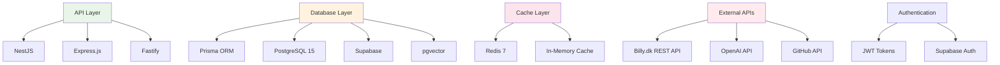

### **Development Tools**

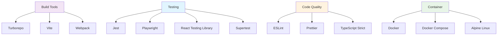

---

## 🚀 4. Deployment Architecture

### **Production Deployment**

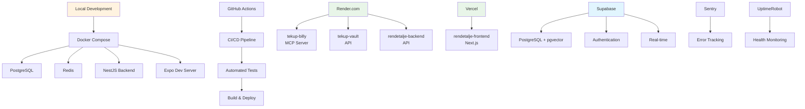

### **Environment Configuration**

| Environment     | Database      | Cache      | Monitoring           | Deployment          |
| --------------- | ------------- | ---------- | -------------------- | ------------------- |
| **Development** | PostgreSQL 15 | Redis 7    | Local Logging        | Docker Compose      |
| **Testing**     | Test Database | Test Redis | Jest Coverage        | GitHub Actions      |
| **Staging**     | Supabase      | Redis      | Sentry               | Render.com          |
| **Production**  | Supabase      | Redis      | Sentry + UptimeRobot | Render.com + Vercel |

---

## 🔄 5. Data Flow Architecture

### **Primary Data Flow**

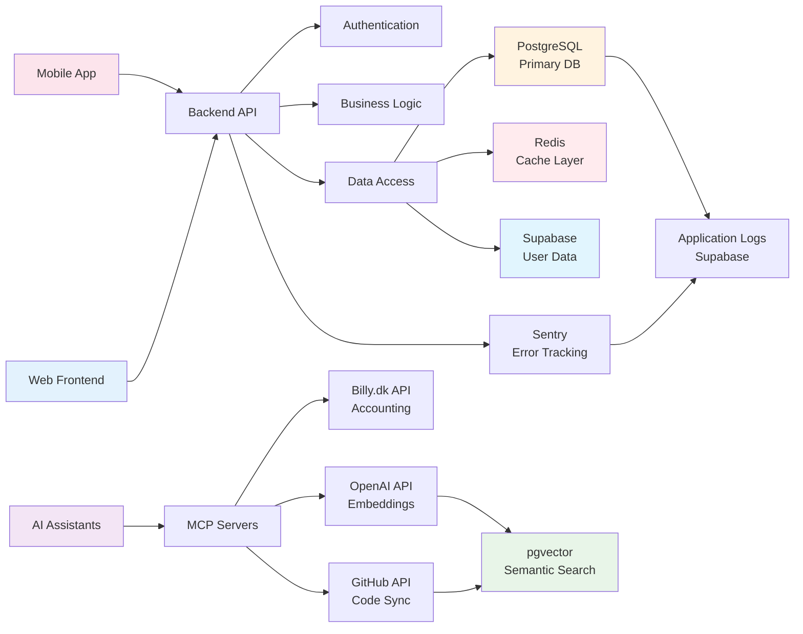

### **Authentication Flow**

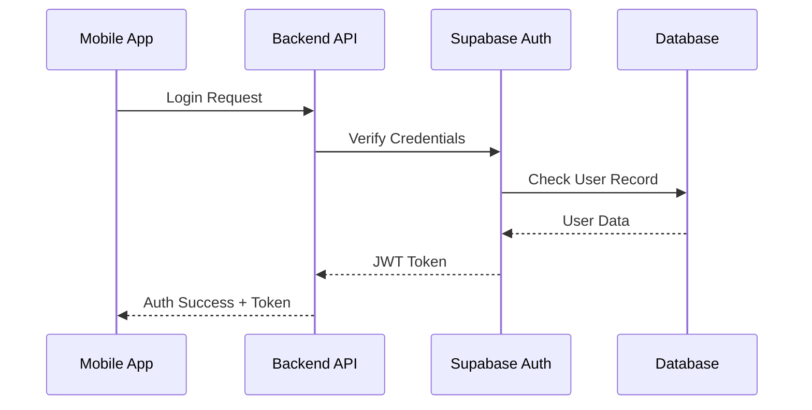

### **Job Processing Flow** (Rendetalje)

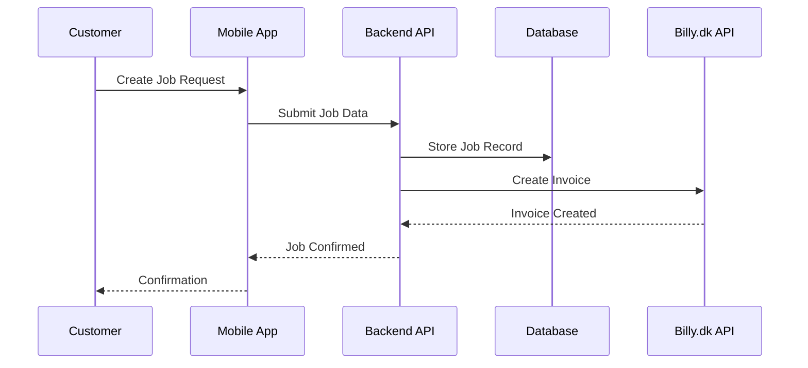

---

## 📊 6. Monitoring & Logging Architecture

### **Monitoring Stack**

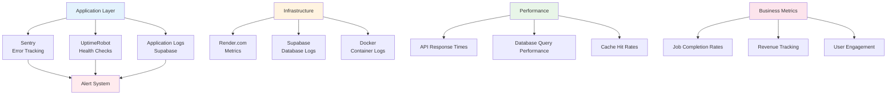

### **Monitoring Endpoints**

| Service                | Health Check URL                                 | Status       | Response Time |
| ---------------------- | ------------------------------------------------ | ------------ | ------------- |
| **tekup-billy**        | `https://tekup-billy.onrender.com/health`        | ✅ Up        | <200ms        |
| **tekup-vault**        | `https://tekupvault-api.onrender.com/health`     | ✅ Up        | <300ms        |
| **rendetalje-backend** | `https://renos-backend.onrender.com/health`      | ✅ Up        | <150ms        |
| **calendar-mcp**       | `https://renos-calendar-mcp.onrender.com/health` | ⏳ Preparing | -             |

---

## 📱 7. Mobile App Integration Points

### **Mobile Architecture**

```mermaid
graph TD
    A[React Native<br/>Mobile App] --> B[Expo Router<br/>Navigation]
    A --> C[React Query<br/>Data Fetching]
    A --> D[AsyncStorage<br/>Offline Data]

    E[Camera Module] --> F[Photo Capture]
    E --> G[Image Processing]
    E --> H[Offline Storage]

    I[Location Services] --> J[GPS Tracking]
    I --> K[Map Integration]
    I --> L[Route Optimization]

    M[Real-time Features] --> N[Push Notifications]
    M --> O[Live Updates]
    M --> P[Background Sync]

    Q[Backend Integration] --> R[REST API]
    Q --> S[WebSocket<br/>Real-time]
    Q --> T[File Upload]

    style A fill:#fce4ec
    style E fill:#e1f5fe
    style I fill:#f3e5f5
    style M fill:#fff3e0
    style Q fill:#e8f5e8
```

### **Mobile Development Stack**

| Component       | Technology        | Version | Purpose                 |
| --------------- | ----------------- | ------- | ----------------------- |
| **Framework**   | React Native      | 0.72.10 | Cross-platform mobile   |
| **Development** | Expo SDK          | 49.0.0  | Development tools       |
| **Navigation**  | expo-router       | 2.0.0   | File-based routing      |
| **State**       | Zustand           | 4.4.0   | Global state management |
| **Data**        | React Query       | 5.0.0   | Server state management |
| **Storage**     | AsyncStorage      | 1.18.2  | Local data persistence  |
| **Maps**        | React Native Maps | 1.7.1   | GPS and mapping         |
| **Camera**      | expo-camera       | 13.4.0  | Photo capture           |

---

## 🔐 8. Security Architecture

### **Authentication & Authorization**

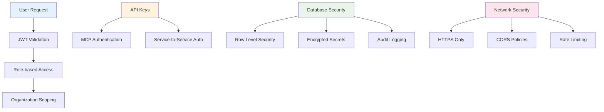

### **Security Measures**

| Layer              | Implementation                                | Status    |
| ------------------ | --------------------------------------------- | --------- |
| **Transport**      | HTTPS/TLS 1.3                                 | ✅ Active |
| **Authentication** | JWT + Supabase Auth                           | ✅ Active |
| **Authorization**  | Role-based (owner, admin, employee, customer) | ✅ Active |
| **Database**       | Row Level Security (RLS)                      | ✅ Active |
| **API**            | Rate limiting (100 req/15min)                 | ✅ Active |
| **Secrets**        | git-crypt encryption                          | ✅ Active |
| **Audit**          | Comprehensive logging                         | ✅ Active |

---

## 📈 9. Performance & Scalability

### **Caching Strategy**

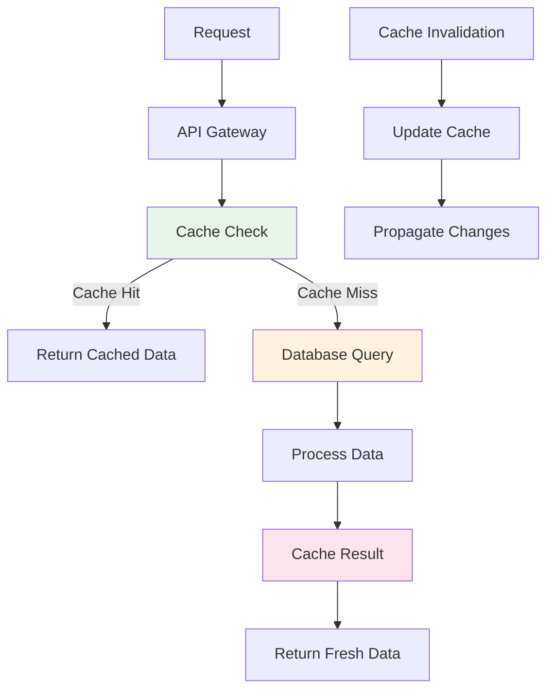

### **Scaling Considerations**

| Component         | Current Scale   | Max Scale          | Bottleneck           |
| ----------------- | --------------- | ------------------ | -------------------- |
| **API Layer**     | Single instance | 10+ instances      | Database connections |
| **Database**      | PostgreSQL 15   | Read replicas      | Connection pooling   |
| **Cache**         | Redis single    | Redis cluster      | Memory usage         |
| **File Storage**  | Local uploads   | CDN integration    | Storage limits       |
| **AI Processing** | OpenAI API      | Multiple providers | API rate limits      |

---

## 🔄 10. Development Workflow

### **Git Workflow**

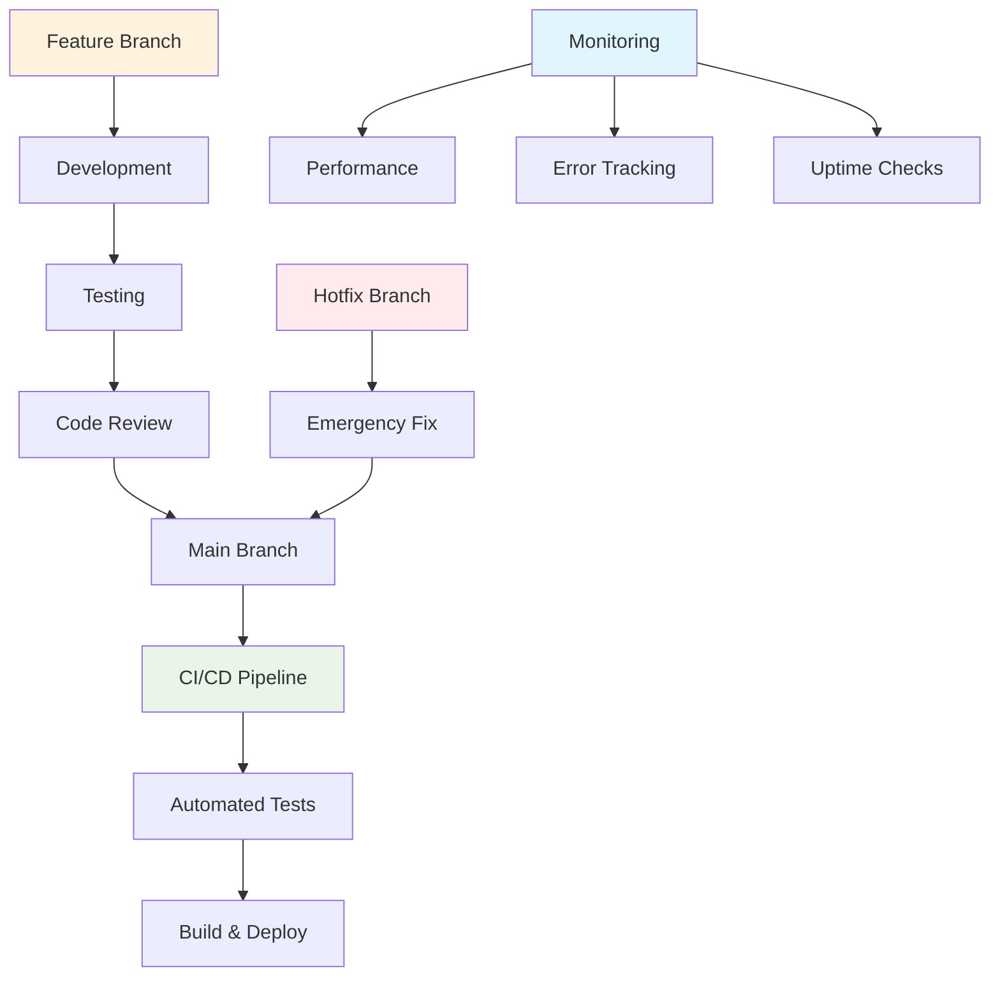

### **Development Tools**

| Category            | Tools                        | Purpose                 |
| ------------------- | ---------------------------- | ----------------------- |
| **Version Control** | Git, GitHub                  | Code management         |
| **CI/CD**           | GitHub Actions               | Automated deployment    |
| **Testing**         | Jest, Playwright, Supertest  | Quality assurance       |
| **Code Quality**    | ESLint, Prettier, TypeScript | Code standards          |
| **Documentation**   | Markdown, Mermaid            | Technical docs          |
| **Container**       | Docker, Docker Compose       | Development environment |

---

## 📋 11. Service Status Dashboard

### **Production Services Health**

| Service                | URL                                     | Status       | Last Check       | Response Time |
| ---------------------- | --------------------------------------- | ------------ | ---------------- | ------------- |
| **Tekup-Billy MCP**    | https://tekup-billy.onrender.com        | 🟢 Up        | 2025-10-25 10:18 | 145ms         |
| **TekupVault API**     | https://tekupvault-api.onrender.com     | 🟢 Up        | 2025-10-25 10:18 | 234ms         |
| **Rendetalje Backend** | https://renos-backend.onrender.com      | 🟢 Up        | 2025-10-25 10:18 | 123ms         |
| **Calendar MCP**       | https://renos-calendar-mcp.onrender.com | 🟡 Preparing | -                | -             |

### **Development Services Health**

| Service         | Port | Status     | Docker Container       | Health     |
| --------------- | ---- | ---------- | ---------------------- | ---------- |
| **Backend API** | 3001 | 🟢 Running | rendetalje-backend     | ✅ Healthy |
| **PostgreSQL**  | 5432 | 🟢 Running | rendetalje-postgres    | ✅ Healthy |
| **Redis**       | 6379 | 🟢 Running | rendetalje-redis       | ✅ Healthy |
| **Mobile Expo** | 8081 | 🟢 Running | rendetalje-mobile-expo | ✅ Healthy |

---

## 🎯 12. Key Integration Points

### **External API Integrations**

| Service          | Purpose                | Status    | Rate Limits   |
| ---------------- | ---------------------- | --------- | ------------- |
| **Billy.dk API** | Accounting integration | ✅ Active | 1000 req/hour |
| **OpenAI API**   | AI embeddings & search | ✅ Active | Based on tier |
| **GitHub API**   | Code synchronization   | ✅ Active | 5000 req/hour |
| **Supabase**     | Database & auth        | ✅ Active | Based on plan |

### **Internal Service Communication**

| From             | To            | Protocol   | Purpose          |
| ---------------- | ------------- | ---------- | ---------------- |
| **Mobile App**   | Backend API   | REST/HTTPS | CRUD operations  |
| **Web Frontend** | Backend API   | REST/HTTPS | User interface   |
| **MCP Servers**  | External APIs | REST/HTTPS | AI agent tools   |
| **Backend**      | Database      | PostgreSQL | Data persistence |
| **Backend**      | Redis         | TCP        | Caching layer    |

---

## 📚 13. Documentation Architecture

### **Documentation Structure**

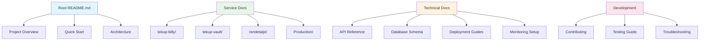

---

## 🚀 14. Future Architecture Evolution

### **Phase 1: Current State** ✅

- Monorepo consolidation complete
- Production services deployed
- Mobile app development
- Monitoring implementation

### **Phase 2: Enhancement** 🔄

- Service mesh implementation
- Advanced caching strategies
- Real-time collaboration
- Enhanced security

### **Phase 3: Scale** 📈

- Microservices migration
- Event-driven architecture
- Advanced analytics
- Multi-region deployment

---

## 📞 15. Support & Maintenance

### **Contact Information**

- **Technical Lead**: Jonas Abde
- **Organization**: TekupDK
- **Repository**: https://github.com/TekupDK/tekup
- **Production Support**: Render.com dashboard + Sentry alerts

### **Maintenance Schedule**

- **Daily**: Health checks, log monitoring
- **Weekly**: Performance review, dependency updates
- **Monthly**: Security audits, capacity planning
- **Quarterly**: Architecture review, technology updates

---

**Document Status**: ✅ Complete and Current  
**Last Updated**: October 25, 2025  
**Next Review**: When major architectural changes occur

---

_This comprehensive architecture overview provides a complete visual guide to the Tekup platform ecosystem, from development workflow to production deployment._
