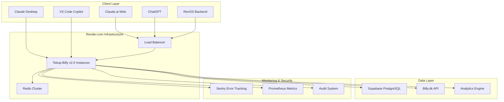

# Design Document

## Overview

Tekup-Billy MCP Server v2.0 represents a comprehensive enhancement of the existing production-ready v1.4.2 system. The design focuses on performance optimization, enterprise-grade features, advanced analytics, and improved developer experience while maintaining backward compatibility and leveraging the existing Render.com deployment infrastructure.

The enhanced system will continue to run on Render.com with improved horizontal scaling capabilities, enhanced monitoring, and advanced caching strategies.

## Architecture

### High-Level Architecture



### Core Components Enhancement

#### 1. Enhanced MCP Server Core

- **Current**: Single-instance stdio/HTTP server
- **Enhanced**: Multi-instance with Redis-based session management
- **Deployment**: Render.com with auto-scaling (2-10 instances)
- **Features**: Zero-downtime deployments, health checks, graceful shutdown

#### 2. Advanced Caching Layer

- **Current**: Supabase-based caching with 5-minute TTL
- **Enhanced**: Multi-tier caching with Redis Cluster
- **Deployment**: Render Redis addon with clustering support
- **Features**: Intelligent cache invalidation, cache warming, distributed locks

#### 3. Enhanced Billy.dk Client

- **Current**: HTTP keep-alive with rate limiting
- **Enhanced**: Circuit breaker, retry policies, connection pooling
- **Features**: Exponential backoff with jitter, request deduplication, bulk operations

#### 4. Advanced Analytics Engine

- **New Component**: Real-time data processing and ML capabilities
- **Deployment**: Separate Render service for analytics workloads
- **Features**: Predictive analytics, anomaly detection, custom metrics

## Components and Interfaces

### 1. Enhanced Server Architecture

```typescript
// Enhanced server with horizontal scaling support
class TekupBillyServerV2 {
  private server: McpServer;
  private redisClient: Redis;
  private circuitBreaker: CircuitBreaker;
  private analyticsEngine: AnalyticsEngine;
  private healthMonitor: HealthMonitor;

  // Enhanced initialization with dependency health checks
  async initialize(): Promise<void>;

  // Graceful shutdown with connection draining
  async shutdown(): Promise<void>;

  // Health check endpoint for Render.com
  async healthCheck(): Promise<HealthStatus>;
}
```

### 2. Advanced Cache Manager

```typescript
// Multi-tier caching with Redis Cluster support
class AdvancedCacheManager {
  private redisCluster: RedisCluster;
  private supabaseCache: SupabaseCache;
  private localCache: LRUCache;

  // Intelligent cache strategy selection
  async get<T>(key: string, options?: CacheOptions): Promise<T | null>;

  // Distributed cache invalidation
  async invalidate(pattern: string): Promise<void>;

  // Cache warming for frequently accessed data
  async warmCache(organizationId: string): Promise<void>;
}
```

### 3. Enhanced Billy Client with Circuit Breaker

```typescript
// Resilient Billy.dk API client
class EnhancedBillyClient extends BillyClient {
  private circuitBreaker: CircuitBreaker;
  private retryPolicy: RetryPolicy;
  private requestDeduplicator: RequestDeduplicator;

  // Bulk operations with batching
  async bulkCreateInvoices(
    invoices: CreateInvoiceInput[]
  ): Promise<BillyInvoice[]>;

  // Request deduplication for concurrent requests
  async makeRequestWithDeduplication<T>(request: ApiRequest): Promise<T>;

  // Intelligent retry with exponential backoff
  async executeWithRetry<T>(operation: () => Promise<T>): Promise<T>;
}
```

### 4. Analytics Engine

```typescript
// Advanced analytics and ML capabilities
class AnalyticsEngine {
  private mlModels: Map<string, MLModel>;
  private dataProcessor: DataProcessor;

  // Predictive revenue forecasting
  async predictRevenue(
    organizationId: string,
    timeframe: string
  ): Promise<RevenueForecast>;

  // Anomaly detection in usage patterns
  async detectAnomalies(data: UsageData[]): Promise<Anomaly[]>;

  // Custom metric calculations
  async calculateCustomMetrics(
    definition: MetricDefinition
  ): Promise<MetricResult>;
}
```

### 5. Enhanced Monitoring System

```typescript
// Comprehensive health monitoring
class HealthMonitor {
  private dependencies: Map<string, HealthCheck>;
  private metrics: PrometheusRegistry;

  // Dependency health checks
  async checkDependencies(): Promise<DependencyStatus[]>;

  // Performance metrics collection
  async collectMetrics(): Promise<MetricsSnapshot>;

  // Auto-scaling recommendations
  async getScalingRecommendations(): Promise<ScalingAdvice>;
}
```

## Data Models

### Enhanced Audit Schema

```sql
-- Enhanced audit logging with correlation IDs
CREATE TABLE billy_audit_logs_v2 (
  id UUID PRIMARY KEY DEFAULT gen_random_uuid(),
  correlation_id UUID NOT NULL,
  organization_id UUID NOT NULL,
  user_id TEXT,
  tool_name TEXT NOT NULL,
  action TEXT NOT NULL,
  success BOOLEAN NOT NULL,
  duration_ms INTEGER NOT NULL,
  input_params JSONB,
  output_data JSONB,
  error_message TEXT,
  error_code TEXT,
  ip_address INET,
  user_agent TEXT,
  request_id TEXT,
  trace_id TEXT,
  created_at TIMESTAMPTZ DEFAULT NOW(),

  -- Performance indexes
  INDEX idx_audit_org_tool (organization_id, tool_name),
  INDEX idx_audit_correlation (correlation_id),
  INDEX idx_audit_created (created_at)
);
```

### Analytics Data Models

```sql
-- Usage patterns and trends
CREATE TABLE billy_usage_patterns (
  id UUID PRIMARY KEY DEFAULT gen_random_uuid(),
  organization_id UUID NOT NULL,
  pattern_type TEXT NOT NULL, -- 'daily', 'weekly', 'seasonal'
  pattern_data JSONB NOT NULL,
  confidence_score DECIMAL(3,2),
  created_at TIMESTAMPTZ DEFAULT NOW(),
  updated_at TIMESTAMPTZ DEFAULT NOW()
);

-- Predictive models and forecasts
CREATE TABLE billy_forecasts (
  id UUID PRIMARY KEY DEFAULT gen_random_uuid(),
  organization_id UUID NOT NULL,
  forecast_type TEXT NOT NULL, -- 'revenue', 'usage', 'growth'
  time_horizon TEXT NOT NULL, -- '1month', '3months', '1year'
  forecast_data JSONB NOT NULL,
  accuracy_score DECIMAL(3,2),
  model_version TEXT NOT NULL,
  created_at TIMESTAMPTZ DEFAULT NOW()
);
```

### Enhanced Caching Schema

```sql
-- Distributed cache with Redis integration
CREATE TABLE billy_cache_metadata (
  cache_key TEXT PRIMARY KEY,
  organization_id UUID NOT NULL,
  cache_tier TEXT NOT NULL, -- 'redis', 'supabase', 'local'
  ttl_seconds INTEGER NOT NULL,
  hit_count INTEGER DEFAULT 0,
  last_accessed TIMESTAMPTZ DEFAULT NOW(),
  created_at TIMESTAMPTZ DEFAULT NOW()
);
```

## Error Handling

### Enhanced Error Management

#### 1. Structured Error Responses

```typescript
interface EnhancedError {
  code: string;
  message: string;
  correlationId: string;
  timestamp: string;
  context: {
    organizationId: string;
    toolName: string;
    action: string;
  };
  details?: {
    billyApiError?: BillyApiError;
    validationErrors?: ValidationError[];
    retryable: boolean;
    retryAfter?: number;
  };
}
```

#### 2. Circuit Breaker Configuration

```typescript
const circuitBreakerConfig = {
  timeout: 30000,
  errorThresholdPercentage: 50,
  resetTimeout: 60000,
  rollingCountTimeout: 10000,
  rollingCountBuckets: 10,
  name: "billy-api",
  fallback: (error) => getCachedResponse(error.request),
};
```

#### 3. Retry Policy with Exponential Backoff

```typescript
const retryPolicy = {
  retries: 3,
  factor: 2,
  minTimeout: 1000,
  maxTimeout: 30000,
  randomize: true,
  retryCondition: (error) => {
    return (
      error.response?.status >= 500 ||
      error.code === "ECONNRESET" ||
      error.code === "ETIMEDOUT"
    );
  },
};
```

## Testing Strategy

### 1. Enhanced Integration Testing

- **Render Environment Testing**: Automated tests against Render.com staging environment
- **Redis Cluster Testing**: Cache consistency and failover scenarios
- **Load Testing**: Performance testing with multiple concurrent users
- **Chaos Engineering**: Fault injection and recovery testing

### 2. Performance Testing

```typescript
// Performance benchmarks for Render deployment
const performanceTargets = {
  responseTime: {
    p50: 200, // ms
    p95: 500, // ms
    p99: 1000, // ms
  },
  throughput: {
    requestsPerSecond: 100,
    concurrentUsers: 50,
  },
  availability: {
    uptime: 99.9, // %
    errorRate: 0.1, // %
  },
};
```

### 3. Monitoring and Alerting

```typescript
// Render.com specific monitoring
const monitoringConfig = {
  healthChecks: {
    endpoint: "/health",
    interval: 30, // seconds
    timeout: 10, // seconds
    retries: 3,
  },
  alerts: {
    highErrorRate: { threshold: 5, window: "5m" },
    highLatency: { threshold: 1000, window: "5m" },
    lowAvailability: { threshold: 99, window: "15m" },
  },
  scaling: {
    minInstances: 2,
    maxInstances: 10,
    cpuThreshold: 70, // %
    memoryThreshold: 80, // %
  },
};
```

## Deployment Architecture

### Render.com Infrastructure

#### 1. Main Application Service

```yaml
# render.yaml enhancement
services:
  - type: web
    name: tekup-billy-v2
    env: node
    plan: pro # Enhanced plan for better performance
    region: oregon
    buildCommand: npm run build
    startCommand: npm run start:http
    healthCheckPath: /health
    autoDeploy: true
    envVars:
      - key: NODE_ENV
        value: production
      - key: REDIS_URL
        fromService:
          type: redis
          name: tekup-billy-cache
    scaling:
      minInstances: 2
      maxInstances: 10
      targetCPU: 70
      targetMemory: 80
```

#### 2. Redis Cache Service

```yaml
- type: redis
  name: tekup-billy-cache
  plan: pro # Redis Pro for clustering
  region: oregon
  maxmemoryPolicy: allkeys-lru
```

#### 3. Analytics Service

```yaml
- type: web
  name: tekup-billy-analytics
  env: node
  plan: standard
  buildCommand: npm run build:analytics
  startCommand: npm run start:analytics
  envVars:
    - key: ANALYTICS_MODE
      value: true
```

### Environment Configuration

#### Production Environment Variables (Render)

```bash
# Core Configuration
NODE_ENV=production
PORT=3000

# Billy.dk API
BILLY_API_KEY=<encrypted>
BILLY_ORGANIZATION_ID=pmf9tU56RoyZdcX3k69z1g
BILLY_API_BASE=https://api.billysbilling.com/v2

# Enhanced Caching
REDIS_URL=<render-redis-url>
CACHE_TTL_MINUTES=5
CACHE_STRATEGY=multi-tier

# Monitoring & Analytics
SENTRY_DSN=<sentry-dsn>
PROMETHEUS_ENABLED=true
ANALYTICS_ENABLED=true

# Performance Tuning
MAX_CONCURRENT_REQUESTS=100
REQUEST_TIMEOUT=30000
CIRCUIT_BREAKER_ENABLED=true

# Security
ENCRYPTION_KEY=<32-char-key>
ENCRYPTION_SALT=<16-char-salt>
MCP_API_KEY=<api-key>
```

## Security Enhancements

### 1. Enhanced Encryption

- **AES-256-GCM with key rotation**: Automatic key rotation every 90 days
- **Secrets management**: Integration with Render environment groups
- **PII filtering**: Advanced regex patterns for sensitive data detection

### 2. Authentication & Authorization

```typescript
// Multi-factor authentication support
interface AuthenticationConfig {
  methods: ["api-key", "oauth2", "jwt"];
  mfa: {
    enabled: boolean;
    providers: ["totp", "sms"];
  };
  sessionManagement: {
    timeout: number;
    refreshEnabled: boolean;
  };
}
```

### 3. Compliance Features

- **GDPR compliance**: Automated data retention and deletion
- **Audit trail integrity**: Cryptographic signatures for audit logs
- **Data anonymization**: Automatic PII redaction in logs and analytics

## Performance Optimizations

### 1. Render.com Specific Optimizations

- **HTTP/2 support**: Enhanced connection multiplexing
- **Compression**: Brotli compression for API responses
- **CDN integration**: Static asset caching via Render CDN
- **Connection pooling**: Optimized for Render's network architecture

### 2. Database Optimizations

- **Connection pooling**: Supabase connection optimization
- **Query optimization**: Indexed queries for audit logs and cache
- **Read replicas**: Separate read/write operations for analytics

### 3. Caching Strategy

```typescript
// Multi-tier caching optimized for Render
const cachingStrategy = {
  tiers: [
    { name: "local", ttl: 60, size: "100MB" },
    { name: "redis", ttl: 300, cluster: true },
    { name: "supabase", ttl: 3600, persistent: true },
  ],
  policies: {
    invoices: "write-through",
    customers: "write-behind",
    products: "cache-aside",
  },
};
```

## Migration Strategy

### Phase 1: Infrastructure Enhancement (Week 1-2)

1. **Redis integration**: Deploy Redis cluster on Render
2. **Enhanced monitoring**: Implement Prometheus metrics
3. **Circuit breaker**: Add resilience patterns
4. **Performance testing**: Baseline current performance

### Phase 2: Analytics Engine (Week 3-4)

1. **Analytics service**: Deploy separate analytics service
2. **ML models**: Implement predictive analytics
3. **Custom metrics**: Add business intelligence features
4. **Dashboard integration**: Connect to monitoring systems

### Phase 3: Advanced Features (Week 5-6)

1. **Enhanced security**: Implement advanced encryption
2. **Bulk operations**: Add batch processing capabilities
3. **Advanced caching**: Multi-tier cache implementation
4. **Auto-scaling**: Configure intelligent scaling rules

### Backward Compatibility

- **API compatibility**: All existing MCP tools remain unchanged
- **Configuration**: Existing environment variables supported
- **Data migration**: Automatic migration of existing cache and audit data
- **Rollback plan**: Blue-green deployment with instant rollback capability

This design leverages Render.com's infrastructure capabilities while providing enterprise-grade enhancements that maintain the system's reliability and performance in production.
