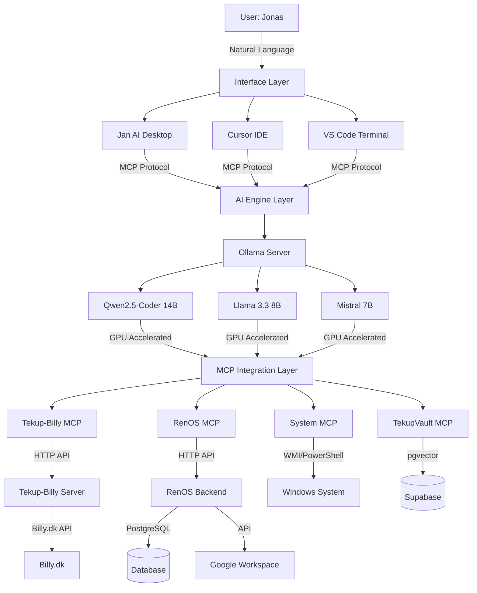
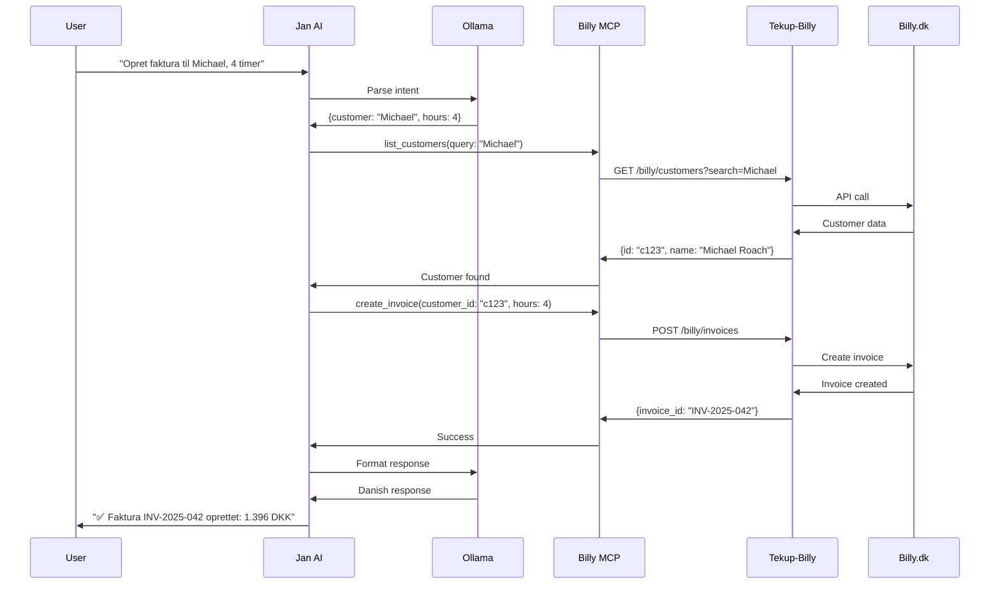
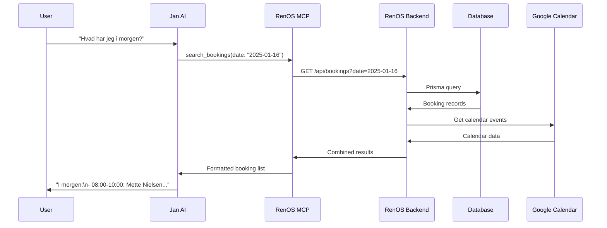

# 🏗️ TekUp AI Assistant - Architecture

System overview og teknisk arkitektur for TekUp AI Assistant projektet.

## 🎯 High-Level Overview



---

## 📦 Component Breakdown

### 1. Interface Layer

**Purpose:** Brugerinteraktion med AI-assistenten

#### Jan AI Desktop
- **Type:** Electron-based desktop app
- **Features:**
  - Chat interface (ChatGPT-like)
  - Model selection
  - Conversation history
  - Settings management
- **Communication:** WebSocket til Ollama
- **Port:** N/A (desktop app)

#### Cursor IDE
- **Type:** VS Code fork med AI integration
- **Features:**
  - Code completion
  - Inline chat
  - Terminal commands
- **Communication:** Built-in MCP support
- **Use Case:** Development workflow

#### VS Code Terminal
- **Type:** Command-line interface
- **Features:**
  - Quick commands
  - Script execution
  - Background tasks
- **Communication:** Direct Ollama API calls

---

### 2. AI Engine Layer

**Purpose:** Local AI model inference

#### Ollama Server
- **Version:** 0.x.x
- **Protocol:** HTTP REST API
- **Default Port:** 11434
- **Endpoints:**
  - `POST /api/generate` - Text generation
  - `POST /api/chat` - Chat completion
  - `GET /api/tags` - List models
  - `POST /api/pull` - Download models

**Configuration:**
```bash
# Location: C:\Users\empir\.ollama\
# Models: C:\Users\empir\.ollama\models\
# Logs: Event Viewer → Windows Logs → Application
```

#### Model Selection Strategy

| Scenario | Model | Why |
|----------|-------|-----|
| Code writing/debugging | Qwen2.5-Coder 14B | Specialized for code, excellent TypeScript |
| Business questions | Llama 3.3 8B | Good reasoning, balanced speed/quality |
| Quick facts | Mistral 7B | Fast responses, lower resource usage |
| Danish language | Llama 3.3 8B | Better multilingual support |

**Hardware Utilization:**
```
RTX 5070 (8GB VRAM):
├── Qwen 14B Q4: ~7GB VRAM, ~50% GPU utilization
├── Llama 8B Q5: ~5GB VRAM, ~40% GPU utilization
└── Mistral 7B Q4: ~3.5GB VRAM, ~30% GPU utilization

64GB System RAM:
├── OS + Apps: ~8GB
├── Ollama overhead: ~2GB
├── Model context: ~4-8GB (depending on conversation length)
└── Available: ~40GB (plenty of headroom)
```

---

### 3. MCP Integration Layer

**Purpose:** Oversætter mellem AI og eksterne services

#### Model Context Protocol (MCP)

**What is MCP?**
- Open standard fra Anthropic
- JSON-RPC baseret
- AI-first design
- Self-documenting tools

**MCP Message Flow:**
```
User: "Opret faktura til Michael Roach, 4 timer"
    ↓
Jan AI parses intent
    ↓
Calls MCP: list_tools()
    → Sees: create_invoice, list_customers
    ↓
Calls MCP: call_tool(name="list_customers", args={query:"Michael Roach"})
    → Returns: {id: "c123", name: "Michael Roach"}
    ↓
Calls MCP: call_tool(name="create_invoice", args={customer_id:"c123", hours:4})
    → Returns: {invoice_id: "INV-2025-042", amount: 1396}
    ↓
Jan AI formats response
    ↓
User sees: "✅ Faktura INV-2025-042 oprettet: 1.396 DKK"
```

---

### 4. External Systems Integration

#### Tekup-Billy (Existing)
**Status:** ✅ Already deployed  
**URL:** https://tekup-billy.onrender.com  
**Version:** v1.2.0

**Architecture:**
```
TekUp AI Assistant
    ↓ HTTP POST
Tekup-Billy MCP Wrapper
    ↓ HTTP
Tekup-Billy Server (Node.js)
    ↓ Billy.dk API
Billy.dk Platform
```

**Key Endpoints:**
- `POST /billy/invoices` - Create invoice
- `GET /billy/customers` - List customers
- `GET /billy/products` - List products
- `GET /billy/revenue` - Get revenue data

**Authentication:** Bearer token (from env vars)

---

#### RenOS Backend (Existing)
**Status:** ✅ Already deployed  
**Tech Stack:** Node.js + TypeScript + Prisma

**Architecture:**
```
TekUp AI Assistant
    ↓ HTTP
RenOS MCP Wrapper
    ↓ REST API
RenOS Backend (Express)
    ↓ Prisma ORM
PostgreSQL Database
```

**Key Endpoints:**
- `GET /api/bookings` - List/search bookings
- `POST /api/bookings` - Create booking
- `GET /api/customers/:id` - Get customer
- `GET /api/calendar` - Get calendar events

**Database Schema (Prisma):**
```prisma
model Booking {
  id            String   @id @default(cuid())
  customerId    String
  serviceType   String
  startTime     DateTime
  durationHours Int
  status        String
  address       String?
  accessCode    String?
  notes         String?
  createdAt     DateTime @default(now())
  updatedAt     DateTime @updatedAt
  
  customer Customer @relation(fields: [customerId], references: [id])
}

model Customer {
  id       String    @id @default(cuid())
  name     String
  email    String?
  phone    String?
  address  String?
  bookings Booking[]
}
```

---

#### Google Workspace Integration

**Via RenOS (Preferred):**
```
TekUp AI → RenOS Backend → Google Calendar API
                         → Gmail API
```

**Direct (Alternative):**
```
TekUp AI → Google OAuth2 → Calendar/Gmail
```

**Preferred approach:** Via RenOS (authentication already handled)

---

### 5. System Monitoring

#### Windows Performance Monitoring

**Data Sources:**
- WMI (Windows Management Instrumentation)
- Performance Counters
- Event Logs
- Task Manager data

**Metrics Collected:**
```powershell
# Chrome RAM usage
Get-Process chrome | Measure-Object WorkingSet -Sum

# GPU utilization (NVIDIA)
nvidia-smi --query-gpu=utilization.gpu --format=csv

# Disk I/O
Get-Counter '\PhysicalDisk(_Total)\Disk Bytes/sec'
```

**Alert Thresholds:**
- Chrome RAM >10GB → Suggest tab suspension
- GPU usage >95% for 5+ min → Thermal warning
- Disk usage >90% → Cleanup suggestion

---

## 🔄 Data Flow Examples

### Example 1: Invoice Creation



**Timeline:**
- User input: 0s
- AI parsing: 0-2s
- MCP calls: 2-4s (2 API calls)
- AI formatting: 4-5s
- **Total: ~5 seconds**

---

### Example 2: Calendar Check



---

## 🔐 Security Architecture

### Authentication Flow

```
User credentials → RenOS Backend
                 → Stored in .env (encrypted)
                 → Never exposed to AI
                 
Billy.dk API key → Tekup-Billy .env
                 → Not in version control
                 → Rotated quarterly

Google OAuth2 → RenOS handles
              → Refresh tokens managed
              → Scoped permissions only
```

### Data Privacy

**Local-First Design:**
- ✅ All AI models run locally (no cloud API calls)
- ✅ Customer data stays in your database
- ✅ Conversations stored locally only
- ✅ No telemetry to external services

**GDPR Compliance:**
- Right to erasure: Delete conversation history
- Data minimization: Only fetch needed data
- Purpose limitation: AI only accesses data for specified tasks
- Audit trail: All MCP calls logged

---

## 📊 Performance Characteristics

### Latency Breakdown

| Component | Latency | Notes |
|-----------|---------|-------|
| User input → Jan AI | <50ms | Local UI |
| Jan AI → Ollama | 50-100ms | HTTP localhost |
| Ollama inference | 2-5s | GPU dependent |
| MCP call | 200-500ms | Network + API |
| Total (simple query) | 3-6s | Acceptable |
| Total (multi-API) | 5-10s | Multiple MCP calls |

### Scalability

**Current Setup:**
- Single user (Jonas)
- Local execution only
- No concurrent requests

**Future (if needed):**
- Multi-user: Deploy Ollama on server
- Concurrent: Queue system for requests
- Caching: Store common MCP responses

---

## 🛠️ Development vs Production

### Current (Development)

```
Laptop (Local)
├── Ollama (localhost:11434)
├── Jan AI (desktop app)
└── MCP configs (local files)

Remote Services
├── Tekup-Billy (Render.com)
├── RenOS Backend (Render.com)
└── Billy.dk (cloud)
```

### Future (Production - Optional)

```
Desktop (Client)
├── Jan AI (GUI)
└── Cursor (development)
    ↓ HTTPS
Server (Self-hosted or cloud)
├── Ollama (centralized)
├── MCP servers (Docker)
└── Monitoring (Grafana)
```

---

## 🔧 Configuration Management

### Configuration Files

```
tekup-ai-assistant/
├── configs/
│   ├── jan-ai/
│   │   └── mcp-config.json          # Jan AI MCP settings
│   ├── claude-desktop/
│   │   └── mcp-config.json          # Claude Desktop (if used)
│   └── ollama/
│       └── modelfile                # Custom model configs
```

### Environment Variables

```bash
# Tekup-Billy
BILLY_API_KEY=your_key_here
TEKUP_BILLY_URL=https://tekup-billy.onrender.com

# RenOS
RENOS_API_URL=https://renos-backend.onrender.com
RENOS_API_KEY=your_key_here

# Google
GOOGLE_CLIENT_ID=your_client_id
GOOGLE_CLIENT_SECRET=your_secret
```

**Storage:** `.env` files (NOT committed to Git)

---

## 📈 Monitoring & Observability

### Metrics to Track

```
AI Performance:
├── Response time (p50, p95, p99)
├── Token generation speed
├── GPU utilization
└── Model accuracy (feedback)

MCP Integration:
├── API call success rate
├── API latency
├── Error rates by endpoint
└── Rate limit hits

Business Metrics:
├── Invoices created via AI
├── Time saved per task
├── Error rate (incorrect invoices)
└── User satisfaction
```

### Logging Strategy

```
Levels:
├── ERROR: API failures, MCP errors
├── WARN: Slow responses, near-limits
├── INFO: Successful operations
└── DEBUG: Detailed MCP calls (dev only)

Storage:
├── Jan AI: App logs folder
├── Ollama: Windows Event Viewer
├── MCP servers: Console output
└── Custom: TekupVault (optional)
```

---

## 🚀 Deployment Architecture

### Phase 1: Local Development (Current)
- Everything runs locally
- Manual configuration
- Testing and iteration

### Phase 2: Hybrid (Week 2-3)
- Ollama local
- MCP servers as services
- Remote API integrations stable

### Phase 3: Production Ready (Week 4+)
- Automated startup scripts
- Monitoring dashboards
- Error alerting
- Backup strategies

---

**Version:** 1.0.0  
**Last Updated:** 2025-01-15  
**Maintained by:** TekUp AI Assistant Project


