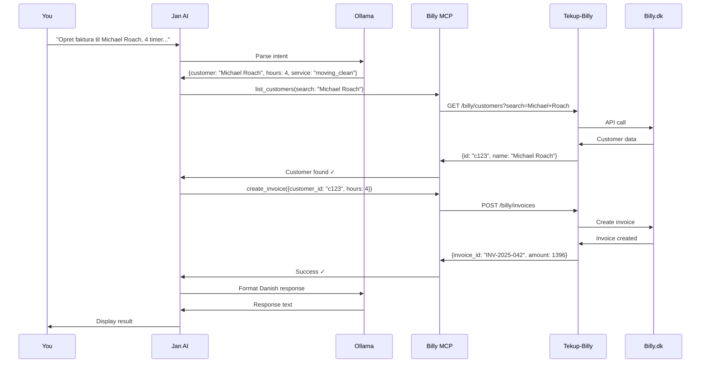

# 💰 Example: Create Invoice via AI

Complete walkthrough of creating an invoice using TekUp AI Assistant.

## 📋 Scenario

**Situation:** You just completed a 4-hour moving clean for Michael Roach yesterday. You need to create and send an invoice.

**Current manual process:**
1. Open Billy.dk in browser
2. Click "New Invoice"
3. Find customer in dropdown
4. Add line item: "Flytterengøring - 4 timer"
5. Calculate: 4 × 349 DKK = 1.396 DKK
6. Save and send
**Time: 6-8 minutes**

---

## 🤖 With AI Assistant

### Step 1: Open Jan AI

Launch Jan AI from Start Menu or desktop shortcut.

### Step 2: Natural Language Command

Type in chat:
```
Opret faktura til Michael Roach for 4 timer moving clean fra i går
```

### Step 3: AI Processing

**What happens behind the scenes:**



### Step 4: AI Response

You'll see:

```
🔍 Søger efter kunde: Michael Roach...
✓ Fundet: Michael Roach (kunde ID: c123)

💰 Opretter faktura:
- Service: Flytterengøring
- Timer: 4
- Pris pr. time: 349 DKK
- Subtotal: 1.396 DKK
- Moms (25%): 349 DKK
- Total: 1.745 DKK

📨 Sender faktura til Billy.dk...

✅ FAKTURA OPRETTET!

Faktura: INV-2025-042
Kunde: Michael Roach
Beløb: 1.745 DKK (inkl. moms)
Forfaldsdag: 13. februar 2025
Status: Sendt til kunde via email

Faktura link: https://billy.dk/invoices/INV-2025-042

Noget andet jeg kan hjælpe med? 🙂
```

**Time: 15-20 seconds**  
**Time saved: ~7 minutes**

---

## 🎯 Variations

### Variation 1: Multiple Line Items

**Command:**
```
Opret faktura til Jørn Haagensen:
- 2 timer basic clean
- 1 time deep cleaning af køkken
- Tilkørsel 25 km
```

**AI Response:**
```
✅ FAKTURA OPRETTET!

Faktura: INV-2025-043
Kunde: Jørn Haagensen

Linjer:
1. Basic clean - 2 timer × 299 DKK = 598 DKK
2. Deep clean køkken - 1 time × 349 DKK = 349 DKK
3. Tilkørsel - 25 km × 5 DKK = 125 DKK

Subtotal: 1.072 DKK
Moms (25%): 268 DKK
Total: 1.340 DKK

Status: Sendt til kunde
```

---

### Variation 2: Uncertain Customer Name

**Command:**
```
Opret faktura til Michael for 3 timer basic clean
```

**AI Response:**
```
⚠️ Fandt 2 kunder ved navn "Michael":
1. Michael Roach (Aarhus C)
2. Michael Jensen (Risskov)

Hvilken Michael?
```

**You reply:**
```
Den i Aarhus C
```

**AI:**
```
✅ FAKTURA OPRETTET!
Faktura: INV-2025-044
Kunde: Michael Roach
...
```

---

### Variation 3: Copy Previous Invoice

**Command:**
```
Opret faktura til Kunde ABC - samme som sidst
```

**AI:**
```
🔍 Henter sidste faktura til Kunde ABC...
✓ Fundet: INV-2025-032 fra 15/12/2024

Linjer fra sidste faktura:
- 3 timer basic clean
- Tilkørsel 30 km

Opretter samme faktura...

✅ FAKTURA OPRETTET!
Faktura: INV-2025-045
Baseret på: INV-2025-032
Total: 1.490 DKK
```

---

### Variation 4: Bulk Invoice Creation

**Command:**
```
Opret fakturaer for alle jobs fra i går
```

**AI:**
```
🔍 Søger efter jobs fra 14/1/2025...
✓ Fundet 3 bookings:

1. Mette Nielsen - 2 timer basic
2. Michael Roach - 4 timer moving
3. Eoin - 2 timer basic

Opretter 3 fakturaer...

✅ 3 FAKTURAER OPRETTET:

1. INV-2025-042 - Mette Nielsen - 748 DKK
2. INV-2025-043 - Michael Roach - 1.745 DKK
3. INV-2025-044 - Eoin - 748 DKK

Total: 3.241 DKK
Alle sendt til kunderne ✓
```

---

## 🐛 Error Handling

### Error 1: Customer Not Found

**Command:**
```
Opret faktura til Unknown Person, 3 timer
```

**AI Response:**
```
❌ Kunde ikke fundet: "Unknown Person"

Fandt ingen match i Billy.dk.

Vil du:
1. Søge efter lignende navne?
2. Oprette ny kunde først?
3. Tjekke stavning?
```

**Solution:** Correct the name or create customer first

---

### Error 2: Missing Information

**Command:**
```
Opret faktura til Michael Roach
```

**AI Response:**
```
⚠️ Manglende information:
- Antal timer?
- Service type? (basic/deep/moving)

Eksempel:
"Opret faktura til Michael Roach for 4 timer moving clean"
```

**Solution:** Provide missing details

---

### Error 3: Billy.dk API Error

**Command:**
```
Opret faktura til Michael Roach, 4 timer
```

**AI Response:**
```
❌ Fejl fra Billy.dk API:
"Rate limit exceeded - too many requests"

Prøver igen om 30 sekunder...

[After retry]
✅ Faktura oprettet (forsøg 2/3)
```

**Solution:** AI retries automatically (up to 3 attempts)

---

## 📊 Time Comparison

### Manual Process (Average)

| Step | Time |
|------|------|
| Open Billy.dk | 30s |
| Find customer | 30s |
| Create invoice form | 30s |
| Add line items | 2-3 min |
| Calculate total | 30s |
| Review and send | 1 min |
| **Total** | **6-8 min** |

### AI Process (Average)

| Step | Time |
|------|------|
| Type command | 5s |
| AI processing | 10-15s |
| **Total** | **15-20s** |

**Time saved: ~7 minutes per invoice**

---

## ✅ Verification Checklist

After invoice creation, verify:

- [ ] **Correct customer:** Check name and email
- [ ] **Correct amount:** Verify calculation
- [ ] **Correct date:** Invoice date is correct
- [ ] **Service description:** Matches work performed
- [ ] **Status:** Invoice shows "Sent" in Billy.dk
- [ ] **Customer received:** Check email was sent

**First 50 invoices:** Manual verification recommended  
**After 50:** Spot checks (every 10th invoice)

---

## 🎓 Pro Tips

### Tip 1: Be Specific with Dates

```
✅ "faktura fra i går"
✅ "faktura for job d. 14/1"
✅ "faktura for sidste onsdag"

❌ "faktura for et job for nylig"
```

### Tip 2: Use Customer Identifiers

```
✅ "Michael Roach i Aarhus"
✅ "kunde #c123"
✅ "Michael med email michael@example.com"
```

### Tip 3: Chain Commands

```
"Opret fakturaer fra i går og vis mig totalen"

AI will:
1. Create invoices
2. Calculate sum
3. Show summary
```

### Tip 4: Ask for Confirmation (Optional)

```
"Lav faktura til Michael, 4 timer - men vis mig den først"

AI will:
- Show preview
- Ask for confirmation
- Create only if you approve
```

---

## 📸 Screenshots

*(In production, add screenshots here)*

1. Jan AI interface with command
2. AI processing response
3. Final invoice in Billy.dk
4. Email sent to customer

---

## 📈 ROI Calculation

**Your usage (average):**
- 3 invoices/day
- 22 working days/month
- Total: 66 invoices/month

**Time saved:**
- 7 minutes × 66 = 462 minutes/month
- = **7.7 hours/month**
- = **92.4 hours/year**

**Value (at 600 DKK/hour):**
- **4.620 DKK/month**
- **55.440 DKK/year**

---

**Version:** 1.0.0  
**Last Updated:** 2025-01-15  
**See also:** [WORKFLOWS.md](../WORKFLOWS.md) | [Billy API](../api/tekup-billy-api.md)
