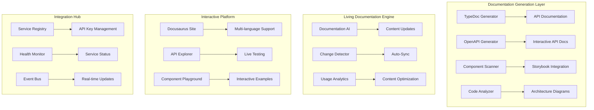

# Design Document

## Overview

This design outlines a comprehensive documentation ecosystem that transforms the TekUp.org monorepo into a living AI organism with complete documentation, seamless integration, and intelligent automation. The system addresses the current fragmented state of 25+ applications and creates a unified, self-documenting platform.

## Current State Analysis

### Existing Strengths
- **Solid Core Architecture**: flow-api and flow-web provide robust foundation
- **Comprehensive Integration**: Advanced WebSocket-based real-time communication
- **AI Integration**: Gemini Live API integration for voice processing
- **Multi-tenant Architecture**: Row Level Security (RLS) implementation
- **Automated Environment Management**: env-auto.mjs script for configuration
- **Existing Documentation**: Some apps have good README files and implementation summaries

### Identified Gaps
- **Documentation Inconsistency**: Varying quality across 25+ applications
- **Missing API Documentation**: Limited OpenAPI/Swagger coverage
- **Integration Complexity**: Multiple overlapping services (tekup-crm-api, tekup-lead-platform)
- **External Service Management**: No centralized API key/service documentation
- **Living Documentation**: Static docs that don't evolve with code
- **Danish Localization**: Limited Danish language support
- **Interactive Learning**: No hands-on exploration capabilities

## Architecture

### Core Documentation Infrastructure



### Application Documentation Structure

```
docs/
├── apps/                           # Per-application documentation
│   ├── flow-api/
│   │   ├── README.md              # Overview and quick start
│   │   ├── api-reference.md       # Auto-generated API docs
│   │   ├── architecture.md        # Technical architecture
│   │   ├── deployment.md          # Deployment guides
│   │   └── integration.md         # Integration patterns
│   ├── tekup-crm-api/
│   ├── voice-agent/
│   └── ...
├── guides/                         # Cross-cutting guides
│   ├── getting-started/
│   ├── deployment/
│   ├── integration/
│   └── troubleshooting/
├── architecture/                   # System-wide architecture
│   ├── overview.md
│   ├── data-flow.md
│   ├── security.md
│   └── scalability.md
├── api/                           # Consolidated API documentation
│   ├── openapi/                   # Auto-generated OpenAPI specs
│   ├── postman/                   # Postman collections
│   └── examples/                  # Code examples
└── whitepapers/                   # Technical whitepapers
    ├── ai-integration.md
    ├── multi-tenancy.md
    └── performance-optimization.md
```

## Components and Interfaces

### 1. Documentation Generation System

#### TypeDoc Integration
```typescript
interface DocumentationGenerator {
  generateApiDocs(packagePath: string): Promise<ApiDocumentation>;
  generateComponentDocs(componentPath: string): Promise<ComponentDocumentation>;
  updateDocumentation(changes: CodeChange[]): Promise<void>;
}

interface ApiDocumentation {
  endpoints: EndpointDoc[];
  schemas: SchemaDoc[];
  examples: ExampleDoc[];
  authentication: AuthDoc;
}
```

#### OpenAPI Auto-Generation
```typescript
interface OpenAPIGenerator {
  extractFromNestJS(appPath: string): Promise<OpenAPISpec>;
  generatePostmanCollection(spec: OpenAPISpec): Promise<PostmanCollection>;
  createInteractiveExplorer(spec: OpenAPISpec): Promise<APIExplorer>;
}
```

### 2. Living Documentation Engine

#### AI-Powered Documentation Updates
```typescript
interface DocumentationAI {
  analyzeCodeChanges(diff: GitDiff): Promise<DocumentationUpdate[]>;
  generateDocumentation(codebase: CodebaseSnapshot): Promise<Documentation>;
  translateContent(content: string, targetLanguage: 'da' | 'en'): Promise<string>;
  optimizeContent(content: string, analytics: UsageAnalytics): Promise<string>;
}

interface DocumentationUpdate {
  type: 'api-change' | 'component-update' | 'architecture-change';
  files: string[];
  suggestedChanges: string[];
  priority: 'low' | 'medium' | 'high' | 'critical';
}
```

#### Change Detection and Sync
```typescript
interface ChangeDetector {
  watchCodebase(): void;
  detectAPIChanges(oldSpec: OpenAPISpec, newSpec: OpenAPISpec): APIChange[];
  detectComponentChanges(oldComponents: Component[], newComponents: Component[]): ComponentChange[];
  triggerDocumentationUpdate(changes: Change[]): Promise<void>;
}
```

### 3. Interactive Documentation Platform

#### Multi-language Docusaurus Site
```typescript
interface DocumentationSite {
  buildSite(config: SiteConfig): Promise<void>;
  generateMultiLanguage(content: Content[], languages: string[]): Promise<void>;
  integrateAPIExplorer(apiSpecs: OpenAPISpec[]): Promise<void>;
  deployToVercel(): Promise<DeploymentResult>;
}

interface SiteConfig {
  title: string;
  languages: string[];
  theme: 'light' | 'dark' | 'auto';
  integrations: Integration[];
}
```

#### API Explorer and Testing
```typescript
interface APIExplorer {
  loadOpenAPISpec(spec: OpenAPISpec): void;
  createInteractiveEndpoint(endpoint: Endpoint): InteractiveEndpoint;
  enableLiveTesting(authConfig: AuthConfig): void;
  generateCodeExamples(endpoint: Endpoint, languages: string[]): CodeExample[];
}

interface InteractiveEndpoint {
  endpoint: Endpoint;
  testForm: TestForm;
  responseViewer: ResponseViewer;
  codeGenerator: CodeGenerator;
}
```

### 4. Service Integration Hub

#### API Key and Service Management
```typescript
interface ServiceRegistry {
  registerService(service: ExternalService): Promise<void>;
  updateServiceConfig(serviceId: string, config: ServiceConfig): Promise<void>;
  rotateAPIKey(serviceId: string): Promise<APIKeyRotationResult>;
  monitorServiceHealth(serviceId: string): Promise<HealthStatus>;
}

interface ExternalService {
  id: string;
  name: string;
  type: 'openai' | 'stripe' | 'convertkit' | 'hubspot' | 'gemini';
  apiKey: string;
  endpoints: ServiceEndpoint[];
  rateLimits: RateLimit[];
  documentation: ServiceDocumentation;
}

interface ServiceDocumentation {
  quickStart: string;
  authentication: AuthenticationGuide;
  endpoints: EndpointDocumentation[];
  examples: IntegrationExample[];
  troubleshooting: TroubleshootingGuide;
}
```

#### Health Monitoring and Alerts
```typescript
interface HealthMonitor {
  checkServiceHealth(serviceId: string): Promise<HealthStatus>;
  monitorAPIUsage(serviceId: string): Promise<UsageMetrics>;
  alertOnThresholds(thresholds: AlertThreshold[]): void;
  generateHealthReport(): Promise<HealthReport>;
}

interface HealthStatus {
  serviceId: string;
  status: 'healthy' | 'degraded' | 'down';
  responseTime: number;
  errorRate: number;
  lastChecked: Date;
  issues: HealthIssue[];
}
```

## Data Models

### Documentation Metadata
```typescript
interface DocumentationMetadata {
  id: string;
  type: 'api' | 'guide' | 'whitepaper' | 'component';
  title: string;
  description: string;
  version: string;
  lastUpdated: Date;
  author: string;
  tags: string[];
  languages: string[];
  relatedDocs: string[];
}

interface ApplicationDocumentation {
  appId: string;
  name: string;
  type: 'api' | 'web' | 'mobile' | 'desktop';
  framework: string;
  status: 'active' | 'deprecated' | 'experimental';
  documentation: DocumentationMetadata[];
  integrations: Integration[];
  dependencies: Dependency[];
}
```

### Integration Mapping
```typescript
interface Integration {
  sourceApp: string;
  targetApp: string;
  type: 'api' | 'websocket' | 'event' | 'database';
  protocol: string;
  authentication: AuthenticationType;
  endpoints: IntegrationEndpoint[];
  documentation: IntegrationDocumentation;
}

interface IntegrationEndpoint {
  method: string;
  path: string;
  description: string;
  requestSchema: JSONSchema;
  responseSchema: JSONSchema;
  examples: RequestResponseExample[];
}
```

### Service Configuration
```typescript
interface ServiceConfiguration {
  serviceId: string;
  name: string;
  provider: string;
  apiKey: string;
  baseUrl: string;
  version: string;
  rateLimits: RateLimit;
  retryPolicy: RetryPolicy;
  monitoring: MonitoringConfig;
  documentation: ServiceDocumentationConfig;
}

interface RateLimit {
  requestsPerMinute: number;
  requestsPerHour: number;
  requestsPerDay: number;
  burstLimit: number;
}
```

## Error Handling

### Documentation Generation Errors
```typescript
interface DocumentationError {
  type: 'generation' | 'sync' | 'deployment' | 'translation';
  severity: 'warning' | 'error' | 'critical';
  message: string;
  context: ErrorContext;
  suggestedFix: string;
  retryable: boolean;
}

interface ErrorContext {
  file?: string;
  line?: number;
  component?: string;
  service?: string;
  operation?: string;
}
```

### Service Integration Error Handling
```typescript
interface ServiceError {
  serviceId: string;
  errorType: 'authentication' | 'rate_limit' | 'timeout' | 'server_error';
  httpStatus?: number;
  message: string;
  timestamp: Date;
  retryAfter?: number;
  documentation: string; // Link to troubleshooting docs
}

class ServiceErrorHandler {
  handleError(error: ServiceError): Promise<ErrorResolution>;
  retryWithBackoff(operation: () => Promise<any>, maxRetries: number): Promise<any>;
  escalateToSupport(error: ServiceError): Promise<SupportTicket>;
}
```

## Testing Strategy

### Documentation Testing
```typescript
interface DocumentationTest {
  testType: 'link-check' | 'api-validation' | 'example-execution' | 'translation-quality';
  target: string;
  expected: any;
  actual: any;
  passed: boolean;
  message: string;
}

interface DocumentationTestSuite {
  validateLinks(documentation: Documentation[]): Promise<DocumentationTest[]>;
  validateAPIExamples(apiDocs: ApiDocumentation[]): Promise<DocumentationTest[]>;
  validateTranslations(content: MultiLanguageContent): Promise<DocumentationTest[]>;
  validateCodeExamples(examples: CodeExample[]): Promise<DocumentationTest[]>;
}
```

### Integration Testing
```typescript
interface IntegrationTest {
  name: string;
  description: string;
  sourceApp: string;
  targetApp: string;
  testSteps: TestStep[];
  expectedResult: any;
  actualResult: any;
  status: 'passed' | 'failed' | 'skipped';
}

interface TestStep {
  action: string;
  endpoint?: string;
  payload?: any;
  expectedResponse?: any;
  timeout: number;
}
```

### Service Health Testing
```typescript
interface ServiceHealthTest {
  serviceId: string;
  testType: 'connectivity' | 'authentication' | 'rate_limit' | 'functionality';
  endpoint: string;
  method: string;
  expectedStatus: number;
  timeout: number;
  retries: number;
}

class ServiceTestRunner {
  runHealthChecks(services: ExternalService[]): Promise<ServiceHealthTest[]>;
  validateAPIKeys(services: ExternalService[]): Promise<ValidationResult[]>;
  testRateLimits(services: ExternalService[]): Promise<RateLimitTest[]>;
}
```

## Implementation Phases

### Phase 1: Foundation (Weeks 1-2)
1. **Documentation Infrastructure Setup**
   - Configure Docusaurus with multi-language support
   - Set up TypeDoc and OpenAPI generation pipelines
   - Create documentation templates and standards

2. **Core Application Documentation**
   - Document flow-api (master service) comprehensively
   - Create integration guides for existing WebSocket system
   - Document voice-agent and Gemini Live integration

### Phase 2: Service Integration (Weeks 3-4)
1. **External Service Documentation**
   - Document all API integrations (OpenAI, Stripe, ConvertKit, etc.)
   - Create service configuration management system
   - Implement API key rotation and monitoring

2. **Inter-Application Communication**
   - Document WebSocket event system
   - Create integration testing framework
   - Implement health monitoring for all services

### Phase 3: AI Enhancement (Weeks 5-6)
1. **Living Documentation Engine**
   - Implement AI-powered documentation updates
   - Create change detection and auto-sync system
   - Implement Danish translation capabilities

2. **Interactive Features**
   - Build API explorer with live testing
   - Create component playground
   - Implement personalized learning paths

### Phase 4: Optimization (Weeks 7-8)
1. **Performance and Monitoring**
   - Implement comprehensive health monitoring
   - Create automated alerting system
   - Optimize documentation generation performance

2. **User Experience Enhancement**
   - Implement advanced search and navigation
   - Create role-based documentation views
   - Add feedback and improvement suggestion systems

## Deployment Architecture

### Documentation Site Deployment
```yaml
# Vercel deployment configuration
name: tekup-docs
framework: docusaurus
buildCommand: pnpm docs:all
outputDirectory: docs/build
environmentVariables:
  - OPENAI_API_KEY
  - GEMINI_API_KEY
  - DATABASE_URL
```

### Service Monitoring Deployment
```yaml
# Monitoring service deployment
name: tekup-monitoring
services:
  - name: health-monitor
    image: tekup/health-monitor:latest
    environment:
      - SERVICES_CONFIG_PATH=/config/services.json
      - ALERT_WEBHOOK_URL
  - name: documentation-ai
    image: tekup/docs-ai:latest
    environment:
      - OPENAI_API_KEY
      - GITHUB_TOKEN
```

This design provides a comprehensive foundation for transforming the TekUp.org monorepo into a fully documented, living AI organism with seamless integration between all applications and services.