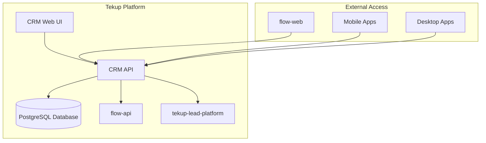
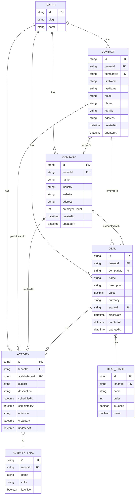
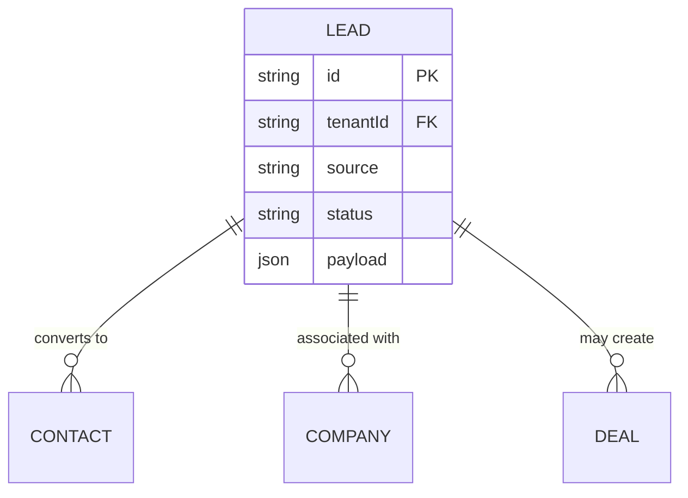
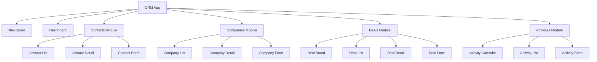

# CRM System for Tekup Platform

## Overview

The Tekup platform already has a lead management system, but lacks comprehensive CRM functionality. This document outlines the design for a new CRM system that would integrate with the existing Tekup ecosystem, extending the current lead management capabilities with full customer relationship management features.

The CRM system would be built as a new application within the Tekup monorepo, leveraging existing shared packages and following the established architectural patterns. It would work alongside the existing `tekup-lead-platform` and `flow-api` to provide a complete customer relationship management solution.

The CRM interface would seamlessly integrate with the existing Tekup design language, using the same Tailwind CSS configuration, color palette, and component patterns as the current `flow-web` application. This ensures consistency across all Tekup applications and provides a unified user experience.

The CRM ecosystem would function as an integral part of the Tekup platform, connecting with all existing applications to provide a seamless workflow from lead capture to customer relationship management. The system is designed with multi-tenancy at its core, supporting isolated data and customized experiences for each tenant (Rendetalje, Foodtruck Fiesta, and Tekup).

## Architecture

### System Context

### Component Architecture

The CRM system would consist of the following components:

1. **CRM API Service** - Backend service built with NestJS, following the same patterns as existing services
2. **CRM Web UI** - Next.js frontend application
3. **CRM Mobile App** - React Native mobile application (extension of existing mobile apps)
4. **Shared Packages** - Extensions to existing shared packages for CRM-specific types and utilities

### Integration with Existing Apps

The CRM system would integrate seamlessly with all existing Tekup applications:

1. **flow-api**: The CRM API would communicate with flow-api to access existing lead data and tenant information. When a lead is converted in the CRM, it would update the status in flow-api.

2. **tekup-lead-platform**: The CRM would consume qualified leads from the lead platform and provide feedback on conversion rates and sales outcomes.

3. **flow-web**: The existing web interface would be extended to include CRM functionality, with navigation to CRM modules.

4. **inbox-ai**: The desktop application could display CRM contacts and deals related to email conversations.

5. **tekup-mobile**: The mobile app would include CRM functionality for field sales teams to access contact information and update deal statuses.

6. **nexus-dashboard**: The admin dashboard would include CRM metrics and reports.

### Multi-Tenant Architecture

The CRM system would follow the same multi-tenant architecture as the existing Tekup platform, providing isolated data and customized experiences for each tenant:

1. **Tenant Isolation**: Each tenant (Rendetalje, Foodtruck Fiesta, Tekup) would have completely isolated data
2. **Custom Branding**: Each tenant can have custom branding, colors, and logos
3. **Tenant-specific Workflows**: Custom business processes and validation rules per tenant
4. **Independent Configuration**: Each tenant can configure CRM settings independently
5. **Resource Allocation**: Fair resource distribution across tenants

### Ecosystem Workflow

The CRM system would create a unified workflow across the entire Tekup ecosystem for each tenant:

1. **Lead Capture**: Leads enter through various channels (website forms, email, social media) and are processed by flow-api
2. **Lead Qualification**: Qualified leads are enriched and scored by tekup-lead-platform
3. **Lead Conversion**: Sales teams convert qualified leads to CRM contacts, companies, and deals through the CRM interface
4. **Relationship Management**: Ongoing customer relationships are managed through CRM contacts, activities, and deals
5. **Communication**: Email interactions in inbox-ai are linked to CRM contacts and deals
6. **Mobile Access**: Field sales teams access CRM data through tekup-mobile
7. **Analytics**: Business metrics are reported through nexus-dashboard with CRM data integration

### Integration Points

- **flow-api**: For existing lead data and tenant management
- **tekup-lead-platform**: For advanced lead qualification and nurturing
- **@tekup/shared**: For shared types and utilities
- **@tekup/api-client**: For API communication
- **@tekup/auth**: For authentication and authorization
- **@tekup/config**: For configuration management

### Data Flow Between Systems

The CRM system would establish bidirectional data flows with existing Tekup applications, maintaining tenant isolation:

1. **From flow-api to CRM**: Lead data synchronization, tenant information, user permissions
2. **From CRM to flow-api**: Lead status updates, conversion notifications, activity logs
3. **From tekup-lead-platform to CRM**: Qualified lead data, scoring information, nurturing history
4. **From CRM to tekup-lead-platform**: Conversion feedback, sales outcomes, deal values
5. **Between CRM and inbox-ai**: Contact synchronization, deal context, communication history
6. **Between CRM and tekup-mobile**: Real-time data synchronization for offline access

All data flows would maintain strict tenant isolation, ensuring that Rendetalje data never mixes with Foodtruck Fiesta or Tekup data.

## Data Models

### Core CRM Entities

### Relationship with Existing Lead System

## CRM Features and Pages

### Core CRM Modules

1. **Dashboard**
   - Overview statistics (total contacts, companies, deals, activities)
   - Deal pipeline visualization
   - Upcoming activities
   - Recent contact interactions
   - Performance metrics

2. **Contacts Management**
   - Contact list with filtering and search
   - Contact detail view
   - Contact creation/edit forms
   - Contact activity timeline
   - Contact merge functionality

3. **Companies Management**
   - Company list with filtering and search
   - Company detail view
   - Company creation/edit forms
   - Company hierarchy management
   - Associated contacts and deals

4. **Deals Management**
   - Deal pipeline/board view
   - Deal list with filtering
   - Deal detail view
   - Deal creation/edit forms
   - Deal stage progression
   - Deal value forecasting

5. **Activities Management**
   - Activity calendar view
   - Activity list view
   - Activity creation/edit forms
   - Activity types management
   - Activity reminders and notifications

6. **Reports & Analytics**
   - Sales performance reports
   - Deal conversion rates
   - Activity completion metrics
   - Revenue forecasting
   - Custom report builder

Each tenant (Rendetalje, Foodtruck Fiesta, Tekup) would have access to all these modules with their own isolated data.

### Page Design Patterns

All CRM pages would follow the existing Tekup design patterns observed in the `flow-web` application:

1. **Dashboard Page**
   - Grid layout with stat cards (similar to existing Dashboard.tsx)
   - Chart visualizations using consistent color palette
   - Activity feed with consistent card designs
   - Responsive grid that adapts to screen size

2. **List Pages** (Contacts, Companies, Deals)
   - Header with count and filtering options
   - Toggle between card view and table view
   - Consistent sorting controls
   - Search functionality
   - Bulk action capabilities
   - Pagination controls

3. **Detail Pages**
   - Breadcrumb navigation
   - Header with entity name and status
   - Tabbed interface for related information
   - Activity timeline
   - Action buttons (edit, delete, convert)

4. **Form Pages**
   - Consistent form layout with clear sections
   - Validation feedback
   - Save/cancel actions
   - Progress indicators for multi-step forms

### Design Consistency Elements

1. **Color Scheme**
   - Primary brand color: tekup purple (#7c3aed)
   - Status colors: green for success, yellow for warnings, red for errors
   - Neutral grays for backgrounds and text

2. **Typography**
   - Inter font family
   - Consistent heading hierarchy
   - Appropriate text sizing and weights

3. **Components**
   - Card-based layouts with consistent shadows and borders
   - Table designs with proper spacing and hover states
   - Form elements with consistent styling
   - Badges for status indicators
   - Buttons with consistent sizing and states

4. **Navigation**
   - Top navigation bar with tenant context
   - Sidebar navigation for CRM modules
   - Breadcrumb trails for hierarchy
   - Consistent active state indicators

Each tenant can customize their branding colors while maintaining the overall design consistency.

## API Endpoints

### Authentication and Authorization

The CRM API would follow the same authentication and authorization patterns as existing Tekup services:

1. **API Keys**: Tenant-scoped API keys for service-to-service communication
2. **JWT Tokens**: User authentication tokens for client applications
3. **OAuth2**: Third-party authentication integration
4. **Role-based Access Control**: Permission levels (Admin, Sales Manager, Sales Rep, Viewer)
5. **Row-level Security**: Tenant isolation at the database level

Each tenant (Rendetalje, Foodtruck Fiesta, Tekup) would have their own separate authentication systems and user management, ensuring complete data isolation.

### Contacts

| Endpoint | Method | Description |
|----------|--------|-------------|
| `/api/contacts` | GET | List contacts with filtering and pagination |
| `/api/contacts` | POST | Create a new contact |
| `/api/contacts/{id}` | GET | Get a specific contact |
| `/api/contacts/{id}` | PUT | Update a contact |
| `/api/contacts/{id}` | DELETE | Delete a contact |
| `/api/contacts/{id}/activities` | GET | Get activities for a contact |

### Companies

| Endpoint | Method | Description |
|----------|--------|-------------|
| `/api/companies` | GET | List companies with filtering and pagination |
| `/api/companies` | POST | Create a new company |
| `/api/companies/{id}` | GET | Get a specific company |
| `/api/companies/{id}` | PUT | Update a company |
| `/api/companies/{id}` | DELETE | Delete a company |
| `/api/companies/{id}/contacts` | GET | Get contacts for a company |
| `/api/companies/{id}/deals` | GET | Get deals for a company |

### Deals

| Endpoint | Method | Description |
|----------|--------|-------------|
| `/api/deals` | GET | List deals with filtering and pagination |
| `/api/deals` | POST | Create a new deal |
| `/api/deals/{id}` | GET | Get a specific deal |
| `/api/deals/{id}` | PUT | Update a deal |
| `/api/deals/{id}` | DELETE | Delete a deal |
| `/api/deals/{id}/activities` | GET | Get activities for a deal |
| `/api/deals/stages` | GET | Get deal stages |
| `/api/deals/stages` | POST | Create a new deal stage |

### Activities

| Endpoint | Method | Description |
|----------|--------|-------------|
| `/api/activities` | GET | List activities with filtering and pagination |
| `/api/activities` | POST | Create a new activity |
| `/api/activities/{id}` | GET | Get a specific activity |
| `/api/activities/{id}` | PUT | Update an activity |
| `/api/activities/{id}` | DELETE | Delete an activity |
| `/api/activities/types` | GET | Get activity types |

### Lead Conversion

| Endpoint | Method | Description |
|----------|--------|-------------|
| `/api/leads/{id}/convert` | POST | Convert a lead to contact/company/deal |

## Business Logic

### Lead Conversion Process

1. When a lead is qualified in the existing lead system, it can be converted to a CRM entity
2. The conversion process creates:
   - A contact record with lead information
   - A company record if company information is available
   - An initial deal if the lead has sales potential
3. The original lead is marked as converted and linked to the new CRM entities
4. The conversion is synchronized with the lead platform to update lead status and provide feedback on conversion success

### Cross-Application Data Synchronization

The CRM system would maintain data consistency across the Tekup ecosystem through:

1. **Real-time Updates**: Webhook notifications for immediate data synchronization
2. **Batch Processing**: Scheduled synchronization for non-critical data
3. **Conflict Resolution**: Timestamp-based conflict resolution for concurrent updates
4. **Data Validation**: Consistent validation rules across all applications
5. **Audit Trail**: Comprehensive logging of all data changes across systems

All synchronization processes maintain strict tenant isolation, ensuring data from Rendetalje, Foodtruck Fiesta, and Tekup remains completely separate.

### Deal Pipeline Management

1. Tenants can define custom deal stages
2. Deals progress through stages with validation
3. Win/loss reasons are tracked for closed deals
4. Forecasting capabilities based on deal stages and values

### Activity Tracking

1. Activities can be scheduled for future dates
2. Different activity types (calls, meetings, emails, tasks)
3. Activity outcomes recorded when completed
4. Integration with calendar systems

## Frontend Architecture

### Component Hierarchy

### Integration with flow-web

The CRM frontend would be integrated into the existing `flow-web` application:
1. **Shared Navigation**: CRM modules would appear in the main navigation alongside existing features
2. **Consistent UI**: CRM components would use the same design system and UI components as the rest of the application
3. **Shared Authentication**: The same authentication flow and session management would be used
4. **Unified Data Loading**: API calls would follow the same patterns as existing data fetching in the application

### Design System Alignment

The CRM interface would follow the existing Tekup design language:
1. **Color Palette**: Use the existing brand colors (rendetalje: #059669, foodtruck: #dc2626, tekup: #7c3aed) with neutral grays
2. **Typography**: Use the Inter font family as defined in the Tailwind config
3. **Component Patterns**: Follow the same card-based layouts, table designs, and form patterns as seen in the leads interface
4. **Responsive Design**: Mobile-first approach with responsive grid layouts
5. **Interactive Elements**: Consistent hover states, focus states, and transitions

### State Management

The CRM frontend would use the same state management patterns as the existing `flow-web` application:
- Zustand for global state management
- React Query for server state management
- Context API for tenant-specific context

### UI Components

The CRM would leverage existing UI components from the `@tekup/ui` package and extend them as needed:
- Data tables with sorting, filtering, and pagination
- Forms with validation
- Dashboard components for metrics and charts
- Calendar components for activity scheduling

## Security & Compliance

### Authentication

The CRM system would integrate with the existing authentication system:
- API key-based authentication for server-to-server communication
- JWT-based authentication for user sessions
- OAuth2 integration for third-party services

### Authorization

Role-based access control with the following roles:
- Administrator: Full access to all CRM features
- Sales Manager: Access to all deals and team activities
- Sales Representative: Access to own deals and contacts
- Viewer: Read-only access to CRM data

Each tenant (Rendetalje, Foodtruck Fiesta, Tekup) would have their own separate user management and role assignments.

### Data Protection

- Row-level security (RLS) for tenant data isolation
- Encryption of sensitive data at rest
- Audit logging for all data modifications
- GDPR compliance for data subject rights

The multi-tenant architecture ensures that Rendetalje data is completely isolated from Foodtruck Fiesta and Tekup data, with no cross-tenant data access possible.

## Implementation Plan

### Phase 1: Core CRM API

1. Create CRM API service with NestJS (following the same patterns as flow-api)
2. Implement core data models and database schema (extending existing Prisma schema)
3. Build basic CRUD operations for contacts, companies, and deals
4. Implement authentication and authorization (integrating with @tekup/auth)
5. Set up environment configuration and secrets management

### Phase 2: Lead Integration

1. Implement lead conversion functionality (integrating with flow-api and tekup-lead-platform)
2. Create APIs for deal stages and activity tracking
3. Add data validation and business logic
4. Implement synchronization with existing lead systems
5. Configure API keys and service-to-service authentication

### Phase 3: Web UI Integration

1. Extend flow-web with CRM modules (integrating into existing navigation)
2. Implement contact, company, and deal management interfaces
3. Build dashboard with key metrics and reports
4. Ensure consistent UI/UX with existing applications
5. Implement client-side authentication and session management

### Phase 4: Cross-Application Integration

1. Activity tracking and calendar integration (with inbox-ai)
2. Mobile CRM functionality (extending tekup-mobile)
3. Reporting and analytics (integrating with nexus-dashboard)
4. Third-party integrations
5. Configure cross-application API keys and webhooks

### Environment and Configuration Setup

The implementation would include comprehensive environment and configuration management:
1. **Environment Files**: Create .env.example files for all environments
2. **Configuration Service**: Integrate with @tekup/config for centralized management
3. **Secrets Management**: Set up secure storage for API keys and credentials
4. **Multi-tenancy**: Configure tenant-specific settings and permissions
5. **Monitoring**: Set up logging and metrics collection
6. **Documentation**: Provide clear documentation for environment setup

The system would be pre-configured to support the three known tenants (Rendetalje, Foodtruck Fiesta, Tekup) with the ability to easily add new tenants.

## Technology Stack

### Backend

- **Framework**: NestJS (consistent with existing services like flow-api and secure-platform)
- **Database**: PostgreSQL (shared with existing services)
- **ORM**: Prisma (consistent with existing services)
- **Authentication**: JWT/OAuth2 (leveraging @tekup/auth)
- **Testing**: Jest (consistent with existing services)

### Frontend

- **Framework**: Next.js (consistent with existing web applications like flow-web and landing-web)
- **State Management**: Zustand + React Query (following flow-web patterns)
- **UI Components**: @tekup/ui package (shared with all Tekup applications)
- **Styling**: Tailwind CSS (consistent with existing applications)
- **Testing**: Jest + React Testing Library (consistent with existing frontend testing)

### Design Consistency

The CRM system follows the same design patterns and UI components as existing Tekup applications:
1. **Component Library**: Uses @tekup/ui package for consistent UI components
2. **Tailwind Configuration**: Uses the same tailwind.config.mjs with Inter font and brand colors
3. **Layout Patterns**: Follows the same responsive grid and card-based layouts
4. **Interaction Patterns**: Consistent hover states, transitions, and animations

### Configuration Management

The CRM system uses the same configuration management approach as other Tekup applications:
1. **Environment Variables**: Uses .env files for configuration (consistent with existing apps)
2. **@tekup/config**: Leverages the shared configuration package for centralized config management
3. **Secrets Management**: Integrates with existing secrets management infrastructure
4. **Multi-environment Support**: Supports development, staging, and production environments

### Consistency with Existing Apps

The CRM system technology choices align with the existing Tekup ecosystem:
1. **Same Stack**: Uses the same Node.js/TypeScript stack as all other services
2. **Shared Dependencies**: Leverages the same shared packages (@tekup/auth, @tekup/config, @tekup/api-client)
3. **Consistent Tooling**: Uses the same build tools (PNPM, TypeScript, Prettier) and follows the same coding standards
4. **Infrastructure Alignment**: Follows the same containerization and deployment patterns
5. **Ecosystem Integration**: Integrates seamlessly with existing communication patterns and data flows

## Deployment Architecture

The CRM system would follow the same deployment patterns as existing Tekup services:

1. **Containerization**: Docker images for API service (similar to flow-api and secure-platform Dockerfiles)
2. **Orchestration**: Docker Compose for local development (extending existing docker-compose.yml), Kubernetes for production
3. **CI/CD**: GitHub Actions pipelines consistent with existing services
4. **Monitoring**: Integration with existing metrics and logging systems
5. **Scaling**: Horizontal scaling of API instances based on load

### Integration with Existing Infrastructure

The CRM system would integrate with the existing Tekup infrastructure:
1. **Shared Database**: Use the same PostgreSQL database with separate schemas or tables
2. **Shared Configuration**: Use the same configuration management system (@tekup/config)
3. **Shared Authentication**: Use the same authentication service (@tekup/auth)
4. **Shared Networking**: Deploy within the same network infrastructure as other services
5. **Shared Monitoring**: Integrate with existing Prometheus/Grafana monitoring setup

### Multi-Tenant Data Isolation

The CRM system would implement the same robust multi-tenant data isolation as the existing Tekup platform:
1. **Row-Level Security (RLS)**: PostgreSQL RLS policies to ensure tenants cannot access each other's data
2. **Tenant ID Enforcement**: All database queries include tenant ID filtering
3. **Separate Schemas**: Optionally use separate database schemas for each tenant
4. **Audit Logging**: Comprehensive logging of all data access with tenant context
5. **API Tenant Scoping**: All API endpoints are scoped to specific tenants

The system supports the three known tenants (Rendetalje, Foodtruck Fiesta, Tekup) with the ability to add more tenants as needed.

### Configuration and Environment Management

The CRM system would use the same configuration and environment management patterns as existing Tekup applications:
1. **Environment Files**: .env files for environment-specific configuration (development, staging, production)
2. **Configuration Service**: Integration with @tekup/config for centralized configuration management
3. **Secrets Management**: Secure storage of API keys, database credentials, and other secrets
4. **Multi-tenancy Configuration**: Tenant-specific settings through the existing configuration system
5. **Feature Flags**: Integration with existing feature flag system for controlled rollouts

### API Keys and Service Authentication

The CRM system would implement the same API key and authentication patterns as existing Tekup services:
1. **Tenant-scoped API Keys**: Unique API keys for each tenant with specific permissions
2. **Key Rotation**: Automated API key rotation with grace periods
3. **Access Scopes**: Fine-grained permissions for different API operations
4. **Rate Limiting**: Per-key rate limiting to prevent abuse
5. **Audit Logging**: Comprehensive logging of all API key usage
6. **Service-to-Service Authentication**: JWT-based authentication for internal services

Each tenant (Rendetalje, Foodtruck Fiesta, Tekup) would have their own isolated set of API keys and authentication tokens, ensuring complete data separation.

### Ecosystem Communication Patterns

The CRM system would communicate with other Tekup applications using established patterns:
1. **REST APIs**: Standard API communication for synchronous operations
2. **Webhooks**: Event-driven notifications for real-time updates
3. **Message Queues**: Asynchronous processing for non-critical operations
4. **Shared Libraries**: Common utilities and types through @tekup packages
5. **Service Discovery**: DNS-based service discovery within the Kubernetes cluster

## Testing Strategy

### Unit Testing

- Test all business logic in services
- Mock database interactions
- Test edge cases and error conditions

### Integration Testing

- Test API endpoints with database interactions
- Test integration with existing lead system
- Test authentication and authorization flows

### End-to-End Testing

- Test critical user workflows
- Test cross-module functionality
- Test error handling and recovery

## Performance Considerations

1. **Database Indexing**: Proper indexing on frequently queried fields
2. **Caching**: Redis caching for frequently accessed data
3. **Pagination**: Cursor-based pagination for large data sets
4. **Background Jobs**: Asynchronous processing for non-critical operations
5. **Database Connection Pooling**: Efficient database connection management

## Risk Assessment

### Technical Risks

1. **Data Migration**: Complexity of migrating existing lead data to CRM entities
2. **Performance**: Handling large volumes of CRM data alongside existing systems
3. **Integration**: Ensuring seamless integration with existing lead platform
4. **Consistency**: Maintaining UI/UX consistency across all Tekup applications
5. **Deployment**: Coordinating deployment with existing services
6. **Ecosystem Complexity**: Managing dependencies and communication between multiple integrated systems
7. **Multi-tenancy Complexity**: Ensuring complete data isolation between tenants (Rendetalje, Foodtruck Fiesta, Tekup)

### Mitigation Strategies

1. **Phased Rollout**: Implement in phases with thorough testing
2. **Data Validation**: Comprehensive data validation during conversion
3. **Monitoring**: Enhanced monitoring during initial deployment
4. **Design System**: Strict adherence to existing design system (@tekup/ui)
5. **Coordinated Deployment**: Align deployment processes with existing CI/CD pipelines
6. **Integration Testing**: Comprehensive testing of cross-application workflows
7. **Documentation**: Detailed documentation of integration points and data flows
8. **Security Testing**: Rigorous testing of multi-tenancy isolation and data protection