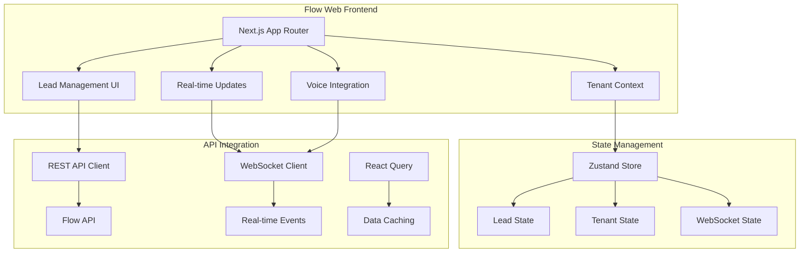

# TekUp Flow Web (`apps/flow-web`)

The primary web interface for the TekUp ecosystem, providing a modern, responsive dashboard for lead management, real-time monitoring, and multi-tenant operations.

## 🏗️ Architecture Overview

Flow Web is built with Next.js 15 using the App Router architecture, providing a fast, SEO-friendly, and highly interactive user experience. It connects to the Flow API via REST and WebSocket for real-time updates.

### Core Components



## 🚀 Tech Stack

- **Framework**: Next.js 15 with App Router
- **Language**: TypeScript (strict mode)
- **Styling**: Tailwind CSS 4.x
- **State Management**: Zustand for global state
- **Data Fetching**: TanStack React Query
- **Real-time**: Socket.IO client for WebSocket
- **UI Components**: Custom components with Tailwind
- **Testing**: Jest with React Testing Library

## 🔧 Environment Configuration

### Required Environment Variables

```bash
# API Configuration
NEXT_PUBLIC_API_URL=http://localhost:4000
NEXT_PUBLIC_WS_URL=http://localhost:4000

# Tenant Configuration
NEXT_PUBLIC_DEFAULT_TENANT=demo1
NEXT_PUBLIC_TENANT_API_KEY=demo-tenant-key-1

# Development
NODE_ENV=development
NEXT_PUBLIC_DEBUG=true

# Optional Features
NEXT_PUBLIC_VOICE_ENABLED=true
NEXT_PUBLIC_ANALYTICS_ENABLED=false
```

## 🏃‍♂️ Quick Start

### Prerequisites

- Node.js 18.18.0+
- pnpm 9.9.0+
- Flow API running on port 4000

### Installation & Setup

```bash
# Install dependencies
pnpm install

# Start development server
pnpm --filter @tekup/flow-web dev

# Build for production
pnpm --filter @tekup/flow-web build

# Start production server
pnpm --filter @tekup/flow-web start
```

The application will be available at `http://localhost:3000`.

## 📱 Application Structure

### App Router Structure

```
app/
├── layout.tsx              # Root layout with providers
├── page.tsx               # Dashboard homepage
├── globals.css            # Global styles
├── providers.tsx          # Context providers
├── t/                     # Tenant-specific routes
│   └── [tenant]/
│       ├── layout.tsx     # Tenant layout
│       ├── page.tsx       # Tenant dashboard
│       └── leads/
│           ├── page.tsx   # Leads list
│           └── [id]/
│               └── page.tsx # Lead details
└── lib/
    ├── api.ts             # API client configuration
    ├── config.ts          # App configuration
    └── store.ts           # Zustand store setup
```

### Component Architecture

```
components/
├── ui/                    # Base UI components
│   ├── Button.tsx
│   ├── Input.tsx
│   ├── Table.tsx
│   └── Modal.tsx
├── leads/                 # Lead-specific components
│   ├── LeadsList.tsx
│   ├── LeadCard.tsx
│   ├── LeadForm.tsx
│   └── LeadStatusBadge.tsx
├── tenant/                # Tenant management
│   ├── TenantSwitcher.tsx
│   ├── TenantBanner.tsx
│   └── TenantSettings.tsx
└── realtime/              # Real-time features
    ├── WebSocketProvider.tsx
    ├── NotificationCenter.tsx
    └── LiveUpdates.tsx
```

## 🔐 Multi-tenant Architecture

### Tenant Context System

```typescript
// Tenant context provider
const TenantProvider = ({ children }: { children: React.ReactNode }) => {
  const [currentTenant, setCurrentTenant] = useState<Tenant | null>(null);
  const [tenants, setTenants] = useState<Tenant[]>([]);
  
  // Tenant switching logic
  const switchTenant = useCallback(async (tenantId: string) => {
    const tenant = tenants.find(t => t.id === tenantId);
    if (tenant) {
      setCurrentTenant(tenant);
      // Update API client configuration
      apiClient.setTenant(tenant);
      // Clear cached data
      queryClient.clear();
    }
  }, [tenants]);

  return (
    <TenantContext.Provider value={{
      currentTenant,
      tenants,
      switchTenant,
      isLoading: !currentTenant
    }}>
      {children}
    </TenantContext.Provider>
  );
};
```

### Tenant-aware Routing

```typescript
// Dynamic tenant routes
app/t/[tenant]/
├── layout.tsx     # Validates tenant access
├── page.tsx       # Tenant dashboard
└── leads/         # Tenant-specific leads
```

## 📊 State Management

### Zustand Store Configuration

```typescript
interface AppState {
  // Tenant state
  currentTenant: Tenant | null;
  tenants: Tenant[];
  
  // Lead state
  leads: Lead[];
  selectedLead: Lead | null;
  leadFilters: LeadFilters;
  
  // UI state
  sidebarOpen: boolean;
  notifications: Notification[];
  
  // WebSocket state
  isConnected: boolean;
  connectionStatus: 'connecting' | 'connected' | 'disconnected';
  
  // Actions
  setCurrentTenant: (tenant: Tenant) => void;
  updateLead: (lead: Lead) => void;
  addNotification: (notification: Notification) => void;
  setConnectionStatus: (status: string) => void;
}
```

### React Query Integration

```typescript
// Lead queries
const useLeads = (tenantId: string, filters?: LeadFilters) => {
  return useQuery({
    queryKey: ['leads', tenantId, filters],
    queryFn: () => apiClient.getLeads(filters),
    enabled: !!tenantId,
    staleTime: 30000, // 30 seconds
  });
};

// Lead mutations
const useCreateLead = () => {
  const queryClient = useQueryClient();
  
  return useMutation({
    mutationFn: (leadData: CreateLeadRequest) => apiClient.createLead(leadData),
    onSuccess: () => {
      queryClient.invalidateQueries({ queryKey: ['leads'] });
    },
  });
};
```

## 🔌 Real-time Integration

### WebSocket Connection

```typescript
// WebSocket provider
const WebSocketProvider = ({ children }: { children: React.ReactNode }) => {
  const [socket, setSocket] = useState<Socket | null>(null);
  const { currentTenant } = useTenant();
  
  useEffect(() => {
    if (!currentTenant) return;
    
    const newSocket = io(`${process.env.NEXT_PUBLIC_WS_URL}/events`, {
      extraHeaders: {
        'x-tenant-key': currentTenant.apiKey,
      },
    });
    
    newSocket.on('connect', () => {
      console.log('Connected to WebSocket');
    });
    
    newSocket.on('lead_event', (event: LeadEvent) => {
      // Handle lead updates
      queryClient.invalidateQueries({ queryKey: ['leads'] });
    });
    
    setSocket(newSocket);
    
    return () => {
      newSocket.disconnect();
    };
  }, [currentTenant]);
  
  return (
    <WebSocketContext.Provider value={{ socket }}>
      {children}
    </WebSocketContext.Provider>
  );
};
```

### Live Updates

```typescript
// Real-time lead updates
const LeadsList = () => {
  const { data: leads, refetch } = useLeads(currentTenant?.id);
  const { socket } = useWebSocket();
  
  useEffect(() => {
    if (!socket) return;
    
    const handleLeadUpdate = (event: LeadEvent) => {
      // Optimistic update
      queryClient.setQueryData(['leads'], (oldData: Lead[]) => {
        return oldData.map(lead => 
          lead.id === event.leadId 
            ? { ...lead, ...event.data }
            : lead
        );
      });
    };
    
    socket.on('lead_event', handleLeadUpdate);
    
    return () => {
      socket.off('lead_event', handleLeadUpdate);
    };
  }, [socket]);
  
  return (
    <div className="space-y-4">
      {leads?.map(lead => (
        <LeadCard key={lead.id} lead={lead} />
      ))}
    </div>
  );
};
```

## 🎨 UI Components

### Design System

The application uses a custom design system built with Tailwind CSS:

```typescript
// Button component with variants
const Button = ({ variant = 'primary', size = 'md', ...props }) => {
  const baseClasses = 'inline-flex items-center justify-center rounded-md font-medium transition-colors';
  
  const variants = {
    primary: 'bg-blue-600 text-white hover:bg-blue-700',
    secondary: 'bg-gray-200 text-gray-900 hover:bg-gray-300',
    danger: 'bg-red-600 text-white hover:bg-red-700',
  };
  
  const sizes = {
    sm: 'px-3 py-1.5 text-sm',
    md: 'px-4 py-2 text-sm',
    lg: 'px-6 py-3 text-base',
  };
  
  return (
    <button
      className={cn(baseClasses, variants[variant], sizes[size])}
      {...props}
    />
  );
};
```

### Lead Management Components

```typescript
// Lead card component
const LeadCard = ({ lead }: { lead: Lead }) => {
  const updateStatus = useUpdateLeadStatus();
  
  return (
    <div className="bg-white rounded-lg shadow-sm border p-4">
      <div className="flex items-center justify-between">
        <div>
          <h3 className="font-semibold text-gray-900">{lead.payload.name}</h3>
          <p className="text-sm text-gray-600">{lead.payload.email}</p>
        </div>
        <LeadStatusBadge status={lead.status} />
      </div>
      
      <div className="mt-4 flex space-x-2">
        <Button
          size="sm"
          onClick={() => updateStatus.mutate({ id: lead.id, status: 'CONTACTED' })}
          disabled={lead.status === 'CONTACTED'}
        >
          Mark Contacted
        </Button>
      </div>
    </div>
  );
};
```

## 📱 Responsive Design

### Mobile-first Approach

```css
/* Tailwind responsive utilities */
.lead-grid {
  @apply grid grid-cols-1 gap-4;
  @apply md:grid-cols-2;
  @apply lg:grid-cols-3;
  @apply xl:grid-cols-4;
}

.sidebar {
  @apply fixed inset-y-0 left-0 z-50 w-64;
  @apply transform -translate-x-full transition-transform;
  @apply lg:translate-x-0 lg:static lg:inset-0;
}
```

### Adaptive Navigation

```typescript
// Responsive navigation component
const Navigation = () => {
  const [sidebarOpen, setSidebarOpen] = useState(false);
  
  return (
    <>
      {/* Mobile menu button */}
      <button
        className="lg:hidden p-2"
        onClick={() => setSidebarOpen(true)}
      >
        <MenuIcon className="h-6 w-6" />
      </button>
      
      {/* Sidebar */}
      <div className={cn(
        'sidebar bg-white shadow-lg',
        sidebarOpen ? 'translate-x-0' : '-translate-x-full'
      )}>
        <NavigationItems />
      </div>
      
      {/* Overlay */}
      {sidebarOpen && (
        <div
          className="fixed inset-0 bg-black bg-opacity-50 lg:hidden"
          onClick={() => setSidebarOpen(false)}
        />
      )}
    </>
  );
};
```

## 🧪 Testing

### Component Testing

```typescript
// Lead card component test
describe('LeadCard', () => {
  it('renders lead information correctly', () => {
    const mockLead = {
      id: '123',
      status: 'NEW',
      payload: {
        name: 'John Doe',
        email: 'john@example.com',
      },
    };
    
    render(<LeadCard lead={mockLead} />);
    
    expect(screen.getByText('John Doe')).toBeInTheDocument();
    expect(screen.getByText('john@example.com')).toBeInTheDocument();
    expect(screen.getByText('Mark Contacted')).toBeInTheDocument();
  });
  
  it('handles status updates', async () => {
    const mockUpdateStatus = jest.fn();
    
    render(<LeadCard lead={mockLead} />);
    
    fireEvent.click(screen.getByText('Mark Contacted'));
    
    await waitFor(() => {
      expect(mockUpdateStatus).toHaveBeenCalledWith({
        id: '123',
        status: 'CONTACTED'
      });
    });
  });
});
```

### Integration Testing

```typescript
// API integration test
describe('Lead API Integration', () => {
  it('fetches leads correctly', async () => {
    const mockLeads = [
      { id: '1', status: 'NEW', payload: { name: 'John' } },
      { id: '2', status: 'CONTACTED', payload: { name: 'Jane' } },
    ];
    
    server.use(
      rest.get('/api/leads', (req, res, ctx) => {
        return res(ctx.json({ data: mockLeads }));
      })
    );
    
    render(<LeadsList />);
    
    await waitFor(() => {
      expect(screen.getByText('John')).toBeInTheDocument();
      expect(screen.getByText('Jane')).toBeInTheDocument();
    });
  });
});
```

## 🚀 Performance Optimization

### Code Splitting

```typescript
// Lazy load components
const LeadDetails = lazy(() => import('./components/leads/LeadDetails'));
const TenantSettings = lazy(() => import('./components/tenant/TenantSettings'));

// Route-based code splitting
const LeadDetailsPage = () => (
  <Suspense fallback={<LoadingSpinner />}>
    <LeadDetails />
  </Suspense>
);
```

### Image Optimization

```typescript
// Next.js Image component
import Image from 'next/image';

const UserAvatar = ({ user }: { user: User }) => (
  <Image
    src={user.avatar || '/default-avatar.png'}
    alt={user.name}
    width={40}
    height={40}
    className="rounded-full"
    priority={false}
  />
);
```

### Caching Strategy

```typescript
// React Query caching configuration
const queryClient = new QueryClient({
  defaultOptions: {
    queries: {
      staleTime: 5 * 60 * 1000, // 5 minutes
      cacheTime: 10 * 60 * 1000, // 10 minutes
      retry: 3,
      refetchOnWindowFocus: false,
    },
  },
});
```

## 🔧 Development Scripts

```bash
# Development
pnpm --filter @tekup/flow-web dev              # Start development server
pnpm --filter @tekup/flow-web build            # Build for production
pnpm --filter @tekup/flow-web start            # Start production server

# Testing
pnpm --filter @tekup/flow-web test             # Run unit tests
pnpm --filter @tekup/flow-web test:watch       # Watch mode testing
pnpm --filter @tekup/flow-web test:coverage    # Test with coverage
pnpm --filter @tekup/flow-web test:ci          # CI testing

# Code Quality
pnpm --filter @tekup/flow-web lint             # ESLint checking
pnpm --filter @tekup/flow-web check:types      # TypeScript checking

# Utilities
pnpm --filter @tekup/flow-web tailwind:init    # Initialize Tailwind
```

## 🚀 Deployment

### Vercel Deployment

```bash
# Deploy to Vercel
vercel --prod

# Environment variables for production
NEXT_PUBLIC_API_URL=https://api.tekup.dk
NEXT_PUBLIC_WS_URL=https://api.tekup.dk
```

### Docker Deployment

```dockerfile
# Dockerfile
FROM node:18-alpine AS base
WORKDIR /app
COPY package*.json ./
RUN npm ci --only=production

FROM base AS build
COPY . .
RUN npm run build

FROM base AS runtime
COPY --from=build /app/.next ./.next
EXPOSE 3000
CMD ["npm", "start"]
```

## 🔗 Integration with Other Apps

### Flow API Integration

```typescript
// API client configuration
const apiClient = createApiClient({
  baseUrl: process.env.NEXT_PUBLIC_API_URL,
  apiKey: process.env.NEXT_PUBLIC_TENANT_API_KEY,
  tenantId: currentTenant?.id,
});
```

### Voice Agent Integration

```typescript
// Voice command integration
const VoiceButton = () => {
  const { socket } = useWebSocket();
  
  const executeVoiceCommand = (command: string) => {
    socket?.emit('execute_voice_command', {
      command,
      parameters: {},
    });
  };
  
  return (
    <Button onClick={() => executeVoiceCommand('get_leads')}>
      🎤 Voice Command
    </Button>
  );
};
```

## 🐛 Troubleshooting

### Common Issues

1. **API Connection Issues**
   ```bash
   # Check API connectivity
   curl http://localhost:4000/health
   ```

2. **WebSocket Connection Problems**
   ```javascript
   // Debug WebSocket connection
   console.log('WebSocket URL:', process.env.NEXT_PUBLIC_WS_URL);
   ```

3. **Build Issues**
   ```bash
   # Clear Next.js cache
   rm -rf .next
   pnpm build
   ```

### Debug Mode

Enable debug logging:
```bash
NEXT_PUBLIC_DEBUG=true pnpm dev
```

## 🔄 Roadmap

### Phase 1: Core Features ✅
- [x] Multi-tenant architecture
- [x] Lead management interface
- [x] Real-time WebSocket integration
- [x] Responsive design

### Phase 2: Enhanced UX 🚧
- [ ] Advanced filtering and search
- [ ] Bulk operations
- [ ] Export functionality
- [ ] Advanced notifications
- [ ] Voice integration UI

### Phase 3: Advanced Features 📋
- [ ] Dashboard analytics
- [ ] Custom reporting
- [ ] Advanced tenant management
- [ ] Mobile app integration
- [ ] Offline support

## 🤝 Contributing

1. Follow the [TekUp Development Guidelines](../../docs/CONTRIBUTING.md)
2. Ensure all tests pass: `pnpm test`
3. Follow TypeScript strict mode
4. Maintain responsive design principles
5. Update Storybook stories for new components

## 📄 License

This project is part of the TekUp ecosystem and is proprietary software.

---

**Built with ❤️ by the TekUp Team**
