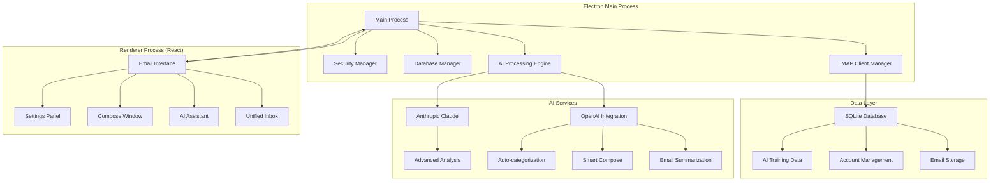

# TekUp Inbox AI (`apps/inbox-ai`)

A sophisticated cross-platform desktop email application that unifies multiple IMAP accounts with advanced AI capabilities, providing intelligent email management, automated responses, and seamless integration with the TekUp ecosystem.

## 🏗️ Architecture Overview

TekUp Inbox AI is built as an Electron application that combines the power of desktop computing with modern web technologies, providing a native email experience with AI-powered features and TekUp ecosystem integration.

### Core Architecture



## 🚀 Tech Stack

- **Framework**: Electron 37.x with React 18
- **Language**: TypeScript (strict mode)
- **UI Library**: React with Tailwind CSS
- **Database**: SQLite with better-sqlite3
- **Email Processing**: Custom IMAP client with node-imap
- **AI Integration**: OpenAI GPT-4, Anthropic Claude
- **Security**: Electron security best practices
- **Build System**: Vite for renderer, TypeScript for main process
- **Testing**: Jest with Electron testing utilities

## ✨ Key Features

### 📧 Unified Email Management
- **Multi-account Support**: Gmail, Outlook, Yahoo, and custom IMAP servers
- **Unified Inbox**: Single interface for all email accounts
- **Smart Folders**: AI-powered automatic email categorization
- **Advanced Search**: Full-text search across all accounts and attachments
- **Offline Support**: Local email storage for offline access

### 🤖 AI-Powered Features
- **Smart Compose**: AI-assisted email writing with context awareness
- **Email Summarization**: Automatic summarization of long email threads
- **Priority Detection**: AI-powered email priority and urgency detection
- **Auto-categorization**: Intelligent email sorting and labeling
- **Response Suggestions**: Smart reply suggestions based on email content

### 🔒 Security & Privacy
- **Local-first Architecture**: All data stored locally with optional cloud sync
- **Encrypted Storage**: Email credentials and sensitive data encrypted at rest
- **Secure Communication**: TLS/SSL for all email server connections
- **Privacy Controls**: Granular privacy settings for AI features
- **Audit Logging**: Complete audit trail for security monitoring

### 🔗 TekUp Ecosystem Integration
- **CRM Integration**: Automatic contact synchronization with TekUp CRM
- **Lead Generation**: Email-to-lead conversion with AI analysis
- **Activity Tracking**: Email interactions logged in TekUp activity system
- **Voice Integration**: Voice commands for email management
- **Workflow Automation**: Integration with TekUp automation workflows

## 🔧 Environment Configuration

### Required Environment Variables

```bash
# AI Services
OPENAI_API_KEY=your_openai_api_key_here
ANTHROPIC_API_KEY=your_anthropic_api_key_here

# TekUp Integration
TEKUP_API_URL=http://localhost:4000
TEKUP_CRM_API_URL=http://localhost:4001
TEKUP_API_KEY=your_tekup_api_key

# Email Configuration
SMTP_RATE_LIMIT=100
IMAP_CONNECTION_TIMEOUT=30000
EMAIL_SYNC_INTERVAL=300000

# Security
ENCRYPTION_KEY=your_encryption_key_here
MASTER_PASSWORD_REQUIRED=true

# Development
NODE_ENV=development
ELECTRON_IS_DEV=true
DEBUG_EMAIL_SYNC=true
```

### Application Configuration

```json
{
  "email": {
    "maxAccountsPerUser": 10,
    "syncInterval": 300000,
    "maxEmailsPerSync": 1000,
    "attachmentSizeLimit": 25000000
  },
  "ai": {
    "enableSmartCompose": true,
    "enableSummarization": true,
    "enableCategorization": true,
    "maxTokensPerRequest": 4000,
    "confidenceThreshold": 0.8
  },
  "security": {
    "encryptLocalData": true,
    "requireMasterPassword": true,
    "sessionTimeout": 3600000,
    "maxLoginAttempts": 5
  },
  "ui": {
    "theme": "system",
    "compactMode": false,
    "showPreviewPane": true,
    "enableNotifications": true
  }
}
```

## 🏃‍♂️ Quick Start

### Prerequisites

- Node.js 18.18.0+
- Python 3.8+ (for native dependencies)
- Git
- Windows: Visual Studio Build Tools
- macOS: Xcode Command Line Tools
- Linux: build-essential

### Installation & Setup

```bash
# Clone and install dependencies
pnpm install

# Setup database
pnpm run db:migrate

# Start development environment
pnpm run dev

# Build for production
pnpm run build

# Package for distribution
pnpm run dist
```

### First Run Setup

1. **Master Password**: Set up a master password for local data encryption
2. **Email Accounts**: Add your email accounts (Gmail, Outlook, etc.)
3. **AI Configuration**: Configure AI features and privacy settings
4. **TekUp Integration**: Connect to your TekUp tenant (optional)

## 📧 Email Account Configuration

### Supported Email Providers

```typescript
// Pre-configured email providers
const EMAIL_PROVIDERS = {
  gmail: {
    name: 'Gmail',
    imap: {
      host: 'imap.gmail.com',
      port: 993,
      secure: true,
    },
    smtp: {
      host: 'smtp.gmail.com',
      port: 587,
      secure: false,
      requireTLS: true,
    },
    authType: 'oauth2',
  },
  outlook: {
    name: 'Outlook',
    imap: {
      host: 'outlook.office365.com',
      port: 993,
      secure: true,
    },
    smtp: {
      host: 'smtp-mail.outlook.com',
      port: 587,
      secure: false,
      requireTLS: true,
    },
    authType: 'oauth2',
  },
  yahoo: {
    name: 'Yahoo',
    imap: {
      host: 'imap.mail.yahoo.com',
      port: 993,
      secure: true,
    },
    smtp: {
      host: 'smtp.mail.yahoo.com',
      port: 587,
      secure: false,
      requireTLS: true,
    },
    authType: 'password',
  },
  custom: {
    name: 'Custom IMAP',
    // User-configurable settings
  },
};
```

### OAuth2 Setup

```typescript
// Gmail OAuth2 configuration
class GmailOAuth2Service {
  private readonly clientId = process.env.GMAIL_CLIENT_ID;
  private readonly clientSecret = process.env.GMAIL_CLIENT_SECRET;
  private readonly redirectUri = 'http://localhost:8080/oauth/callback';
  
  async getAuthUrl(): Promise<string> {
    const oauth2Client = new google.auth.OAuth2(
      this.clientId,
      this.clientSecret,
      this.redirectUri
    );
    
    return oauth2Client.generateAuthUrl({
      access_type: 'offline',
      scope: [
        'https://www.googleapis.com/auth/gmail.readonly',
        'https://www.googleapis.com/auth/gmail.send',
        'https://www.googleapis.com/auth/gmail.modify',
      ],
    });
  }
  
  async exchangeCodeForTokens(code: string): Promise<OAuth2Tokens> {
    const oauth2Client = new google.auth.OAuth2(
      this.clientId,
      this.clientSecret,
      this.redirectUri
    );
    
    const { tokens } = await oauth2Client.getToken(code);
    return tokens;
  }
}
```

## 🤖 AI Integration

### Smart Compose Feature

```typescript
// AI-powered email composition
class SmartComposeService {
  private openai: OpenAI;
  
  constructor() {
    this.openai = new OpenAI({
      apiKey: process.env.OPENAI_API_KEY,
    });
  }
  
  async generateEmailSuggestion(
    context: EmailContext,
    userInput: string
  ): Promise<EmailSuggestion> {
    const prompt = this.buildComposePrompt(context, userInput);
    
    const response = await this.openai.chat.completions.create({
      model: 'gpt-4',
      messages: [
        {
          role: 'system',
          content: 'You are an AI email assistant helping users compose professional emails.',
        },
        {
          role: 'user',
          content: prompt,
        },
      ],
      max_tokens: 500,
      temperature: 0.7,
    });
    
    return {
      suggestion: response.choices[0].message.content,
      confidence: this.calculateConfidence(response),
      alternatives: await this.generateAlternatives(context, userInput),
    };
  }
  
  private buildComposePrompt(context: EmailContext, userInput: string): string {
    return `
      Context:
      - Recipient: ${context.recipient}
      - Subject: ${context.subject}
      - Previous emails in thread: ${context.previousEmails?.length || 0}
      - User's writing style: ${context.userStyle}
      
      User input: "${userInput}"
      
      Please help complete this email in a professional and appropriate tone.
      Consider the context and maintain consistency with the user's writing style.
    `;
  }
}
```

### Email Summarization

```typescript
// AI-powered email summarization
class EmailSummarizationService {
  async summarizeEmail(email: Email): Promise<EmailSummary> {
    const response = await this.openai.chat.completions.create({
      model: 'gpt-4',
      messages: [
        {
          role: 'system',
          content: `
            You are an AI assistant that summarizes emails concisely.
            Provide a brief summary highlighting key points, action items, and important dates.
            Format the response as JSON with the following structure:
            {
              "summary": "Brief summary of the email",
              "keyPoints": ["Key point 1", "Key point 2"],
              "actionItems": ["Action item 1", "Action item 2"],
              "importantDates": ["Date 1", "Date 2"],
              "sentiment": "positive|neutral|negative",
              "priority": "high|medium|low"
            }
          `,
        },
        {
          role: 'user',
          content: `
            From: ${email.from}
            To: ${email.to}
            Subject: ${email.subject}
            Date: ${email.date}
            
            ${email.body}
          `,
        },
      ],
      max_tokens: 300,
      temperature: 0.3,
    });
    
    return JSON.parse(response.choices[0].message.content);
  }
}
```

### Auto-categorization

```typescript
// AI-powered email categorization
class EmailCategorizationService {
  private categories = [
    'work',
    'personal',
    'finance',
    'shopping',
    'travel',
    'social',
    'newsletters',
    'promotions',
    'support',
    'urgent',
  ];
  
  async categorizeEmail(email: Email): Promise<EmailCategory> {
    const response = await this.openai.chat.completions.create({
      model: 'gpt-3.5-turbo',
      messages: [
        {
          role: 'system',
          content: `
            Categorize the following email into one of these categories:
            ${this.categories.join(', ')}
            
            Respond with JSON: {"category": "category_name", "confidence": 0.95}
          `,
        },
        {
          role: 'user',
          content: `
            From: ${email.from}
            Subject: ${email.subject}
            Body: ${email.body.substring(0, 500)}...
          `,
        },
      ],
      max_tokens: 50,
      temperature: 0.1,
    });
    
    return JSON.parse(response.choices[0].message.content);
  }
}
```

## 📊 Database Schema

### SQLite Database Structure

```sql
-- Email accounts
CREATE TABLE email_accounts (
  id TEXT PRIMARY KEY,
  name TEXT NOT NULL,
  email TEXT NOT NULL UNIQUE,
  provider TEXT NOT NULL,
  imap_config TEXT NOT NULL, -- JSON
  smtp_config TEXT NOT NULL, -- JSON
  auth_type TEXT NOT NULL,
  credentials TEXT NOT NULL, -- Encrypted JSON
  is_active BOOLEAN DEFAULT 1,
  last_sync DATETIME,
  created_at DATETIME DEFAULT CURRENT_TIMESTAMP,
  updated_at DATETIME DEFAULT CURRENT_TIMESTAMP
);

-- Emails
CREATE TABLE emails (
  id TEXT PRIMARY KEY,
  account_id TEXT NOT NULL,
  message_id TEXT NOT NULL,
  thread_id TEXT,
  folder TEXT NOT NULL,
  from_address TEXT NOT NULL,
  to_addresses TEXT NOT NULL, -- JSON array
  cc_addresses TEXT, -- JSON array
  bcc_addresses TEXT, -- JSON array
  subject TEXT,
  body_text TEXT,
  body_html TEXT,
  date DATETIME NOT NULL,
  is_read BOOLEAN DEFAULT 0,
  is_starred BOOLEAN DEFAULT 0,
  is_archived BOOLEAN DEFAULT 0,
  is_deleted BOOLEAN DEFAULT 0,
  has_attachments BOOLEAN DEFAULT 0,
  ai_summary TEXT, -- JSON
  ai_category TEXT,
  ai_priority TEXT,
  created_at DATETIME DEFAULT CURRENT_TIMESTAMP,
  updated_at DATETIME DEFAULT CURRENT_TIMESTAMP,
  FOREIGN KEY (account_id) REFERENCES email_accounts(id)
);

-- Email attachments
CREATE TABLE email_attachments (
  id TEXT PRIMARY KEY,
  email_id TEXT NOT NULL,
  filename TEXT NOT NULL,
  content_type TEXT,
  size INTEGER,
  content_id TEXT,
  file_path TEXT, -- Local storage path
  created_at DATETIME DEFAULT CURRENT_TIMESTAMP,
  FOREIGN KEY (email_id) REFERENCES emails(id)
);

-- AI training data
CREATE TABLE ai_training_data (
  id TEXT PRIMARY KEY,
  email_id TEXT NOT NULL,
  feature_type TEXT NOT NULL, -- 'categorization', 'priority', 'summary'
  user_feedback TEXT NOT NULL, -- JSON
  ai_prediction TEXT NOT NULL, -- JSON
  is_correct BOOLEAN,
  created_at DATETIME DEFAULT CURRENT_TIMESTAMP,
  FOREIGN KEY (email_id) REFERENCES emails(id)
);

-- User preferences
CREATE TABLE user_preferences (
  key TEXT PRIMARY KEY,
  value TEXT NOT NULL, -- JSON
  updated_at DATETIME DEFAULT CURRENT_TIMESTAMP
);

-- Indexes for performance
CREATE INDEX idx_emails_account_date ON emails(account_id, date DESC);
CREATE INDEX idx_emails_thread ON emails(thread_id);
CREATE INDEX idx_emails_folder ON emails(account_id, folder);
CREATE INDEX idx_emails_search ON emails(subject, from_address);
```

## 🔒 Security Implementation

### Data Encryption

```typescript
// Secure credential storage
class CredentialManager {
  private encryptionKey: Buffer;
  
  constructor() {
    this.encryptionKey = this.deriveEncryptionKey();
  }
  
  encryptCredentials(credentials: EmailCredentials): string {
    const cipher = crypto.createCipher('aes-256-gcm', this.encryptionKey);
    const encrypted = cipher.update(JSON.stringify(credentials), 'utf8', 'hex');
    const final = cipher.final('hex');
    const authTag = cipher.getAuthTag();
    
    return JSON.stringify({
      encrypted: encrypted + final,
      authTag: authTag.toString('hex'),
    });
  }
  
  decryptCredentials(encryptedData: string): EmailCredentials {
    const { encrypted, authTag } = JSON.parse(encryptedData);
    const decipher = crypto.createDecipher('aes-256-gcm', this.encryptionKey);
    
    decipher.setAuthTag(Buffer.from(authTag, 'hex'));
    
    const decrypted = decipher.update(encrypted, 'hex', 'utf8');
    const final = decipher.final('utf8');
    
    return JSON.parse(decrypted + final);
  }
  
  private deriveEncryptionKey(): Buffer {
    const masterPassword = this.getMasterPassword();
    const salt = this.getOrCreateSalt();
    
    return crypto.pbkdf2Sync(masterPassword, salt, 100000, 32, 'sha256');
  }
}
```

### Secure IPC Communication

```typescript
// Secure communication between main and renderer processes
class SecureIPC {
  static setupSecureChannels() {
    // Email operations
    ipcMain.handle('email:get-accounts', this.validateAndExecute(this.getEmailAccounts));
    ipcMain.handle('email:add-account', this.validateAndExecute(this.addEmailAccount));
    ipcMain.handle('email:sync', this.validateAndExecute(this.syncEmails));
    
    // AI operations
    ipcMain.handle('ai:summarize-email', this.validateAndExecute(this.summarizeEmail));
    ipcMain.handle('ai:compose-suggestion', this.validateAndExecute(this.getComposeSuggestion));
  }
  
  private static validateAndExecute(handler: Function) {
    return async (event: IpcMainInvokeEvent, ...args: any[]) => {
      // Validate sender
      if (!this.isValidSender(event.sender)) {
        throw new Error('Unauthorized IPC request');
      }
      
      // Rate limiting
      if (!this.checkRateLimit(event.sender)) {
        throw new Error('Rate limit exceeded');
      }
      
      // Execute handler
      return handler(...args);
    };
  }
}
```

## 🧪 Testing

### Unit Testing

```typescript
// Email service unit tests
describe('EmailService', () => {
  let emailService: EmailService;
  let mockDatabase: jest.Mocked<Database>;
  
  beforeEach(() => {
    mockDatabase = createMockDatabase();
    emailService = new EmailService(mockDatabase);
  });
  
  describe('syncEmails', () => {
    it('should sync new emails from IMAP server', async () => {
      const mockAccount = createMockEmailAccount();
      const mockEmails = createMockEmails(5);
      
      mockDatabase.getEmailAccount.mockResolvedValue(mockAccount);
      jest.spyOn(emailService, 'fetchEmailsFromIMAP').mockResolvedValue(mockEmails);
      
      const result = await emailService.syncEmails(mockAccount.id);
      
      expect(result.newEmails).toBe(5);
      expect(mockDatabase.insertEmails).toHaveBeenCalledWith(mockEmails);
    });
    
    it('should handle IMAP connection errors gracefully', async () => {
      const mockAccount = createMockEmailAccount();
      
      mockDatabase.getEmailAccount.mockResolvedValue(mockAccount);
      jest.spyOn(emailService, 'fetchEmailsFromIMAP').mockRejectedValue(
        new Error('IMAP connection failed')
      );
      
      await expect(emailService.syncEmails(mockAccount.id)).rejects.toThrow(
        'IMAP connection failed'
      );
    });
  });
});
```

### Integration Testing

```typescript
// AI integration tests
describe('AI Integration', () => {
  let aiService: AIService;
  
  beforeEach(() => {
    aiService = new AIService({
      openaiApiKey: process.env.OPENAI_API_KEY,
      anthropicApiKey: process.env.ANTHROPIC_API_KEY,
    });
  });
  
  it('should summarize email content accurately', async () => {
    const testEmail = {
      subject: 'Project Update - Q4 Planning',
      body: 'Hi team, I wanted to update you on our Q4 planning progress...',
      from: 'manager@company.com',
    };
    
    const summary = await aiService.summarizeEmail(testEmail);
    
    expect(summary.summary).toBeDefined();
    expect(summary.keyPoints).toBeInstanceOf(Array);
    expect(summary.priority).toMatch(/high|medium|low/);
  }, 30000); // 30 second timeout for AI API calls
});
```

### End-to-End Testing

```typescript
// Electron E2E tests
describe('Email Application E2E', () => {
  let app: Application;
  
  beforeEach(async () => {
    app = new Application({
      path: electronPath,
      args: [path.join(__dirname, '../dist/main/index.js')],
      env: {
        NODE_ENV: 'test',
      },
    });
    
    await app.start();
  });
  
  afterEach(async () => {
    if (app && app.isRunning()) {
      await app.stop();
    }
  });
  
  it('should display unified inbox after account setup', async () => {
    // Setup test email account
    await app.client.click('[data-testid="add-account-button"]');
    await app.client.setValue('[data-testid="email-input"]', 'test@example.com');
    await app.client.setValue('[data-testid="password-input"]', 'testpassword');
    await app.client.click('[data-testid="connect-button"]');
    
    // Wait for sync to complete
    await app.client.waitForVisible('[data-testid="inbox-list"]', 10000);
    
    // Verify inbox is displayed
    const emailCount = await app.client.elements('[data-testid="email-item"]');
    expect(emailCount.value.length).toBeGreaterThan(0);
  });
});
```

## 🚀 Build and Distribution

### Build Configuration

```json
{
  "build": {
    "appId": "com.tekup.inbox-ai",
    "productName": "TekUp Inbox AI",
    "directories": {
      "output": "release",
      "buildResources": "build"
    },
    "files": [
      "dist/**/*",
      "assets/**/*",
      "node_modules/**/*",
      "package.json"
    ],
    "mac": {
      "category": "public.app-category.productivity",
      "icon": "build/icon.icns",
      "target": {
        "target": "dmg",
        "arch": ["x64", "arm64"]
      },
      "notarize": {
        "teamId": "TEAM_ID"
      }
    },
    "win": {
      "target": [
        {
          "target": "nsis",
          "arch": ["x64"]
        },
        {
          "target": "portable",
          "arch": ["x64"]
        }
      ],
      "icon": "build/icon.ico",
      "publisherName": "TekUp.dk"
    },
    "linux": {
      "target": [
        {
          "target": "AppImage",
          "arch": ["x64"]
        },
        {
          "target": "deb",
          "arch": ["x64"]
        }
      ],
      "icon": "build/icon.png",
      "category": "Office"
    }
  }
}
```

### Auto-updater Configuration

```typescript
// Auto-updater implementation
class AutoUpdater {
  constructor() {
    autoUpdater.setFeedURL({
      provider: 'github',
      owner: 'tekup-dk',
      repo: 'inbox-ai',
    });
    
    autoUpdater.checkForUpdatesAndNotify();
  }
  
  setupUpdateHandlers() {
    autoUpdater.on('checking-for-update', () => {
      console.log('Checking for update...');
    });
    
    autoUpdater.on('update-available', (info) => {
      console.log('Update available:', info);
      this.showUpdateNotification(info);
    });
    
    autoUpdater.on('update-downloaded', (info) => {
      console.log('Update downloaded:', info);
      this.showRestartDialog();
    });
  }
  
  private showUpdateNotification(info: UpdateInfo) {
    dialog.showMessageBox({
      type: 'info',
      title: 'Update Available',
      message: `A new version (${info.version}) is available. It will be downloaded in the background.`,
      buttons: ['OK'],
    });
  }
}
```

## 🔧 Development Scripts

```bash
# Development
pnpm run dev                    # Start development with hot reload
pnpm run dev:main              # Start main process only
pnpm run dev:renderer          # Start renderer process only

# Building
pnpm run build                 # Build for production
pnpm run build:main            # Build main process
pnpm run build:renderer        # Build renderer process

# Testing
pnpm run test                  # Run all tests
pnpm run test:watch            # Run tests in watch mode
pnpm run test:e2e              # Run E2E tests

# Distribution
pnpm run dist                  # Build and package for current platform
pnpm run dist:win              # Build for Windows
pnpm run dist:mac              # Build for macOS
pnpm run dist:linux            # Build for Linux
pnpm run dist:all              # Build for all platforms

# Database
pnpm run db:migrate            # Run database migrations
pnpm run db:seed               # Seed test data
pnpm run db:reset              # Reset database

# Code Quality
pnpm run lint                  # Run ESLint
pnpm run lint:fix              # Fix ESLint issues
pnpm run type-check            # TypeScript type checking
```

## 🐛 Troubleshooting

### Common Issues

1. **Email Sync Issues**
   ```bash
   # Check IMAP connectivity
   telnet imap.gmail.com 993
   
   # Verify credentials
   pnpm run test:auth
   ```

2. **AI Service Issues**
   ```bash
   # Test AI API connectivity
   curl -H "Authorization: Bearer $OPENAI_API_KEY" \
        https://api.openai.com/v1/models
   ```

3. **Database Issues**
   ```bash
   # Reset database
   pnpm run db:reset
   
   # Check database integrity
   sqlite3 data/inbox.db "PRAGMA integrity_check;"
   ```

4. **Build Issues**
   ```bash
   # Clear build cache
   rm -rf dist release
   
   # Rebuild native dependencies
   pnpm rebuild
   ```

### Debug Mode

Enable comprehensive debugging:
```bash
DEBUG=inbox-ai:*
ELECTRON_IS_DEV=true
DEBUG_EMAIL_SYNC=true
pnpm run dev
```

## 🔄 Roadmap

### Phase 1: Core Email Client ✅
- [x] Multi-account IMAP support
- [x] Unified inbox interface
- [x] Basic AI features (summarization, categorization)
- [x] Secure credential storage
- [x] Cross-platform desktop app

### Phase 2: Advanced AI Features 🚧
- [ ] Advanced smart compose with context awareness
- [ ] Email thread analysis and insights
- [ ] Automated email scheduling and follow-ups
- [ ] Voice-to-email dictation
- [ ] Advanced search with natural language queries

### Phase 3: Enterprise Features 📋
- [ ] Team collaboration features
- [ ] Advanced security and compliance
- [ ] Custom AI model training
- [ ] Enterprise deployment options
- [ ] Advanced analytics and reporting

## 🤝 Contributing

1. Follow the [TekUp Development Guidelines](../../docs/CONTRIBUTING.md)
2. Ensure all tests pass: `pnpm test`
3. Follow Electron security best practices
4. Test on all target platforms
5. Update documentation for new features

## 📄 License

This project is part of the TekUp ecosystem and is proprietary software.

---

**Built with ❤️ by the TekUp Team**