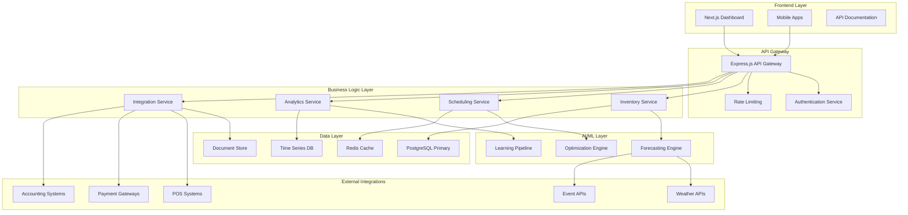

# RestaurantIQ - Full Feature Product Plan

**AI-Powered Restaurant Intelligence SaaS for Danish Market**  
*Version 1.0 | September 2025*

---

## 📋 Executive Summary

RestaurantIQ is an AI-driven SaaS platform designed to revolutionize Danish restaurant operations through intelligent inventory forecasting, staff scheduling optimization, and menu profitability analysis. Built as a **standalone-first platform** with future Tekup ecosystem integration capabilities.

### Core Value Proposition
- **Reduce food waste by 25-40%** through AI-powered demand forecasting
- **Optimize labor costs by 15-30%** with intelligent staff scheduling
- **Increase profit margins by 10-25%** through menu analytics and pricing optimization
- **Ensure Danish compliance** with arbejdsmiljølov, overenskomster, and GDPR
- **Seamless POS integration** with major Danish systems and payment providers

---

## 🎯 Target Market

### Primary Market
- **Small to Medium Danish Restaurants** (5-50 employees)
- **Restaurant Chains** (2-20 locations)
- **Food Trucks & Mobile Restaurants**
- **Cafés & Casual Dining** establishments

### Market Size (Denmark)
- **Total Addressable Market**: ~15,000 restaurants
- **Serviceable Available Market**: ~8,500 digitally-ready establishments
- **Initial Target**: 500 restaurants in Copenhagen metropolitan area

---

## 🏗️ Complete Feature Set

### 1. AI Inventory Forecasting & Management

#### Core Features
- **Demand Prediction Engine**
  - Machine learning models analyzing historical sales data
  - Weather impact analysis for seasonal adjustments
  - Event-based demand forecasting (concerts, sports, holidays)
  - Local area event integration (Copenhagen events API)
  - Real-time adjustment based on current sales trends

- **Smart Inventory Management**
  - Automatic reorder point calculations
  - Supplier integration and automated ordering
  - Expiration date tracking and waste prevention alerts
  - Recipe-based ingredient consumption tracking
  - Multi-location inventory synchronization

- **Waste Reduction Analytics**
  - Real-time waste tracking and reporting
  - Predictive alerts for overstocking
  - Donation coordination with local food banks
  - Waste cost analysis and ROI tracking
  - Sustainability reporting for ESG compliance

#### Advanced Features
- **Supply Chain Optimization**
  - Multi-supplier price comparison
  - Quality score tracking for suppliers
  - Delivery schedule optimization
  - Emergency supplier backup systems
  - Local supplier network integration

- **Recipe Cost Analysis**
  - Dynamic recipe costing based on ingredient prices
  - Portion size optimization recommendations
  - Alternative ingredient suggestions
  - Seasonal menu adaptation recommendations

### 2. Intelligent Staff Scheduling

#### Core Features
- **AI-Powered Schedule Generation**
  - Demand-based staffing predictions
  - Employee availability optimization
  - Skill-based assignment algorithms
  - Break and shift pattern optimization
  - Multi-location staff coordination

- **Danish Labor Law Compliance**
  - Arbejdsmiljølov compliance checking
  - Overenskomst adherence validation
  - Mandatory break scheduling
  - Overtime calculation and alerts
  - Holiday and sick leave management
  - EU working time directive compliance

- **Real-Time Schedule Management**
  - Last-minute shift change handling
  - Employee self-service shift swapping
  - Real-time attendance tracking
  - Performance-based scheduling adjustments
  - Emergency staff coverage algorithms

#### Advanced Features
- **Employee Analytics**
  - Productivity tracking per employee
  - Training needs identification
  - Performance trend analysis
  - Retention risk prediction
  - Career development path suggestions

- **Integration with Danish Systems**
  - Borger.dk integration for employee verification
  - Skat.dk integration for tax reporting
  - SIRI payroll system integration
  - Danish pension scheme integration

### 3. Menu Profitability Analyzer

#### Core Features
- **Dynamic Menu Analysis**
  - Real-time profit margin calculations
  - Ingredient cost tracking per dish
  - Sales performance analytics per menu item
  - Competitor price analysis
  - Customer preference trending

- **Pricing Optimization Engine**
  - AI-driven price recommendation algorithms
  - Market-based pricing adjustments
  - Seasonal pricing strategies
  - A/B testing framework for price changes
  - Revenue optimization suggestions

- **Menu Engineering Dashboard**
  - Star/Dog/Plow horse/Puzzle classification
  - Menu item performance matrices
  - Cross-selling opportunity identification
  - Upselling recommendation engine
  - Menu layout optimization suggestions

#### Advanced Features
- **Customer Analytics Integration**
  - Customer lifetime value tracking
  - Dietary preference analysis
  - Order pattern recognition
  - Personalized menu recommendations
  - Customer satisfaction correlation with profitability

### 4. Operational Dashboard & Reporting

#### Core Features
- **Real-Time Operations Dashboard**
  - Live sales and performance metrics
  - Inventory status overview
  - Staff schedule and attendance
  - Kitchen queue management
  - Customer satisfaction scores

- **Advanced Analytics & Reporting**
  - Custom report builder
  - Financial performance analytics
  - Operational efficiency metrics
  - Comparative analysis (location vs. location)
  - Trend analysis and forecasting

- **Alert & Notification System**
  - Proactive issue detection
  - Critical threshold alerts
  - Mobile notifications for managers
  - Escalation procedures
  - Performance milestone notifications

#### Advanced Features
- **Business Intelligence Suite**
  - Executive-level dashboards
  - Board reporting templates
  - Investor-ready metrics
  - Benchmarking against industry standards
  - Growth opportunity identification

### 5. POS & Payment Integrations

#### Core POS Integrations
- **Major Danish POS Systems**
  - Lightspeed Restaurant (DK)
  - Revel Systems Denmark
  - Toast POS (European)
  - Square for Restaurants
  - Ordrestyring.dk
  - Dinero Kasse

- **Payment Gateway Integrations**
  - **MobilePay** (Primary Danish payment)
  - **Nets/Teller** (Major Danish acquirer)
  - **Swedbank Pay**
  - **Stripe** (International backup)
  - **PayPal** (Online orders)

#### Advanced Integration Features
- **Unified Order Management**
  - Online ordering integration
  - Delivery platform coordination (Just Eat, Wolt, Foodora)
  - Reservation system integration
  - Customer data unification
  - Loyalty program management

### 6. Multi-Location Management

#### Core Features
- **Centralized Management Console**
  - Multi-location dashboard overview
  - Standardized reporting across locations
  - Central inventory management
  - Corporate policy enforcement
  - Performance comparison tools

- **Location-Specific Customization**
  - Local menu variations
  - Regional pricing strategies
  - Location-specific staff scheduling
  - Local supplier integrations
  - Customized reporting requirements

#### Advanced Features
- **Franchise Management Tools**
  - Franchisee performance tracking
  - Brand compliance monitoring
  - Centralized purchasing coordination
  - Knowledge sharing platforms
  - Best practice distribution

### 7. Mobile Applications

#### Manager Mobile App
- **Core Management Features**
  - Real-time dashboard access
  - Schedule management on-the-go
  - Inventory quick updates
  - Staff communication tools
  - Alert and notification center

- **Advanced Mobile Features**
  - Offline capability with sync
  - Push notifications for critical issues
  - Mobile approval workflows
  - Photo-based inventory updates
  - Voice-to-text reporting

#### Staff Mobile App
- **Employee Self-Service**
  - Schedule viewing and shift swapping
  - Time clock with GPS verification
  - Internal messaging system
  - Training module access
  - Performance feedback viewing

### 8. Integration APIs & Third-Party Ecosystem

#### Core API Features
- **RESTful API Suite**
  - Full CRUD operations for all data
  - Webhook support for real-time events
  - Rate limiting and authentication
  - Comprehensive API documentation
  - SDK development kits

- **Danish Business Integrations**
  - **e-conomic** accounting integration
  - **Dinero** accounting integration
  - **Billy** accounting integration
  - **Skat.dk** tax reporting
  - **Erhvervsstyrelsen** business registry

#### Advanced Integration Features
- **Enterprise Integrations**
  - ERP system connections
  - CRM system synchronization
  - Business intelligence tool exports
  - Custom integration development
  - White-label API solutions

### 9. Advanced Reporting & Analytics

#### Financial Analytics
- **Profit & Loss Analysis**
  - Real-time P&L generation
  - Cost center analysis
  - Margin analysis by category
  - Cash flow forecasting
  - Budget vs. actual reporting

- **KPI Dashboard Suite**
  - Revenue per square meter
  - Customer acquisition cost
  - Average transaction value
  - Employee productivity metrics
  - Food cost percentages

#### Operational Analytics
- **Performance Metrics**
  - Service time analysis
  - Kitchen efficiency metrics
  - Staff productivity tracking
  - Customer satisfaction correlation
  - Waste reduction measurements

### 10. AI & Machine Learning Engine

#### Forecasting Models
- **Demand Prediction**
  - Neural network-based sales forecasting
  - Weather impact modeling
  - Seasonal adjustment algorithms
  - Event-driven demand spikes
  - Economic indicator integration

- **Optimization Algorithms**
  - Genetic algorithms for staff scheduling
  - Linear programming for inventory optimization
  - Reinforcement learning for pricing
  - Clustering for customer segmentation
  - Time series analysis for trends

#### Continuous Learning System
- **Model Improvement**
  - Automated model retraining
  - Performance monitoring and adjustment
  - A/B testing framework
  - Feedback loop integration
  - Anomaly detection and correction

---

## 🏛️ Technical Architecture

### System Architecture Overview



### Database Design

#### Core Tables

```sql
-- Tenants & Organizations
CREATE TABLE tenants (
    id UUID PRIMARY KEY DEFAULT uuid_generate_v4(),
    name VARCHAR(255) NOT NULL,
    domain VARCHAR(255) UNIQUE,
    settings JSONB DEFAULT '{}',
    created_at TIMESTAMP WITH TIME ZONE DEFAULT NOW(),
    updated_at TIMESTAMP WITH TIME ZONE DEFAULT NOW()
);

-- Locations
CREATE TABLE locations (
    id UUID PRIMARY KEY DEFAULT uuid_generate_v4(),
    tenant_id UUID REFERENCES tenants(id),
    name VARCHAR(255) NOT NULL,
    address JSONB,
    settings JSONB DEFAULT '{}',
    pos_system VARCHAR(100),
    pos_config JSONB,
    created_at TIMESTAMP WITH TIME ZONE DEFAULT NOW()
);

-- Inventory Management
CREATE TABLE inventory_items (
    id UUID PRIMARY KEY DEFAULT uuid_generate_v4(),
    tenant_id UUID REFERENCES tenants(id),
    location_id UUID REFERENCES locations(id),
    name VARCHAR(255) NOT NULL,
    category VARCHAR(100),
    unit VARCHAR(50),
    current_stock DECIMAL(10,3),
    min_stock DECIMAL(10,3),
    max_stock DECIMAL(10,3),
    cost_per_unit DECIMAL(10,2),
    supplier_info JSONB,
    created_at TIMESTAMP WITH TIME ZONE DEFAULT NOW()
);

CREATE TABLE inventory_transactions (
    id UUID PRIMARY KEY DEFAULT uuid_generate_v4(),
    item_id UUID REFERENCES inventory_items(id),
    transaction_type VARCHAR(50), -- 'purchase', 'usage', 'waste', 'adjustment'
    quantity DECIMAL(10,3),
    cost_per_unit DECIMAL(10,2),
    total_cost DECIMAL(10,2),
    reference_id VARCHAR(255), -- POS transaction, order, etc.
    notes TEXT,
    created_at TIMESTAMP WITH TIME ZONE DEFAULT NOW()
);

-- Menu Management
CREATE TABLE menu_items (
    id UUID PRIMARY KEY DEFAULT uuid_generate_v4(),
    tenant_id UUID REFERENCES tenants(id),
    location_id UUID REFERENCES locations(id),
    name VARCHAR(255) NOT NULL,
    category VARCHAR(100),
    description TEXT,
    price DECIMAL(8,2),
    cost DECIMAL(8,2),
    active BOOLEAN DEFAULT true,
    nutrition_info JSONB,
    allergens TEXT[],
    created_at TIMESTAMP WITH TIME ZONE DEFAULT NOW()
);

CREATE TABLE recipe_ingredients (
    id UUID PRIMARY KEY DEFAULT uuid_generate_v4(),
    menu_item_id UUID REFERENCES menu_items(id),
    inventory_item_id UUID REFERENCES inventory_items(id),
    quantity DECIMAL(10,3),
    unit VARCHAR(50),
    created_at TIMESTAMP WITH TIME ZONE DEFAULT NOW()
);

-- Staff Management
CREATE TABLE employees (
    id UUID PRIMARY KEY DEFAULT uuid_generate_v4(),
    tenant_id UUID REFERENCES tenants(id),
    location_id UUID REFERENCES locations(id),
    employee_number VARCHAR(50) UNIQUE,
    first_name VARCHAR(100),
    last_name VARCHAR(100),
    email VARCHAR(255),
    phone VARCHAR(20),
    role VARCHAR(50),
    hourly_rate DECIMAL(8,2),
    skills JSONB DEFAULT '[]',
    availability JSONB DEFAULT '{}',
    active BOOLEAN DEFAULT true,
    created_at TIMESTAMP WITH TIME ZONE DEFAULT NOW()
);

CREATE TABLE schedules (
    id UUID PRIMARY KEY DEFAULT uuid_generate_v4(),
    employee_id UUID REFERENCES employees(id),
    location_id UUID REFERENCES locations(id),
    shift_date DATE,
    start_time TIME,
    end_time TIME,
    role VARCHAR(50),
    status VARCHAR(50) DEFAULT 'scheduled', -- 'scheduled', 'completed', 'no-show'
    actual_start_time TIMESTAMP WITH TIME ZONE,
    actual_end_time TIMESTAMP WITH TIME ZONE,
    break_minutes INTEGER DEFAULT 0,
    created_at TIMESTAMP WITH TIME ZONE DEFAULT NOW()
);

-- Sales & Analytics
CREATE TABLE sales_transactions (
    id UUID PRIMARY KEY DEFAULT uuid_generate_v4(),
    tenant_id UUID REFERENCES tenants(id),
    location_id UUID REFERENCES locations(id),
    pos_transaction_id VARCHAR(255),
    transaction_date TIMESTAMP WITH TIME ZONE,
    total_amount DECIMAL(10,2),
    payment_method VARCHAR(50),
    customer_id UUID,
    table_number INTEGER,
    server_id UUID REFERENCES employees(id),
    items JSONB, -- Array of sold items
    created_at TIMESTAMP WITH TIME ZONE DEFAULT NOW()
);

-- Forecasting & Predictions
CREATE TABLE demand_forecasts (
    id UUID PRIMARY KEY DEFAULT uuid_generate_v4(),
    tenant_id UUID REFERENCES tenants(id),
    location_id UUID REFERENCES locations(id),
    item_id UUID, -- Can be menu_item_id or inventory_item_id
    item_type VARCHAR(50), -- 'menu_item' or 'inventory_item'
    forecast_date DATE,
    predicted_quantity DECIMAL(10,3),
    confidence_level DECIMAL(5,2),
    weather_factor JSONB,
    event_factors JSONB,
    model_version VARCHAR(50),
    created_at TIMESTAMP WITH TIME ZONE DEFAULT NOW()
);

-- External Integrations
CREATE TABLE integration_logs (
    id UUID PRIMARY KEY DEFAULT uuid_generate_v4(),
    tenant_id UUID REFERENCES tenants(id),
    integration_type VARCHAR(100), -- 'pos', 'payment', 'accounting'
    action VARCHAR(100),
    status VARCHAR(50), -- 'success', 'error', 'pending'
    request_data JSONB,
    response_data JSONB,
    error_message TEXT,
    created_at TIMESTAMP WITH TIME ZONE DEFAULT NOW()
);
```

### API Endpoints Design

#### Authentication & Authorization
```
POST /api/v1/auth/login
POST /api/v1/auth/logout
POST /api/v1/auth/refresh
GET  /api/v1/auth/me
POST /api/v1/auth/forgot-password
POST /api/v1/auth/reset-password
```

#### Tenant & Location Management
```
GET    /api/v1/tenants
POST   /api/v1/tenants
GET    /api/v1/tenants/:id
PUT    /api/v1/tenants/:id
DELETE /api/v1/tenants/:id

GET    /api/v1/locations
POST   /api/v1/locations
GET    /api/v1/locations/:id
PUT    /api/v1/locations/:id
DELETE /api/v1/locations/:id
```

#### Inventory Management
```
GET    /api/v1/inventory/items
POST   /api/v1/inventory/items
GET    /api/v1/inventory/items/:id
PUT    /api/v1/inventory/items/:id
DELETE /api/v1/inventory/items/:id

GET    /api/v1/inventory/transactions
POST   /api/v1/inventory/transactions
GET    /api/v1/inventory/reports/waste
GET    /api/v1/inventory/reports/low-stock
GET    /api/v1/inventory/forecasts
```

#### Menu Management
```
GET    /api/v1/menu/items
POST   /api/v1/menu/items
GET    /api/v1/menu/items/:id
PUT    /api/v1/menu/items/:id
DELETE /api/v1/menu/items/:id

GET    /api/v1/menu/recipes/:menuItemId
POST   /api/v1/menu/recipes/:menuItemId
GET    /api/v1/menu/analytics/profitability
GET    /api/v1/menu/analytics/performance
```

#### Staff Management
```
GET    /api/v1/staff/employees
POST   /api/v1/staff/employees
GET    /api/v1/staff/employees/:id
PUT    /api/v1/staff/employees/:id
DELETE /api/v1/staff/employees/:id

GET    /api/v1/staff/schedules
POST   /api/v1/staff/schedules
PUT    /api/v1/staff/schedules/:id
GET    /api/v1/staff/schedules/generate
POST   /api/v1/staff/schedules/optimize

GET    /api/v1/staff/timeclock/checkin
POST   /api/v1/staff/timeclock/checkout
GET    /api/v1/staff/reports/productivity
```

#### Analytics & Reporting
```
GET    /api/v1/analytics/dashboard
GET    /api/v1/analytics/sales
GET    /api/v1/analytics/inventory
GET    /api/v1/analytics/staff
GET    /api/v1/analytics/financial
GET    /api/v1/analytics/custom
POST   /api/v1/reports/generate
GET    /api/v1/reports/:id/download
```

#### Integrations
```
GET    /api/v1/integrations/pos/status
POST   /api/v1/integrations/pos/sync
GET    /api/v1/integrations/payments/transactions
POST   /api/v1/integrations/accounting/export
GET    /api/v1/integrations/weather/forecast
GET    /api/v1/integrations/events/local
```

#### AI & Forecasting
```
GET    /api/v1/ai/forecasts/demand
GET    /api/v1/ai/forecasts/inventory
GET    /api/v1/ai/recommendations/menu
GET    /api/v1/ai/recommendations/pricing
GET    /api/v1/ai/recommendations/staff
POST   /api/v1/ai/models/retrain
GET    /api/v1/ai/models/performance
```

---

## 📅 Development Roadmap

### Phase 1: MVP (Months 1-4)
**Target**: Basic standalone platform with core functionality

#### Month 1-2: Foundation
- ✅ Project setup and Docker environment
- ✅ Database design and migrations
- ✅ Authentication and authorization system
- ✅ Multi-tenant architecture
- Basic frontend with Tailwind CSS 4.1
- Core API endpoints

#### Month 3-4: Core Features
- Basic inventory management
- Simple staff scheduling
- Menu item management
- Sales data import/sync
- Basic dashboard
- Mobile app foundation

### Phase 2: V1.0 - Enhanced Platform (Months 5-8)
**Target**: Production-ready platform with AI features

#### Month 5-6: AI Integration
- Demand forecasting engine
- Basic optimization algorithms
- Weather API integration
- Historical data analysis
- Predictive analytics dashboard

#### Month 7-8: Advanced Features
- Advanced scheduling algorithms
- Menu profitability analysis
- Danish labor law compliance
- POS system integrations (2-3 major systems)
- Mobile app completion

### Phase 3: V2.0 - Market Expansion (Months 9-12)
**Target**: Comprehensive platform with extensive integrations

#### Month 9-10: Integrations
- Payment gateway integrations (MobilePay, Nets)
- Accounting system integrations (e-conomic, Dinero)
- Advanced POS integrations (5+ systems)
- API ecosystem development

#### Month 11-12: Advanced Analytics
- Advanced reporting suite
- Business intelligence features
- Benchmarking capabilities
- Enterprise features
- Multi-location management

### Phase 4: Enterprise & Scale (Year 2)
**Target**: Enterprise-grade platform with Tekup integration

#### Quarter 1: Enterprise Features
- Advanced multi-tenant capabilities
- White-label solutions
- Enterprise security features
- Advanced API management
- Franchise management tools

#### Quarter 2: Tekup Integration
- SSO integration with Tekup ecosystem
- Unified billing system
- Cross-platform data sharing
- Shared user management
- Ecosystem benefits

#### Quarter 3: Nordic Expansion
- Norwegian market adaptation
- Swedish market adaptation
- Multi-language support
- Regional compliance features
- Local partnership integrations

#### Quarter 4: Advanced AI
- Machine learning optimization
- Predictive maintenance
- Customer behavior analysis
- Advanced forecasting models
- Real-time decision engine

---

## 💰 Business Model & Pricing Strategy

### Pricing Tiers

#### Starter Plan - 399 DKK/month per location
**Target**: Small independent restaurants (1-2 locations)

**Features Included**:
- Basic inventory management
- Simple staff scheduling (up to 15 employees)
- Basic menu analytics
- 1 POS integration
- Email support
- Basic reporting
- Mobile app access

**Limitations**:
- Single location only
- 1,000 transactions/month
- Basic forecasting only
- 30-day data retention

#### Professional Plan - 799 DKK/month per location
**Target**: Medium restaurants and small chains (2-10 locations)

**Features Included**:
- Advanced inventory management with forecasting
- Intelligent staff scheduling (up to 50 employees)
- Complete menu profitability analysis
- 3 POS integrations
- 2 accounting system integrations
- Priority phone support
- Advanced reporting and analytics
- API access (limited)

**Benefits**:
- Multi-location management
- 10,000 transactions/month
- Advanced AI forecasting
- 1-year data retention
- Danish compliance tools

#### Enterprise Plan - 1,499 DKK/month per location
**Target**: Large restaurants and chains (10+ locations)

**Features Included**:
- Complete platform access
- Unlimited POS and payment integrations
- Full accounting system integrations
- Dedicated customer success manager
- Custom reporting and dashboards
- Full API access
- White-label options
- Advanced analytics and benchmarking

**Enterprise Benefits**:
- Unlimited locations and employees
- Unlimited transactions
- Real-time AI optimization
- Unlimited data retention
- Custom integrations
- SLA guarantees
- Priority feature development

### Additional Revenue Streams

#### Setup & Onboarding Fees
- **Starter**: Free self-service onboarding
- **Professional**: 2,000 DKK one-time setup fee
- **Enterprise**: Custom onboarding (5,000-15,000 DKK)

#### Integration Fees
- **Standard Integrations**: Included in plans
- **Custom Integrations**: 15,000-50,000 DKK per integration
- **White-label Development**: 100,000-300,000 DKK

#### Premium Support
- **Training Sessions**: 1,000 DKK per session
- **Dedicated Support**: 5,000 DKK/month
- **On-site Consultation**: 2,000 DKK per day

#### Data & Analytics Services
- **Advanced Analytics Package**: +200 DKK/month per location
- **Benchmarking Reports**: +300 DKK/month
- **Custom AI Models**: 10,000-30,000 DKK development fee

### Revenue Projections (Year 1-3)

#### Year 1 Targets
- **Customers**: 50 restaurants (Q1) → 200 restaurants (Q4)
- **Average Revenue Per Customer**: 600 DKK/month
- **Monthly Recurring Revenue**: 120,000 DKK (Q4)
- **Annual Revenue**: ~700,000 DKK

#### Year 2 Targets
- **Customers**: 200 → 800 restaurants
- **Average Revenue Per Customer**: 750 DKK/month
- **Monthly Recurring Revenue**: 600,000 DKK (Q4)
- **Annual Revenue**: ~4,000,000 DKK

#### Year 3 Targets
- **Customers**: 800 → 2,000 restaurants
- **Average Revenue Per Customer**: 900 DKK/month
- **Monthly Recurring Revenue**: 1,800,000 DKK (Q4)
- **Annual Revenue**: ~12,000,000 DKK

### Customer Acquisition Strategy

#### Sales Channels
1. **Direct Sales** (Primary)
   - Copenhagen-based sales team
   - Targeted outreach to restaurant chains
   - Trade show participation (HORESTA events)
   - Industry partnership presentations

2. **Digital Marketing**
   - SEO-optimized website
   - Google Ads targeting restaurant owners
   - LinkedIn advertising to decision makers
   - Content marketing (restaurant industry insights)

3. **Partner Channel**
   - POS system integrations and referrals
   - Accounting software partnerships
   - Restaurant consultancy partnerships
   - Industry association collaborations

4. **Referral Program**
   - Customer referral incentives
   - Partner referral commissions
   - Success story case studies
   - Word-of-mouth amplification

---

## 📊 Key Performance Indicators (KPIs)

### Business KPIs

#### Revenue Metrics
- **Monthly Recurring Revenue (MRR)**
  - Target: 10% month-over-month growth
  - Tracking by plan type and customer segment

- **Annual Recurring Revenue (ARR)**
  - Year 1 Target: 1,000,000 DKK
  - Year 3 Target: 15,000,000 DKK

- **Customer Lifetime Value (LTV)**
  - Target: 25,000 DKK per customer
  - LTV:CAC ratio target: 3:1 minimum

#### Customer Metrics
- **Customer Acquisition Cost (CAC)**
  - Target: <8,000 DKK per customer
  - Payback period: <12 months

- **Customer Churn Rate**
  - Target: <5% monthly churn
  - Gross revenue churn: <3% monthly

- **Net Promoter Score (NPS)**
  - Target: >50 NPS score
  - Customer satisfaction: >4.5/5

### Product KPIs

#### Usage & Engagement
- **Daily Active Users (DAU)**
  - Target: >80% of customers using daily
  - Feature adoption rates

- **Feature Utilization**
  - Inventory management: >90% usage
  - Staff scheduling: >85% usage
  - Menu analytics: >75% usage

#### Technical Performance
- **System Uptime**
  - Target: 99.9% uptime
  - Response time: <200ms average

- **Integration Success Rate**
  - POS sync success: >99.5%
  - Payment processing: >99.9%
  - Data accuracy: >99.8%

### Customer Success KPIs

#### Value Delivery Metrics
- **Food Waste Reduction**
  - Target: 25-40% reduction per customer
  - Average: 32% waste reduction

- **Labor Cost Optimization**
  - Target: 15-30% labor cost savings
  - Average: 22% cost reduction

- **Profit Margin Improvement**
  - Target: 10-25% margin increase
  - Average: 18% margin improvement

- **Time Savings**
  - Administrative time reduction: 5-10 hours/week
  - Inventory management: 3-5 hours/week
  - Staff scheduling: 2-4 hours/week

### AI & Forecasting KPIs

#### Prediction Accuracy
- **Demand Forecasting Accuracy**
  - Target: >85% accuracy within 10% variance
  - Inventory optimization: >80% accuracy

- **Model Performance**
  - False positive rate: <5%
  - Model drift detection and correction
  - Continuous learning improvement metrics

---

## 🔧 Implementation Strategy

### Development Methodology
- **Agile/Scrum Development**
  - 2-week sprints
  - Continuous integration/deployment
  - Regular customer feedback integration
  - Iterative feature development

### Technology Stack Decisions

#### Backend Technology
- **Node.js + TypeScript**: Rapid development, strong ecosystem
- **Express.js**: Proven, flexible web framework
- **PostgreSQL**: Robust, GDPR-compliant, excellent for analytics
- **Redis**: Session management and caching
- **Docker**: Consistent development and deployment

#### Frontend Technology
- **Next.js 14+**: Server-side rendering, excellent performance
- **Tailwind CSS 4.1**: Futuristic design system, rapid styling
- **React**: Component-based architecture, extensive ecosystem

#### AI/ML Technology
- **Python**: Data science and machine learning
- **TensorFlow/PyTorch**: Deep learning models
- **scikit-learn**: Traditional ML algorithms
- **Apache Airflow**: ML pipeline orchestration

### Quality Assurance
- **Automated Testing**: >90% code coverage target
- **End-to-End Testing**: Critical user journey coverage
- **Security Testing**: Regular penetration testing
- **Performance Testing**: Load testing for scale

### Deployment Strategy
- **Staged Deployment**: Development → Staging → Production
- **Blue-Green Deployment**: Zero-downtime updates
- **Feature Flags**: Gradual feature rollouts
- **Monitoring**: Comprehensive observability stack

---

## 🛡️ Risk Management

### Technical Risks

#### Data Integration Challenges
- **Risk**: POS system integration complexities
- **Mitigation**: Standardized integration framework, extensive testing
- **Contingency**: Manual data import capabilities

#### Scalability Concerns
- **Risk**: Performance degradation at scale
- **Mitigation**: Microservices architecture, horizontal scaling
- **Contingency**: Cloud-native infrastructure, auto-scaling

#### AI Model Accuracy
- **Risk**: Inaccurate predictions leading to customer dissatisfaction
- **Mitigation**: Continuous model validation, human oversight
- **Contingency**: Fallback to conservative estimates

### Business Risks

#### Market Competition
- **Risk**: Large competitors entering Danish market
- **Mitigation**: Strong local partnerships, rapid innovation
- **Contingency**: Focus on niche specialization

#### Regulatory Changes
- **Risk**: Changes in Danish labor or data protection laws
- **Mitigation**: Legal compliance monitoring, flexible architecture
- **Contingency**: Rapid feature adaptation capabilities

#### Customer Acquisition
- **Risk**: Slower than expected customer adoption
- **Mitigation**: Strong pilot program, customer success focus
- **Contingency**: Pricing strategy adjustments, channel expansion

### Operational Risks

#### Team Scaling
- **Risk**: Difficulty hiring qualified developers
- **Mitigation**: Competitive compensation, remote-first culture
- **Contingency**: Outsourcing partnerships, contractor relationships

#### Customer Support Load
- **Risk**: Support requirements exceeding capacity
- **Mitigation**: Self-service tools, comprehensive documentation
- **Contingency**: Outsourced support partnerships

---

## 🚀 Go-to-Market Strategy

### Pre-Launch Phase (Months 1-3)
1. **Product Development**
   - Core MVP features completion
   - Alpha testing with friendly customers
   - Danish compliance validation

2. **Market Preparation**
   - Website development and SEO
   - Content marketing strategy
   - Industry relationship building

3. **Partnership Development**
   - POS system partnership agreements
   - Accounting software partnerships
   - Industry association connections

### Launch Phase (Months 4-6)
1. **Soft Launch**
   - Limited release to 20-30 pilot customers
   - Intensive customer success support
   - Product iteration based on feedback

2. **Marketing Campaign**
   - Industry publication features
   - Trade show participation
   - Digital advertising campaign launch

3. **Sales Team Activation**
   - Direct sales outreach
   - Demo program launch
   - Customer success story development

### Growth Phase (Months 7-12)
1. **Market Expansion**
   - Geographic expansion beyond Copenhagen
   - Feature set expansion
   - Enterprise customer targeting

2. **Partnership Scaling**
   - Channel partner program
   - Integration marketplace presence
   - Referral program optimization

3. **Customer Success Focus**
   - Customer health score tracking
   - Expansion revenue optimization
   - Churn prevention programs

---

## 🎯 Success Metrics & Milestones

### 6-Month Milestones
- [ ] 50 paying customers
- [ ] 3 major POS integrations completed
- [ ] 95% customer satisfaction score
- [ ] 500,000 DKK ARR
- [ ] Break-even on customer acquisition

### 12-Month Milestones
- [ ] 200 paying customers
- [ ] 1,500,000 DKK ARR
- [ ] <5% monthly churn rate
- [ ] 5 accounting system integrations
- [ ] 85%+ AI prediction accuracy
- [ ] Profitability achievement

### 18-Month Milestones
- [ ] 500 paying customers
- [ ] 4,000,000 DKK ARR
- [ ] Multi-location management features
- [ ] Enterprise customer acquisition
- [ ] Nordic market research completion
- [ ] Tekup integration planning

### 24-Month Milestones
- [ ] 1,000 paying customers
- [ ] 10,000,000 DKK ARR
- [ ] Market leadership in Denmark
- [ ] Tekup ecosystem integration
- [ ] Nordic expansion launch
- [ ] Series A funding readiness

---

## 📋 Conclusion

RestaurantIQ represents a comprehensive solution to the Danish restaurant industry's operational challenges, leveraging AI and modern technology to deliver measurable business value. The standalone-first approach ensures rapid market entry and customer validation, while the future Tekup integration path provides long-term strategic alignment.

The platform's focus on Danish compliance, local integrations, and measurable ROI positions it uniquely in the market. With conservative estimates showing potential for 15,000,000 DKK ARR within three years, RestaurantIQ presents a strong business opportunity with clear value proposition and execution strategy.

**Next Immediate Steps**:
1. Complete MVP development (Months 1-4)
2. Secure initial pilot customers in Copenhagen
3. Validate core value propositions through customer success metrics
4. Prepare for scaling and Series A funding discussions

---

*This document serves as the comprehensive product specification for RestaurantIQ and will be updated regularly as the product evolves and market feedback is incorporated.*

**Document Version**: 1.0  
**Last Updated**: September 11, 2025  
**Next Review**: October 15, 2025
