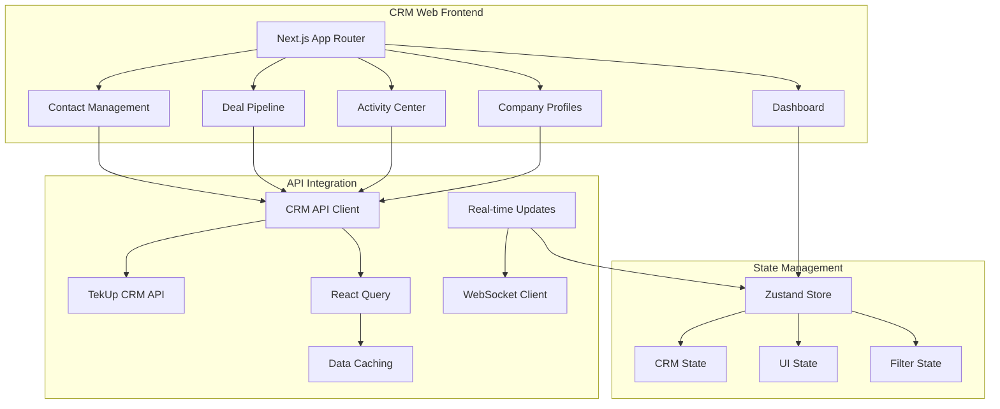

# TekUp CRM Web (`apps/tekup-crm-web`)

A comprehensive Customer Relationship Management web application built with Next.js 15, providing an intuitive interface for managing contacts, companies, deals, and activities with real-time updates and advanced analytics.

## 🏗️ Architecture Overview

The TekUp CRM Web application serves as the primary user interface for CRM operations, connecting to the CRM API and integrating with the broader TekUp ecosystem for seamless customer relationship management.

### Core Components



## 🚀 Tech Stack

- **Framework**: Next.js 15 with App Router
- **Language**: TypeScript (strict mode)
- **Styling**: Tailwind CSS 4.x
- **State Management**: Zustand for global state
- **Data Fetching**: TanStack React Query
- **UI Components**: Custom components with @tekup/ui
- **Authentication**: @tekup/auth integration
- **API Client**: @tekup/api-client for CRM operations
- **Testing**: Jest with React Testing Library

## ✨ Key Features

### 📊 Comprehensive Dashboard
- **Real-time metrics** and KPI tracking
- **Pipeline visualization** with drag-and-drop functionality
- **Activity timeline** and recent interactions
- **Revenue forecasting** and trend analysis
- **Customizable widgets** per tenant

### 👥 Advanced Contact Management
- **Detailed contact profiles** with interaction history
- **Smart contact search** with advanced filtering
- **Bulk operations** for contact management
- **Contact segmentation** and tagging
- **Communication tracking** across all channels

### 🏢 Company Management
- **Company hierarchies** and relationship mapping
- **Industry categorization** and custom fields
- **Company-wide activity tracking**
- **Deal association** and revenue tracking
- **Contact management** within companies

### 💼 Deal Pipeline Management
- **Visual pipeline** with customizable stages
- **Drag-and-drop** deal progression
- **Deal probability** and value tracking
- **Forecasting tools** and revenue projections
- **Activity-based** deal progression

### 📅 Activity Center
- **Unified activity timeline** across all entities
- **Task scheduling** and reminder system
- **Communication logging** (calls, emails, meetings)
- **Activity analytics** and performance tracking
- **Calendar integration** for scheduling

## 🔧 Environment Configuration

### Required Environment Variables

```bash
# API Configuration
NEXT_PUBLIC_CRM_API_URL=http://localhost:4001
NEXT_PUBLIC_FLOW_API_URL=http://localhost:4000

# Authentication
NEXT_PUBLIC_CRM_API_KEY=crm_tenant_key_here
NEXT_PUBLIC_TENANT_ID=your_tenant_id

# Features
NEXT_PUBLIC_REAL_TIME_ENABLED=true
NEXT_PUBLIC_ANALYTICS_ENABLED=true
NEXT_PUBLIC_VOICE_INTEGRATION=true

# Development
NODE_ENV=development
NEXT_PUBLIC_DEBUG=true

# Optional Integrations
NEXT_PUBLIC_HUBSPOT_ENABLED=false
NEXT_PUBLIC_SALESFORCE_ENABLED=false
```

## 🏃‍♂️ Quick Start

### Prerequisites

- Node.js 18.18.0+
- pnpm 9.9.0+
- TekUp CRM API running on port 4001

### Installation & Setup

```bash
# Install dependencies
pnpm install

# Start development server
pnpm --filter @tekup/crm-web dev

# Build for production
pnpm --filter @tekup/crm-web build

# Start production server
pnpm --filter @tekup/crm-web start
```

The application will be available at `http://localhost:3000`.

## 📱 Application Structure

### App Router Structure

```
app/
├── layout.tsx              # Root layout with providers
├── page.tsx               # Dashboard homepage
├── globals.css            # Global styles
├── providers.tsx          # Context providers
├── dashboard/             # Dashboard pages
│   ├── page.tsx          # Main dashboard
│   ├── analytics/        # Analytics views
│   └── reports/          # Reporting interface
├── contacts/              # Contact management
│   ├── page.tsx          # Contacts list
│   ├── [id]/             # Contact details
│   │   ├── page.tsx      # Contact profile
│   │   ├── activities/   # Contact activities
│   │   └── deals/        # Contact deals
│   └── new/              # Create contact
├── companies/             # Company management
│   ├── page.tsx          # Companies list
│   ├── [id]/             # Company details
│   └── new/              # Create company
├── deals/                 # Deal management
│   ├── page.tsx          # Pipeline view
│   ├── [id]/             # Deal details
│   ├── new/              # Create deal
│   └── pipeline/         # Pipeline management
├── activities/            # Activity center
│   ├── page.tsx          # Activities list
│   ├── [id]/             # Activity details
│   ├── new/              # Create activity
│   └── calendar/         # Calendar view
└── settings/              # CRM settings
    ├── deal-stages/      # Pipeline configuration
    ├── custom-fields/    # Field management
    └── integrations/     # External integrations
```

### Component Architecture

```
components/
├── ui/                    # Base UI components
│   ├── Button.tsx
│   ├── Input.tsx
│   ├── Table.tsx
│   ├── Modal.tsx
│   └── Card.tsx
├── crm/                   # CRM-specific components
│   ├── ContactCard.tsx
│   ├── ContactForm.tsx
│   ├── ContactList.tsx
│   ├── CompanyCard.tsx
│   ├── DealCard.tsx
│   ├── DealPipeline.tsx
│   ├── ActivityTimeline.tsx
│   └── ActivityForm.tsx
├── dashboard/             # Dashboard components
│   ├── MetricsCards.tsx
│   ├── PipelineChart.tsx
│   ├── RevenueChart.tsx
│   ├── ActivityFeed.tsx
│   └── QuickActions.tsx
├── layout/                # Layout components
│   ├── Sidebar.tsx
│   ├── Header.tsx
│   ├── Navigation.tsx
│   └── Breadcrumbs.tsx
└── shared/                # Shared components
    ├── SearchBar.tsx
    ├── FilterPanel.tsx
    ├── Pagination.tsx
    └── LoadingSpinner.tsx
```

## 🔐 Multi-tenant Architecture

### Tenant Context System

```typescript
// Tenant-aware CRM context
const CRMTenantProvider = ({ children }: { children: React.ReactNode }) => {
  const [currentTenant, setCurrentTenant] = useState<Tenant | null>(null);
  const [crmSettings, setCrmSettings] = useState<CRMSettings | null>(null);
  
  // Load tenant-specific CRM configuration
  const loadTenantCRMSettings = useCallback(async (tenantId: string) => {
    const settings = await crmApiClient.getTenantSettings(tenantId);
    setCrmSettings(settings);
    
    // Configure deal stages
    const dealStages = await crmApiClient.getDealStages(tenantId);
    setCrmSettings(prev => ({ ...prev, dealStages }));
  }, []);

  return (
    <CRMTenantContext.Provider value={{
      currentTenant,
      crmSettings,
      loadTenantCRMSettings,
      isLoading: !currentTenant || !crmSettings
    }}>
      {children}
    </CRMTenantContext.Provider>
  );
};
```

### Tenant-aware API Client

```typescript
// CRM API client with tenant context
class CRMApiClient {
  constructor(private config: CRMApiConfig) {}
  
  // Contacts
  async getContacts(filters?: ContactFilters): Promise<PaginatedResult<Contact>> {
    return this.request('GET', '/contacts', { params: filters });
  }
  
  async createContact(contactData: CreateContactDto): Promise<Contact> {
    return this.request('POST', '/contacts', { data: contactData });
  }
  
  // Companies
  async getCompanies(filters?: CompanyFilters): Promise<PaginatedResult<Company>> {
    return this.request('GET', '/companies', { params: filters });
  }
  
  // Deals
  async getDeals(filters?: DealFilters): Promise<PaginatedResult<Deal>> {
    return this.request('GET', '/deals', { params: filters });
  }
  
  async moveDealToStage(dealId: string, stageId: string): Promise<Deal> {
    return this.request('PATCH', `/deals/${dealId}/stage`, { 
      data: { stageId } 
    });
  }
  
  // Activities
  async getActivities(filters?: ActivityFilters): Promise<PaginatedResult<Activity>> {
    return this.request('GET', '/activities', { params: filters });
  }
  
  private async request(method: string, path: string, options?: RequestOptions) {
    const response = await fetch(`${this.config.baseUrl}${path}`, {
      method,
      headers: {
        'Content-Type': 'application/json',
        'x-api-key': this.config.apiKey,
        ...options?.headers,
      },
      body: options?.data ? JSON.stringify(options.data) : undefined,
    });
    
    if (!response.ok) {
      throw new Error(`CRM API error: ${response.statusText}`);
    }
    
    return response.json();
  }
}
```

## 📊 State Management

### Zustand Store Configuration

```typescript
interface CRMState {
  // Contacts
  contacts: Contact[];
  selectedContact: Contact | null;
  contactFilters: ContactFilters;
  
  // Companies
  companies: Company[];
  selectedCompany: Company | null;
  companyFilters: CompanyFilters;
  
  // Deals
  deals: Deal[];
  selectedDeal: Deal | null;
  dealStages: DealStage[];
  pipelineView: 'board' | 'list';
  
  // Activities
  activities: Activity[];
  selectedActivity: Activity | null;
  activityFilters: ActivityFilters;
  
  // UI State
  sidebarOpen: boolean;
  activeView: 'dashboard' | 'contacts' | 'companies' | 'deals' | 'activities';
  searchQuery: string;
  
  // Actions
  setContacts: (contacts: Contact[]) => void;
  updateContact: (contact: Contact) => void;
  setContactFilters: (filters: ContactFilters) => void;
  
  setDeals: (deals: Deal[]) => void;
  moveDeal: (dealId: string, stageId: string) => void;
  setPipelineView: (view: 'board' | 'list') => void;
  
  setActivities: (activities: Activity[]) => void;
  addActivity: (activity: Activity) => void;
  
  setActiveView: (view: string) => void;
  setSearchQuery: (query: string) => void;
}

const useCRMStore = create<CRMState>((set, get) => ({
  // Initial state
  contacts: [],
  selectedContact: null,
  contactFilters: {},
  
  companies: [],
  selectedCompany: null,
  companyFilters: {},
  
  deals: [],
  selectedDeal: null,
  dealStages: [],
  pipelineView: 'board',
  
  activities: [],
  selectedActivity: null,
  activityFilters: {},
  
  sidebarOpen: true,
  activeView: 'dashboard',
  searchQuery: '',
  
  // Actions
  setContacts: (contacts) => set({ contacts }),
  updateContact: (contact) => set((state) => ({
    contacts: state.contacts.map(c => c.id === contact.id ? contact : c)
  })),
  setContactFilters: (contactFilters) => set({ contactFilters }),
  
  setDeals: (deals) => set({ deals }),
  moveDeal: (dealId, stageId) => set((state) => ({
    deals: state.deals.map(deal => 
      deal.id === dealId ? { ...deal, stageId } : deal
    )
  })),
  setPipelineView: (pipelineView) => set({ pipelineView }),
  
  setActivities: (activities) => set({ activities }),
  addActivity: (activity) => set((state) => ({
    activities: [activity, ...state.activities]
  })),
  
  setActiveView: (activeView) => set({ activeView }),
  setSearchQuery: (searchQuery) => set({ searchQuery }),
}));
```

### React Query Integration

```typescript
// Contact queries
const useContacts = (filters?: ContactFilters) => {
  return useQuery({
    queryKey: ['contacts', filters],
    queryFn: () => crmApiClient.getContacts(filters),
    staleTime: 30000, // 30 seconds
  });
};

const useCreateContact = () => {
  const queryClient = useQueryClient();
  
  return useMutation({
    mutationFn: (contactData: CreateContactDto) => 
      crmApiClient.createContact(contactData),
    onSuccess: () => {
      queryClient.invalidateQueries({ queryKey: ['contacts'] });
    },
  });
};

// Deal queries
const useDeals = (filters?: DealFilters) => {
  return useQuery({
    queryKey: ['deals', filters],
    queryFn: () => crmApiClient.getDeals(filters),
    staleTime: 30000,
  });
};

const useMoveDeal = () => {
  const queryClient = useQueryClient();
  
  return useMutation({
    mutationFn: ({ dealId, stageId }: { dealId: string; stageId: string }) =>
      crmApiClient.moveDealToStage(dealId, stageId),
    onSuccess: () => {
      queryClient.invalidateQueries({ queryKey: ['deals'] });
    },
  });
};
```

## 🎨 UI Components

### Deal Pipeline Component

```typescript
// Interactive deal pipeline with drag-and-drop
const DealPipeline = () => {
  const { data: deals } = useDeals();
  const { data: dealStages } = useDealStages();
  const moveDeal = useMoveDeal();
  const { pipelineView, setPipelineView } = useCRMStore();
  
  const handleDealMove = (dealId: string, stageId: string) => {
    moveDeal.mutate({ dealId, stageId });
  };
  
  if (pipelineView === 'board') {
    return (
      <div className="flex space-x-4 overflow-x-auto">
        {dealStages?.map(stage => (
          <DealStageColumn
            key={stage.id}
            stage={stage}
            deals={deals?.data.filter(deal => deal.stageId === stage.id) || []}
            onDealMove={handleDealMove}
          />
        ))}
      </div>
    );
  }
  
  return (
    <DealListView 
      deals={deals?.data || []} 
      stages={dealStages || []}
      onDealMove={handleDealMove}
    />
  );
};

// Deal stage column with drag-and-drop
const DealStageColumn = ({ stage, deals, onDealMove }) => {
  const [{ isOver }, drop] = useDrop({
    accept: 'deal',
    drop: (item: { dealId: string }) => {
      onDealMove(item.dealId, stage.id);
    },
    collect: (monitor) => ({
      isOver: monitor.isOver(),
    }),
  });
  
  const totalValue = deals.reduce((sum, deal) => sum + deal.value, 0);
  
  return (
    <div
      ref={drop}
      className={cn(
        'min-w-80 bg-gray-50 rounded-lg p-4',
        isOver && 'bg-blue-50 border-2 border-blue-300'
      )}
    >
      <div className="flex items-center justify-between mb-4">
        <h3 className="font-semibold text-gray-900">{stage.name}</h3>
        <div className="text-sm text-gray-600">
          {deals.length} deals • ${totalValue.toLocaleString()}
        </div>
      </div>
      
      <div className="space-y-3">
        {deals.map(deal => (
          <DealCard key={deal.id} deal={deal} />
        ))}
      </div>
    </div>
  );
};
```

### Contact Management Interface

```typescript
// Contact list with advanced filtering
const ContactList = () => {
  const [filters, setFilters] = useState<ContactFilters>({});
  const { data: contacts, isLoading } = useContacts(filters);
  const [selectedContacts, setSelectedContacts] = useState<string[]>([]);
  
  const handleBulkAction = async (action: string) => {
    switch (action) {
      case 'delete':
        await bulkDeleteContacts(selectedContacts);
        break;
      case 'export':
        await exportContacts(selectedContacts);
        break;
      case 'tag':
        // Open tag modal
        break;
    }
    setSelectedContacts([]);
  };
  
  if (isLoading) {
    return <ContactListSkeleton />;
  }
  
  return (
    <div className="space-y-6">
      <div className="flex items-center justify-between">
        <h1 className="text-2xl font-bold text-gray-900">Contacts</h1>
        <div className="flex space-x-3">
          <Button onClick={() => exportContacts()}>
            Export
          </Button>
          <Button href="/contacts/new">
            Add Contact
          </Button>
        </div>
      </div>
      
      <ContactFilters 
        filters={filters} 
        onFiltersChange={setFilters} 
      />
      
      {selectedContacts.length > 0 && (
        <BulkActionBar
          selectedCount={selectedContacts.length}
          onAction={handleBulkAction}
        />
      )}
      
      <ContactTable
        contacts={contacts?.data || []}
        selectedContacts={selectedContacts}
        onSelectionChange={setSelectedContacts}
      />
      
      <Pagination
        currentPage={contacts?.page || 1}
        totalPages={Math.ceil((contacts?.total || 0) / (contacts?.limit || 20))}
        onPageChange={(page) => setFilters(prev => ({ ...prev, page }))}
      />
    </div>
  );
};
```

## 📊 Analytics and Reporting

### Dashboard Metrics

```typescript
// CRM dashboard with real-time metrics
const CRMDashboard = () => {
  const { data: metrics } = useCRMMetrics();
  const { data: pipelineData } = usePipelineAnalytics();
  const { data: recentActivities } = useRecentActivities({ limit: 10 });
  
  return (
    <div className="space-y-6">
      <div className="grid grid-cols-1 md:grid-cols-2 lg:grid-cols-4 gap-6">
        <MetricCard
          title="Total Contacts"
          value={metrics?.totalContacts || 0}
          change={metrics?.contactsChange || 0}
          icon={<UsersIcon />}
        />
        <MetricCard
          title="Active Deals"
          value={metrics?.activeDeals || 0}
          change={metrics?.dealsChange || 0}
          icon={<CurrencyDollarIcon />}
        />
        <MetricCard
          title="Pipeline Value"
          value={`$${(metrics?.pipelineValue || 0).toLocaleString()}`}
          change={metrics?.pipelineChange || 0}
          icon={<ChartBarIcon />}
        />
        <MetricCard
          title="Conversion Rate"
          value={`${(metrics?.conversionRate || 0).toFixed(1)}%`}
          change={metrics?.conversionChange || 0}
          icon={<TrendingUpIcon />}
        />
      </div>
      
      <div className="grid grid-cols-1 lg:grid-cols-2 gap-6">
        <Card>
          <CardHeader>
            <CardTitle>Pipeline Overview</CardTitle>
          </CardHeader>
          <CardContent>
            <PipelineChart data={pipelineData} />
          </CardContent>
        </Card>
        
        <Card>
          <CardHeader>
            <CardTitle>Recent Activities</CardTitle>
          </CardHeader>
          <CardContent>
            <ActivityFeed activities={recentActivities?.data || []} />
          </CardContent>
        </Card>
      </div>
      
      <div className="grid grid-cols-1 lg:grid-cols-3 gap-6">
        <Card className="lg:col-span-2">
          <CardHeader>
            <CardTitle>Revenue Forecast</CardTitle>
          </CardHeader>
          <CardContent>
            <RevenueChart data={metrics?.revenueData} />
          </CardContent>
        </Card>
        
        <Card>
          <CardHeader>
            <CardTitle>Top Performers</CardTitle>
          </CardHeader>
          <CardContent>
            <TopPerformersList data={metrics?.topPerformers} />
          </CardContent>
        </Card>
      </div>
    </div>
  );
};
```

## 🧪 Testing

### Component Testing

```typescript
// Contact form component test
describe('ContactForm', () => {
  it('creates contact with valid data', async () => {
    const mockCreateContact = jest.fn().mockResolvedValue({
      id: '123',
      firstName: 'John',
      lastName: 'Doe',
      email: 'john@example.com',
    });
    
    render(
      <ContactForm onSubmit={mockCreateContact} />
    );
    
    fireEvent.change(screen.getByLabelText('First Name'), {
      target: { value: 'John' },
    });
    fireEvent.change(screen.getByLabelText('Last Name'), {
      target: { value: 'Doe' },
    });
    fireEvent.change(screen.getByLabelText('Email'), {
      target: { value: 'john@example.com' },
    });
    
    fireEvent.click(screen.getByText('Create Contact'));
    
    await waitFor(() => {
      expect(mockCreateContact).toHaveBeenCalledWith({
        firstName: 'John',
        lastName: 'Doe',
        email: 'john@example.com',
      });
    });
  });
});
```

### Integration Testing

```typescript
// Deal pipeline integration test
describe('Deal Pipeline Integration', () => {
  it('moves deal between stages', async () => {
    const mockDeals = [
      { id: '1', title: 'Deal 1', stageId: 'stage-1', value: 1000 },
      { id: '2', title: 'Deal 2', stageId: 'stage-2', value: 2000 },
    ];
    
    const mockStages = [
      { id: 'stage-1', name: 'Prospecting', order: 1 },
      { id: 'stage-2', name: 'Qualification', order: 2 },
    ];
    
    server.use(
      rest.get('/api/deals', (req, res, ctx) => {
        return res(ctx.json({ data: mockDeals }));
      }),
      rest.get('/api/deal-stages', (req, res, ctx) => {
        return res(ctx.json(mockStages));
      }),
      rest.patch('/api/deals/:id/stage', (req, res, ctx) => {
        return res(ctx.json({ ...mockDeals[0], stageId: 'stage-2' }));
      })
    );
    
    render(<DealPipeline />);
    
    // Wait for data to load
    await waitFor(() => {
      expect(screen.getByText('Deal 1')).toBeInTheDocument();
    });
    
    // Simulate drag and drop
    const dealCard = screen.getByText('Deal 1');
    const targetStage = screen.getByText('Qualification');
    
    fireEvent.dragStart(dealCard);
    fireEvent.dragOver(targetStage);
    fireEvent.drop(targetStage);
    
    await waitFor(() => {
      expect(screen.getByText('Deal moved successfully')).toBeInTheDocument();
    });
  });
});
```

## 🚀 Performance Optimization

### Code Splitting and Lazy Loading

```typescript
// Lazy load heavy components
const DealPipeline = lazy(() => import('./components/deals/DealPipeline'));
const ContactList = lazy(() => import('./components/contacts/ContactList'));
const AnalyticsDashboard = lazy(() => import('./components/analytics/AnalyticsDashboard'));

// Route-based code splitting
const ContactsPage = () => (
  <Suspense fallback={<ContactListSkeleton />}>
    <ContactList />
  </Suspense>
);
```

### Data Optimization

```typescript
// Optimized data fetching with pagination
const useOptimizedContacts = (filters: ContactFilters) => {
  return useInfiniteQuery({
    queryKey: ['contacts', filters],
    queryFn: ({ pageParam = 1 }) => 
      crmApiClient.getContacts({ ...filters, page: pageParam }),
    getNextPageParam: (lastPage) => 
      lastPage.page < Math.ceil(lastPage.total / lastPage.limit) 
        ? lastPage.page + 1 
        : undefined,
    staleTime: 5 * 60 * 1000, // 5 minutes
  });
};
```

## 🚀 Deployment

### Vercel Deployment

```bash
# Deploy to Vercel
vercel --prod

# Environment variables for production
NEXT_PUBLIC_CRM_API_URL=https://crm-api.tekup.dk
NEXT_PUBLIC_FLOW_API_URL=https://api.tekup.dk
```

### Docker Deployment

```dockerfile
# Dockerfile for CRM Web
FROM node:18-alpine AS base
WORKDIR /app
COPY package*.json ./
RUN npm ci --only=production

FROM base AS build
COPY . .
RUN npm run build

FROM base AS runtime
COPY --from=build /app/.next ./.next
EXPOSE 3000
CMD ["npm", "start"]
```

## 🔧 Development Scripts

```bash
# Development
pnpm --filter @tekup/crm-web dev              # Start development server
pnpm --filter @tekup/crm-web build            # Build for production
pnpm --filter @tekup/crm-web start            # Start production server

# Testing
pnpm --filter @tekup/crm-web test             # Run unit tests
pnpm --filter @tekup/crm-web test:watch       # Watch mode testing
pnpm --filter @tekup/crm-web test:coverage    # Test with coverage
pnpm --filter @tekup/crm-web test:ci          # CI testing

# Code Quality
pnpm --filter @tekup/crm-web lint             # ESLint checking
pnpm --filter @tekup/crm-web check:types      # TypeScript checking
```

## 🐛 Troubleshooting

### Common Issues

1. **API Connection Issues**
   ```bash
   # Check CRM API connectivity
   curl http://localhost:4001/health
   ```

2. **Authentication Problems**
   ```bash
   # Verify API key
   curl -H "x-api-key: your-key" http://localhost:4001/contacts
   ```

3. **Build Issues**
   ```bash
   # Clear Next.js cache
   rm -rf .next
   pnpm build
   ```

### Debug Mode

Enable debug logging:
```bash
NEXT_PUBLIC_DEBUG=true pnpm dev
```

## 🔄 Roadmap

### Phase 1: Core CRM Interface ✅
- [x] Contact and company management
- [x] Deal pipeline visualization
- [x] Activity tracking
- [x] Basic dashboard and analytics

### Phase 2: Advanced Features 🚧
- [ ] Advanced analytics and reporting
- [ ] Custom field management
- [ ] Email integration interface
- [ ] Advanced search and filtering
- [ ] Mobile-responsive optimization

### Phase 3: Enterprise Features 📋
- [ ] Advanced workflow automation
- [ ] Third-party integration interfaces
- [ ] Advanced security features
- [ ] Custom dashboard builder
- [ ] Advanced reporting tools

## 🤝 Contributing

1. Follow the [TekUp Development Guidelines](../../docs/CONTRIBUTING.md)
2. Ensure all tests pass: `pnpm test`
3. Follow TypeScript strict mode
4. Maintain responsive design principles
5. Update component documentation

## 📄 License

This project is part of the TekUp ecosystem and is proprietary software.

---

**Built with ❤️ by the TekUp Team**