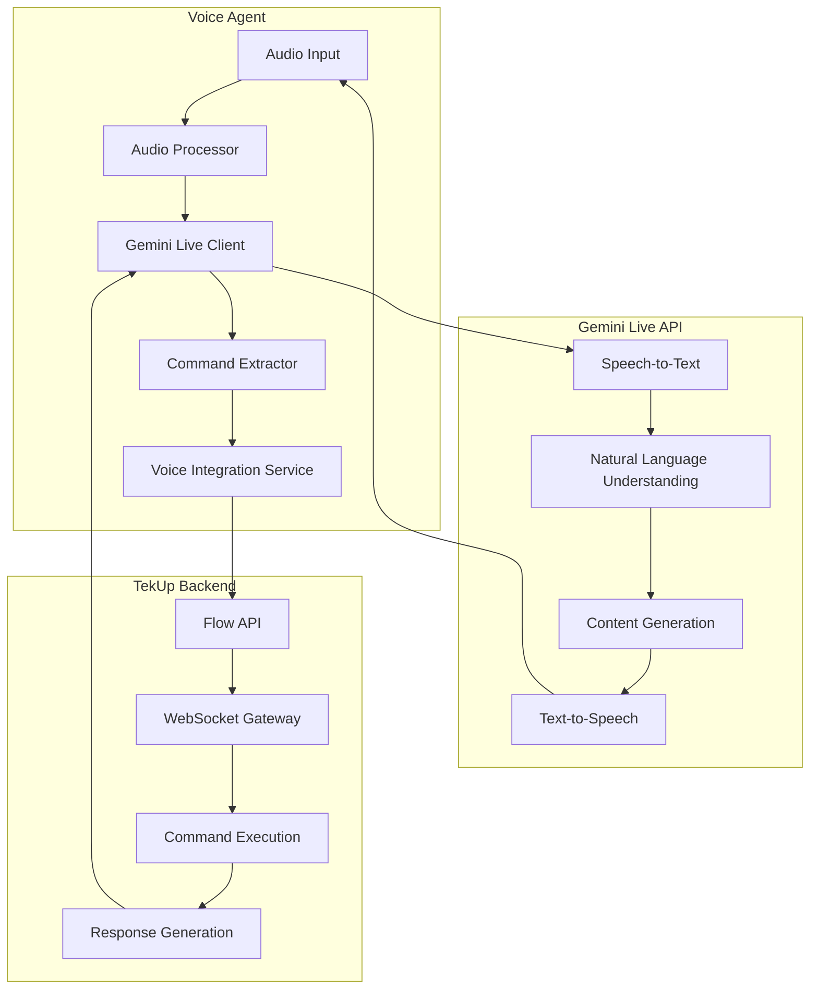

# Gemini Live API Integration Guide

This document provides comprehensive guidance for integrating with Google's Gemini Live API for advanced voice processing capabilities in the TekUp Voice Agent.

## Overview

The TekUp Voice Agent leverages Google's Gemini Live API to provide state-of-the-art voice processing capabilities, including speech-to-text, natural language understanding, and text-to-speech functionality with support for Danish and English languages.

## Architecture

### Integration Flow



## Configuration

### Environment Variables

```bash
# Gemini Live API Configuration
GEMINI_API_KEY=your_gemini_api_key_here
GEMINI_MODEL=gemini-2.5-flash
GEMINI_TEMPERATURE=0.7
GEMINI_MAX_TOKENS=1000
GEMINI_TOP_P=0.9
GEMINI_TOP_K=40

# Audio Configuration
GEMINI_AUDIO_ENCODING=LINEAR16
GEMINI_SAMPLE_RATE=16000
GEMINI_LANGUAGE_CODE=da-DK

# Safety Settings
GEMINI_SAFETY_HARASSMENT=BLOCK_MEDIUM_AND_ABOVE
GEMINI_SAFETY_HATE_SPEECH=BLOCK_MEDIUM_AND_ABOVE
GEMINI_SAFETY_SEXUALLY_EXPLICIT=BLOCK_MEDIUM_AND_ABOVE
GEMINI_SAFETY_DANGEROUS_CONTENT=BLOCK_MEDIUM_AND_ABOVE
```

### API Client Setup

```typescript
import { GoogleGenerativeAI } from '@google/generative-ai';

class GeminiLiveClient {
  private genAI: GoogleGenerativeAI;
  private model: any;
  private config: GeminiConfig;
  
  constructor(config: GeminiConfig) {
    this.config = config;
    this.genAI = new GoogleGenerativeAI(config.apiKey);
    this.model = this.genAI.getGenerativeModel({
      model: config.model || 'gemini-2.5-flash',
      generationConfig: {
        temperature: config.temperature || 0.7,
        topP: config.topP || 0.9,
        topK: config.topK || 40,
        maxOutputTokens: config.maxTokens || 1000,
      },
      safetySettings: this.getSafetySettings(),
    });
  }
  
  private getSafetySettings() {
    return [
      {
        category: 'HARM_CATEGORY_HARASSMENT',
        threshold: 'BLOCK_MEDIUM_AND_ABOVE',
      },
      {
        category: 'HARM_CATEGORY_HATE_SPEECH',
        threshold: 'BLOCK_MEDIUM_AND_ABOVE',
      },
      {
        category: 'HARM_CATEGORY_SEXUALLY_EXPLICIT',
        threshold: 'BLOCK_MEDIUM_AND_ABOVE',
      },
      {
        category: 'HARM_CATEGORY_DANGEROUS_CONTENT',
        threshold: 'BLOCK_MEDIUM_AND_ABOVE',
      },
    ];
  }
}
```

## Audio Processing

### Audio Input Handling

```typescript
class AudioInputProcessor {
  private audioContext: AudioContext | null = null;
  private mediaRecorder: MediaRecorder | null = null;
  private audioChunks: Blob[] = [];
  
  async startRecording(): Promise<MediaStream> {
    try {
      const stream = await navigator.mediaDevices.getUserMedia({
        audio: {
          sampleRate: 16000,
          channelCount: 1,
          echoCancellation: true,
          noiseSuppression: true,
          autoGainControl: true,
        },
      });
      
      this.audioContext = new AudioContext({ sampleRate: 16000 });
      
      this.mediaRecorder = new MediaRecorder(stream, {
        mimeType: 'audio/webm;codecs=opus',
      });
      
      this.mediaRecorder.ondataavailable = (event) => {
        if (event.data.size > 0) {
          this.audioChunks.push(event.data);
        }
      };
      
      this.mediaRecorder.start(100); // Collect data every 100ms
      
      return stream;
    } catch (error) {
      console.error('Error starting audio recording:', error);
      throw new Error('Failed to access microphone');
    }
  }
  
  stopRecording(): Promise<Blob> {
    return new Promise((resolve) => {
      if (!this.mediaRecorder) {
        resolve(new Blob());
        return;
      }
      
      this.mediaRecorder.onstop = () => {
        const audioBlob = new Blob(this.audioChunks, { type: 'audio/webm' });
        this.audioChunks = [];
        resolve(audioBlob);
      };
      
      this.mediaRecorder.stop();
    });
  }
  
  async convertToWav(audioBlob: Blob): Promise<ArrayBuffer> {
    const arrayBuffer = await audioBlob.arrayBuffer();
    const audioContext = new AudioContext({ sampleRate: 16000 });
    const audioBuffer = await audioContext.decodeAudioData(arrayBuffer);
    
    // Convert to WAV format
    const wavBuffer = this.audioBufferToWav(audioBuffer);
    return wavBuffer;
  }
  
  private audioBufferToWav(buffer: AudioBuffer): ArrayBuffer {
    const length = buffer.length;
    const arrayBuffer = new ArrayBuffer(44 + length * 2);
    const view = new DataView(arrayBuffer);
    const channels = buffer.numberOfChannels;
    const sampleRate = buffer.sampleRate;
    
    // WAV header
    const writeString = (offset: number, string: string) => {
      for (let i = 0; i < string.length; i++) {
        view.setUint8(offset + i, string.charCodeAt(i));
      }
    };
    
    writeString(0, 'RIFF');
    view.setUint32(4, 36 + length * 2, true);
    writeString(8, 'WAVE');
    writeString(12, 'fmt ');
    view.setUint32(16, 16, true);
    view.setUint16(20, 1, true);
    view.setUint16(22, channels, true);
    view.setUint32(24, sampleRate, true);
    view.setUint32(28, sampleRate * 2, true);
    view.setUint16(32, 2, true);
    view.setUint16(34, 16, true);
    writeString(36, 'data');
    view.setUint32(40, length * 2, true);
    
    // Convert audio data
    const channelData = buffer.getChannelData(0);
    let offset = 44;
    for (let i = 0; i < length; i++) {
      const sample = Math.max(-1, Math.min(1, channelData[i]));
      view.setInt16(offset, sample < 0 ? sample * 0x8000 : sample * 0x7FFF, true);
      offset += 2;
    }
    
    return arrayBuffer;
  }
}
```

### Audio Output Handling

```typescript
class AudioOutputProcessor {
  private audioContext: AudioContext | null = null;
  
  async playAudio(audioData: ArrayBuffer): Promise<void> {
    try {
      this.audioContext = this.audioContext || new AudioContext();
      
      const audioBuffer = await this.audioContext.decodeAudioData(audioData);
      const source = this.audioContext.createBufferSource();
      
      source.buffer = audioBuffer;
      source.connect(this.audioContext.destination);
      
      return new Promise((resolve) => {
        source.onended = () => resolve();
        source.start();
      });
    } catch (error) {
      console.error('Error playing audio:', error);
      throw new Error('Failed to play audio response');
    }
  }
  
  async synthesizeSpeech(text: string, languageCode: string = 'da-DK'): Promise<ArrayBuffer> {
    // This would integrate with Gemini's text-to-speech capabilities
    // For now, we'll use a placeholder implementation
    
    const response = await fetch('/api/tts', {
      method: 'POST',
      headers: {
        'Content-Type': 'application/json',
      },
      body: JSON.stringify({
        text,
        languageCode,
        voiceName: languageCode === 'da-DK' ? 'da-DK-WaveNet-A' : 'en-US-WaveNet-D',
      }),
    });
    
    if (!response.ok) {
      throw new Error('Failed to synthesize speech');
    }
    
    return response.arrayBuffer();
  }
}
```

## Speech Processing

### Speech-to-Text Integration

```typescript
class SpeechToTextProcessor {
  private geminiClient: GeminiLiveClient;
  
  constructor(geminiClient: GeminiLiveClient) {
    this.geminiClient = geminiClient;
  }
  
  async transcribeAudio(audioData: ArrayBuffer, languageCode: string = 'da'): Promise<TranscriptionResult> {
    try {
      // Convert audio to base64
      const base64Audio = this.arrayBufferToBase64(audioData);
      
      const prompt = this.buildTranscriptionPrompt(languageCode);
      
      const result = await this.geminiClient.generateContent([
        {
          inlineData: {
            mimeType: 'audio/wav',
            data: base64Audio,
          },
        },
        { text: prompt },
      ]);
      
      const response = await result.response;
      const transcription = response.text();
      
      return {
        transcription,
        confidence: this.calculateConfidence(response),
        language: languageCode,
        timestamp: new Date(),
      };
    } catch (error) {
      console.error('Speech-to-text error:', error);
      throw new Error('Failed to transcribe audio');
    }
  }
  
  private buildTranscriptionPrompt(languageCode: string): string {
    const prompts = {
      da: `
        Transskriber følgende lydfil til dansk tekst. 
        Fokuser på at genkende kommandoer relateret til:
        - Lead management (vis leads, opret lead, søg leads)
        - System operationer (start backup, kør compliance check)
        - Navigation (gå til, åbn, vis)
        
        Returner kun den transskriberede tekst uden yderligere kommentarer.
      `,
      en: `
        Transcribe the following audio file to English text.
        Focus on recognizing commands related to:
        - Lead management (show leads, create lead, search leads)
        - System operations (start backup, run compliance check)
        - Navigation (go to, open, show)
        
        Return only the transcribed text without additional comments.
      `,
    };
    
    return prompts[languageCode] || prompts.en;
  }
  
  private calculateConfidence(response: any): number {
    // Calculate confidence based on response metadata
    // This is a simplified implementation
    return response.candidates?.[0]?.finishReason === 'STOP' ? 0.9 : 0.7;
  }
  
  private arrayBufferToBase64(buffer: ArrayBuffer): string {
    const bytes = new Uint8Array(buffer);
    let binary = '';
    for (let i = 0; i < bytes.byteLength; i++) {
      binary += String.fromCharCode(bytes[i]);
    }
    return btoa(binary);
  }
}
```

### Natural Language Understanding

```typescript
class NaturalLanguageProcessor {
  private geminiClient: GeminiLiveClient;
  
  constructor(geminiClient: GeminiLiveClient) {
    this.geminiClient = geminiClient;
  }
  
  async extractCommand(text: string, context: ConversationContext): Promise<CommandExtractionResult> {
    try {
      const prompt = this.buildCommandExtractionPrompt(text, context);
      
      const result = await this.geminiClient.generateContent(prompt);
      const response = await result.response;
      const responseText = response.text();
      
      // Parse the structured response
      const commandData = this.parseCommandResponse(responseText);
      
      return {
        command: commandData.command,
        parameters: commandData.parameters,
        confidence: commandData.confidence,
        intent: commandData.intent,
        entities: commandData.entities,
      };
    } catch (error) {
      console.error('Command extraction error:', error);
      throw new Error('Failed to extract command from text');
    }
  }
  
  private buildCommandExtractionPrompt(text: string, context: ConversationContext): string {
    return `
      Du er en AI assistent der hjælper med at analysere voice kommandoer for TekUp systemet.
      
      Analyser følgende tekst og udtræk kommando information:
      Tekst: "${text}"
      
      Kontekst:
      - Nuværende tenant: ${context.tenantId}
      - Tidligere kommandoer: ${JSON.stringify(context.previousCommands)}
      - Bruger rolle: ${context.userRole}
      
      Tilgængelige kommandoer:
      1. get_leads - Hent leads (parametre: status, limit, source)
      2. create_lead - Opret lead (parametre: name, email, company, phone, notes)
      3. search_leads - Søg leads (parametre: query, status, date_range)
      4. get_metrics - Hent metrics (parametre: metric_type, period)
      5. start_backup - Start backup (parametre: backup_type, priority)
      6. compliance_check - Compliance check (parametre: check_type, severity)
      
      Returner resultatet som JSON i følgende format:
      {
        "command": "kommando_navn",
        "parameters": { "param1": "værdi1", "param2": "værdi2" },
        "confidence": 0.95,
        "intent": "bruger_intention",
        "entities": [
          { "type": "entity_type", "value": "entity_value", "start": 0, "end": 5 }
        ]
      }
      
      Hvis ingen kommando kan identificeres, returner:
      {
        "command": "unknown",
        "parameters": {},
        "confidence": 0.0,
        "intent": "unclear",
        "entities": []
      }
    `;
  }
  
  private parseCommandResponse(responseText: string): any {
    try {
      // Clean up the response text to extract JSON
      const jsonMatch = responseText.match(/\{[\s\S]*\}/);
      if (!jsonMatch) {
        throw new Error('No JSON found in response');
      }
      
      return JSON.parse(jsonMatch[0]);
    } catch (error) {
      console.error('Failed to parse command response:', error);
      return {
        command: 'unknown',
        parameters: {},
        confidence: 0.0,
        intent: 'parse_error',
        entities: [],
      };
    }
  }
}
```

## Response Generation

### Contextual Response Generation

```typescript
class ResponseGenerator {
  private geminiClient: GeminiLiveClient;
  
  constructor(geminiClient: GeminiLiveClient) {
    this.geminiClient = geminiClient;
  }
  
  async generateResponse(
    commandResult: any,
    context: ConversationContext,
    language: string = 'da'
  ): Promise<ResponseGenerationResult> {
    try {
      const prompt = this.buildResponsePrompt(commandResult, context, language);
      
      const result = await this.geminiClient.generateContent(prompt);
      const response = await result.response;
      const responseText = response.text();
      
      return {
        text: responseText,
        language,
        shouldSpeak: true,
        emotion: this.detectEmotion(commandResult),
        followUpSuggestions: this.generateFollowUpSuggestions(commandResult, language),
      };
    } catch (error) {
      console.error('Response generation error:', error);
      throw new Error('Failed to generate response');
    }
  }
  
  private buildResponsePrompt(commandResult: any, context: ConversationContext, language: string): string {
    const prompts = {
      da: `
        Du er TekUp's AI voice assistent. Generer et naturligt, hjælpsomt svar på dansk.
        
        Kommando resultat:
        ${JSON.stringify(commandResult, null, 2)}
        
        Kontekst:
        - Tenant: ${context.tenantId}
        - Bruger: ${context.userRole}
        - Tid: ${new Date().toLocaleString('da-DK')}
        
        Retningslinjer:
        - Vær venlig og professionel
        - Brug dansk sprog naturligt
        - Inkluder relevante tal og data
        - Foreslå næste trin hvis relevant
        - Hold svaret kort og præcist (max 2-3 sætninger)
        
        Generer kun svaret, ingen yderligere kommentarer.
      `,
      en: `
        You are TekUp's AI voice assistant. Generate a natural, helpful response in English.
        
        Command result:
        ${JSON.stringify(commandResult, null, 2)}
        
        Context:
        - Tenant: ${context.tenantId}
        - User: ${context.userRole}
        - Time: ${new Date().toLocaleString('en-US')}
        
        Guidelines:
        - Be friendly and professional
        - Use natural English
        - Include relevant numbers and data
        - Suggest next steps if relevant
        - Keep response short and precise (max 2-3 sentences)
        
        Generate only the response, no additional comments.
      `,
    };
    
    return prompts[language] || prompts.en;
  }
  
  private detectEmotion(commandResult: any): string {
    if (commandResult.success) {
      return commandResult.data?.length > 0 ? 'satisfied' : 'neutral';
    } else {
      return 'apologetic';
    }
  }
  
  private generateFollowUpSuggestions(commandResult: any, language: string): string[] {
    const suggestions = {
      da: {
        get_leads: ['Vil du se detaljer for en specifik lead?', 'Skal jeg filtrere efter status?'],
        create_lead: ['Vil du tilføje flere oplysninger?', 'Skal jeg sende en velkomst email?'],
        search_leads: ['Vil du søge med andre kriterier?', 'Skal jeg vise lead detaljer?'],
        get_metrics: ['Vil du se metrics for en anden periode?', 'Skal jeg generere en rapport?'],
      },
      en: {
        get_leads: ['Would you like to see details for a specific lead?', 'Should I filter by status?'],
        create_lead: ['Would you like to add more information?', 'Should I send a welcome email?'],
        search_leads: ['Would you like to search with different criteria?', 'Should I show lead details?'],
        get_metrics: ['Would you like to see metrics for another period?', 'Should I generate a report?'],
      },
    };
    
    const langSuggestions = suggestions[language] || suggestions.en;
    const command = commandResult.command || 'get_leads';
    
    return langSuggestions[command] || [];
  }
}
```

## Error Handling

### Comprehensive Error Management

```typescript
class GeminiErrorHandler {
  static handleError(error: any): GeminiError {
    if (error.code) {
      switch (error.code) {
        case 'PERMISSION_DENIED':
          return new GeminiError(
            'AUTHENTICATION_ERROR',
            'Invalid API key or insufficient permissions',
            'Check your Gemini API key and permissions'
          );
        
        case 'QUOTA_EXCEEDED':
          return new GeminiError(
            'QUOTA_EXCEEDED',
            'API quota exceeded',
            'Wait before making more requests or upgrade your quota'
          );
        
        case 'INVALID_ARGUMENT':
          return new GeminiError(
            'INVALID_INPUT',
            'Invalid input provided to Gemini API',
            'Check audio format and parameters'
          );
        
        case 'DEADLINE_EXCEEDED':
          return new GeminiError(
            'TIMEOUT',
            'Request timed out',
            'Try again with shorter audio or check network connection'
          );
        
        default:
          return new GeminiError(
            'UNKNOWN_ERROR',
            error.message || 'Unknown Gemini API error',
            'Check logs and try again'
          );
      }
    }
    
    return new GeminiError(
      'NETWORK_ERROR',
      'Failed to connect to Gemini API',
      'Check internet connection and API endpoint'
    );
  }
}

class GeminiError extends Error {
  constructor(
    public code: string,
    public message: string,
    public suggestion: string
  ) {
    super(message);
    this.name = 'GeminiError';
  }
}
```

### Retry Logic

```typescript
class GeminiRetryHandler {
  private maxRetries = 3;
  private baseDelay = 1000; // 1 second
  
  async executeWithRetry<T>(
    operation: () => Promise<T>,
    context: string
  ): Promise<T> {
    let lastError: Error;
    
    for (let attempt = 1; attempt <= this.maxRetries; attempt++) {
      try {
        return await operation();
      } catch (error) {
        lastError = error;
        
        if (!this.shouldRetry(error) || attempt === this.maxRetries) {
          throw error;
        }
        
        const delay = this.calculateDelay(attempt);
        console.log(`${context} failed (attempt ${attempt}), retrying in ${delay}ms...`);
        
        await this.sleep(delay);
      }
    }
    
    throw lastError!;
  }
  
  private shouldRetry(error: any): boolean {
    // Retry on network errors and temporary server errors
    const retryableCodes = [
      'DEADLINE_EXCEEDED',
      'UNAVAILABLE',
      'INTERNAL',
      'NETWORK_ERROR'
    ];
    
    return retryableCodes.includes(error.code);
  }
  
  private calculateDelay(attempt: number): number {
    // Exponential backoff with jitter
    const exponentialDelay = this.baseDelay * Math.pow(2, attempt - 1);
    const jitter = Math.random() * 0.1 * exponentialDelay;
    return Math.floor(exponentialDelay + jitter);
  }
  
  private sleep(ms: number): Promise<void> {
    return new Promise(resolve => setTimeout(resolve, ms));
  }
}
```

## Performance Optimization

### Caching Strategy

```typescript
class GeminiResponseCache {
  private cache = new Map<string, CacheEntry>();
  private maxCacheSize = 100;
  private cacheTimeout = 5 * 60 * 1000; // 5 minutes
  
  get(key: string): any | null {
    const entry = this.cache.get(key);
    
    if (!entry) {
      return null;
    }
    
    if (Date.now() - entry.timestamp > this.cacheTimeout) {
      this.cache.delete(key);
      return null;
    }
    
    return entry.data;
  }
  
  set(key: string, data: any): void {
    // Implement LRU eviction
    if (this.cache.size >= this.maxCacheSize) {
      const firstKey = this.cache.keys().next().value;
      this.cache.delete(firstKey);
    }
    
    this.cache.set(key, {
      data,
      timestamp: Date.now(),
    });
  }
  
  generateKey(operation: string, params: any): string {
    return `${operation}:${JSON.stringify(params)}`;
  }
}

interface CacheEntry {
  data: any;
  timestamp: number;
}
```

### Request Batching

```typescript
class GeminiBatchProcessor {
  private batchQueue: BatchRequest[] = [];
  private batchTimeout = 100; // 100ms
  private maxBatchSize = 5;
  private batchTimer: NodeJS.Timeout | null = null;
  
  async addToBatch(request: BatchRequest): Promise<any> {
    return new Promise((resolve, reject) => {
      this.batchQueue.push({
        ...request,
        resolve,
        reject,
      });
      
      if (this.batchQueue.length >= this.maxBatchSize) {
        this.processBatch();
      } else if (!this.batchTimer) {
        this.batchTimer = setTimeout(() => {
          this.processBatch();
        }, this.batchTimeout);
      }
    });
  }
  
  private async processBatch(): Promise<void> {
    if (this.batchTimer) {
      clearTimeout(this.batchTimer);
      this.batchTimer = null;
    }
    
    const batch = this.batchQueue.splice(0, this.maxBatchSize);
    
    if (batch.length === 0) {
      return;
    }
    
    try {
      // Process batch requests
      const results = await Promise.allSettled(
        batch.map(request => this.processRequest(request))
      );
      
      // Resolve individual promises
      results.forEach((result, index) => {
        const request = batch[index];
        
        if (result.status === 'fulfilled') {
          request.resolve(result.value);
        } else {
          request.reject(result.reason);
        }
      });
    } catch (error) {
      // Reject all requests in case of batch failure
      batch.forEach(request => request.reject(error));
    }
  }
  
  private async processRequest(request: BatchRequest): Promise<any> {
    // Individual request processing logic
    switch (request.type) {
      case 'transcribe':
        return this.transcribeAudio(request.data);
      case 'generate':
        return this.generateResponse(request.data);
      default:
        throw new Error(`Unknown request type: ${request.type}`);
    }
  }
}

interface BatchRequest {
  type: string;
  data: any;
  resolve?: (value: any) => void;
  reject?: (error: any) => void;
}
```

## Testing

### Unit Tests

```typescript
describe('GeminiLiveIntegration', () => {
  let geminiClient: GeminiLiveClient;
  let mockGenAI: jest.Mocked<GoogleGenerativeAI>;
  
  beforeEach(() => {
    mockGenAI = {
      getGenerativeModel: jest.fn(),
    } as any;
    
    geminiClient = new GeminiLiveClient({
      apiKey: 'test-key',
      model: 'gemini-2.5-flash',
    });
  });
  
  describe('transcribeAudio', () => {
    it('should transcribe audio correctly', async () => {
      const mockResponse = {
        response: {
          text: () => 'vis alle leads',
        },
      };
      
      mockGenAI.getGenerativeModel().generateContent.mockResolvedValue(mockResponse);
      
      const audioData = new ArrayBuffer(1024);
      const result = await geminiClient.transcribeAudio(audioData, 'da');
      
      expect(result.transcription).toBe('vis alle leads');
      expect(result.language).toBe('da');
      expect(result.confidence).toBeGreaterThan(0);
    });
    
    it('should handle transcription errors', async () => {
      mockGenAI.getGenerativeModel().generateContent.mockRejectedValue(
        new Error('API Error')
      );
      
      const audioData = new ArrayBuffer(1024);
      
      await expect(
        geminiClient.transcribeAudio(audioData, 'da')
      ).rejects.toThrow('Failed to transcribe audio');
    });
  });
});
```

### Integration Tests

```typescript
describe('Gemini Live Integration E2E', () => {
  let geminiClient: GeminiLiveClient;
  
  beforeAll(() => {
    if (!process.env.GEMINI_API_KEY) {
      throw new Error('GEMINI_API_KEY required for integration tests');
    }
    
    geminiClient = new GeminiLiveClient({
      apiKey: process.env.GEMINI_API_KEY,
      model: 'gemini-2.5-flash',
    });
  });
  
  it('should process real audio input', async () => {
    // Load test audio file
    const audioBuffer = await loadTestAudio('test-command-da.wav');
    
    const result = await geminiClient.transcribeAudio(audioBuffer, 'da');
    
    expect(result.transcription).toBeDefined();
    expect(result.confidence).toBeGreaterThan(0.5);
    expect(result.language).toBe('da');
  }, 30000); // 30 second timeout for real API calls
});
```

## Monitoring and Analytics

### Performance Monitoring

```typescript
class GeminiPerformanceMonitor {
  private metrics = {
    requestCount: 0,
    successCount: 0,
    errorCount: 0,
    totalLatency: 0,
    averageLatency: 0,
  };
  
  recordRequest(startTime: number, success: boolean, error?: Error): void {
    const latency = Date.now() - startTime;
    
    this.metrics.requestCount++;
    this.metrics.totalLatency += latency;
    this.metrics.averageLatency = this.metrics.totalLatency / this.metrics.requestCount;
    
    if (success) {
      this.metrics.successCount++;
    } else {
      this.metrics.errorCount++;
      console.error('Gemini API error:', error);
    }
  }
  
  getMetrics(): PerformanceMetrics {
    return {
      ...this.metrics,
      successRate: this.metrics.successCount / this.metrics.requestCount,
      errorRate: this.metrics.errorCount / this.metrics.requestCount,
    };
  }
  
  reset(): void {
    this.metrics = {
      requestCount: 0,
      successCount: 0,
      errorCount: 0,
      totalLatency: 0,
      averageLatency: 0,
    };
  }
}
```

## Best Practices

### 1. Audio Quality
- Use 16kHz sample rate for optimal processing
- Implement noise suppression and echo cancellation
- Validate audio format before sending to API

### 2. Error Handling
- Implement comprehensive error handling for all API calls
- Use retry logic with exponential backoff
- Provide meaningful error messages to users

### 3. Performance
- Cache frequently used responses
- Implement request batching for multiple operations
- Monitor API usage and optimize accordingly

### 4. Security
- Store API keys securely
- Validate all input before processing
- Implement rate limiting to prevent abuse

### 5. User Experience
- Provide visual feedback during processing
- Handle network interruptions gracefully
- Support both Danish and English languages

This comprehensive guide provides everything needed to integrate with Gemini Live API effectively in the TekUp Voice Agent.