# Core Applications Integration Architecture

This document outlines the integration architecture between the three core applications: Flow API, Flow Web, and Voice Agent, and how they work together to provide a unified TekUp experience.

## System Overview

The TekUp core applications form an integrated ecosystem where each component serves a specific purpose while maintaining seamless communication with others.

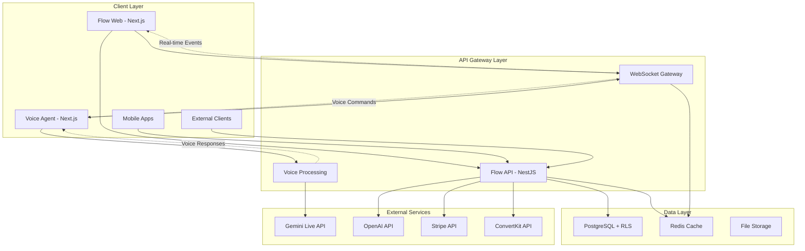

## Application Roles and Responsibilities

### Flow API (Backend Core)
- **Primary Role**: Central API server and data orchestrator
- **Key Responsibilities**:
  - Multi-tenant data management with RLS
  - RESTful API endpoints for all operations
  - WebSocket gateway for real-time communication
  - Voice command processing and execution
  - External service integration management
  - Authentication and authorization
  - Metrics collection and monitoring

### Flow Web (Frontend Dashboard)
- **Primary Role**: Primary web interface for business users
- **Key Responsibilities**:
  - Lead management interface
  - Real-time dashboard updates
  - Tenant switching and management
  - User authentication and session management
  - Responsive design for all devices
  - Integration with voice commands

### Voice Agent (Voice Interface)
- **Primary Role**: Natural language voice interface
- **Key Responsibilities**:
  - Voice input/output processing
  - Natural language understanding
  - Voice command execution via WebSocket
  - Multi-language support (Danish/English)
  - Tenant-aware voice operations
  - Audio quality optimization

## Integration Patterns

### 1. REST API Integration

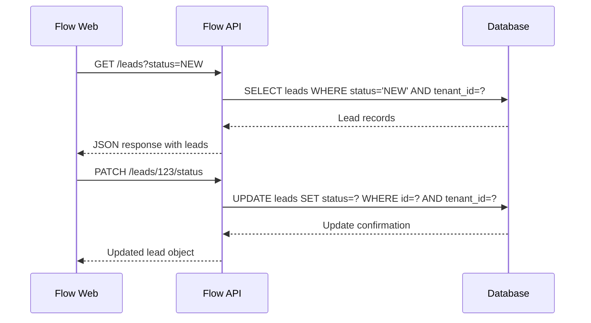

### 2. WebSocket Real-time Communication

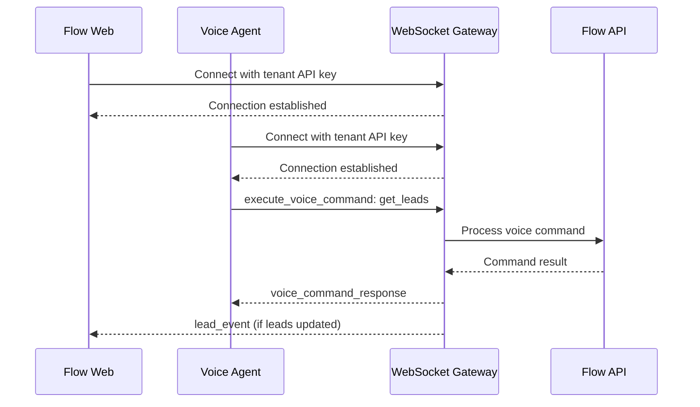

### 3. Voice Command Processing Flow

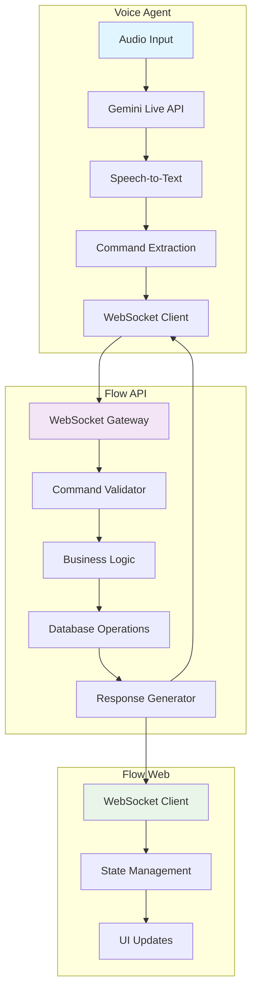

## Data Flow Architecture

### Multi-tenant Data Isolation

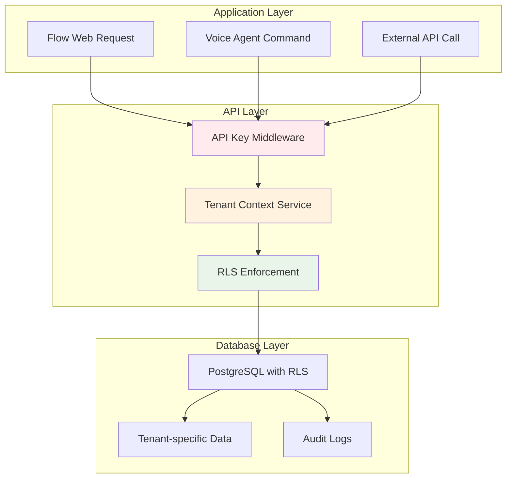

### Event-Driven Updates

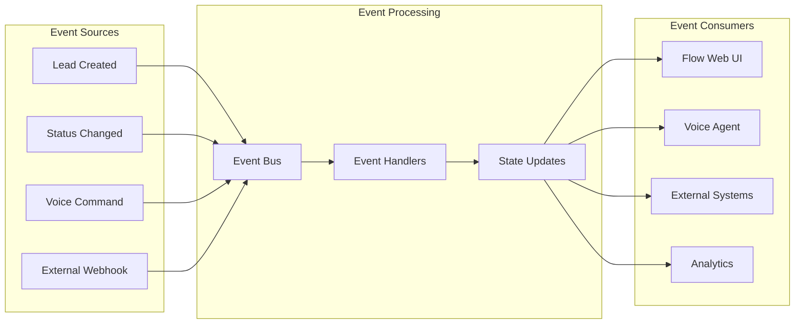

## Authentication and Security

### Multi-tenant Security Model

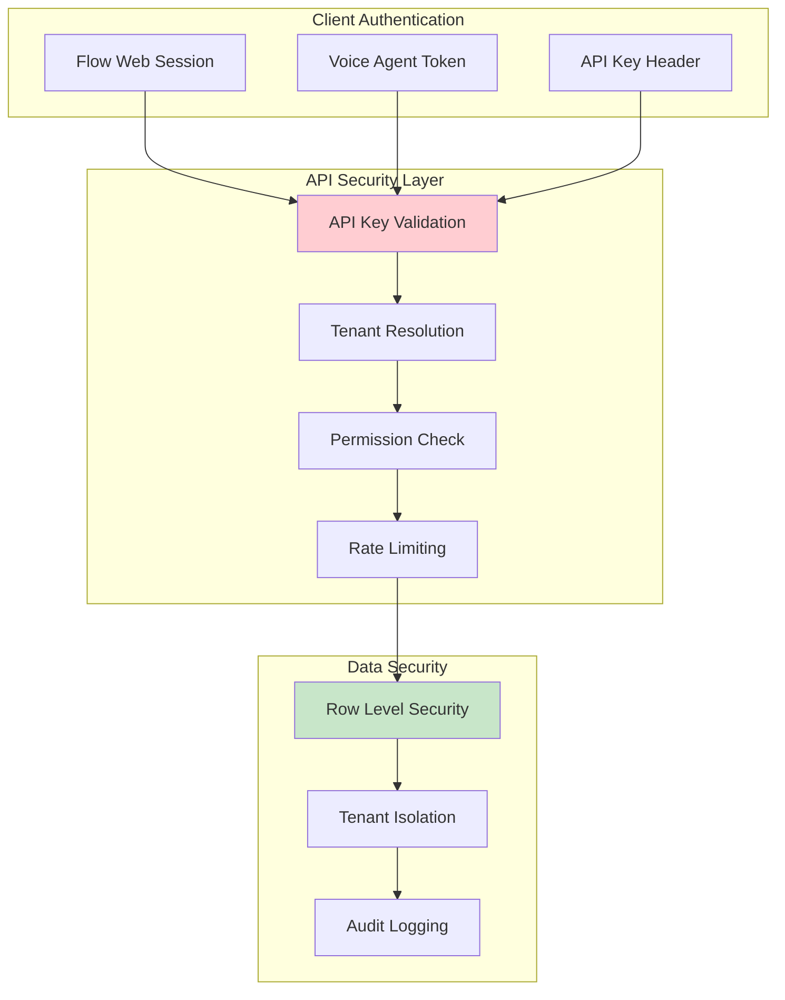

### Security Enforcement Points

1. **API Gateway Level**
   - API key validation
   - Rate limiting per tenant
   - Request/response logging

2. **Application Level**
   - Tenant context validation
   - Permission-based access control
   - Input sanitization and validation

3. **Database Level**
   - Row Level Security (RLS) policies
   - Encrypted sensitive data
   - Audit trail for all operations

## Performance Optimization

### Caching Strategy

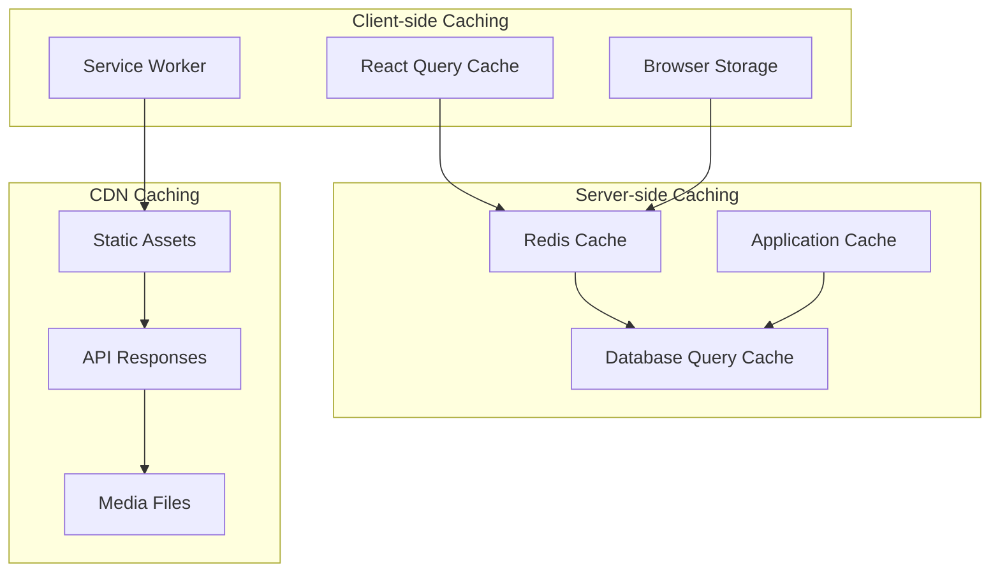

### Load Balancing and Scaling

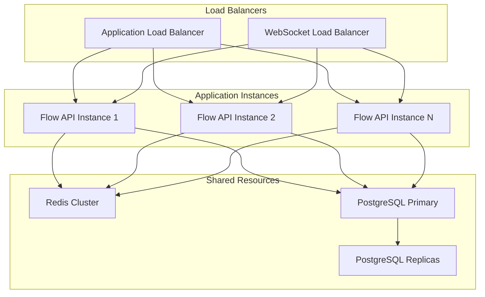

## Monitoring and Observability

### Metrics Collection

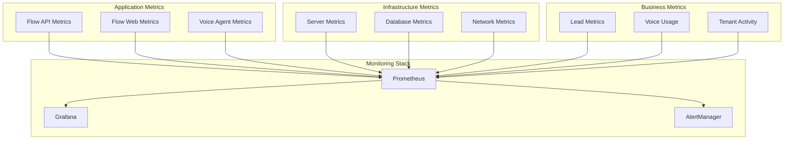

### Health Check Architecture

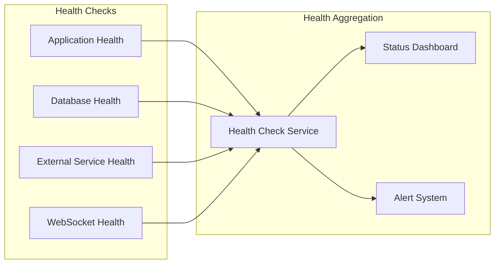

## Deployment Architecture

### Container Orchestration

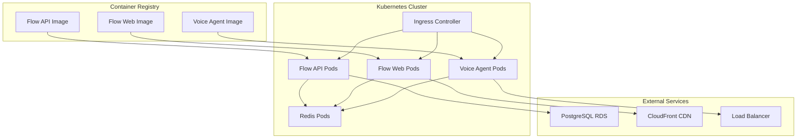

### Environment Configuration

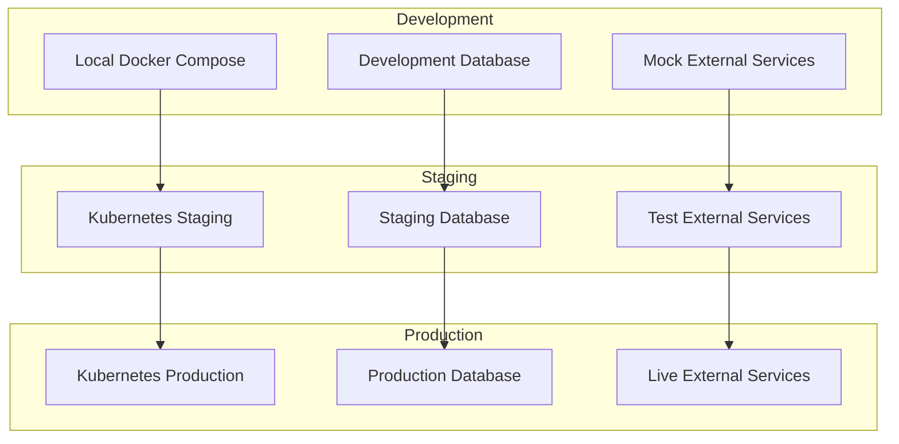

## Integration Testing Strategy

### End-to-End Testing Flow

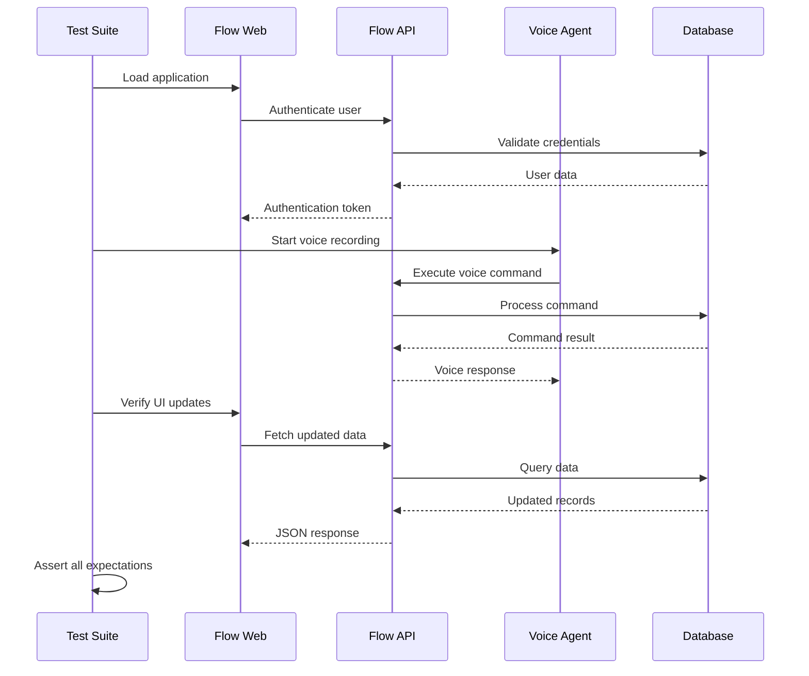

### Testing Scenarios

1. **Cross-Application Communication**
   - Voice command execution updates Flow Web UI
   - Flow Web actions trigger voice notifications
   - Real-time synchronization between clients

2. **Multi-tenant Isolation**
   - Tenant A cannot access Tenant B data
   - Voice commands respect tenant boundaries
   - WebSocket events are tenant-scoped

3. **Error Handling**
   - Network failures and reconnection
   - Invalid voice commands
   - Database connection issues

4. **Performance Testing**
   - Concurrent user load testing
   - WebSocket connection limits
   - Voice processing latency

## Troubleshooting Guide

### Common Integration Issues

1. **WebSocket Connection Problems**
   ```bash
   # Check WebSocket endpoint
   curl -H "Upgrade: websocket" \
        -H "Connection: Upgrade" \
        -H "x-tenant-key: demo-key" \
        http://localhost:4000/events
   ```

2. **Voice Command Failures**
   ```bash
   # Test voice endpoint directly
   curl -X POST http://localhost:4000/voice/test \
        -H "x-tenant-key: demo-key" \
        -H "Content-Type: application/json" \
        -d '{"command": "get_leads"}'
   ```

3. **Database Connection Issues**
   ```bash
   # Check database connectivity
   psql $DATABASE_URL -c "SELECT 1;"
   ```

4. **Authentication Problems**
   ```bash
   # Validate API key
   curl -H "x-tenant-key: demo-key" \
        http://localhost:4000/health
   ```

### Debug Mode Configuration

```bash
# Enable debug logging for all applications
DEBUG=tekup:*
LOG_LEVEL=debug

# Flow API debug
FLOW_API_DEBUG=true

# Flow Web debug
NEXT_PUBLIC_DEBUG=true

# Voice Agent debug
NEXT_PUBLIC_VOICE_DEBUG=true
```

## Best Practices

### 1. API Design
- Use consistent REST conventions
- Implement proper error handling
- Version APIs appropriately
- Document all endpoints

### 2. Real-time Communication
- Handle connection failures gracefully
- Implement proper reconnection logic
- Use event throttling for high-frequency updates
- Maintain connection state properly

### 3. Security
- Validate all inputs
- Implement proper authentication
- Use HTTPS/WSS in production
- Log security events

### 4. Performance
- Implement caching strategies
- Use connection pooling
- Monitor resource usage
- Optimize database queries

### 5. Monitoring
- Implement comprehensive logging
- Set up proper alerting
- Monitor business metrics
- Track user experience metrics

This architecture ensures that the three core applications work together seamlessly while maintaining security, performance, and scalability requirements.