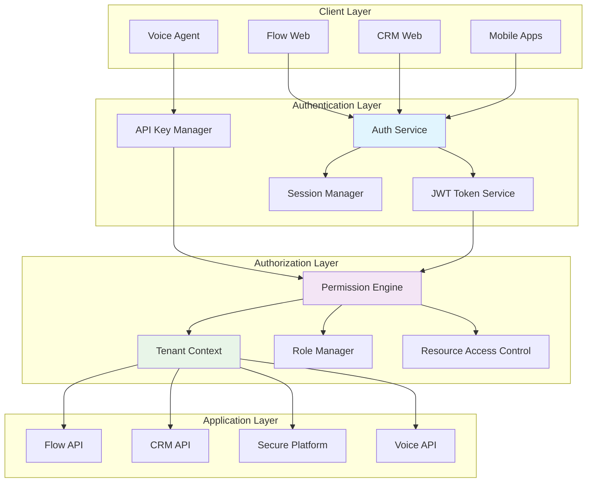

# Authentication and Authorization Patterns

This document outlines the authentication and authorization patterns used across the TekUp ecosystem to ensure secure, tenant-aware access control and seamless integration between applications.

## Overview

The TekUp ecosystem implements a multi-layered security model that provides:
- **Multi-tenant isolation** with complete data separation
- **API key-based authentication** for service-to-service communication
- **JWT-based authentication** for user sessions
- **Role-based access control** (RBAC) within tenant boundaries
- **Cross-application authorization** with fine-grained permissions

## Authentication Architecture

### High-Level Authentication Flow



## Multi-tenant Authentication

### Tenant Context Resolution

```typescript
// Tenant context service for multi-tenant authentication
class TenantContextService {
  private tenantCache: Map<string, TenantContext> = new Map();
  private apiKeyCache: Map<string, ApiKeyData> = new Map();
  
  constructor(
    private tenantRepository: TenantRepository,
    private apiKeyRepository: ApiKeyRepository
  ) {}
  
  // Resolve tenant context from API key
  async resolveTenantFromApiKey(apiKey: string): Promise<TenantContext> {
    // Check cache first
    const cached = this.apiKeyCache.get(apiKey);
    if (cached && !this.isExpired(cached)) {
      return this.buildTenantContext(cached);
    }
    
    // Fetch from database
    const apiKeyData = await this.apiKeyRepository.findByKey(apiKey);
    if (!apiKeyData || !apiKeyData.isActive) {
      throw new UnauthorizedError('Invalid API key');
    }
    
    // Validate key expiration
    if (apiKeyData.expiresAt && apiKeyData.expiresAt < new Date()) {
      throw new UnauthorizedError('API key expired');
    }
    
    // Get tenant information
    const tenant = await this.tenantRepository.findById(apiKeyData.tenantId);
    if (!tenant || !tenant.isActive) {
      throw new UnauthorizedError('Tenant not active');
    }
    
    // Cache the result
    this.apiKeyCache.set(apiKey, { ...apiKeyData, tenant });
    
    return this.buildTenantContext({ ...apiKeyData, tenant });
  }
  
  // Resolve tenant context from JWT token
  async resolveTenantFromJWT(token: string): Promise<TenantContext> {
    try {
      const payload = jwt.verify(token, this.jwtSecret) as JWTPayload;
      
      // Get tenant from cache or database
      let tenant = this.tenantCache.get(payload.tenantId);
      if (!tenant) {
        const tenantData = await this.tenantRepository.findById(payload.tenantId);
        if (!tenantData || !tenantData.isActive) {
          throw new UnauthorizedError('Tenant not active');
        }
        tenant = this.buildTenantContext(tenantData);
        this.tenantCache.set(payload.tenantId, tenant);
      }
      
      return {
        ...tenant,
        userId: payload.userId,
        userRoles: payload.roles,
        sessionId: payload.sessionId,
      };
    } catch (error) {
      throw new UnauthorizedError('Invalid JWT token');
    }
  }
  
  private buildTenantContext(data: any): TenantContext {
    return {
      tenantId: data.tenant.id,
      tenantSlug: data.tenant.slug,
      tenantName: data.tenant.name,
      permissions: data.permissions || [],
      rateLimit: data.rateLimit || { requests: 1000, window: 3600 },
      allowedApps: data.allowedApps || [],
      features: data.tenant.features || [],
      settings: data.tenant.settings || {},
    };
  }
}
```

### API Key Management

```typescript
// API key management with tenant isolation
class ApiKeyManager {
  constructor(
    private apiKeyRepository: ApiKeyRepository,
    private encryptionService: EncryptionService
  ) {}
  
  // Generate new API key for tenant
  async generateApiKey(
    tenantId: string,
    keyConfig: ApiKeyConfig
  ): Promise<ApiKeyResult> {
    // Generate cryptographically secure key
    const keyValue = this.generateSecureKey();
    const hashedKey = await this.hashApiKey(keyValue);
    
    // Create API key record
    const apiKey = await this.apiKeyRepository.create({
      tenantId,
      name: keyConfig.name,
      hashedKey,
      permissions: keyConfig.permissions,
      allowedApps: keyConfig.allowedApps,
      rateLimit: keyConfig.rateLimit,
      expiresAt: keyConfig.expiresAt,
      isActive: true,
      createdBy: keyConfig.createdBy,
    });
    
    // Log key creation
    await this.auditLogger.log({
      action: 'API_KEY_CREATED',
      tenantId,
      userId: keyConfig.createdBy,
      details: {
        keyId: apiKey.id,
        keyName: keyConfig.name,
        permissions: keyConfig.permissions,
      },
    });
    
    return {
      id: apiKey.id,
      key: keyValue, // Only returned once
      name: apiKey.name,
      permissions: apiKey.permissions,
      expiresAt: apiKey.expiresAt,
    };
  }
  
  // Rotate API key
  async rotateApiKey(keyId: string, tenantId: string): Promise<ApiKeyResult> {
    const existingKey = await this.apiKeyRepository.findById(keyId);
    
    if (!existingKey || existingKey.tenantId !== tenantId) {
      throw new NotFoundError('API key not found');
    }
    
    // Generate new key value
    const newKeyValue = this.generateSecureKey();
    const newHashedKey = await this.hashApiKey(newKeyValue);
    
    // Update key in database
    const updatedKey = await this.apiKeyRepository.update(keyId, {
      hashedKey: newHashedKey,
      rotatedAt: new Date(),
      rotationCount: (existingKey.rotationCount || 0) + 1,
    });
    
    // Log key rotation
    await this.auditLogger.log({
      action: 'API_KEY_ROTATED',
      tenantId,
      details: {
        keyId,
        rotationCount: updatedKey.rotationCount,
      },
    });
    
    return {
      id: updatedKey.id,
      key: newKeyValue,
      name: updatedKey.name,
      permissions: updatedKey.permissions,
      expiresAt: updatedKey.expiresAt,
    };
  }
  
  // Validate API key and return context
  async validateApiKey(keyValue: string): Promise<ApiKeyValidationResult> {
    const hashedKey = await this.hashApiKey(keyValue);
    const apiKey = await this.apiKeyRepository.findByHashedKey(hashedKey);
    
    if (!apiKey || !apiKey.isActive) {
      await this.recordFailedAttempt(keyValue);
      throw new UnauthorizedError('Invalid API key');
    }
    
    // Check expiration
    if (apiKey.expiresAt && apiKey.expiresAt < new Date()) {
      throw new UnauthorizedError('API key expired');
    }
    
    // Check rate limiting
    const rateLimitResult = await this.checkRateLimit(apiKey);
    if (!rateLimitResult.allowed) {
      throw new RateLimitExceededError('Rate limit exceeded');
    }
    
    // Update last used timestamp
    await this.apiKeyRepository.updateLastUsed(apiKey.id);
    
    return {
      valid: true,
      tenantId: apiKey.tenantId,
      permissions: apiKey.permissions,
      allowedApps: apiKey.allowedApps,
      rateLimit: rateLimitResult,
    };
  }
  
  private generateSecureKey(): string {
    // Generate 32-byte random key and encode as base64
    const randomBytes = crypto.randomBytes(32);
    return `tkp_${randomBytes.toString('base64url')}`;
  }
  
  private async hashApiKey(keyValue: string): Promise<string> {
    // Use bcrypt for secure hashing
    return bcrypt.hash(keyValue, 12);
  }
}
```

## JWT Token Management

### Token Service Implementation

```typescript
// JWT token service with tenant-aware claims
class JWTTokenService {
  private readonly accessTokenExpiry = '15m';
  private readonly refreshTokenExpiry = '7d';
  
  constructor(
    private jwtSecret: string,
    private refreshTokenRepository: RefreshTokenRepository
  ) {}
  
  // Generate access and refresh tokens
  async generateTokenPair(
    user: User,
    tenant: Tenant,
    sessionId: string
  ): Promise<TokenPair> {
    const accessTokenPayload: AccessTokenPayload = {
      userId: user.id,
      tenantId: tenant.id,
      sessionId,
      roles: user.roles,
      permissions: this.resolveUserPermissions(user, tenant),
      iat: Math.floor(Date.now() / 1000),
      exp: Math.floor(Date.now() / 1000) + (15 * 60), // 15 minutes
    };
    
    const refreshTokenPayload: RefreshTokenPayload = {
      userId: user.id,
      tenantId: tenant.id,
      sessionId,
      tokenType: 'refresh',
      iat: Math.floor(Date.now() / 1000),
      exp: Math.floor(Date.now() / 1000) + (7 * 24 * 60 * 60), // 7 days
    };
    
    const accessToken = jwt.sign(accessTokenPayload, this.jwtSecret);
    const refreshToken = jwt.sign(refreshTokenPayload, this.jwtSecret);
    
    // Store refresh token
    await this.refreshTokenRepository.create({
      token: refreshToken,
      userId: user.id,
      tenantId: tenant.id,
      sessionId,
      expiresAt: new Date(refreshTokenPayload.exp * 1000),
    });
    
    return {
      accessToken,
      refreshToken,
      expiresIn: 15 * 60, // 15 minutes in seconds
      tokenType: 'Bearer',
    };
  }
  
  // Refresh access token
  async refreshAccessToken(refreshToken: string): Promise<TokenPair> {
    try {
      const payload = jwt.verify(refreshToken, this.jwtSecret) as RefreshTokenPayload;
      
      // Validate refresh token in database
      const storedToken = await this.refreshTokenRepository.findByToken(refreshToken);
      if (!storedToken || storedToken.isRevoked) {
        throw new UnauthorizedError('Invalid refresh token');
      }
      
      // Get user and tenant information
      const user = await this.userRepository.findById(payload.userId);
      const tenant = await this.tenantRepository.findById(payload.tenantId);
      
      if (!user || !tenant || !user.isActive || !tenant.isActive) {
        throw new UnauthorizedError('User or tenant not active');
      }
      
      // Generate new token pair
      const newTokenPair = await this.generateTokenPair(user, tenant, payload.sessionId);
      
      // Revoke old refresh token
      await this.refreshTokenRepository.revoke(refreshToken);
      
      return newTokenPair;
    } catch (error) {
      throw new UnauthorizedError('Invalid refresh token');
    }
  }
  
  // Validate access token
  async validateAccessToken(token: string): Promise<AccessTokenPayload> {
    try {
      const payload = jwt.verify(token, this.jwtSecret) as AccessTokenPayload;
      
      // Additional validation can be added here
      // e.g., check if session is still active, user is still active, etc.
      
      return payload;
    } catch (error) {
      throw new UnauthorizedError('Invalid access token');
    }
  }
  
  // Revoke all tokens for a session
  async revokeSession(sessionId: string, tenantId: string): Promise<void> {
    await this.refreshTokenRepository.revokeBySession(sessionId, tenantId);
    
    // Add to token blacklist if needed
    await this.tokenBlacklistService.addSession(sessionId);
  }
  
  private resolveUserPermissions(user: User, tenant: Tenant): string[] {
    const permissions: string[] = [];
    
    // Add role-based permissions
    user.roles.forEach(role => {
      permissions.push(...role.permissions);
    });
    
    // Add tenant-specific permissions
    const tenantRole = user.tenantRoles?.find(tr => tr.tenantId === tenant.id);
    if (tenantRole) {
      permissions.push(...tenantRole.permissions);
    }
    
    // Remove duplicates and return
    return [...new Set(permissions)];
  }
}
```

## Role-Based Access Control (RBAC)

### Permission System

```typescript
// Permission-based access control system
class PermissionEngine {
  constructor(
    private roleRepository: RoleRepository,
    private permissionRepository: PermissionRepository
  ) {}
  
  // Check if user has permission for specific action
  async checkPermission(
    context: AuthContext,
    resource: string,
    action: string,
    resourceId?: string
  ): Promise<boolean> {
    // System admin has all permissions
    if (context.roles.includes('system_admin')) {
      return true;
    }
    
    // Tenant admin has all permissions within tenant
    if (context.roles.includes('tenant_admin') && 
        this.isWithinTenant(resourceId, context.tenantId)) {
      return true;
    }
    
    // Check explicit permissions
    const requiredPermission = `${action}:${resource}`;
    if (context.permissions.includes(requiredPermission) ||
        context.permissions.includes(`${action}:*`) ||
        context.permissions.includes('*')) {
      return this.checkResourceAccess(context, resource, resourceId);
    }
    
    // Check role-based permissions
    return this.checkRolePermissions(context, resource, action, resourceId);
  }
  
  // Check resource-level access
  private async checkResourceAccess(
    context: AuthContext,
    resource: string,
    resourceId?: string
  ): Promise<boolean> {
    if (!resourceId) {
      return true; // No specific resource, general permission applies
    }
    
    switch (resource) {
      case 'leads':
        return this.checkLeadAccess(context, resourceId);
      case 'contacts':
        return this.checkContactAccess(context, resourceId);
      case 'deals':
        return this.checkDealAccess(context, resourceId);
      case 'activities':
        return this.checkActivityAccess(context, resourceId);
      default:
        return this.checkGenericResourceAccess(context, resource, resourceId);
    }
  }
  
  private async checkLeadAccess(context: AuthContext, leadId: string): Promise<boolean> {
    const lead = await this.leadRepository.findById(leadId);
    
    if (!lead) {
      return false;
    }
    
    // Check tenant isolation
    if (lead.tenantId !== context.tenantId) {
      return false;
    }
    
    // Check ownership or team access
    if (lead.assignedTo === context.userId) {
      return true;
    }
    
    // Check team access
    if (context.roles.includes('sales_manager') || 
        context.roles.includes('sales_rep')) {
      return this.checkTeamAccess(context, lead.assignedTo);
    }
    
    return false;
  }
  
  // Generate permission matrix for user
  async generatePermissionMatrix(
    userId: string,
    tenantId: string
  ): Promise<PermissionMatrix> {
    const user = await this.userRepository.findById(userId);
    const tenant = await this.tenantRepository.findById(tenantId);
    
    if (!user || !tenant) {
      throw new NotFoundError('User or tenant not found');
    }
    
    const matrix: PermissionMatrix = {
      userId,
      tenantId,
      roles: user.roles,
      permissions: {},
      resourceAccess: {},
    };
    
    // Build permission matrix
    const resources = ['leads', 'contacts', 'deals', 'activities', 'reports'];
    const actions = ['create', 'read', 'update', 'delete', 'export'];
    
    for (const resource of resources) {
      matrix.permissions[resource] = {};
      for (const action of actions) {
        matrix.permissions[resource][action] = await this.checkPermission(
          { userId, tenantId, roles: user.roles, permissions: user.permissions },
          resource,
          action
        );
      }
    }
    
    return matrix;
  }
}
```

### Role Definitions

```typescript
// Standard role definitions for the TekUp ecosystem
const STANDARD_ROLES = {
  // System-level roles
  system_admin: {
    name: 'System Administrator',
    description: 'Full system access across all tenants',
    permissions: ['*'],
    level: 'system',
  },
  
  // Tenant-level roles
  tenant_admin: {
    name: 'Tenant Administrator',
    description: 'Full access within tenant',
    permissions: [
      'create:*', 'read:*', 'update:*', 'delete:*',
      'manage:users', 'manage:settings', 'manage:billing'
    ],
    level: 'tenant',
  },
  
  // Business roles
  sales_manager: {
    name: 'Sales Manager',
    description: 'Manage sales team and processes',
    permissions: [
      'create:leads', 'read:leads', 'update:leads', 'delete:leads',
      'create:contacts', 'read:contacts', 'update:contacts',
      'create:deals', 'read:deals', 'update:deals', 'delete:deals',
      'read:activities', 'create:activities', 'update:activities',
      'read:reports', 'export:reports',
      'manage:team_members',
    ],
    level: 'business',
  },
  
  sales_rep: {
    name: 'Sales Representative',
    description: 'Manage assigned leads and deals',
    permissions: [
      'create:leads', 'read:leads', 'update:leads',
      'read:contacts', 'update:contacts',
      'create:deals', 'read:deals', 'update:deals',
      'create:activities', 'read:activities', 'update:activities',
      'read:reports',
    ],
    level: 'business',
    restrictions: ['own_records_only'],
  },
  
  marketing_manager: {
    name: 'Marketing Manager',
    description: 'Manage marketing campaigns and leads',
    permissions: [
      'create:leads', 'read:leads', 'update:leads',
      'read:contacts', 'update:contacts',
      'read:deals',
      'create:activities', 'read:activities',
      'read:reports', 'export:reports',
      'manage:campaigns',
    ],
    level: 'business',
  },
  
  // Support roles
  support_agent: {
    name: 'Support Agent',
    description: 'Handle customer support requests',
    permissions: [
      'read:contacts', 'update:contacts',
      'create:activities', 'read:activities', 'update:activities',
      'read:support_tickets', 'update:support_tickets',
    ],
    level: 'business',
  },
  
  // Read-only roles
  viewer: {
    name: 'Viewer',
    description: 'Read-only access to data',
    permissions: [
      'read:leads', 'read:contacts', 'read:deals', 'read:activities',
      'read:reports',
    ],
    level: 'business',
  },
};
```

## Cross-Application Authorization

### Service-to-Service Authorization

```typescript
// Service-to-service authorization with fine-grained permissions
class ServiceAuthorizationMiddleware {
  constructor(
    private permissionEngine: PermissionEngine,
    private tenantContextService: TenantContextService
  ) {}
  
  // Middleware for API endpoints
  authorize(requiredPermission: string, options?: AuthorizationOptions) {
    return async (req: Request, res: Response, next: NextFunction) => {
      try {
        // Extract authentication context
        const context = await this.extractAuthContext(req);
        
        // Check basic authentication
        if (!context) {
          return res.status(401).json({ error: 'Authentication required' });
        }
        
        // Parse required permission
        const [action, resource] = requiredPermission.split(':');
        const resourceId = options?.resourceIdParam ? req.params[options.resourceIdParam] : undefined;
        
        // Check permission
        const hasPermission = await this.permissionEngine.checkPermission(
          context,
          resource,
          action,
          resourceId
        );
        
        if (!hasPermission) {
          return res.status(403).json({ 
            error: 'Insufficient permissions',
            required: requiredPermission,
            resource: resourceId,
          });
        }
        
        // Add context to request
        req.authContext = context;
        next();
        
      } catch (error) {
        return res.status(401).json({ error: 'Authentication failed' });
      }
    };
  }
  
  private async extractAuthContext(req: Request): Promise<AuthContext | null> {
    // Try API key authentication first
    const apiKey = req.headers['x-tenant-key'] as string;
    if (apiKey) {
      const tenantContext = await this.tenantContextService.resolveTenantFromApiKey(apiKey);
      return {
        type: 'api_key',
        tenantId: tenantContext.tenantId,
        permissions: tenantContext.permissions,
        roles: [], // API keys don't have user roles
        sourceApp: req.headers['x-source-app'] as string,
      };
    }
    
    // Try JWT authentication
    const authHeader = req.headers.authorization;
    if (authHeader?.startsWith('Bearer ')) {
      const token = authHeader.substring(7);
      const tenantContext = await this.tenantContextService.resolveTenantFromJWT(token);
      return {
        type: 'jwt',
        userId: tenantContext.userId,
        tenantId: tenantContext.tenantId,
        permissions: tenantContext.permissions || [],
        roles: tenantContext.userRoles || [],
        sessionId: tenantContext.sessionId,
      };
    }
    
    return null;
  }
}
```

### Permission Decorators

```typescript
// Decorators for method-level authorization
export function RequirePermission(permission: string, options?: AuthorizationOptions) {
  return function (target: any, propertyName: string, descriptor: PropertyDescriptor) {
    const method = descriptor.value;
    
    descriptor.value = async function (...args: any[]) {
      const context = this.getAuthContext(); // Assume context is available
      
      if (!context) {
        throw new UnauthorizedError('Authentication required');
      }
      
      const [action, resource] = permission.split(':');
      const resourceId = options?.resourceIdParam ? args[0] : undefined;
      
      const hasPermission = await this.permissionEngine.checkPermission(
        context,
        resource,
        action,
        resourceId
      );
      
      if (!hasPermission) {
        throw new ForbiddenError(`Insufficient permissions: ${permission}`);
      }
      
      return method.apply(this, args);
    };
  };
}

// Usage example
class LeadService {
  @RequirePermission('create:leads')
  async createLead(leadData: CreateLeadRequest): Promise<Lead> {
    // Implementation
  }
  
  @RequirePermission('read:leads', { resourceIdParam: 'leadId' })
  async getLead(leadId: string): Promise<Lead> {
    // Implementation
  }
  
  @RequirePermission('update:leads', { resourceIdParam: 'leadId' })
  async updateLead(leadId: string, updateData: UpdateLeadRequest): Promise<Lead> {
    // Implementation
  }
  
  @RequirePermission('delete:leads', { resourceIdParam: 'leadId' })
  async deleteLead(leadId: string): Promise<void> {
    // Implementation
  }
}
```

## Security Middleware

### Rate Limiting

```typescript
// Tenant-aware rate limiting middleware
class RateLimitingMiddleware {
  private rateLimiters: Map<string, RateLimiter> = new Map();
  
  constructor(private redisClient: Redis) {}
  
  // Create rate limiting middleware
  createRateLimiter(options: RateLimitOptions = {}) {
    return async (req: Request, res: Response, next: NextFunction) => {
      try {
        const context = req.authContext;
        if (!context) {
          return next(); // Let auth middleware handle this
        }
        
        // Create rate limit key
        const key = this.createRateLimitKey(context, req);
        
        // Get rate limit configuration
        const config = this.getRateLimitConfig(context, options);
        
        // Check rate limit
        const result = await this.checkRateLimit(key, config);
        
        // Add rate limit headers
        res.set({
          'X-RateLimit-Limit': config.limit.toString(),
          'X-RateLimit-Remaining': result.remaining.toString(),
          'X-RateLimit-Reset': result.resetTime.toString(),
        });
        
        if (!result.allowed) {
          return res.status(429).json({
            error: 'Rate limit exceeded',
            retryAfter: result.retryAfter,
          });
        }
        
        next();
      } catch (error) {
        next(error);
      }
    };
  }
  
  private createRateLimitKey(context: AuthContext, req: Request): string {
    // Different rate limiting strategies
    if (context.type === 'api_key') {
      return `rate_limit:api_key:${context.tenantId}:${context.sourceApp}`;
    } else {
      return `rate_limit:user:${context.tenantId}:${context.userId}`;
    }
  }
  
  private getRateLimitConfig(
    context: AuthContext,
    options: RateLimitOptions
  ): RateLimitConfig {
    // Default configuration
    let config: RateLimitConfig = {
      limit: 1000,
      window: 3600, // 1 hour
      burst: 100,
    };
    
    // Override with tenant-specific limits
    if (context.rateLimit) {
      config = { ...config, ...context.rateLimit };
    }
    
    // Override with endpoint-specific limits
    if (options.limit) {
      config.limit = options.limit;
    }
    if (options.window) {
      config.window = options.window;
    }
    
    return config;
  }
  
  private async checkRateLimit(
    key: string,
    config: RateLimitConfig
  ): Promise<RateLimitResult> {
    const now = Date.now();
    const windowStart = now - (config.window * 1000);
    
    // Use Redis sorted set for sliding window
    const pipeline = this.redisClient.pipeline();
    
    // Remove old entries
    pipeline.zremrangebyscore(key, 0, windowStart);
    
    // Count current requests
    pipeline.zcard(key);
    
    // Add current request
    pipeline.zadd(key, now, `${now}-${Math.random()}`);
    
    // Set expiration
    pipeline.expire(key, config.window);
    
    const results = await pipeline.exec();
    const currentCount = results[1][1] as number;
    
    const allowed = currentCount < config.limit;
    const remaining = Math.max(0, config.limit - currentCount - 1);
    const resetTime = Math.ceil((now + config.window * 1000) / 1000);
    
    return {
      allowed,
      remaining,
      resetTime,
      retryAfter: allowed ? 0 : Math.ceil(config.window),
    };
  }
}
```

### Audit Logging

```typescript
// Comprehensive audit logging for security events
class SecurityAuditLogger {
  constructor(
    private auditRepository: AuditRepository,
    private eventPublisher: EventPublisher
  ) {}
  
  // Log authentication events
  async logAuthEvent(event: AuthEvent): Promise<void> {
    const auditEntry = {
      eventType: 'AUTHENTICATION',
      action: event.action,
      userId: event.userId,
      tenantId: event.tenantId,
      sourceIp: event.sourceIp,
      userAgent: event.userAgent,
      success: event.success,
      details: {
        authMethod: event.authMethod,
        sessionId: event.sessionId,
        failureReason: event.failureReason,
      },
      timestamp: new Date(),
    };
    
    await this.auditRepository.create(auditEntry);
    
    // Publish security event for real-time monitoring
    if (!event.success) {
      await this.eventPublisher.publish({
        type: 'AUTHENTICATION_FAILED',
        tenantId: event.tenantId,
        data: auditEntry,
        priority: 'high',
      });
    }
  }
  
  // Log authorization events
  async logAuthorizationEvent(event: AuthorizationEvent): Promise<void> {
    const auditEntry = {
      eventType: 'AUTHORIZATION',
      action: event.action,
      userId: event.userId,
      tenantId: event.tenantId,
      resource: event.resource,
      resourceId: event.resourceId,
      permission: event.permission,
      success: event.success,
      details: {
        userRoles: event.userRoles,
        requiredPermission: event.requiredPermission,
        denialReason: event.denialReason,
      },
      timestamp: new Date(),
    };
    
    await this.auditRepository.create(auditEntry);
    
    // Alert on privilege escalation attempts
    if (!event.success && this.isPrivilegeEscalation(event)) {
      await this.eventPublisher.publish({
        type: 'PRIVILEGE_ESCALATION_ATTEMPT',
        tenantId: event.tenantId,
        data: auditEntry,
        priority: 'critical',
      });
    }
  }
  
  // Log API access events
  async logApiAccess(event: ApiAccessEvent): Promise<void> {
    const auditEntry = {
      eventType: 'API_ACCESS',
      action: `${event.method} ${event.endpoint}`,
      userId: event.userId,
      tenantId: event.tenantId,
      sourceIp: event.sourceIp,
      userAgent: event.userAgent,
      success: event.statusCode < 400,
      details: {
        method: event.method,
        endpoint: event.endpoint,
        statusCode: event.statusCode,
        responseTime: event.responseTime,
        requestSize: event.requestSize,
        responseSize: event.responseSize,
        sourceApp: event.sourceApp,
      },
      timestamp: new Date(),
    };
    
    await this.auditRepository.create(auditEntry);
  }
  
  private isPrivilegeEscalation(event: AuthorizationEvent): boolean {
    // Define patterns that indicate privilege escalation attempts
    const escalationPatterns = [
      'admin', 'system', 'root', 'superuser',
      'delete:*', 'create:*', 'update:*', '*'
    ];
    
    return escalationPatterns.some(pattern => 
      event.requiredPermission.includes(pattern)
    );
  }
}
```

## Testing Authentication and Authorization

### Authentication Testing

```typescript
// Comprehensive authentication testing
describe('Authentication System', () => {
  let authService: AuthService;
  let tenantContextService: TenantContextService;
  
  beforeEach(() => {
    authService = new AuthService();
    tenantContextService = new TenantContextService();
  });
  
  describe('API Key Authentication', () => {
    it('should authenticate valid API key', async () => {
      const apiKey = 'tkp_valid_api_key_123';
      
      const context = await tenantContextService.resolveTenantFromApiKey(apiKey);
      
      expect(context.tenantId).toBeDefined();
      expect(context.permissions).toBeInstanceOf(Array);
    });
    
    it('should reject invalid API key', async () => {
      const apiKey = 'tkp_invalid_api_key_123';
      
      await expect(
        tenantContextService.resolveTenantFromApiKey(apiKey)
      ).rejects.toThrow('Invalid API key');
    });
    
    it('should reject expired API key', async () => {
      const expiredApiKey = 'tkp_expired_api_key_123';
      
      await expect(
        tenantContextService.resolveTenantFromApiKey(expiredApiKey)
      ).rejects.toThrow('API key expired');
    });
  });
  
  describe('JWT Authentication', () => {
    it('should authenticate valid JWT token', async () => {
      const validToken = generateTestJWT({
        userId: 'user-123',
        tenantId: 'tenant-123',
        roles: ['sales_rep'],
      });
      
      const context = await tenantContextService.resolveTenantFromJWT(validToken);
      
      expect(context.userId).toBe('user-123');
      expect(context.tenantId).toBe('tenant-123');
      expect(context.userRoles).toContain('sales_rep');
    });
    
    it('should reject expired JWT token', async () => {
      const expiredToken = generateTestJWT({
        userId: 'user-123',
        tenantId: 'tenant-123',
        exp: Math.floor(Date.now() / 1000) - 3600, // 1 hour ago
      });
      
      await expect(
        tenantContextService.resolveTenantFromJWT(expiredToken)
      ).rejects.toThrow('Invalid JWT token');
    });
  });
});
```

### Authorization Testing

```typescript
// Authorization testing with different scenarios
describe('Authorization System', () => {
  let permissionEngine: PermissionEngine;
  
  beforeEach(() => {
    permissionEngine = new PermissionEngine();
  });
  
  describe('Permission Checking', () => {
    it('should allow access with correct permission', async () => {
      const context = {
        userId: 'user-123',
        tenantId: 'tenant-123',
        roles: ['sales_rep'],
        permissions: ['read:leads', 'create:leads'],
      };
      
      const hasPermission = await permissionEngine.checkPermission(
        context,
        'leads',
        'read'
      );
      
      expect(hasPermission).toBe(true);
    });
    
    it('should deny access without permission', async () => {
      const context = {
        userId: 'user-123',
        tenantId: 'tenant-123',
        roles: ['viewer'],
        permissions: ['read:leads'],
      };
      
      const hasPermission = await permissionEngine.checkPermission(
        context,
        'leads',
        'delete'
      );
      
      expect(hasPermission).toBe(false);
    });
    
    it('should enforce tenant isolation', async () => {
      const context = {
        userId: 'user-123',
        tenantId: 'tenant-123',
        roles: ['sales_rep'],
        permissions: ['read:leads'],
      };
      
      // Try to access lead from different tenant
      const hasPermission = await permissionEngine.checkPermission(
        context,
        'leads',
        'read',
        'lead-from-different-tenant'
      );
      
      expect(hasPermission).toBe(false);
    });
  });
  
  describe('Role-based Access', () => {
    it('should grant admin full access', async () => {
      const adminContext = {
        userId: 'admin-123',
        tenantId: 'tenant-123',
        roles: ['tenant_admin'],
        permissions: ['*'],
      };
      
      const hasPermission = await permissionEngine.checkPermission(
        adminContext,
        'leads',
        'delete',
        'any-lead-id'
      );
      
      expect(hasPermission).toBe(true);
    });
    
    it('should restrict sales rep to own records', async () => {
      const salesRepContext = {
        userId: 'sales-rep-123',
        tenantId: 'tenant-123',
        roles: ['sales_rep'],
        permissions: ['read:leads', 'update:leads'],
      };
      
      // Should access own lead
      const ownLeadAccess = await permissionEngine.checkPermission(
        salesRepContext,
        'leads',
        'read',
        'lead-assigned-to-sales-rep-123'
      );
      
      // Should not access other's lead
      const otherLeadAccess = await permissionEngine.checkPermission(
        salesRepContext,
        'leads',
        'read',
        'lead-assigned-to-other-user'
      );
      
      expect(ownLeadAccess).toBe(true);
      expect(otherLeadAccess).toBe(false);
    });
  });
});
```

## Best Practices

### 1. API Key Management
- Use cryptographically secure key generation
- Implement key rotation policies
- Store keys securely with proper hashing
- Monitor key usage and implement rate limiting
- Provide key management interfaces for tenants

### 2. JWT Token Security
- Use short-lived access tokens (15 minutes)
- Implement secure refresh token rotation
- Include minimal necessary claims
- Validate tokens on every request
- Implement token blacklisting for revoked sessions

### 3. Permission Design
- Follow principle of least privilege
- Use resource-based permissions
- Implement hierarchical role structures
- Provide granular permission controls
- Regular permission audits and reviews

### 4. Multi-tenant Security
- Enforce tenant isolation at all levels
- Validate tenant context on every request
- Use tenant-aware rate limiting
- Implement tenant-specific security policies
- Monitor cross-tenant access attempts

### 5. Monitoring and Auditing
- Log all authentication and authorization events
- Monitor for suspicious patterns
- Implement real-time alerting
- Regular security audits
- Compliance reporting capabilities

This comprehensive authentication and authorization system ensures secure, scalable, and maintainable access control across the entire TekUp ecosystem.