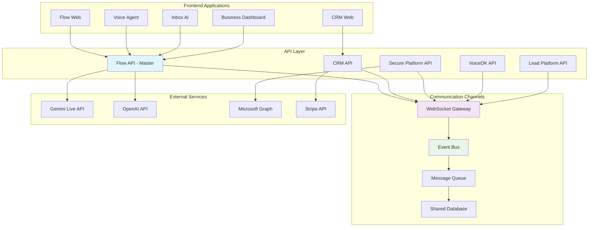
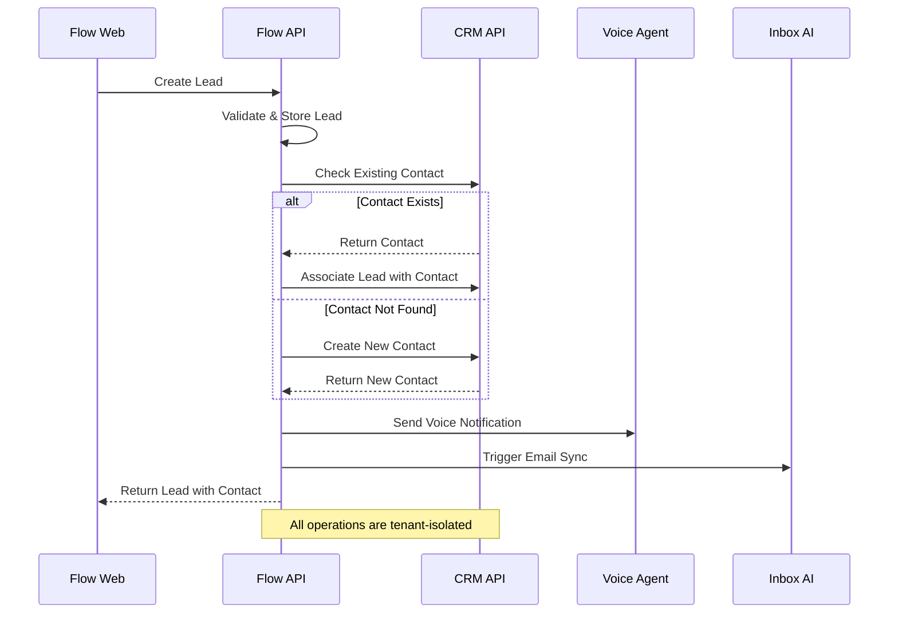
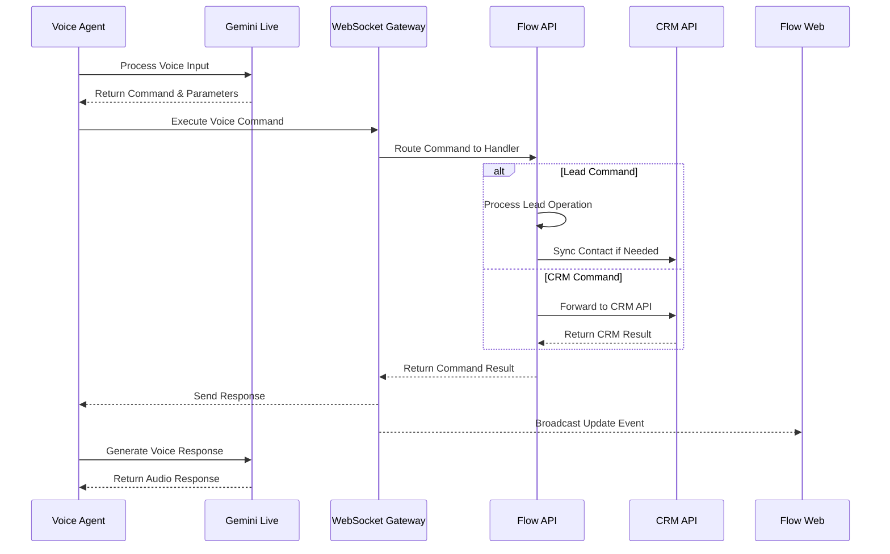
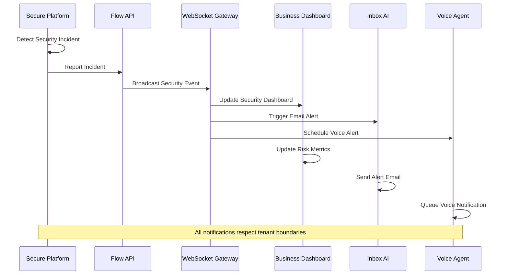

# Cross-Application Communication Patterns

This document outlines the communication patterns, data flow, and integration strategies used across all TekUp applications to ensure seamless operation as a unified ecosystem.

## Overview

The TekUp ecosystem consists of 25+ applications that work together to provide comprehensive business solutions. This document describes how these applications communicate, share data, and maintain consistency across the platform.

## Communication Architecture

### High-Level Communication Flow



## Communication Patterns

### 1. REST API Communication

The primary communication method between applications uses RESTful APIs with standardized patterns.

#### API Client Pattern

```typescript
// Standardized API client for inter-application communication
class TekUpAPIClient {
  private baseUrl: string;
  private apiKey: string;
  private tenantId: string;
  
  constructor(config: APIClientConfig) {
    this.baseUrl = config.baseUrl;
    this.apiKey = config.apiKey;
    this.tenantId = config.tenantId;
  }
  
  // Standardized request method with tenant isolation
  async request<T>(
    method: string,
    endpoint: string,
    options?: RequestOptions
  ): Promise<T> {
    const url = `${this.baseUrl}${endpoint}`;
    
    const response = await fetch(url, {
      method,
      headers: {
        'Content-Type': 'application/json',
        'x-tenant-key': this.apiKey,
        'x-tenant-id': this.tenantId,
        'x-source-app': this.getSourceApp(),
        ...options?.headers,
      },
      body: options?.data ? JSON.stringify(options.data) : undefined,
    });
    
    if (!response.ok) {
      throw new APIError(response.status, await response.text());
    }
    
    return response.json();
  }
  
  // Lead management integration
  async createLead(leadData: CreateLeadRequest): Promise<Lead> {
    return this.request('POST', '/leads', { data: leadData });
  }
  
  // Contact synchronization
  async syncContact(contactData: ContactSyncRequest): Promise<Contact> {
    return this.request('POST', '/contacts/sync', { data: contactData });
  }
  
  // Activity tracking
  async logActivity(activityData: ActivityRequest): Promise<Activity> {
    return this.request('POST', '/activities', { data: activityData });
  }
}
```

#### Cross-Application API Endpoints

| Source App | Target App | Endpoint | Purpose |
|------------|------------|----------|---------|
| Flow Web | Flow API | `/leads` | Lead management |
| CRM Web | CRM API | `/contacts` | Contact management |
| Voice Agent | Flow API | `/voice/execute` | Voice command execution |
| Inbox AI | CRM API | `/contacts/sync` | Email contact sync |
| Secure Platform | Flow API | `/compliance/report` | Security incident reporting |
| Business Dashboard | All APIs | `/metrics` | Metrics aggregation |

### 2. WebSocket Real-time Communication

Real-time communication is handled through a centralized WebSocket gateway that manages connections and event distribution.

#### WebSocket Event System

```typescript
// Centralized WebSocket event system
class WebSocketEventSystem {
  private connections: Map<string, WebSocketConnection> = new Map();
  private eventBus: EventBus;
  
  constructor() {
    this.eventBus = new EventBus();
    this.setupEventHandlers();
  }
  
  // Handle client connection with tenant isolation
  handleConnection(socket: WebSocket, tenantId: string, appId: string) {
    const connectionId = this.generateConnectionId();
    const connection = new WebSocketConnection(socket, tenantId, appId);
    
    this.connections.set(connectionId, connection);
    
    // Join tenant-specific room
    connection.joinRoom(`tenant:${tenantId}`);
    
    // Join app-specific room for targeted communication
    connection.joinRoom(`app:${appId}`);
    
    // Setup event listeners
    this.setupConnectionEventListeners(connection);
  }
  
  // Publish event to specific tenant and/or application
  publishEvent(event: CrossAppEvent) {
    const targetRooms = this.determineTargetRooms(event);
    
    targetRooms.forEach(room => {
      this.broadcastToRoom(room, event);
    });
    
    // Log event for audit trail
    this.logEvent(event);
  }
  
  private determineTargetRooms(event: CrossAppEvent): string[] {
    const rooms = [`tenant:${event.tenantId}`];
    
    // Add app-specific rooms based on event type
    switch (event.type) {
      case 'LEAD_CREATED':
        rooms.push('app:crm-web', 'app:flow-web');
        break;
      case 'CONTACT_UPDATED':
        rooms.push('app:inbox-ai', 'app:crm-web');
        break;
      case 'VOICE_COMMAND_EXECUTED':
        rooms.push('app:flow-web', 'app:voice-agent');
        break;
      case 'SECURITY_INCIDENT':
        rooms.push('app:secure-platform', 'app:business-dashboard');
        break;
    }
    
    return rooms;
  }
}
```

#### Event Types and Routing

```typescript
// Standardized event types for cross-application communication
interface CrossAppEvent {
  id: string;
  type: EventType;
  source: string;
  target?: string[];
  tenantId: string;
  timestamp: Date;
  data: any;
  priority: 'low' | 'medium' | 'high' | 'critical';
}

enum EventType {
  // Lead Management Events
  LEAD_CREATED = 'LEAD_CREATED',
  LEAD_UPDATED = 'LEAD_UPDATED',
  LEAD_STATUS_CHANGED = 'LEAD_STATUS_CHANGED',
  LEAD_ASSIGNED = 'LEAD_ASSIGNED',
  
  // Contact Management Events
  CONTACT_CREATED = 'CONTACT_CREATED',
  CONTACT_UPDATED = 'CONTACT_UPDATED',
  CONTACT_MERGED = 'CONTACT_MERGED',
  
  // Activity Events
  ACTIVITY_CREATED = 'ACTIVITY_CREATED',
  ACTIVITY_COMPLETED = 'ACTIVITY_COMPLETED',
  MEETING_SCHEDULED = 'MEETING_SCHEDULED',
  
  // Voice Events
  VOICE_COMMAND_EXECUTED = 'VOICE_COMMAND_EXECUTED',
  VOICE_PROCESSING_STARTED = 'VOICE_PROCESSING_STARTED',
  VOICE_PROCESSING_COMPLETED = 'VOICE_PROCESSING_COMPLETED',
  
  // Security Events
  SECURITY_INCIDENT = 'SECURITY_INCIDENT',
  COMPLIANCE_CHECK_COMPLETED = 'COMPLIANCE_CHECK_COMPLETED',
  BACKUP_COMPLETED = 'BACKUP_COMPLETED',
  
  // Business Events
  DEAL_CREATED = 'DEAL_CREATED',
  DEAL_WON = 'DEAL_WON',
  DEAL_LOST = 'DEAL_LOST',
  REVENUE_MILESTONE = 'REVENUE_MILESTONE',
  
  // System Events
  TENANT_CREATED = 'TENANT_CREATED',
  USER_LOGGED_IN = 'USER_LOGGED_IN',
  SYSTEM_MAINTENANCE = 'SYSTEM_MAINTENANCE',
}
```

### 3. Message Queue System

For asynchronous processing and reliable message delivery, the system uses a message queue architecture.

#### Queue-based Communication

```typescript
// Message queue system for reliable inter-application communication
class MessageQueueSystem {
  private queues: Map<string, Queue> = new Map();
  private processors: Map<string, MessageProcessor> = new Map();
  
  constructor() {
    this.initializeQueues();
    this.setupProcessors();
  }
  
  // Initialize application-specific queues
  private initializeQueues() {
    const queueConfigs = [
      { name: 'lead-processing', priority: 'high', maxRetries: 3 },
      { name: 'email-sync', priority: 'medium', maxRetries: 5 },
      { name: 'voice-processing', priority: 'high', maxRetries: 2 },
      { name: 'backup-operations', priority: 'low', maxRetries: 3 },
      { name: 'compliance-checks', priority: 'medium', maxRetries: 3 },
      { name: 'analytics-processing', priority: 'low', maxRetries: 1 },
    ];
    
    queueConfigs.forEach(config => {
      this.queues.set(config.name, new Queue(config));
    });
  }
  
  // Enqueue message for processing
  async enqueueMessage(queueName: string, message: QueueMessage): Promise<void> {
    const queue = this.queues.get(queueName);
    if (!queue) {
      throw new Error(`Queue ${queueName} not found`);
    }
    
    await queue.add(message, {
      priority: this.getPriority(message.priority),
      attempts: queue.config.maxRetries,
      backoff: 'exponential',
      delay: message.delay || 0,
    });
  }
  
  // Process messages from queue
  private setupProcessors() {
    // Lead processing
    this.processors.set('lead-processing', new LeadProcessor());
    
    // Email synchronization
    this.processors.set('email-sync', new EmailSyncProcessor());
    
    // Voice command processing
    this.processors.set('voice-processing', new VoiceProcessor());
    
    // Backup operations
    this.processors.set('backup-operations', new BackupProcessor());
    
    // Compliance checks
    this.processors.set('compliance-checks', new ComplianceProcessor());
    
    // Analytics processing
    this.processors.set('analytics-processing', new AnalyticsProcessor());
  }
}
```

#### Message Processing Examples

```typescript
// Lead processing across applications
class LeadProcessor implements MessageProcessor {
  async process(message: QueueMessage): Promise<ProcessingResult> {
    const { type, data, tenantId } = message;
    
    switch (type) {
      case 'LEAD_CREATED':
        return this.processLeadCreated(data, tenantId);
      case 'LEAD_QUALIFIED':
        return this.processLeadQualified(data, tenantId);
      case 'LEAD_CONVERTED':
        return this.processLeadConverted(data, tenantId);
      default:
        throw new Error(`Unknown lead processing type: ${type}`);
    }
  }
  
  private async processLeadCreated(leadData: any, tenantId: string): Promise<ProcessingResult> {
    // 1. Create lead in Flow API
    const lead = await this.flowApiClient.createLead(leadData);
    
    // 2. Check if contact exists in CRM
    const existingContact = await this.crmApiClient.findContactByEmail(leadData.email);
    
    if (existingContact) {
      // 3. Associate lead with existing contact
      await this.crmApiClient.associateLeadWithContact(lead.id, existingContact.id);
    } else {
      // 4. Create new contact in CRM
      const contact = await this.crmApiClient.createContact({
        firstName: leadData.firstName,
        lastName: leadData.lastName,
        email: leadData.email,
        phone: leadData.phone,
        source: 'lead',
        leadId: lead.id,
      });
    }
    
    // 5. Trigger voice notification if enabled
    if (leadData.voiceNotificationEnabled) {
      await this.voiceApiClient.scheduleNotification({
        tenantId,
        message: `New lead received: ${leadData.firstName} ${leadData.lastName}`,
        priority: 'medium',
      });
    }
    
    // 6. Log activity
    await this.flowApiClient.logActivity({
      type: 'LEAD_CREATED',
      entityId: lead.id,
      description: `Lead created from ${leadData.source}`,
      tenantId,
    });
    
    return { success: true, leadId: lead.id };
  }
}
```

## Data Flow Patterns

### 1. Lead-to-Contact Flow



### 2. Voice Command Integration Flow



### 3. Security Event Propagation



## Authentication and Authorization

### Multi-tenant Security Model

```typescript
// Centralized authentication and authorization
class CrossAppAuthService {
  // Validate API key and resolve tenant context
  async validateApiKey(apiKey: string): Promise<TenantContext> {
    const keyData = await this.apiKeyRepository.findByKey(apiKey);
    
    if (!keyData || !keyData.isActive) {
      throw new UnauthorizedError('Invalid API key');
    }
    
    const tenant = await this.tenantRepository.findById(keyData.tenantId);
    
    if (!tenant || !tenant.isActive) {
      throw new UnauthorizedError('Tenant not active');
    }
    
    return {
      tenantId: tenant.id,
      tenantSlug: tenant.slug,
      permissions: keyData.permissions,
      rateLimit: keyData.rateLimit,
      allowedApps: keyData.allowedApps,
    };
  }
  
  // Check if application has permission for operation
  checkPermission(
    context: TenantContext,
    sourceApp: string,
    operation: string,
    resource?: string
  ): boolean {
    // Check if app is allowed for this tenant
    if (!context.allowedApps.includes(sourceApp)) {
      return false;
    }
    
    // Check operation permission
    const permission = `${operation}:${resource || '*'}`;
    return context.permissions.some(p => 
      p === permission || p === `${operation}:*` || p === '*'
    );
  }
  
  // Generate cross-application JWT token
  generateCrossAppToken(context: TenantContext, sourceApp: string): string {
    const payload = {
      tenantId: context.tenantId,
      sourceApp,
      permissions: context.permissions,
      iat: Math.floor(Date.now() / 1000),
      exp: Math.floor(Date.now() / 1000) + (60 * 60), // 1 hour
    };
    
    return jwt.sign(payload, this.jwtSecret);
  }
}
```

### Permission Matrix

| Source App | Target App | Allowed Operations | Resource Scope |
|------------|------------|-------------------|----------------|
| Flow Web | Flow API | `read:leads`, `write:leads`, `read:activities` | Tenant-scoped |
| CRM Web | CRM API | `read:contacts`, `write:contacts`, `read:deals` | Tenant-scoped |
| Voice Agent | Flow API | `execute:voice`, `read:leads`, `write:activities` | Tenant-scoped |
| Inbox AI | CRM API | `read:contacts`, `write:contacts`, `sync:emails` | Tenant-scoped |
| Secure Platform | All APIs | `read:security`, `write:incidents`, `read:compliance` | Tenant-scoped |
| Business Dashboard | All APIs | `read:metrics`, `read:analytics` | Tenant-scoped |

## Error Handling and Resilience

### Circuit Breaker Pattern

```typescript
// Circuit breaker for inter-application communication
class CircuitBreaker {
  private state: 'CLOSED' | 'OPEN' | 'HALF_OPEN' = 'CLOSED';
  private failureCount = 0;
  private lastFailureTime?: Date;
  private successCount = 0;
  
  constructor(
    private threshold: number = 5,
    private timeout: number = 60000, // 1 minute
    private monitoringWindow: number = 60000
  ) {}
  
  async execute<T>(operation: () => Promise<T>): Promise<T> {
    if (this.state === 'OPEN') {
      if (this.shouldAttemptReset()) {
        this.state = 'HALF_OPEN';
        this.successCount = 0;
      } else {
        throw new CircuitBreakerOpenError('Circuit breaker is OPEN');
      }
    }
    
    try {
      const result = await operation();
      this.onSuccess();
      return result;
    } catch (error) {
      this.onFailure();
      throw error;
    }
  }
  
  private onSuccess() {
    this.failureCount = 0;
    
    if (this.state === 'HALF_OPEN') {
      this.successCount++;
      if (this.successCount >= 3) {
        this.state = 'CLOSED';
      }
    }
  }
  
  private onFailure() {
    this.failureCount++;
    this.lastFailureTime = new Date();
    
    if (this.failureCount >= this.threshold) {
      this.state = 'OPEN';
    }
  }
  
  private shouldAttemptReset(): boolean {
    return this.lastFailureTime && 
           (Date.now() - this.lastFailureTime.getTime()) >= this.timeout;
  }
}
```

### Retry Mechanisms

```typescript
// Exponential backoff retry mechanism
class RetryHandler {
  async executeWithRetry<T>(
    operation: () => Promise<T>,
    options: RetryOptions = {}
  ): Promise<T> {
    const {
      maxRetries = 3,
      baseDelay = 1000,
      maxDelay = 30000,
      backoffMultiplier = 2,
      jitter = true,
    } = options;
    
    let lastError: Error;
    
    for (let attempt = 0; attempt <= maxRetries; attempt++) {
      try {
        return await operation();
      } catch (error) {
        lastError = error;
        
        if (attempt === maxRetries || !this.isRetryableError(error)) {
          throw error;
        }
        
        const delay = this.calculateDelay(attempt, baseDelay, maxDelay, backoffMultiplier, jitter);
        await this.sleep(delay);
      }
    }
    
    throw lastError!;
  }
  
  private isRetryableError(error: any): boolean {
    // Network errors
    if (error.code === 'ECONNRESET' || error.code === 'ENOTFOUND') {
      return true;
    }
    
    // HTTP errors
    if (error.status >= 500 && error.status < 600) {
      return true;
    }
    
    // Rate limiting
    if (error.status === 429) {
      return true;
    }
    
    return false;
  }
  
  private calculateDelay(
    attempt: number,
    baseDelay: number,
    maxDelay: number,
    multiplier: number,
    jitter: boolean
  ): number {
    let delay = baseDelay * Math.pow(multiplier, attempt);
    delay = Math.min(delay, maxDelay);
    
    if (jitter) {
      delay = delay * (0.5 + Math.random() * 0.5);
    }
    
    return Math.floor(delay);
  }
}
```

## Monitoring and Observability

### Cross-Application Metrics

```typescript
// Metrics collection for cross-application communication
class CrossAppMetrics {
  private metricsCollector: MetricsCollector;
  
  constructor() {
    this.metricsCollector = new MetricsCollector();
    this.setupMetrics();
  }
  
  private setupMetrics() {
    // API call metrics
    this.metricsCollector.createCounter('cross_app_requests_total', {
      help: 'Total number of cross-application requests',
      labelNames: ['source_app', 'target_app', 'method', 'status'],
    });
    
    this.metricsCollector.createHistogram('cross_app_request_duration_seconds', {
      help: 'Duration of cross-application requests',
      labelNames: ['source_app', 'target_app', 'method'],
      buckets: [0.1, 0.5, 1, 2, 5, 10],
    });
    
    // WebSocket metrics
    this.metricsCollector.createGauge('websocket_connections_active', {
      help: 'Number of active WebSocket connections',
      labelNames: ['tenant_id', 'app_id'],
    });
    
    this.metricsCollector.createCounter('websocket_events_published_total', {
      help: 'Total number of WebSocket events published',
      labelNames: ['event_type', 'source_app', 'target_app'],
    });
    
    // Queue metrics
    this.metricsCollector.createGauge('message_queue_size', {
      help: 'Number of messages in queue',
      labelNames: ['queue_name'],
    });
    
    this.metricsCollector.createCounter('message_queue_processed_total', {
      help: 'Total number of messages processed',
      labelNames: ['queue_name', 'status'],
    });
  }
  
  // Record API call metrics
  recordAPICall(
    sourceApp: string,
    targetApp: string,
    method: string,
    status: number,
    duration: number
  ) {
    this.metricsCollector.incrementCounter('cross_app_requests_total', {
      source_app: sourceApp,
      target_app: targetApp,
      method,
      status: status.toString(),
    });
    
    this.metricsCollector.recordHistogram('cross_app_request_duration_seconds', duration / 1000, {
      source_app: sourceApp,
      target_app: targetApp,
      method,
    });
  }
  
  // Record WebSocket event
  recordWebSocketEvent(eventType: string, sourceApp: string, targetApp?: string) {
    this.metricsCollector.incrementCounter('websocket_events_published_total', {
      event_type: eventType,
      source_app: sourceApp,
      target_app: targetApp || 'broadcast',
    });
  }
}
```

### Distributed Tracing

```typescript
// Distributed tracing for cross-application requests
class DistributedTracing {
  private tracer: Tracer;
  
  constructor() {
    this.tracer = opentelemetry.trace.getTracer('tekup-cross-app');
  }
  
  // Start a new trace for cross-application operation
  startTrace(operationName: string, context?: any): Span {
    const span = this.tracer.startSpan(operationName, {
      attributes: {
        'tekup.operation': operationName,
        'tekup.tenant_id': context?.tenantId,
        'tekup.source_app': context?.sourceApp,
        'tekup.target_app': context?.targetApp,
      },
    });
    
    return span;
  }
  
  // Add event to current span
  addEvent(span: Span, eventName: string, attributes?: any) {
    span.addEvent(eventName, attributes);
  }
  
  // Record error in span
  recordError(span: Span, error: Error) {
    span.recordException(error);
    span.setStatus({
      code: SpanStatusCode.ERROR,
      message: error.message,
    });
  }
  
  // End span
  endSpan(span: Span) {
    span.end();
  }
}
```

## Testing Cross-Application Integration

### Integration Test Framework

```typescript
// Framework for testing cross-application integration
class CrossAppIntegrationTest {
  private testEnvironment: TestEnvironment;
  private mockServices: Map<string, MockService> = new Map();
  
  async setupTestEnvironment() {
    this.testEnvironment = new TestEnvironment();
    
    // Start test instances of all applications
    await this.testEnvironment.startApplication('flow-api', { port: 4000 });
    await this.testEnvironment.startApplication('crm-api', { port: 4001 });
    await this.testEnvironment.startApplication('secure-platform', { port: 4002 });
    
    // Setup mock external services
    this.setupMockServices();
    
    // Wait for all services to be ready
    await this.waitForServicesReady();
  }
  
  async testLeadToContactFlow() {
    // 1. Create lead in Flow API
    const leadData = {
      firstName: 'John',
      lastName: 'Doe',
      email: 'john@example.com',
      phone: '+45 12 34 56 78',
      source: 'website',
    };
    
    const flowApiClient = this.testEnvironment.getClient('flow-api');
    const lead = await flowApiClient.createLead(leadData);
    
    // 2. Verify lead was created
    expect(lead.id).toBeDefined();
    expect(lead.email).toBe(leadData.email);
    
    // 3. Wait for contact sync to CRM
    await this.waitForEventProcessing('LEAD_CREATED');
    
    // 4. Verify contact was created in CRM
    const crmApiClient = this.testEnvironment.getClient('crm-api');
    const contacts = await crmApiClient.getContacts({ email: leadData.email });
    
    expect(contacts.data).toHaveLength(1);
    expect(contacts.data[0].email).toBe(leadData.email);
    expect(contacts.data[0].leadId).toBe(lead.id);
    
    // 5. Verify activity was logged
    const activities = await flowApiClient.getActivities({ entityId: lead.id });
    expect(activities.data).toHaveLength(1);
    expect(activities.data[0].type).toBe('LEAD_CREATED');
  }
  
  async testVoiceCommandIntegration() {
    // 1. Setup WebSocket connection
    const wsClient = this.testEnvironment.getWebSocketClient();
    await wsClient.connect();
    
    // 2. Execute voice command
    const voiceCommand = {
      command: 'get_leads',
      parameters: { status: 'NEW', limit: 5 },
    };
    
    const response = await wsClient.executeVoiceCommand(voiceCommand);
    
    // 3. Verify response
    expect(response.success).toBe(true);
    expect(response.data.leads).toBeDefined();
    expect(Array.isArray(response.data.leads)).toBe(true);
    
    // 4. Verify event was broadcast
    const events = await wsClient.getReceivedEvents();
    const voiceEvent = events.find(e => e.type === 'VOICE_COMMAND_EXECUTED');
    expect(voiceEvent).toBeDefined();
  }
  
  async testSecurityEventPropagation() {
    // 1. Trigger security incident in Secure Platform
    const securityClient = this.testEnvironment.getClient('secure-platform');
    const incident = await securityClient.reportIncident({
      type: 'data_breach',
      severity: 'high',
      description: 'Test security incident',
    });
    
    // 2. Wait for event propagation
    await this.waitForEventProcessing('SECURITY_INCIDENT');
    
    // 3. Verify incident was logged in Flow API
    const flowApiClient = this.testEnvironment.getClient('flow-api');
    const activities = await flowApiClient.getActivities({ 
      type: 'SECURITY_INCIDENT',
      entityId: incident.id 
    });
    
    expect(activities.data).toHaveLength(1);
    
    // 4. Verify dashboard was updated
    const dashboardClient = this.testEnvironment.getClient('business-dashboard');
    const metrics = await dashboardClient.getSecurityMetrics();
    
    expect(metrics.activeIncidents).toBeGreaterThan(0);
  }
}
```

## Troubleshooting Guide

### Common Integration Issues

#### 1. API Communication Failures

**Symptoms:**
- HTTP 500 errors between applications
- Timeout errors
- Connection refused errors

**Diagnosis:**
```bash
# Check application health
curl http://localhost:4000/health  # Flow API
curl http://localhost:4001/health  # CRM API
curl http://localhost:4002/health  # Secure Platform

# Check network connectivity
telnet localhost 4000
telnet localhost 4001
telnet localhost 4002

# Check API key validity
curl -H "x-tenant-key: your-key" http://localhost:4000/leads
```

**Solutions:**
- Verify all applications are running
- Check API key configuration
- Verify network connectivity
- Check rate limiting settings

#### 2. WebSocket Connection Issues

**Symptoms:**
- WebSocket connections dropping
- Events not being received
- Connection authentication failures

**Diagnosis:**
```bash
# Test WebSocket connection
wscat -c ws://localhost:4000/events -H "x-tenant-key: your-key"

# Check WebSocket metrics
curl http://localhost:4000/metrics | grep websocket
```

**Solutions:**
- Verify WebSocket endpoint configuration
- Check authentication headers
- Implement connection retry logic
- Monitor connection health

#### 3. Message Queue Processing Issues

**Symptoms:**
- Messages stuck in queue
- Processing failures
- Duplicate message processing

**Diagnosis:**
```bash
# Check queue status
curl http://localhost:4000/admin/queues

# Monitor queue metrics
curl http://localhost:4000/metrics | grep queue
```

**Solutions:**
- Check queue processor health
- Verify message format
- Implement dead letter queues
- Monitor processing metrics

#### 4. Tenant Isolation Problems

**Symptoms:**
- Cross-tenant data leakage
- Authentication failures
- Permission denied errors

**Diagnosis:**
```bash
# Verify tenant isolation
curl -H "x-tenant-key: tenant-a-key" http://localhost:4000/leads
curl -H "x-tenant-key: tenant-b-key" http://localhost:4000/leads

# Check database RLS policies
psql $DATABASE_URL -c "SELECT * FROM pg_policies WHERE tablename = 'leads';"
```

**Solutions:**
- Verify RLS policies are active
- Check API key tenant associations
- Validate middleware configuration
- Test cross-tenant access controls

### Monitoring and Alerting

#### Key Metrics to Monitor

1. **API Response Times**
   - Target: < 500ms for 95th percentile
   - Alert: > 2 seconds for 95th percentile

2. **WebSocket Connection Health**
   - Target: > 99% uptime
   - Alert: < 95% uptime

3. **Message Queue Processing**
   - Target: < 1 minute processing time
   - Alert: > 5 minutes processing time

4. **Error Rates**
   - Target: < 1% error rate
   - Alert: > 5% error rate

#### Alert Configuration

```yaml
# Prometheus alerting rules
groups:
  - name: cross-app-integration
    rules:
      - alert: HighAPIErrorRate
        expr: rate(cross_app_requests_total{status=~"5.."}[5m]) > 0.05
        for: 2m
        labels:
          severity: warning
        annotations:
          summary: "High error rate in cross-application API calls"
          
      - alert: WebSocketConnectionDrop
        expr: websocket_connections_active < 10
        for: 1m
        labels:
          severity: critical
        annotations:
          summary: "WebSocket connections dropped significantly"
          
      - alert: MessageQueueBacklog
        expr: message_queue_size > 1000
        for: 5m
        labels:
          severity: warning
        annotations:
          summary: "Message queue backlog is growing"
```

## Best Practices

### 1. API Design
- Use consistent REST conventions across all applications
- Implement proper versioning strategies
- Use standardized error response formats
- Include correlation IDs for tracing

### 2. Event-Driven Architecture
- Design events to be immutable and self-contained
- Use event sourcing for critical business events
- Implement event replay capabilities
- Ensure events are idempotent

### 3. Security
- Always validate tenant context
- Use mutual TLS for service-to-service communication
- Implement proper rate limiting
- Log all cross-application interactions

### 4. Resilience
- Implement circuit breakers for external calls
- Use exponential backoff for retries
- Design for graceful degradation
- Implement health checks for all services

### 5. Monitoring
- Implement distributed tracing
- Monitor business metrics, not just technical metrics
- Set up proper alerting thresholds
- Use correlation IDs for debugging

This comprehensive integration documentation ensures that all TekUp applications can communicate effectively while maintaining security, performance, and reliability standards.