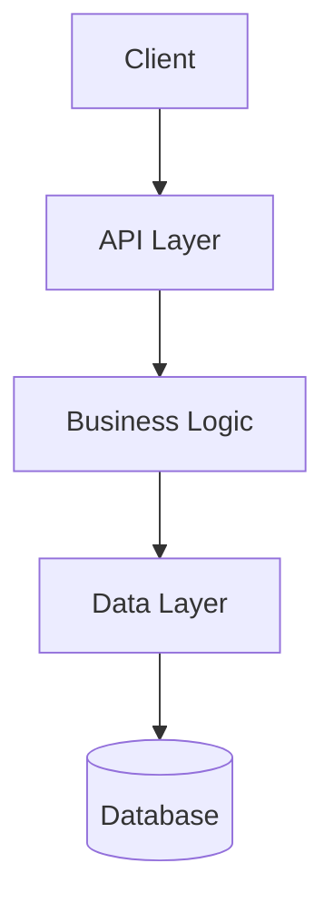

# Application Name

Brief description of what this application does and its role in the TekUp ecosystem.

## Overview

Detailed overview of the application including:
- Purpose and functionality
- Key features
- Integration points
- Target users

## Architecture

### Technology Stack
- **Framework**: [Framework name and version]
- **Database**: [Database type and configuration]
- **Authentication**: [Authentication method]
- **Deployment**: [Deployment method]

### System Design


## Getting Started

### Prerequisites
- List of required dependencies
- Environment setup requirements
- Access permissions needed

### Installation
```bash
# Clone and setup
git clone https://github.com/TekUp-org/tekup-org.git
cd tekup-org

# Install dependencies
pnpm install

# Setup environment
pnpm run env:auto

# Start the application
pnpm run [app-name]:dev
```

### Configuration
Key configuration options and environment variables:

| Variable | Description | Default | Required |
|----------|-------------|---------|----------|
| `DATABASE_URL` | Database connection string | - | Yes |
| `JWT_SECRET` | JWT signing secret | - | Yes |
| `API_PORT` | Port for API server | 3000 | No |

## API Reference

### Authentication
Description of authentication methods and requirements.

### Endpoints

#### GET /api/endpoint
Description of the endpoint.

**Parameters:**
- `param1` (string, required): Description
- `param2` (number, optional): Description

**Response:**
```json
{
  "data": {},
  "message": "Success"
}
```

## Integration

### Internal Integrations
- **flow-api**: Description of integration
- **Other services**: Description of integrations

### External Integrations
- **Third-party service**: Description of integration
- **APIs**: Description of external API usage

## Development

### Project Structure
```
src/
├── controllers/     # API controllers
├── services/       # Business logic
├── models/         # Data models
├── middleware/     # Express middleware
├── config/         # Configuration files
└── utils/          # Utility functions
```

### Testing
```bash
# Run tests
pnpm run [app-name]:test

# Run tests with coverage
pnpm run [app-name]:test:coverage

# Run e2e tests
pnpm run [app-name]:test:e2e
```

### Building
```bash
# Build for production
pnpm run [app-name]:build

# Build and start
pnpm run [app-name]:start
```

## Deployment

### Environment Setup
Steps for setting up different environments.

### Docker Deployment
```dockerfile
# Example Dockerfile configuration
FROM node:18-alpine
WORKDIR /app
COPY package*.json ./
RUN npm install
COPY . .
EXPOSE 3000
CMD ["npm", "start"]
```

### Kubernetes Deployment
```yaml
# Example Kubernetes configuration
apiVersion: apps/v1
kind: Deployment
metadata:
  name: app-name
spec:
  replicas: 3
  selector:
    matchLabels:
      app: app-name
  template:
    metadata:
      labels:
        app: app-name
    spec:
      containers:
      - name: app-name
        image: tekup/app-name:latest
        ports:
        - containerPort: 3000
```

## Monitoring

### Health Checks
- **Endpoint**: `/health`
- **Response**: Health status and dependencies

### Metrics
Key metrics to monitor:
- Response time
- Error rate
- Database connections
- Memory usage

### Logging
Logging configuration and important log events.

## Troubleshooting

### Common Issues

#### Issue 1: Description
**Symptoms:** What users might see
**Cause:** Root cause of the issue
**Solution:** Step-by-step resolution

#### Issue 2: Description
**Symptoms:** What users might see
**Cause:** Root cause of the issue
**Solution:** Step-by-step resolution

### Debug Mode
How to enable debug mode and interpret debug output.

## Contributing

Guidelines for contributing to this application:
1. Fork the repository
2. Create a feature branch
3. Make your changes
4. Add tests
5. Submit a pull request

## Changelog

### Version 1.0.0
- Initial release
- Core functionality implemented
- Basic API endpoints

## Support

- **Documentation**: Link to additional docs
- **Issues**: GitHub issues link
- **Community**: Discord/Slack link
- **Email**: support email