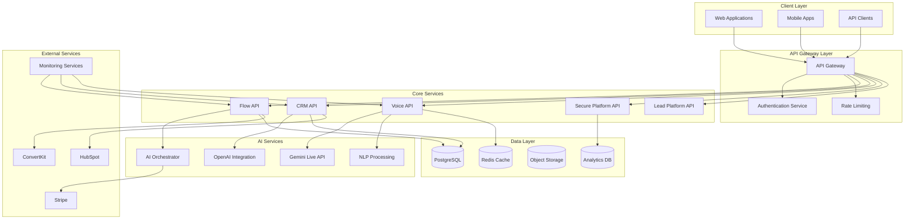
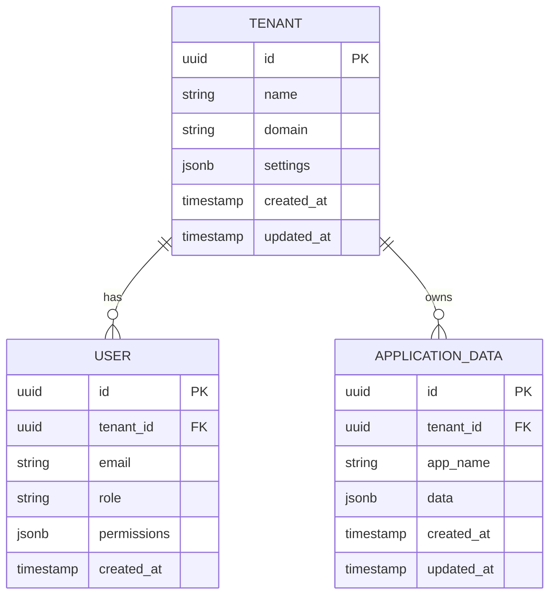
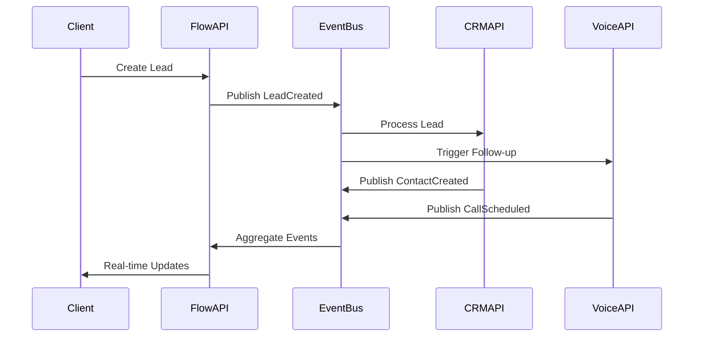

# Architecture Overview

The TekUp platform is designed as a comprehensive AI-powered business ecosystem that operates as a living, breathing organism. This document provides a high-level overview of the system architecture and design principles.

## System Design Philosophy

### Living AI Organism
The platform is designed to function as a unified AI organism where:
- **Applications communicate seamlessly** through standardized APIs and event systems
- **AI components learn and adapt** based on usage patterns and business metrics
- **Self-monitoring and optimization** occurs automatically across all services
- **Intelligent decision-making** happens at every layer of the stack

### Core Principles

1. **Microservices Architecture**: Loosely coupled, independently deployable services
2. **Event-Driven Communication**: Asynchronous messaging for scalability and resilience
3. **Multi-Tenant by Design**: Complete data isolation with shared infrastructure
4. **API-First Development**: All functionality exposed through well-documented APIs
5. **Security by Default**: Zero-trust security model with comprehensive monitoring

## High-Level Architecture

## Application Ecosystem

### Core Applications

#### Flow API (`flow-api`)
The master backend service that orchestrates the entire platform:
- **Tenant Management**: Multi-tenant architecture with RLS
- **Event Orchestration**: Central event bus for inter-service communication
- **WebSocket Hub**: Real-time communication coordination
- **Business Logic**: Core business rules and workflows

#### Flow Web (`flow-web`)
The primary web interface providing:
- **Dashboard**: Unified view of all business metrics
- **Tenant Management**: Multi-tenant administration
- **Real-time Updates**: WebSocket-powered live updates
- **Responsive Design**: Mobile-first responsive interface

#### Voice Agent (`voice-agent`)
AI-powered voice processing system:
- **Gemini Live Integration**: Advanced voice AI capabilities
- **Danish Language Support**: Specialized Danish NLP processing
- **Command Processing**: Voice command interpretation and execution
- **Real-time Streaming**: Low-latency voice processing

### Business Applications

#### TekUp CRM (`tekup-crm-api`, `tekup-crm-web`)
Comprehensive customer relationship management:
- **Contact Management**: Advanced contact and company management
- **Pipeline Management**: Sales pipeline tracking and automation
- **Integration Hub**: Connects with external CRM systems
- **Analytics**: Customer behavior and sales analytics

#### Lead Platform (`tekup-lead-platform`, `tekup-lead-platform-web`)
Lead generation and management system:
- **Campaign Management**: Multi-channel campaign orchestration
- **Lead Scoring**: AI-powered lead qualification
- **Attribution Tracking**: Multi-touch attribution analysis
- **Conversion Optimization**: A/B testing and optimization

### Specialized Applications

#### Inbox AI (`inbox-ai`)
Desktop application for AI-powered inbox management:
- **Email Processing**: Intelligent email categorization and prioritization
- **Response Generation**: AI-powered response suggestions
- **Task Extraction**: Automatic task and calendar event creation
- **Integration**: Seamless integration with business workflows

#### Secure Platform (`secure-platform`)
Security and compliance management:
- **Compliance Monitoring**: Automated compliance checking
- **Incident Response**: Security incident management
- **Audit Trails**: Comprehensive audit logging
- **Risk Assessment**: Continuous security risk evaluation

## Data Architecture

### Multi-Tenant Data Model

### Row Level Security (RLS)
All data access is secured through PostgreSQL's Row Level Security:
- **Tenant Isolation**: Complete data separation between tenants
- **Role-Based Access**: Fine-grained permissions per user role
- **Audit Logging**: All data access is logged for compliance
- **Performance Optimization**: Efficient query planning with tenant context

## Communication Patterns

### API Communication
- **RESTful APIs**: Standard HTTP APIs for CRUD operations
- **GraphQL**: Flexible data querying for complex frontend needs
- **OpenAPI Specs**: Auto-generated documentation and client libraries

### Real-Time Communication
- **WebSockets**: Bi-directional real-time communication
- **Server-Sent Events**: One-way real-time updates
- **Event Streaming**: Kafka-like event streaming for high-throughput scenarios

### Event-Driven Architecture

## Security Architecture

### Authentication & Authorization
- **JWT Tokens**: Stateless authentication with refresh token rotation
- **OAuth 2.0**: Third-party authentication integration
- **Role-Based Access Control (RBAC)**: Granular permission management
- **Multi-Factor Authentication (MFA)**: Enhanced security for sensitive operations

### Data Protection
- **Encryption at Rest**: All sensitive data encrypted in database
- **Encryption in Transit**: TLS 1.3 for all communications
- **Key Management**: Secure key rotation and management
- **Data Anonymization**: GDPR-compliant data handling

### Monitoring & Compliance
- **Security Information and Event Management (SIEM)**: Centralized security monitoring
- **Compliance Frameworks**: GDPR, SOC 2, ISO 27001 compliance
- **Incident Response**: Automated incident detection and response
- **Audit Trails**: Comprehensive logging for all system activities

## Deployment Architecture

### Infrastructure
- **Containerization**: Docker containers for all services
- **Orchestration**: Kubernetes for container orchestration
- **Service Mesh**: Istio for service-to-service communication
- **Load Balancing**: Intelligent traffic distribution

### Environments
- **Development**: Local development with Docker Compose
- **Staging**: Production-like environment for testing
- **Production**: High-availability production deployment
- **Disaster Recovery**: Multi-region backup and recovery

### Monitoring & Observability
- **Metrics**: Prometheus for metrics collection
- **Logging**: Centralized logging with ELK stack
- **Tracing**: Distributed tracing with Jaeger
- **Alerting**: Intelligent alerting with PagerDuty integration

## Performance & Scalability

### Horizontal Scaling
- **Stateless Services**: All services designed for horizontal scaling
- **Database Sharding**: Tenant-based database sharding
- **Caching Strategy**: Multi-layer caching with Redis
- **CDN Integration**: Global content delivery network

### Performance Optimization
- **Query Optimization**: Database query performance tuning
- **Connection Pooling**: Efficient database connection management
- **Async Processing**: Background job processing with queues
- **Resource Management**: Intelligent resource allocation and scaling

## Next Steps

- **[System Design](./system-design.md)** - Detailed system design patterns
- **[Multi-Tenancy](./multi-tenancy.md)** - Deep dive into multi-tenant architecture
- **[Security](./security.md)** - Comprehensive security implementation
- **[Integration Patterns](./integration-patterns.md)** - Service integration patterns