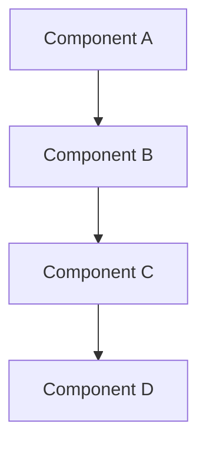

# Whitepaper Title

**Abstract:** Brief summary of the whitepaper content, key findings, and recommendations.

**Authors:** Author names and affiliations  
**Date:** Publication date  
**Version:** Document version  
**Classification:** Public/Internal/Confidential  

## Executive Summary

High-level overview of the document including:
- Problem statement
- Key findings
- Recommendations
- Business impact
- Technical implications

## Table of Contents

1. [Introduction](#introduction)
2. [Problem Statement](#problem-statement)
3. [Current State Analysis](#current-state-analysis)
4. [Proposed Solution](#proposed-solution)
5. [Technical Architecture](#technical-architecture)
6. [Implementation Strategy](#implementation-strategy)
7. [Risk Assessment](#risk-assessment)
8. [Cost-Benefit Analysis](#cost-benefit-analysis)
9. [Recommendations](#recommendations)
10. [Conclusion](#conclusion)
11. [Appendices](#appendices)

## Introduction

### Background
Context and background information that led to this analysis.

### Scope
What is covered and what is not covered in this document.

### Objectives
- Primary objectives
- Secondary objectives
- Success criteria

### Methodology
Research and analysis methods used.

## Problem Statement

### Current Challenges
Detailed description of existing problems:
- Technical challenges
- Business challenges
- Operational challenges
- Strategic challenges

### Impact Analysis
Quantified impact of current problems:
- Performance metrics
- Cost implications
- Risk factors
- Opportunity costs

### Stakeholder Analysis
Key stakeholders and their concerns:
- Business stakeholders
- Technical stakeholders
- End users
- External partners

## Current State Analysis

### Technical Assessment
Current technical landscape:
- Architecture overview
- Technology stack
- Performance characteristics
- Scalability limitations
- Security posture

### Business Assessment
Current business situation:
- Market position
- Competitive landscape
- Revenue impact
- Operational efficiency
- Customer satisfaction

### Gap Analysis
Identification of gaps between current and desired state:
- Functional gaps
- Technical gaps
- Process gaps
- Skill gaps

## Proposed Solution

### Solution Overview
High-level description of the proposed solution.

### Key Components
Detailed breakdown of solution components:
- Component 1: Description and rationale
- Component 2: Description and rationale
- Component 3: Description and rationale

### Design Principles
Guiding principles for the solution:
- Scalability
- Security
- Maintainability
- Performance
- Cost-effectiveness

### Alternative Solutions Considered
Other options that were evaluated and why they were not selected.

## Technical Architecture

### Architecture Overview

### System Components
Detailed description of each system component:
- Purpose and functionality
- Technology choices
- Integration points
- Dependencies

### Data Architecture
Data flow and storage design:
- Data models
- Storage solutions
- Data processing pipelines
- Data governance

### Security Architecture
Security design and controls:
- Authentication and authorization
- Data protection
- Network security
- Compliance requirements

### Integration Architecture
How the solution integrates with existing systems:
- API design
- Message queuing
- Event-driven architecture
- Legacy system integration

## Implementation Strategy

### Phased Approach
Implementation phases and timeline:

#### Phase 1: Foundation (Months 1-3)
- Objectives
- Deliverables
- Success criteria
- Resource requirements

#### Phase 2: Core Implementation (Months 4-8)
- Objectives
- Deliverables
- Success criteria
- Resource requirements

#### Phase 3: Optimization (Months 9-12)
- Objectives
- Deliverables
- Success criteria
- Resource requirements

### Resource Requirements
- Human resources
- Technology resources
- Budget requirements
- External dependencies

### Success Metrics
Key performance indicators:
- Technical metrics
- Business metrics
- User satisfaction metrics
- Operational metrics

## Risk Assessment

### Technical Risks
| Risk | Probability | Impact | Mitigation Strategy |
|------|-------------|--------|-------------------|
| Technology compatibility | Medium | High | Proof of concept development |
| Performance issues | Low | Medium | Load testing and optimization |
| Security vulnerabilities | Medium | High | Security audits and testing |

### Business Risks
| Risk | Probability | Impact | Mitigation Strategy |
|------|-------------|--------|-------------------|
| Budget overrun | Medium | High | Detailed cost tracking |
| Timeline delays | High | Medium | Agile development approach |
| User adoption | Medium | High | Change management program |

### Operational Risks
| Risk | Probability | Impact | Mitigation Strategy |
|------|-------------|--------|-------------------|
| System downtime | Low | High | Redundancy and failover |
| Data loss | Low | High | Backup and recovery procedures |
| Skill gaps | Medium | Medium | Training and knowledge transfer |

## Cost-Benefit Analysis

### Implementation Costs
- Development costs
- Infrastructure costs
- Training costs
- Operational costs

### Expected Benefits
- Cost savings
- Revenue increases
- Efficiency gains
- Risk reduction

### Return on Investment (ROI)
Financial analysis and projections:
- Initial investment
- Ongoing costs
- Expected returns
- Payback period
- Net present value (NPV)

### Total Cost of Ownership (TCO)
Long-term cost analysis:
- 3-year TCO projection
- 5-year TCO projection
- Cost comparison with alternatives

## Recommendations

### Primary Recommendations
1. **Recommendation 1**: Detailed description and rationale
2. **Recommendation 2**: Detailed description and rationale
3. **Recommendation 3**: Detailed description and rationale

### Implementation Priorities
- High priority items
- Medium priority items
- Low priority items

### Next Steps
Immediate actions required:
1. Action item 1 with timeline
2. Action item 2 with timeline
3. Action item 3 with timeline

### Decision Points
Key decisions that need to be made:
- Decision 1: Options and recommendation
- Decision 2: Options and recommendation
- Decision 3: Options and recommendation

## Conclusion

### Summary of Findings
Key takeaways from the analysis.

### Strategic Implications
Long-term strategic impact of the recommendations.

### Call to Action
What stakeholders need to do next.

## Appendices

### Appendix A: Technical Specifications
Detailed technical specifications and requirements.

### Appendix B: Market Research
Supporting market research and competitive analysis.

### Appendix C: Financial Models
Detailed financial calculations and models.

### Appendix D: Risk Register
Comprehensive risk register with detailed mitigation plans.

### Appendix E: Glossary
Definition of technical terms and acronyms used in the document.

---

**Document Information:**
- **Last Updated:** [Date]
- **Review Cycle:** Quarterly
- **Next Review:** [Date]
- **Approval:** [Approver name and date]
- **Distribution:** [Distribution list]

**Revision History:**
| Version | Date | Author | Changes |
|---------|------|--------|---------|
| 1.0 | [Date] | [Author] | Initial version |
| 1.1 | [Date] | [Author] | Updated recommendations |