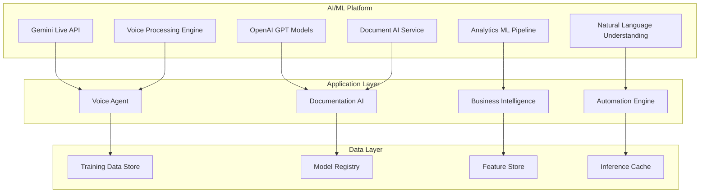
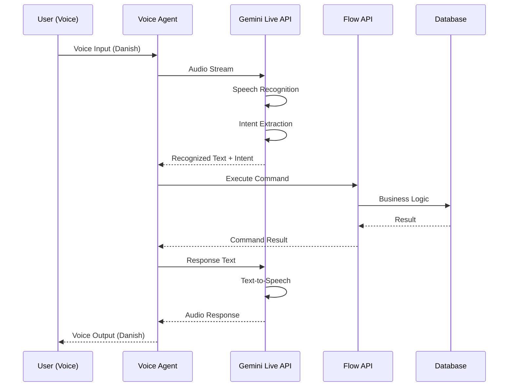
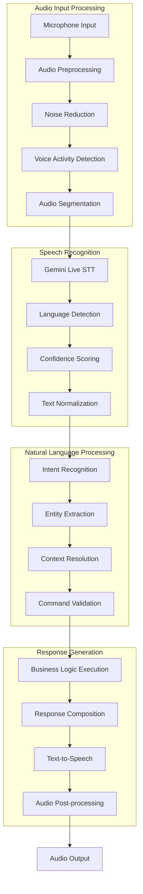
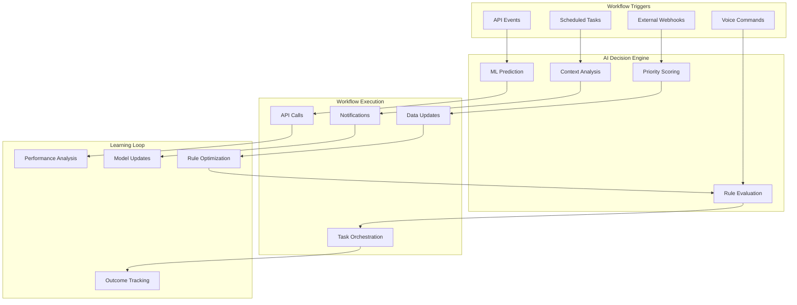

# AI/ML Integration Architecture

## Executive Summary

This whitepaper details the AI/ML integration architecture within the TekUp platform, focusing on the comprehensive implementation of artificial intelligence and machine learning capabilities. The document covers the Gemini Live API integration patterns, voice processing pipeline, natural language understanding, AI-powered automation workflows, and machine learning model documentation and training procedures.

## AI/ML Architecture Overview

### Core AI Components



### AI Integration Principles

1. **Multi-Modal AI**: Support for text, voice, and document processing
2. **Real-time Processing**: Low-latency AI responses for interactive features
3. **Context Awareness**: Maintain conversation and business context
4. **Scalable Architecture**: Handle growing AI workloads efficiently
5. **Privacy by Design**: Ensure data privacy in AI processing
6. **Continuous Learning**: Improve models based on usage patterns

## Gemini Live API Integration

### Real-time Voice Processing Architecture

The Gemini Live API serves as the primary voice processing engine, providing real-time speech-to-text, natural language understanding, and text-to-speech capabilities with Danish language support.



### Gemini Live Service Implementation

```typescript
// Core Gemini Live integration service
@Injectable()
export class GeminiLiveService {
  private readonly logger = new Logger(GeminiLiveService.name);
  private activeConnections = new Map<string, GeminiLiveConnection>();

  constructor(
    private configService: ConfigService,
    private metricsService: MetricsService,
    private tenantService: TenantContextService
  ) {}

  async createVoiceSession(
    tenantId: string,
    userId: string,
    language: 'da-DK' | 'en-US' = 'da-DK'
  ): Promise<VoiceSession> {
    const sessionId = this.generateSessionId();
    
    const connection = new GeminiLiveConnection({
      apiKey: this.configService.get('GEMINI_API_KEY'),
      model: 'gemini-live-v1.5',
      language,
      sessionId,
      tenantContext: await this.tenantService.getTenant(tenantId)
    });

    // Configure session parameters
    await connection.configure({
      voiceSettings: {
        language,
        voice: language === 'da-DK' ? 'da-DK-WaveNet-A' : 'en-US-WaveNet-D',
        speakingRate: 1.0,
        pitch: 0.0,
        volumeGainDb: 0.0
      },
      recognitionSettings: {
        language,
        model: 'latest_long',
        useEnhanced: true,
        enableAutomaticPunctuation: true,
        enableWordTimeOffsets: true,
        enableWordConfidence: true
      },
      conversationSettings: {
        maxTurns: 50,
        contextWindow: 4000,
        temperature: 0.7,
        topP: 0.9
      }
    });

    // Set up event handlers
    this.setupConnectionHandlers(connection, tenantId, userId);
    
    // Store active connection
    this.activeConnections.set(sessionId, connection);
    
    // Record metrics
    this.metricsService.recordVoiceSessionStarted(tenantId, language);
    
    return {
      sessionId,
      connection,
      tenantId,
      userId,
      language,
      createdAt: new Date()
    };
  } 
 private setupConnectionHandlers(
    connection: GeminiLiveConnection,
    tenantId: string,
    userId: string
  ): void {
    // Handle speech recognition results
    connection.on('speech_recognized', async (event: SpeechRecognizedEvent) => {
      try {
        const { text, confidence, isFinal } = event;
        
        if (isFinal && confidence > 0.8) {
          await this.processVoiceCommand(tenantId, userId, text, connection);
        }
        
        // Record metrics
        this.metricsService.recordSpeechRecognition(
          tenantId,
          confidence,
          isFinal ? 'final' : 'interim'
        );
      } catch (error) {
        this.logger.error('Error processing speech recognition:', error);
        await this.handleVoiceError(connection, 'speech_recognition_error', error);
      }
    });

    // Handle conversation turns
    connection.on('conversation_turn', async (event: ConversationTurnEvent) => {
      const { turnId, userInput, assistantResponse } = event;
      
      // Store conversation history
      await this.storeConversationTurn(tenantId, userId, {
        turnId,
        userInput,
        assistantResponse,
        timestamp: new Date()
      });
    });

    // Handle connection errors
    connection.on('error', async (error: GeminiLiveError) => {
      this.logger.error('Gemini Live connection error:', error);
      await this.handleVoiceError(connection, 'connection_error', error);
      
      // Record error metrics
      this.metricsService.recordVoiceError(tenantId, error.type, error.message);
    });

    // Handle connection close
    connection.on('close', (event: ConnectionCloseEvent) => {
      this.logger.log(`Voice session closed: ${event.sessionId}`);
      this.activeConnections.delete(event.sessionId);
      
      // Record session metrics
      this.metricsService.recordVoiceSessionEnded(
        tenantId,
        event.duration,
        event.reason
      );
    });
  }

  private async processVoiceCommand(
    tenantId: string,
    userId: string,
    command: string,
    connection: GeminiLiveConnection
  ): Promise<void> {
    const startTime = Date.now();
    
    try {
      // Extract intent and entities
      const analysis = await this.analyzeVoiceCommand(command, tenantId);
      
      // Execute business logic
      const result = await this.executeVoiceCommand(
        tenantId,
        userId,
        analysis.intent,
        analysis.entities
      );
      
      // Generate response
      const response = await this.generateVoiceResponse(
        result,
        analysis.intent,
        connection.language
      );
      
      // Send audio response
      await connection.speak(response.text, response.audioSettings);
      
      // Record successful command
      this.metricsService.recordVoiceCommand(
        tenantId,
        analysis.intent,
        'success',
        Date.now() - startTime
      );
      
    } catch (error) {
      this.logger.error('Error processing voice command:', error);
      
      // Generate error response
      const errorResponse = await this.generateErrorResponse(
        error,
        connection.language
      );
      
      await connection.speak(errorResponse.text);
      
      // Record failed command
      this.metricsService.recordVoiceCommand(
        tenantId,
        'unknown',
        'error',
        Date.now() - startTime
      );
    }
  }
}
```

### Voice Command Analysis and Intent Recognition

```typescript
// Advanced voice command analysis service
@Injectable()
export class VoiceCommandAnalysisService {
  constructor(
    private openaiService: OpenAIService,
    private tenantService: TenantContextService
  ) {}

  async analyzeVoiceCommand(
    command: string,
    tenantId: string
  ): Promise<VoiceCommandAnalysis> {
    const tenant = await this.tenantService.getTenant(tenantId);
    
    // Create context-aware prompt
    const analysisPrompt = this.buildAnalysisPrompt(command, tenant);
    
    const response = await this.openaiService.createCompletion({
      model: 'gpt-4',
      messages: [
        {
          role: 'system',
          content: `You are a Danish business assistant AI that analyzes voice commands for a CRM system. 
                   Extract the intent and entities from user commands in Danish or English.
                   Respond with structured JSON containing intent, entities, confidence, and language.`
        },
        {
          role: 'user',
          content: analysisPrompt
        }
      ],
      temperature: 0.1,
      max_tokens: 500
    });

    const analysis = JSON.parse(response.choices[0].message.content);
    
    return {
      originalCommand: command,
      intent: analysis.intent,
      entities: analysis.entities,
      confidence: analysis.confidence,
      language: analysis.language,
      suggestedActions: analysis.suggestedActions || []
    };
  }

  private buildAnalysisPrompt(command: string, tenant: TenantContext): string {
    return `
Analyze this voice command: "${command}"

Business Context:
- Tenant: ${tenant.name}
- Available features: ${Object.keys(tenant.features).join(', ')}
- User capabilities: CRM management, lead tracking, voice commands

Common Intents:
- get_leads: Retrieve lead information
- create_lead: Create new lead
- update_lead: Update existing lead
- get_statistics: Get business statistics
- search_leads: Search for specific leads
- schedule_task: Schedule follow-up tasks
- get_help: Request assistance

Extract:
1. Intent (one of the above or "unknown")
2. Entities (names, dates, statuses, etc.)
3. Confidence (0.0-1.0)
4. Language (da-DK or en-US)
5. Suggested actions

Respond in JSON format.
    `;
  }
}
```

## Voice Processing Pipeline

### Audio Processing Architecture



### Audio Quality Optimization

```typescript
// Audio processing and optimization service
@Injectable()
export class AudioProcessingService {
  private readonly audioConfig = {
    sampleRate: 16000,
    channels: 1,
    bitDepth: 16,
    encoding: 'LINEAR16'
  };

  constructor(private logger: Logger) {}

  async preprocessAudio(audioBuffer: Buffer): Promise<ProcessedAudio> {
    const startTime = Date.now();
    
    try {
      // Convert to required format
      const convertedAudio = await this.convertAudioFormat(audioBuffer);
      
      // Apply noise reduction
      const denoisedAudio = await this.reduceNoise(convertedAudio);
      
      // Normalize volume
      const normalizedAudio = await this.normalizeVolume(denoisedAudio);
      
      // Detect voice activity
      const voiceSegments = await this.detectVoiceActivity(normalizedAudio);
      
      const processingTime = Date.now() - startTime;
      
      return {
        processedBuffer: normalizedAudio,
        voiceSegments,
        audioMetrics: {
          originalSize: audioBuffer.length,
          processedSize: normalizedAudio.length,
          processingTime,
          voiceActivityRatio: this.calculateVoiceActivityRatio(voiceSegments),
          signalToNoiseRatio: await this.calculateSNR(normalizedAudio)
        }
      };
    } catch (error) {
      this.logger.error('Audio preprocessing failed:', error);
      throw new AudioProcessingError('Failed to preprocess audio', error);
    }
  }

  private async convertAudioFormat(audioBuffer: Buffer): Promise<Buffer> {
    // Use FFmpeg or similar for audio format conversion
    // Implementation would depend on the audio processing library
    return audioBuffer; // Placeholder
  }

  private async reduceNoise(audioBuffer: Buffer): Promise<Buffer> {
    // Implement noise reduction algorithm
    // Could use spectral subtraction or Wiener filtering
    return audioBuffer; // Placeholder
  }

  private async normalizeVolume(audioBuffer: Buffer): Promise<Buffer> {
    // Implement volume normalization
    // Adjust audio levels to optimal range
    return audioBuffer; // Placeholder
  }

  private async detectVoiceActivity(audioBuffer: Buffer): Promise<VoiceSegment[]> {
    // Implement Voice Activity Detection (VAD)
    // Return segments where voice is detected
    return []; // Placeholder
  }

  private calculateVoiceActivityRatio(segments: VoiceSegment[]): number {
    const totalVoiceTime = segments.reduce((sum, segment) => 
      sum + (segment.endTime - segment.startTime), 0);
    const totalTime = segments.length > 0 ? 
      segments[segments.length - 1].endTime : 0;
    
    return totalTime > 0 ? totalVoiceTime / totalTime : 0;
  }

  private async calculateSNR(audioBuffer: Buffer): Promise<number> {
    // Calculate Signal-to-Noise Ratio
    // Implementation would analyze audio signal characteristics
    return 20; // Placeholder - typical good SNR value
  }
}
```

## Natural Language Understanding

### Danish Language Processing

```typescript
// Danish-specific NLU service
@Injectable()
export class DanishNLUService {
  private readonly danishPatterns = {
    // Common Danish business terms
    leads: ['leads', 'kundeemner', 'potentielle kunder', 'prospects'],
    create: ['opret', 'lav', 'tilføj', 'ny', 'create'],
    update: ['opdater', 'ændre', 'rediger', 'modify', 'update'],
    delete: ['slet', 'fjern', 'delete', 'remove'],
    search: ['søg', 'find', 'search', 'look for'],
    status: ['status', 'tilstand', 'state'],
    statistics: ['statistik', 'stats', 'tal', 'numbers', 'statistics']
  };

  private readonly danishEntityPatterns = {
    // Danish name patterns
    names: /\b[A-ZÆØÅ][a-zæøå]+(?:\s+[A-ZÆØÅ][a-zæøå]+)*\b/g,
    // Danish phone numbers
    phones: /(?:\+45\s?)?(?:\d{2}\s?\d{2}\s?\d{2}\s?\d{2}|\d{8})/g,
    // Danish email patterns
    emails: /[a-zA-Z0-9._%+-]+@[a-zA-Z0-9.-]+\.[a-zA-Z]{2,}/g,
    // Danish dates
    dates: /\b(?:\d{1,2}[\.\/]\d{1,2}[\.\/]\d{2,4}|i\s?dag|i\s?morgen|i\s?går)\b/gi
  };

  async processCommand(command: string): Promise<DanishNLUResult> {
    const normalizedCommand = this.normalizeCommand(command);
    
    // Extract intent
    const intent = this.extractIntent(normalizedCommand);
    
    // Extract entities
    const entities = this.extractEntities(normalizedCommand);
    
    // Resolve Danish-specific context
    const context = await this.resolveDanishContext(normalizedCommand, entities);
    
    return {
      originalCommand: command,
      normalizedCommand,
      intent,
      entities,
      context,
      confidence: this.calculateConfidence(intent, entities),
      language: 'da-DK'
    };
  }

  private normalizeCommand(command: string): string {
    return command
      .toLowerCase()
      .trim()
      // Normalize Danish characters
      .replace(/å/g, 'aa')
      .replace(/æ/g, 'ae')
      .replace(/ø/g, 'oe')
      // Remove filler words
      .replace(/\b(øh|uhm|altså|ikke|vel)\b/g, '')
      .replace(/\s+/g, ' ');
  }

  private extractIntent(command: string): string {
    for (const [intent, patterns] of Object.entries(this.danishPatterns)) {
      for (const pattern of patterns) {
        if (command.includes(pattern)) {
          return intent;
        }
      }
    }
    
    // Fallback to ML-based intent recognition
    return this.mlIntentRecognition(command);
  }

  private extractEntities(command: string): DanishEntity[] {
    const entities: DanishEntity[] = [];
    
    // Extract names
    const names = command.match(this.danishEntityPatterns.names);
    if (names) {
      entities.push(...names.map(name => ({
        type: 'person_name',
        value: name,
        confidence: 0.9
      })));
    }
    
    // Extract phone numbers
    const phones = command.match(this.danishEntityPatterns.phones);
    if (phones) {
      entities.push(...phones.map(phone => ({
        type: 'phone_number',
        value: this.normalizeDanishPhone(phone),
        confidence: 0.95
      })));
    }
    
    // Extract emails
    const emails = command.match(this.danishEntityPatterns.emails);
    if (emails) {
      entities.push(...emails.map(email => ({
        type: 'email',
        value: email.toLowerCase(),
        confidence: 0.98
      })));
    }
    
    // Extract dates
    const dates = command.match(this.danishEntityPatterns.dates);
    if (dates) {
      entities.push(...dates.map(date => ({
        type: 'date',
        value: this.parseDanishDate(date),
        confidence: 0.85
      })));
    }
    
    return entities;
  }

  private normalizeDanishPhone(phone: string): string {
    // Normalize Danish phone number format
    const cleaned = phone.replace(/\s/g, '');
    if (cleaned.startsWith('+45')) {
      return cleaned;
    }
    if (cleaned.length === 8) {
      return `+45${cleaned}`;
    }
    return phone;
  }

  private parseDanishDate(dateStr: string): string {
    const today = new Date();
    
    switch (dateStr.toLowerCase()) {
      case 'i dag':
        return today.toISOString().split('T')[0];
      case 'i morgen':
        const tomorrow = new Date(today);
        tomorrow.setDate(today.getDate() + 1);
        return tomorrow.toISOString().split('T')[0];
      case 'i går':
        const yesterday = new Date(today);
        yesterday.setDate(today.getDate() - 1);
        return yesterday.toISOString().split('T')[0];
      default:
        // Parse DD/MM/YYYY or DD.MM.YYYY format
        const parts = dateStr.split(/[\.\/]/);
        if (parts.length === 3) {
          const [day, month, year] = parts;
          return `${year.padStart(4, '20')}-${month.padStart(2, '0')}-${day.padStart(2, '0')}`;
        }
        return dateStr;
    }
  }

  private async resolveDanishContext(
    command: string,
    entities: DanishEntity[]
  ): Promise<DanishContext> {
    return {
      businessTerms: this.identifyBusinessTerms(command),
      culturalContext: this.identifyCulturalContext(command),
      formalityLevel: this.assessFormalityLevel(command),
      regionalVariant: this.identifyRegionalVariant(command)
    };
  }

  private mlIntentRecognition(command: string): string {
    // Placeholder for ML-based intent recognition
    // Would use a trained model for Danish intent classification
    return 'unknown';
  }
}
```

## AI-Powered Automation and Workflows

### Intelligent Workflow Engine



### Automated Lead Processing

```typescript
// AI-powered lead processing automation
@Injectable()
export class LeadAutomationService {
  constructor(
    private openaiService: OpenAIService,
    private leadService: LeadService,
    private notificationService: NotificationService,
    private workflowEngine: WorkflowEngine
  ) {}

  async processNewLead(lead: Lead, tenantId: string): Promise<AutomationResult> {
    const automationSteps: AutomationStep[] = [];
    
    try {
      // 1. AI-powered lead scoring
      const leadScore = await this.calculateLeadScore(lead);
      automationSteps.push({
        step: 'lead_scoring',
        status: 'completed',
        result: { score: leadScore.score, factors: leadScore.factors }
      });
      
      // 2. Intelligent lead categorization
      const category = await this.categorizeLeadWithAI(lead);
      automationSteps.push({
        step: 'categorization',
        status: 'completed',
        result: { category: category.category, confidence: category.confidence }
      });
      
      // 3. Automated lead enrichment
      const enrichedData = await this.enrichLeadData(lead);
      automationSteps.push({
        step: 'data_enrichment',
        status: 'completed',
        result: enrichedData
      });
      
      // 4. Intelligent assignment
      const assignment = await this.intelligentLeadAssignment(lead, tenantId);
      automationSteps.push({
        step: 'assignment',
        status: 'completed',
        result: assignment
      });
      
      // 5. Automated follow-up scheduling
      const followUp = await this.scheduleIntelligentFollowUp(lead, leadScore);
      automationSteps.push({
        step: 'follow_up_scheduling',
        status: 'completed',
        result: followUp
      });
      
      // 6. Update lead with AI insights
      await this.leadService.update(lead.id, {
        aiScore: leadScore.score,
        category: category.category,
        assignedTo: assignment.userId,
        nextFollowUp: followUp.scheduledDate,
        aiInsights: {
          scoringFactors: leadScore.factors,
          categoryConfidence: category.confidence,
          enrichmentData: enrichedData,
          automationTimestamp: new Date()
        }
      });
      
      return {
        success: true,
        leadId: lead.id,
        automationSteps,
        totalProcessingTime: Date.now() - Date.now(), // Calculate actual time
        aiInsights: {
          score: leadScore.score,
          category: category.category,
          assignedTo: assignment.userId
        }
      };
      
    } catch (error) {
      return {
        success: false,
        leadId: lead.id,
        automationSteps,
        error: error.message
      };
    }
  }

  private async calculateLeadScore(lead: Lead): Promise<LeadScoringResult> {
    const prompt = `
Analyze this lead and provide a score from 0-100 based on conversion likelihood:

Lead Information:
- Name: ${lead.name}
- Email: ${lead.email || 'Not provided'}
- Company: ${lead.company || 'Not provided'}
- Phone: ${lead.phone || 'Not provided'}
- Source: ${lead.source || 'Unknown'}
- Initial Message: ${lead.notes || 'None'}

Consider factors like:
- Contact completeness
- Company information quality
- Source credibility
- Message quality and intent
- Email domain professionalism

Respond with JSON containing:
- score (0-100)
- factors (array of scoring factors with weights)
- reasoning (brief explanation)
    `;

    const response = await this.openaiService.createCompletion({
      model: 'gpt-4',
      messages: [
        {
          role: 'system',
          content: 'You are a lead scoring expert. Analyze leads and provide accurate scoring based on conversion probability.'
        },
        { role: 'user', content: prompt }
      ],
      temperature: 0.1
    });

    return JSON.parse(response.choices[0].message.content);
  }

  private async categorizeLeadWithAI(lead: Lead): Promise<LeadCategorizationResult> {
    const categories = [
      'Enterprise', 'SMB', 'Startup', 'Individual', 'Government', 'Non-profit'
    ];

    const prompt = `
Categorize this lead into one of these categories: ${categories.join(', ')}

Lead Information:
- Name: ${lead.name}
- Email: ${lead.email || 'Not provided'}
- Company: ${lead.company || 'Not provided'}
- Phone: ${lead.phone || 'Not provided'}
- Source: ${lead.source || 'Unknown'}
- Message: ${lead.notes || 'None'}

Respond with JSON containing:
- category (one of the categories above)
- confidence (0.0-1.0)
- reasoning (brief explanation)
    `;

    const response = await this.openaiService.createCompletion({
      model: 'gpt-4',
      messages: [
        {
          role: 'system',
          content: 'You are a lead categorization expert. Categorize leads accurately based on available information.'
        },
        { role: 'user', content: prompt }
      ],
      temperature: 0.1
    });

    return JSON.parse(response.choices[0].message.content);
  }

  private async enrichLeadData(lead: Lead): Promise<LeadEnrichmentData> {
    const enrichmentData: LeadEnrichmentData = {};

    // Company information enrichment
    if (lead.company) {
      enrichmentData.companyInfo = await this.enrichCompanyData(lead.company);
    }

    // Email domain analysis
    if (lead.email) {
      enrichmentData.emailAnalysis = await this.analyzeEmailDomain(lead.email);
    }

    // Phone number analysis
    if (lead.phone) {
      enrichmentData.phoneAnalysis = await this.analyzePhoneNumber(lead.phone);
    }

    return enrichmentData;
  }

  private async intelligentLeadAssignment(
    lead: Lead,
    tenantId: string
  ): Promise<LeadAssignmentResult> {
    // Get available users for the tenant
    const availableUsers = await this.getAvailableUsers(tenantId);
    
    // Calculate assignment scores based on:
    // - User workload
    // - User expertise
    // - Lead characteristics
    // - Historical performance
    
    const assignmentScores = await Promise.all(
      availableUsers.map(user => this.calculateAssignmentScore(user, lead))
    );

    // Select best assignment
    const bestAssignment = assignmentScores.reduce((best, current) =>
      current.score > best.score ? current : best
    );

    return {
      userId: bestAssignment.userId,
      userName: bestAssignment.userName,
      score: bestAssignment.score,
      reasoning: bestAssignment.reasoning
    };
  }

  private async scheduleIntelligentFollowUp(
    lead: Lead,
    leadScore: LeadScoringResult
  ): Promise<FollowUpSchedulingResult> {
    // Determine optimal follow-up timing based on:
    // - Lead score
    // - Lead source
    // - Historical data
    // - Business hours
    
    let followUpHours = 24; // Default 24 hours
    
    if (leadScore.score > 80) {
      followUpHours = 2; // High-value leads get immediate attention
    } else if (leadScore.score > 60) {
      followUpHours = 8; // Medium-value leads within business day
    } else if (leadScore.score > 40) {
      followUpHours = 24; // Low-medium value leads next day
    } else {
      followUpHours = 72; // Low-value leads after 3 days
    }

    const scheduledDate = new Date();
    scheduledDate.setHours(scheduledDate.getHours() + followUpHours);

    return {
      scheduledDate,
      followUpType: this.determineFollowUpType(leadScore.score),
      priority: this.determinePriority(leadScore.score),
      reasoning: `Scheduled based on lead score of ${leadScore.score}`
    };
  }
}
```

## Machine Learning Model Documentation

### Model Registry and Versioning

```typescript
// ML Model management and versioning system
@Injectable()
export class MLModelService {
  private readonly modelRegistry = new Map<string, MLModel>();
  
  constructor(
    private storageService: StorageService,
    private metricsService: MetricsService,
    private logger: Logger
  ) {}

  async registerModel(modelConfig: MLModelConfig): Promise<MLModel> {
    const model: MLModel = {
      id: this.generateModelId(),
      name: modelConfig.name,
      version: modelConfig.version,
      type: modelConfig.type,
      framework: modelConfig.framework,
      createdAt: new Date(),
      status: 'registered',
      metadata: {
        description: modelConfig.description,
        author: modelConfig.author,
        tags: modelConfig.tags || [],
        parameters: modelConfig.parameters,
        metrics: modelConfig.metrics,
        trainingData: modelConfig.trainingData
      },
      deployment: {
        environment: 'none',
        endpoint: null,
        scalingConfig: null
      }
    };

    // Store model artifacts
    if (modelConfig.artifacts) {
      model.artifactPath = await this.storeModelArtifacts(
        model.id,
        modelConfig.artifacts
      );
    }

    // Register in model registry
    this.modelRegistry.set(model.id, model);
    
    // Log model registration
    this.logger.log(`Model registered: ${model.name} v${model.version}`);
    
    return model;
  }

  async deployModel(
    modelId: string,
    environment: 'development' | 'staging' | 'production',
    scalingConfig?: ModelScalingConfig
  ): Promise<ModelDeployment> {
    const model = this.modelRegistry.get(modelId);
    if (!model) {
      throw new Error(`Model not found: ${modelId}`);
    }

    // Create deployment configuration
    const deployment: ModelDeployment = {
      id: this.generateDeploymentId(),
      modelId,
      environment,
      endpoint: this.generateModelEndpoint(model, environment),
      status: 'deploying',
      createdAt: new Date(),
      scalingConfig: scalingConfig || this.getDefaultScalingConfig(),
      healthCheck: {
        enabled: true,
        interval: 30000,
        timeout: 5000,
        retries: 3
      }
    };

    try {
      // Deploy model to inference service
      await this.deployToInferenceService(model, deployment);
      
      // Update deployment status
      deployment.status = 'deployed';
      deployment.deployedAt = new Date();
      
      // Update model registry
      model.deployment = deployment;
      model.status = 'deployed';
      
      // Start health monitoring
      this.startHealthMonitoring(deployment);
      
      this.logger.log(`Model deployed: ${model.name} to ${environment}`);
      
      return deployment;
      
    } catch (error) {
      deployment.status = 'failed';
      deployment.error = error.message;
      
      this.logger.error(`Model deployment failed: ${error.message}`);
      throw error;
    }
  }

  async getModelPerformance(modelId: string): Promise<ModelPerformance> {
    const model = this.modelRegistry.get(modelId);
    if (!model) {
      throw new Error(`Model not found: ${modelId}`);
    }

    // Collect performance metrics
    const metrics = await this.collectModelMetrics(modelId);
    
    return {
      modelId,
      modelName: model.name,
      version: model.version,
      environment: model.deployment.environment,
      metrics: {
        accuracy: metrics.accuracy,
        precision: metrics.precision,
        recall: metrics.recall,
        f1Score: metrics.f1Score,
        latency: {
          p50: metrics.latency.p50,
          p95: metrics.latency.p95,
          p99: metrics.latency.p99
        },
        throughput: metrics.throughput,
        errorRate: metrics.errorRate
      },
      usage: {
        totalRequests: metrics.totalRequests,
        requestsPerSecond: metrics.requestsPerSecond,
        activeUsers: metrics.activeUsers
      },
      lastUpdated: new Date()
    };
  }
}
```

### Training Pipeline Documentation

```typescript
// ML Training pipeline management
@Injectable()
export class MLTrainingService {
  constructor(
    private dataService: DataService,
    private modelService: MLModelService,
    private storageService: StorageService
  ) {}

  async createTrainingPipeline(config: TrainingPipelineConfig): Promise<TrainingPipeline> {
    const pipeline: TrainingPipeline = {
      id: this.generatePipelineId(),
      name: config.name,
      modelType: config.modelType,
      status: 'created',
      createdAt: new Date(),
      config: {
        dataSource: config.dataSource,
        features: config.features,
        target: config.target,
        algorithm: config.algorithm,
        hyperparameters: config.hyperparameters,
        validationStrategy: config.validationStrategy,
        evaluationMetrics: config.evaluationMetrics
      },
      stages: [
        { name: 'data_preparation', status: 'pending' },
        { name: 'feature_engineering', status: 'pending' },
        { name: 'model_training', status: 'pending' },
        { name: 'model_evaluation', status: 'pending' },
        { name: 'model_validation', status: 'pending' }
      ]
    };

    return pipeline;
  }

  async executeTrainingPipeline(pipelineId: string): Promise<TrainingResult> {
    const pipeline = await this.getTrainingPipeline(pipelineId);
    const result: TrainingResult = {
      pipelineId,
      startTime: new Date(),
      stages: []
    };

    try {
      pipeline.status = 'running';
      
      // Stage 1: Data Preparation
      const dataPrep = await this.executeDataPreparation(pipeline);
      result.stages.push(dataPrep);
      
      // Stage 2: Feature Engineering
      const featureEng = await this.executeFeatureEngineering(pipeline, dataPrep.output);
      result.stages.push(featureEng);
      
      // Stage 3: Model Training
      const training = await this.executeModelTraining(pipeline, featureEng.output);
      result.stages.push(training);
      
      // Stage 4: Model Evaluation
      const evaluation = await this.executeModelEvaluation(pipeline, training.output);
      result.stages.push(evaluation);
      
      // Stage 5: Model Validation
      const validation = await this.executeModelValidation(pipeline, evaluation.output);
      result.stages.push(validation);
      
      // Register trained model
      const model = await this.modelService.registerModel({
        name: pipeline.name,
        version: this.generateModelVersion(),
        type: pipeline.modelType,
        framework: 'scikit-learn', // or appropriate framework
        description: `Model trained via pipeline ${pipeline.name}`,
        author: 'ML Training Service',
        parameters: training.output.parameters,
        metrics: evaluation.output.metrics,
        trainingData: {
          source: pipeline.config.dataSource,
          features: pipeline.config.features,
          samples: dataPrep.output.sampleCount,
          trainingDate: new Date()
        },
        artifacts: training.output.artifacts
      });
      
      result.endTime = new Date();
      result.success = true;
      result.modelId = model.id;
      pipeline.status = 'completed';
      
      return result;
      
    } catch (error) {
      result.endTime = new Date();
      result.success = false;
      result.error = error.message;
      pipeline.status = 'failed';
      
      throw error;
    }
  }

  private async executeDataPreparation(pipeline: TrainingPipeline): Promise<StageResult> {
    const startTime = Date.now();
    
    try {
      // Load data from source
      const rawData = await this.dataService.loadData(pipeline.config.dataSource);
      
      // Clean and preprocess data
      const cleanedData = await this.cleanData(rawData);
      
      // Split data into train/validation/test sets
      const dataSplits = await this.splitData(cleanedData, {
        trainRatio: 0.7,
        validationRatio: 0.15,
        testRatio: 0.15
      });
      
      return {
        stageName: 'data_preparation',
        status: 'completed',
        duration: Date.now() - startTime,
        output: {
          trainData: dataSplits.train,
          validationData: dataSplits.validation,
          testData: dataSplits.test,
          sampleCount: rawData.length,
          featureCount: Object.keys(rawData[0] || {}).length
        }
      };
      
    } catch (error) {
      return {
        stageName: 'data_preparation',
        status: 'failed',
        duration: Date.now() - startTime,
        error: error.message
      };
    }
  }

  private async executeFeatureEngineering(
    pipeline: TrainingPipeline,
    dataOutput: any
  ): Promise<StageResult> {
    const startTime = Date.now();
    
    try {
      // Apply feature transformations
      const transformedFeatures = await this.transformFeatures(
        dataOutput.trainData,
        pipeline.config.features
      );
      
      // Feature selection
      const selectedFeatures = await this.selectFeatures(
        transformedFeatures,
        pipeline.config.target
      );
      
      // Feature scaling/normalization
      const scaledFeatures = await this.scaleFeatures(selectedFeatures);
      
      return {
        stageName: 'feature_engineering',
        status: 'completed',
        duration: Date.now() - startTime,
        output: {
          features: scaledFeatures,
          featureNames: Object.keys(scaledFeatures[0] || {}),
          transformations: pipeline.config.features
        }
      };
      
    } catch (error) {
      return {
        stageName: 'feature_engineering',
        status: 'failed',
        duration: Date.now() - startTime,
        error: error.message
      };
    }
  }
}
```

## Conclusion

The AI/ML integration architecture in TekUp provides a comprehensive foundation for intelligent automation, voice processing, and machine learning capabilities. Key achievements include:

### Core Capabilities
- **Real-time Voice Processing**: Gemini Live API integration with Danish language support
- **Natural Language Understanding**: Advanced NLU with Danish-specific processing
- **Intelligent Automation**: AI-powered lead processing and workflow automation
- **ML Model Management**: Comprehensive model registry and training pipelines

### Technical Excellence
- **Scalable Architecture**: Designed for high-throughput AI workloads
- **Multi-modal AI**: Support for text, voice, and document processing
- **Context Awareness**: Maintains business and conversation context
- **Performance Optimization**: Low-latency processing for real-time features

### Business Value
- **Enhanced User Experience**: Natural voice interactions in Danish
- **Automated Workflows**: Intelligent lead processing and assignment
- **Data-Driven Insights**: ML-powered analytics and predictions
- **Continuous Improvement**: Learning systems that adapt over time

The architecture positions TekUp as a truly AI-native platform that leverages cutting-edge AI/ML technologies to deliver superior user experiences and business outcomes.

---

**Document Version**: 1.0  
**Last Updated**: January 2025  
**Next Review**: July 2025  
**Maintained By**: TekUp AI/ML Team