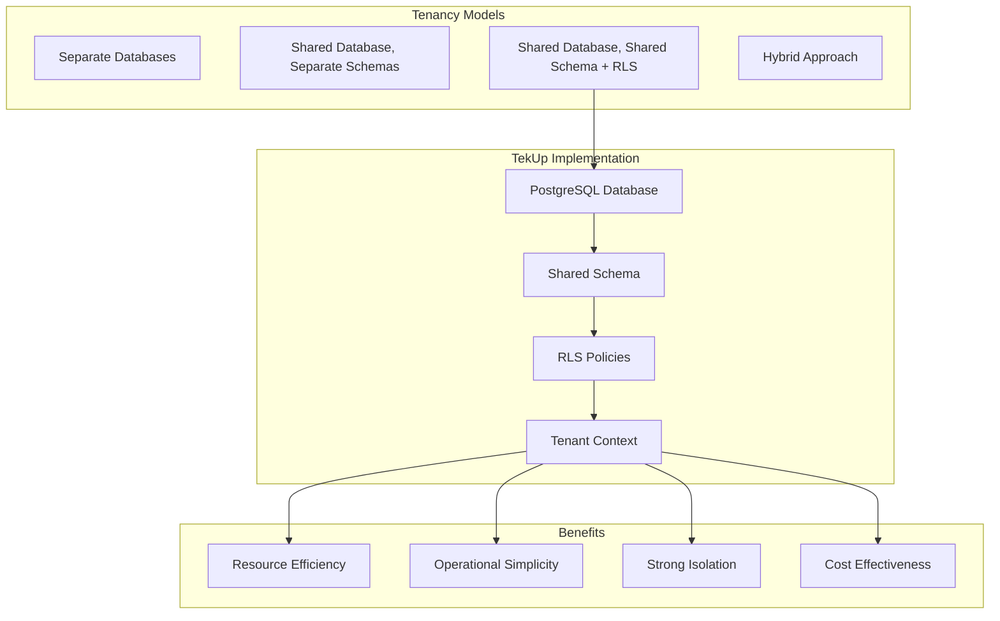

# Multi-tenant Architecture Patterns and RLS Implementation

## Executive Summary

This whitepaper details the multi-tenant architecture patterns implemented in the TekUp platform, with a focus on PostgreSQL Row Level Security (RLS) as the primary tenant isolation mechanism. The document covers design decisions, implementation patterns, performance considerations, and operational best practices for managing a secure, scalable multi-tenant SaaS platform.

## Multi-tenancy Overview

### Tenancy Models Comparison

TekUp implements a **shared database, shared schema** model with Row Level Security (RLS) for tenant isolation. This approach provides the optimal balance of resource efficiency, security, and operational simplicity.



### Tenant Isolation Strategy

#### Database-Level Isolation

```sql
-- Core tenant table
CREATE TABLE tenants (
    id UUID PRIMARY KEY DEFAULT gen_random_uuid(),
    name VARCHAR(255) NOT NULL,
    slug VARCHAR(100) UNIQUE NOT NULL,
    api_key VARCHAR(255) UNIQUE NOT NULL,
    created_at TIMESTAMP DEFAULT NOW(),
    updated_at TIMESTAMP DEFAULT NOW(),
    status VARCHAR(20) DEFAULT 'active',
    
    -- Feature flags and limits
    enabled_features JSONB DEFAULT '{}',
    resource_limits JSONB DEFAULT '{
        "max_users": 100,
        "max_leads": 10000,
        "max_storage_mb": 1000,
        "api_rate_limit": 1000
    }',
    
    -- Billing and subscription
    subscription_plan VARCHAR(50) DEFAULT 'basic',
    billing_email VARCHAR(255),
    
    -- Compliance and security
    data_retention_days INTEGER DEFAULT 365,
    encryption_key_id VARCHAR(255),
    compliance_requirements JSONB DEFAULT '[]'
);

-- Indexes for performance
CREATE INDEX idx_tenants_api_key ON tenants(api_key);
CREATE INDEX idx_tenants_slug ON tenants(slug);
CREATE INDEX idx_tenants_status ON tenants(status);
```

#### RLS Policy Implementation

```sql
-- Example tenant-scoped table
CREATE TABLE leads (
    id UUID PRIMARY KEY DEFAULT gen_random_uuid(),
    tenant_id UUID NOT NULL REFERENCES tenants(id) ON DELETE CASCADE,
    
    -- Business data
    name VARCHAR(255) NOT NULL,
    email VARCHAR(255),
    phone VARCHAR(50),
    company VARCHAR(255),
    status VARCHAR(50) DEFAULT 'NEW',
    source VARCHAR(100),
    
    -- Metadata
    created_at TIMESTAMP DEFAULT NOW(),
    updated_at TIMESTAMP DEFAULT NOW(),
    created_by UUID,
    assigned_to UUID,
    
    -- Custom fields
    custom_fields JSONB DEFAULT '{}',
    
    -- Audit trail
    version INTEGER DEFAULT 1,
    last_activity_at TIMESTAMP DEFAULT NOW()
);

-- Enable RLS
ALTER TABLE leads ENABLE ROW LEVEL SECURITY;

-- Create comprehensive RLS policies
CREATE POLICY tenant_isolation_select ON leads
    FOR SELECT TO authenticated
    USING (tenant_id = current_setting('app.current_tenant')::uuid);

CREATE POLICY tenant_isolation_insert ON leads
    FOR INSERT TO authenticated
    WITH CHECK (tenant_id = current_setting('app.current_tenant')::uuid);

CREATE POLICY tenant_isolation_update ON leads
    FOR UPDATE TO authenticated
    USING (tenant_id = current_setting('app.current_tenant')::uuid)
    WITH CHECK (tenant_id = current_setting('app.current_tenant')::uuid);

CREATE POLICY tenant_isolation_delete ON leads
    FOR DELETE TO authenticated
    USING (tenant_id = current_setting('app.current_tenant')::uuid);

-- Performance indexes
CREATE INDEX idx_leads_tenant_id ON leads(tenant_id);
CREATE INDEX idx_leads_tenant_status ON leads(tenant_id, status);
CREATE INDEX idx_leads_tenant_created ON leads(tenant_id, created_at DESC);
CREATE INDEX idx_leads_tenant_email ON leads(tenant_id, email) WHERE email IS NOT NULL;
```

#### Advanced RLS Patterns

```sql
-- Role-based access within tenants
CREATE TABLE tenant_users (
    id UUID PRIMARY KEY DEFAULT gen_random_uuid(),
    tenant_id UUID NOT NULL REFERENCES tenants(id) ON DELETE CASCADE,
    user_id UUID NOT NULL,
    role VARCHAR(50) NOT NULL DEFAULT 'user',
    permissions JSONB DEFAULT '[]',
    created_at TIMESTAMP DEFAULT NOW(),
    
    UNIQUE(tenant_id, user_id)
);

-- RLS policy with role-based access
CREATE POLICY tenant_user_role_access ON leads
    FOR ALL TO authenticated
    USING (
        tenant_id = current_setting('app.current_tenant')::uuid
        AND (
            -- Admin can access all leads
            EXISTS (
                SELECT 1 FROM tenant_users tu 
                WHERE tu.tenant_id = leads.tenant_id 
                AND tu.user_id = current_setting('app.current_user')::uuid
                AND tu.role = 'admin'
            )
            OR
            -- Users can only access their assigned leads
            assigned_to = current_setting('app.current_user')::uuid
            OR
            -- Users can access leads they created
            created_by = current_setting('app.current_user')::uuid
        )
    );
```

## Application-Level Tenant Management

### Tenant Context Service

```typescript
import { Injectable, UnauthorizedException } from '@nestjs/common';
import { PrismaService } from './prisma.service';

export interface TenantContext {
  tenantId: string;
  name: string;
  slug: string;
  features: Record<string, boolean>;
  limits: {
    maxUsers: number;
    maxLeads: number;
    maxStorageMb: number;
    apiRateLimit: number;
  };
  subscription: {
    plan: string;
    status: string;
    expiresAt?: Date;
  };
}

@Injectable()
export class TenantContextService {
  constructor(private prisma: PrismaService) {}

  async resolveTenantFromApiKey(apiKey: string): Promise<TenantContext> {
    const tenant = await this.prisma.tenant.findUnique({
      where: { 
        apiKey,
        status: 'active'
      },
      select: {
        id: true,
        name: true,
        slug: true,
        enabledFeatures: true,
        resourceLimits: true,
        subscriptionPlan: true,
        // Don't select sensitive fields like api_key
      }
    });

    if (!tenant) {
      throw new UnauthorizedException('Invalid or inactive API key');
    }

    return {
      tenantId: tenant.id,
      name: tenant.name,
      slug: tenant.slug,
      features: tenant.enabledFeatures as Record<string, boolean>,
      limits: tenant.resourceLimits as any,
      subscription: {
        plan: tenant.subscriptionPlan,
        status: 'active' // This would come from billing system
      }
    };
  }

  async setDatabaseContext(tenantId: string, userId?: string): Promise<void> {
    // Set RLS context variables
    await this.prisma.$executeRaw`
      SELECT set_config('app.current_tenant', ${tenantId}, true)
    `;
    
    if (userId) {
      await this.prisma.$executeRaw`
        SELECT set_config('app.current_user', ${userId}, true)
      `;
    }
  }

  async validateTenantAccess(tenantId: string, resource: string): Promise<boolean> {
    const tenant = await this.prisma.tenant.findUnique({
      where: { id: tenantId },
      select: { 
        enabledFeatures: true,
        resourceLimits: true,
        status: true
      }
    });

    if (!tenant || tenant.status !== 'active') {
      return false;
    }

    // Check if feature is enabled
    const features = tenant.enabledFeatures as Record<string, boolean>;
    if (!features[resource]) {
      return false;
    }

    // Additional resource limit checks could go here
    return true;
  }
}
```

### Tenant Middleware

```typescript
import { Injectable, NestMiddleware, UnauthorizedException } from '@nestjs/common';
import { Request, Response, NextFunction } from 'express';
import { TenantContextService } from './tenant-context.service';

export interface TenantRequest extends Request {
  tenant: TenantContext;
}

@Injectable()
export class TenantMiddleware implements NestMiddleware {
  constructor(private tenantContextService: TenantContextService) {}

  async use(req: TenantRequest, res: Response, next: NextFunction) {
    try {
      // Extract API key from header
      const apiKey = req.headers['x-tenant-key'] as string;
      
      if (!apiKey) {
        throw new UnauthorizedException('Missing tenant API key');
      }

      // Resolve tenant context
      const tenant = await this.tenantContextService.resolveTenantFromApiKey(apiKey);
      
      // Set database context for RLS
      await this.tenantContextService.setDatabaseContext(tenant.tenantId);
      
      // Attach tenant to request
      req.tenant = tenant;
      
      // Set response headers for debugging
      res.setHeader('X-Tenant-ID', tenant.tenantId);
      res.setHeader('X-Tenant-Name', tenant.name);
      
      next();
    } catch (error) {
      throw new UnauthorizedException('Invalid tenant context');
    }
  }
}
```

### Tenant-Aware Repository Pattern

```typescript
import { Injectable } from '@nestjs/common';
import { PrismaService } from './prisma.service';
import { TenantContext } from './tenant-context.service';

export abstract class TenantAwareRepository<T> {
  constructor(protected prisma: PrismaService) {}

  protected getTenantId(): string {
    // This would be injected from request context
    return this.getCurrentTenantId();
  }

  protected abstract getCurrentTenantId(): string;
}

@Injectable()
export class LeadRepository extends TenantAwareRepository<Lead> {
  constructor(
    prisma: PrismaService,
    private tenantContext: TenantContext
  ) {
    super(prisma);
  }

  protected getCurrentTenantId(): string {
    return this.tenantContext.tenantId;
  }

  async findAll(filters?: LeadFilters): Promise<Lead[]> {
    // RLS automatically filters by tenant_id
    return this.prisma.lead.findMany({
      where: {
        // Additional filters
        ...filters,
        // tenant_id is automatically handled by RLS
      },
      orderBy: { createdAt: 'desc' }
    });
  }

  async create(data: CreateLeadDto): Promise<Lead> {
    return this.prisma.lead.create({
      data: {
        ...data,
        tenantId: this.getTenantId(), // Explicit tenant assignment
      }
    });
  }

  async findById(id: string): Promise<Lead | null> {
    // RLS ensures only tenant's leads are returned
    return this.prisma.lead.findUnique({
      where: { id }
    });
  }

  async update(id: string, data: UpdateLeadDto): Promise<Lead> {
    // RLS ensures only tenant's leads can be updated
    return this.prisma.lead.update({
      where: { id },
      data
    });
  }

  async delete(id: string): Promise<void> {
    // RLS ensures only tenant's leads can be deleted
    await this.prisma.lead.delete({
      where: { id }
    });
  }

  async getStatistics(): Promise<LeadStatistics> {
    const stats = await this.prisma.lead.groupBy({
      by: ['status'],
      _count: { status: true },
      // RLS automatically filters by tenant
    });

    return {
      total: stats.reduce((sum, stat) => sum + stat._count.status, 0),
      byStatus: stats.reduce((acc, stat) => {
        acc[stat.status] = stat._count.status;
        return acc;
      }, {} as Record<string, number>)
    };
  }
}
```

## Performance Optimization for Multi-tenant Systems

### Indexing Strategy

```sql
-- Tenant-first indexing strategy
-- Always include tenant_id as the first column in composite indexes

-- Primary tenant-based indexes
CREATE INDEX idx_leads_tenant_id ON leads(tenant_id);
CREATE INDEX idx_users_tenant_id ON users(tenant_id);
CREATE INDEX idx_activities_tenant_id ON activities(tenant_id);

-- Composite indexes for common queries
CREATE INDEX idx_leads_tenant_status_created ON leads(tenant_id, status, created_at DESC);
CREATE INDEX idx_leads_tenant_assigned_status ON leads(tenant_id, assigned_to, status);
CREATE INDEX idx_activities_tenant_lead_created ON activities(tenant_id, lead_id, created_at DESC);

-- Partial indexes for specific use cases
CREATE INDEX idx_leads_tenant_active ON leads(tenant_id, updated_at DESC) 
WHERE status IN ('NEW', 'CONTACTED', 'QUALIFIED');

CREATE INDEX idx_leads_tenant_email ON leads(tenant_id, email) 
WHERE email IS NOT NULL;

-- Functional indexes for JSON fields
CREATE INDEX idx_leads_tenant_custom_fields ON leads(tenant_id, (custom_fields->>'priority'))
WHERE custom_fields->>'priority' IS NOT NULL;
```

### Connection Pool Management

```typescript
// Database configuration for multi-tenant performance
export const databaseConfig = {
  development: {
    url: process.env.DATABASE_URL,
    pool: {
      min: 2,
      max: 10,
      acquireTimeoutMillis: 30000,
      createTimeoutMillis: 30000,
      destroyTimeoutMillis: 5000,
      idleTimeoutMillis: 30000,
      reapIntervalMillis: 1000,
      createRetryIntervalMillis: 200,
    }
  },
  production: {
    url: process.env.DATABASE_URL,
    pool: {
      min: 10,
      max: 50,
      acquireTimeoutMillis: 60000,
      createTimeoutMillis: 60000,
      destroyTimeoutMillis: 5000,
      idleTimeoutMillis: 300000,
      reapIntervalMillis: 1000,
      createRetryIntervalMillis: 200,
    },
    // Connection pooling with pgBouncer
    connectionString: process.env.DATABASE_URL + '?pgbouncer=true',
  }
};

// Tenant-aware connection management
@Injectable()
export class TenantAwarePrismaService extends PrismaService {
  private connectionCache = new Map<string, PrismaClient>();

  async getConnection(tenantId: string): Promise<PrismaClient> {
    // For high-scale scenarios, consider tenant-specific connections
    if (this.shouldUseDedicatedConnection(tenantId)) {
      if (!this.connectionCache.has(tenantId)) {
        const connection = new PrismaClient({
          datasources: {
            db: {
              url: this.getTenantSpecificUrl(tenantId)
            }
          }
        });
        this.connectionCache.set(tenantId, connection);
      }
      return this.connectionCache.get(tenantId)!;
    }

    // Default shared connection with RLS
    return this;
  }

  private shouldUseDedicatedConnection(tenantId: string): boolean {
    // Logic to determine if tenant needs dedicated connection
    // Based on size, plan, or performance requirements
    return false; // Default to shared connection
  }

  private getTenantSpecificUrl(tenantId: string): string {
    // For enterprise tenants, might use dedicated databases
    return process.env.DATABASE_URL!;
  }
}
```

### Query Optimization Patterns

```typescript
// Efficient tenant-aware queries
@Injectable()
export class OptimizedLeadService {
  constructor(private prisma: PrismaService) {}

  async getLeadsPaginated(
    tenantId: string,
    page: number = 1,
    limit: number = 20,
    filters?: LeadFilters
  ): Promise<PaginatedResult<Lead>> {
    // Set tenant context
    await this.prisma.$executeRaw`
      SELECT set_config('app.current_tenant', ${tenantId}, true)
    `;

    // Use cursor-based pagination for better performance
    const where = {
      ...filters,
      // tenant_id handled by RLS
    };

    const [leads, total] = await Promise.all([
      this.prisma.lead.findMany({
        where,
        orderBy: { createdAt: 'desc' },
        skip: (page - 1) * limit,
        take: limit,
        select: {
          id: true,
          name: true,
          email: true,
          status: true,
          createdAt: true,
          // Only select needed fields
        }
      }),
      this.prisma.lead.count({ where })
    ]);

    return {
      data: leads,
      pagination: {
        page,
        limit,
        total,
        pages: Math.ceil(total / limit)
      }
    };
  }

  async getLeadStatsByTenant(tenantId: string): Promise<LeadStats> {
    await this.prisma.$executeRaw`
      SELECT set_config('app.current_tenant', ${tenantId}, true)
    `;

    // Efficient aggregation query
    const stats = await this.prisma.$queryRaw<Array<{
      status: string;
      count: number;
      avg_days_in_status: number;
    }>>`
      SELECT 
        status,
        COUNT(*)::int as count,
        AVG(EXTRACT(days FROM (COALESCE(updated_at, NOW()) - created_at)))::int as avg_days_in_status
      FROM leads 
      WHERE tenant_id = ${tenantId}
      GROUP BY status
      ORDER BY count DESC
    `;

    return {
      totalLeads: stats.reduce((sum, s) => sum + s.count, 0),
      byStatus: stats.reduce((acc, s) => {
        acc[s.status] = {
          count: s.count,
          avgDaysInStatus: s.avg_days_in_status
        };
        return acc;
      }, {} as Record<string, { count: number; avgDaysInStatus: number }>)
    };
  }
}
```

## Security Considerations

### RLS Security Best Practices

```sql
-- Security-focused RLS policies
-- 1. Always use WITH CHECK for INSERT/UPDATE policies
CREATE POLICY secure_lead_insert ON leads
    FOR INSERT TO authenticated
    WITH CHECK (
        tenant_id = current_setting('app.current_tenant')::uuid
        AND tenant_id IS NOT NULL
        AND current_setting('app.current_tenant') IS NOT NULL
    );

-- 2. Prevent privilege escalation
CREATE POLICY prevent_tenant_escalation ON leads
    FOR UPDATE TO authenticated
    USING (tenant_id = current_setting('app.current_tenant')::uuid)
    WITH CHECK (
        tenant_id = current_setting('app.current_tenant')::uuid
        AND tenant_id = OLD.tenant_id  -- Prevent changing tenant_id
    );

-- 3. Audit trail with RLS
CREATE TABLE audit_logs (
    id UUID PRIMARY KEY DEFAULT gen_random_uuid(),
    tenant_id UUID NOT NULL REFERENCES tenants(id),
    table_name VARCHAR(100) NOT NULL,
    record_id UUID NOT NULL,
    action VARCHAR(20) NOT NULL,
    old_values JSONB,
    new_values JSONB,
    user_id UUID,
    ip_address INET,
    user_agent TEXT,
    created_at TIMESTAMP DEFAULT NOW()
);

ALTER TABLE audit_logs ENABLE ROW LEVEL SECURITY;

CREATE POLICY audit_tenant_isolation ON audit_logs
    FOR ALL TO authenticated
    USING (tenant_id = current_setting('app.current_tenant')::uuid);
```

### Application Security Measures

```typescript
// Secure tenant context validation
@Injectable()
export class SecurityService {
  constructor(
    private tenantService: TenantContextService,
    private auditService: AuditService
  ) {}

  async validateTenantOperation(
    tenantId: string,
    operation: string,
    resourceId?: string,
    userId?: string
  ): Promise<boolean> {
    try {
      // 1. Validate tenant exists and is active
      const tenant = await this.tenantService.getTenant(tenantId);
      if (!tenant || tenant.status !== 'active') {
        await this.auditService.logSecurityEvent({
          type: 'INVALID_TENANT_ACCESS',
          tenantId,
          operation,
          resourceId,
          userId,
          severity: 'HIGH'
        });
        return false;
      }

      // 2. Check feature access
      if (!tenant.features[operation]) {
        await this.auditService.logSecurityEvent({
          type: 'FEATURE_ACCESS_DENIED',
          tenantId,
          operation,
          userId,
          severity: 'MEDIUM'
        });
        return false;
      }

      // 3. Check rate limits
      const rateLimitOk = await this.checkRateLimit(tenantId, operation);
      if (!rateLimitOk) {
        await this.auditService.logSecurityEvent({
          type: 'RATE_LIMIT_EXCEEDED',
          tenantId,
          operation,
          userId,
          severity: 'MEDIUM'
        });
        return false;
      }

      // 4. Log successful access
      await this.auditService.logAccess({
        tenantId,
        operation,
        resourceId,
        userId,
        success: true
      });

      return true;
    } catch (error) {
      await this.auditService.logSecurityEvent({
        type: 'VALIDATION_ERROR',
        tenantId,
        operation,
        error: error.message,
        severity: 'HIGH'
      });
      return false;
    }
  }

  private async checkRateLimit(tenantId: string, operation: string): Promise<boolean> {
    // Implement rate limiting logic
    // Could use Redis for distributed rate limiting
    return true;
  }
}

// Secure API endpoint decorator
export function TenantSecure(operation: string) {
  return function (target: any, propertyName: string, descriptor: PropertyDescriptor) {
    const method = descriptor.value;
    
    descriptor.value = async function (...args: any[]) {
      const request = args.find(arg => arg && arg.tenant);
      if (!request || !request.tenant) {
        throw new UnauthorizedException('Missing tenant context');
      }

      const securityService = this.securityService as SecurityService;
      const isValid = await securityService.validateTenantOperation(
        request.tenant.tenantId,
        operation,
        args[0]?.id, // resourceId if available
        request.user?.id // userId if available
      );

      if (!isValid) {
        throw new ForbiddenException('Operation not allowed for tenant');
      }

      return method.apply(this, args);
    };
  };
}

// Usage example
@Controller('leads')
export class LeadController {
  constructor(
    private leadService: LeadService,
    private securityService: SecurityService
  ) {}

  @Get()
  @TenantSecure('lead:read')
  async getLeads(@Req() req: TenantRequest): Promise<Lead[]> {
    return this.leadService.findAll(req.tenant.tenantId);
  }

  @Post()
  @TenantSecure('lead:create')
  async createLead(
    @Req() req: TenantRequest,
    @Body() createLeadDto: CreateLeadDto
  ): Promise<Lead> {
    return this.leadService.create(req.tenant.tenantId, createLeadDto);
  }
}
```

## Monitoring and Observability

### Tenant-Aware Metrics

```typescript
// Tenant-specific metrics collection
@Injectable()
export class TenantMetricsService {
  private readonly metrics = {
    // Request metrics by tenant
    requestsTotal: new Counter({
      name: 'tenant_requests_total',
      help: 'Total requests by tenant',
      labelNames: ['tenant_id', 'tenant_name', 'method', 'endpoint', 'status']
    }),

    // Response time by tenant
    requestDuration: new Histogram({
      name: 'tenant_request_duration_seconds',
      help: 'Request duration by tenant',
      labelNames: ['tenant_id', 'tenant_name', 'method', 'endpoint'],
      buckets: [0.1, 0.5, 1, 2, 5, 10]
    }),

    // Database query metrics by tenant
    dbQueryDuration: new Histogram({
      name: 'tenant_db_query_duration_seconds',
      help: 'Database query duration by tenant',
      labelNames: ['tenant_id', 'operation', 'table'],
      buckets: [0.01, 0.05, 0.1, 0.5, 1, 2]
    }),

    // Business metrics by tenant
    leadsCreated: new Counter({
      name: 'tenant_leads_created_total',
      help: 'Total leads created by tenant',
      labelNames: ['tenant_id', 'tenant_name', 'source']
    }),

    // Resource usage by tenant
    storageUsed: new Gauge({
      name: 'tenant_storage_used_bytes',
      help: 'Storage used by tenant',
      labelNames: ['tenant_id', 'tenant_name']
    })
  };

  recordRequest(
    tenantId: string,
    tenantName: string,
    method: string,
    endpoint: string,
    status: number,
    duration: number
  ): void {
    this.metrics.requestsTotal.inc({
      tenant_id: tenantId,
      tenant_name: tenantName,
      method,
      endpoint,
      status: status.toString()
    });

    this.metrics.requestDuration.observe(
      { tenant_id: tenantId, tenant_name: tenantName, method, endpoint },
      duration
    );
  }

  recordDbQuery(
    tenantId: string,
    operation: string,
    table: string,
    duration: number
  ): void {
    this.metrics.dbQueryDuration.observe(
      { tenant_id: tenantId, operation, table },
      duration
    );
  }

  recordLeadCreated(tenantId: string, tenantName: string, source: string): void {
    this.metrics.leadsCreated.inc({
      tenant_id: tenantId,
      tenant_name: tenantName,
      source
    });
  }

  updateStorageUsage(tenantId: string, tenantName: string, bytes: number): void {
    this.metrics.storageUsed.set(
      { tenant_id: tenantId, tenant_name: tenantName },
      bytes
    );
  }
}
```

### Health Checks and Monitoring

```typescript
// Tenant-aware health checks
@Injectable()
export class TenantHealthService {
  constructor(
    private prisma: PrismaService,
    private tenantService: TenantContextService
  ) {}

  async checkTenantHealth(tenantId: string): Promise<HealthStatus> {
    const checks = await Promise.allSettled([
      this.checkDatabaseAccess(tenantId),
      this.checkRLSPolicies(tenantId),
      this.checkResourceLimits(tenantId),
      this.checkFeatureAccess(tenantId)
    ]);

    const results = checks.map((check, index) => ({
      name: ['database', 'rls', 'limits', 'features'][index],
      status: check.status === 'fulfilled' ? 'healthy' : 'unhealthy',
      error: check.status === 'rejected' ? check.reason.message : undefined
    }));

    const overallStatus = results.every(r => r.status === 'healthy') 
      ? 'healthy' 
      : 'unhealthy';

    return {
      tenantId,
      status: overallStatus,
      checks: results,
      timestamp: new Date()
    };
  }

  private async checkDatabaseAccess(tenantId: string): Promise<void> {
    await this.prisma.$executeRaw`
      SELECT set_config('app.current_tenant', ${tenantId}, true)
    `;
    
    await this.prisma.lead.count();
  }

  private async checkRLSPolicies(tenantId: string): Promise<void> {
    // Verify RLS is working correctly
    await this.prisma.$executeRaw`
      SELECT set_config('app.current_tenant', ${tenantId}, true)
    `;

    const leadCount = await this.prisma.lead.count();
    
    // Try to access with different tenant context
    const randomTenantId = 'ffffffff-ffff-ffff-ffff-ffffffffffff';
    await this.prisma.$executeRaw`
      SELECT set_config('app.current_tenant', ${randomTenantId}, true)
    `;

    const otherTenantLeadCount = await this.prisma.lead.count();
    
    if (otherTenantLeadCount > 0 && leadCount > 0) {
      throw new Error('RLS policy not working correctly');
    }
  }

  private async checkResourceLimits(tenantId: string): Promise<void> {
    const tenant = await this.tenantService.getTenant(tenantId);
    const usage = await this.getTenantResourceUsage(tenantId);
    
    if (usage.leads > tenant.limits.maxLeads) {
      throw new Error('Lead limit exceeded');
    }
    
    if (usage.storage > tenant.limits.maxStorageMb * 1024 * 1024) {
      throw new Error('Storage limit exceeded');
    }
  }

  private async checkFeatureAccess(tenantId: string): Promise<void> {
    const tenant = await this.tenantService.getTenant(tenantId);
    
    // Verify critical features are accessible
    const criticalFeatures = ['lead:read', 'lead:create', 'user:read'];
    for (const feature of criticalFeatures) {
      if (!tenant.features[feature]) {
        throw new Error(`Critical feature ${feature} not enabled`);
      }
    }
  }

  private async getTenantResourceUsage(tenantId: string): Promise<ResourceUsage> {
    await this.prisma.$executeRaw`
      SELECT set_config('app.current_tenant', ${tenantId}, true)
    `;

    const [leadCount, userCount, storageUsage] = await Promise.all([
      this.prisma.lead.count(),
      this.prisma.user.count(),
      this.calculateStorageUsage(tenantId)
    ]);

    return {
      leads: leadCount,
      users: userCount,
      storage: storageUsage
    };
  }

  private async calculateStorageUsage(tenantId: string): Promise<number> {
    // Calculate storage usage for tenant
    // This would include file uploads, database size, etc.
    return 0;
  }
}
```

## Operational Best Practices

### Tenant Onboarding

```typescript
// Automated tenant provisioning
@Injectable()
export class TenantProvisioningService {
  constructor(
    private prisma: PrismaService,
    private encryptionService: EncryptionService,
    private billingService: BillingService
  ) {}

  async createTenant(request: CreateTenantRequest): Promise<TenantProvisioningResult> {
    const transaction = await this.prisma.$transaction(async (tx) => {
      // 1. Create tenant record
      const tenant = await tx.tenant.create({
        data: {
          name: request.name,
          slug: this.generateSlug(request.name),
          apiKey: this.generateApiKey(),
          billingEmail: request.billingEmail,
          subscriptionPlan: request.plan || 'basic',
          enabledFeatures: this.getDefaultFeatures(request.plan),
          resourceLimits: this.getDefaultLimits(request.plan),
          encryptionKeyId: await this.encryptionService.generateKey()
        }
      });

      // 2. Create default admin user
      const adminUser = await tx.user.create({
        data: {
          tenantId: tenant.id,
          email: request.adminEmail,
          name: request.adminName,
          role: 'admin',
          passwordHash: await this.hashPassword(request.adminPassword)
        }
      });

      // 3. Create default settings
      await tx.tenantSettings.create({
        data: {
          tenantId: tenant.id,
          timezone: request.timezone || 'UTC',
          locale: request.locale || 'en',
          dateFormat: 'YYYY-MM-DD',
          timeFormat: '24h'
        }
      });

      // 4. Initialize sample data if requested
      if (request.includeSampleData) {
        await this.createSampleData(tx, tenant.id);
      }

      return { tenant, adminUser };
    });

    // 5. Setup billing subscription
    if (request.plan !== 'trial') {
      await this.billingService.createSubscription(
        transaction.tenant.id,
        request.plan,
        request.billingEmail
      );
    }

    // 6. Send welcome email
    await this.sendWelcomeEmail(transaction.tenant, transaction.adminUser);

    return {
      tenantId: transaction.tenant.id,
      apiKey: transaction.tenant.apiKey,
      adminUserId: transaction.adminUser.id,
      dashboardUrl: `https://app.tekup.org/${transaction.tenant.slug}`
    };
  }

  private generateSlug(name: string): string {
    return name
      .toLowerCase()
      .replace(/[^a-z0-9]/g, '-')
      .replace(/-+/g, '-')
      .replace(/^-|-$/g, '')
      .substring(0, 50);
  }

  private generateApiKey(): string {
    return `tk_${crypto.randomBytes(32).toString('hex')}`;
  }

  private getDefaultFeatures(plan: string): Record<string, boolean> {
    const features = {
      basic: {
        'lead:read': true,
        'lead:create': true,
        'lead:update': true,
        'lead:delete': false,
        'voice:basic': true,
        'api:access': true,
        'export:csv': false
      },
      professional: {
        'lead:read': true,
        'lead:create': true,
        'lead:update': true,
        'lead:delete': true,
        'voice:advanced': true,
        'api:access': true,
        'export:csv': true,
        'automation:basic': true
      },
      enterprise: {
        'lead:read': true,
        'lead:create': true,
        'lead:update': true,
        'lead:delete': true,
        'voice:advanced': true,
        'api:access': true,
        'export:csv': true,
        'export:api': true,
        'automation:advanced': true,
        'sso:enabled': true,
        'audit:advanced': true
      }
    };

    return features[plan] || features.basic;
  }

  private getDefaultLimits(plan: string): Record<string, number> {
    const limits = {
      basic: {
        maxUsers: 5,
        maxLeads: 1000,
        maxStorageMb: 100,
        apiRateLimit: 100
      },
      professional: {
        maxUsers: 25,
        maxLeads: 10000,
        maxStorageMb: 1000,
        apiRateLimit: 1000
      },
      enterprise: {
        maxUsers: 100,
        maxLeads: 100000,
        maxStorageMb: 10000,
        apiRateLimit: 10000
      }
    };

    return limits[plan] || limits.basic;
  }
}
```

### Tenant Migration and Maintenance

```typescript
// Tenant data migration utilities
@Injectable()
export class TenantMigrationService {
  constructor(private prisma: PrismaService) {}

  async migrateTenantData(
    sourceTenantId: string,
    targetTenantId: string,
    options: MigrationOptions
  ): Promise<MigrationResult> {
    const result: MigrationResult = {
      success: false,
      migratedRecords: {},
      errors: []
    };

    try {
      await this.prisma.$transaction(async (tx) => {
        // Migrate leads
        if (options.includeLeads) {
          const leads = await tx.lead.findMany({
            where: { tenantId: sourceTenantId }
          });

          for (const lead of leads) {
            await tx.lead.create({
              data: {
                ...lead,
                id: undefined, // Generate new ID
                tenantId: targetTenantId,
                createdAt: new Date(),
                updatedAt: new Date()
              }
            });
          }

          result.migratedRecords.leads = leads.length;
        }

        // Migrate users
        if (options.includeUsers) {
          const users = await tx.user.findMany({
            where: { tenantId: sourceTenantId }
          });

          for (const user of users) {
            await tx.user.create({
              data: {
                ...user,
                id: undefined,
                tenantId: targetTenantId,
                createdAt: new Date(),
                updatedAt: new Date()
              }
            });
          }

          result.migratedRecords.users = users.length;
        }

        // Archive source tenant if requested
        if (options.archiveSource) {
          await tx.tenant.update({
            where: { id: sourceTenantId },
            data: { status: 'archived' }
          });
        }
      });

      result.success = true;
    } catch (error) {
      result.errors.push(error.message);
    }

    return result;
  }

  async cleanupArchivedTenants(): Promise<CleanupResult> {
    const cutoffDate = new Date();
    cutoffDate.setDays(cutoffDate.getDate() - 90); // 90 days retention

    const archivedTenants = await this.prisma.tenant.findMany({
      where: {
        status: 'archived',
        updatedAt: { lt: cutoffDate }
      }
    });

    const result: CleanupResult = {
      tenantsProcessed: 0,
      recordsDeleted: {},
      errors: []
    };

    for (const tenant of archivedTenants) {
      try {
        await this.prisma.$transaction(async (tx) => {
          // Set tenant context for RLS
          await tx.$executeRaw`
            SELECT set_config('app.current_tenant', ${tenant.id}, true)
          `;

          // Delete tenant data
          const leadCount = await tx.lead.deleteMany({});
          const userCount = await tx.user.deleteMany({});
          const activityCount = await tx.activity.deleteMany({});

          // Delete tenant record
          await tx.tenant.delete({
            where: { id: tenant.id }
          });

          result.recordsDeleted[tenant.id] = {
            leads: leadCount.count,
            users: userCount.count,
            activities: activityCount.count
          };
        });

        result.tenantsProcessed++;
      } catch (error) {
        result.errors.push(`Failed to cleanup tenant ${tenant.id}: ${error.message}`);
      }
    }

    return result;
  }
}
```

## Conclusion

The multi-tenant architecture implemented in TekUp provides a robust, secure, and scalable foundation for serving multiple customers while maintaining strict data isolation and optimal performance. Key benefits include:

1. **Strong Security**: Database-level isolation with RLS ensures complete data separation
2. **Performance**: Optimized indexing and query patterns for multi-tenant workloads
3. **Scalability**: Horizontal scaling capabilities with efficient resource utilization
4. **Operational Efficiency**: Shared infrastructure reduces operational overhead
5. **Flexibility**: Feature flags and resource limits enable customized tenant experiences

The architecture is designed to support TekUp's growth from startup to enterprise scale while maintaining security, performance, and operational simplicity.

---

**Document Version**: 1.0  
**Last Updated**: January 2025  
**Next Review**: July 2025  
**Maintained By**: TekUp Architecture Team