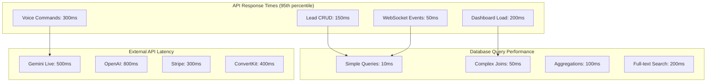
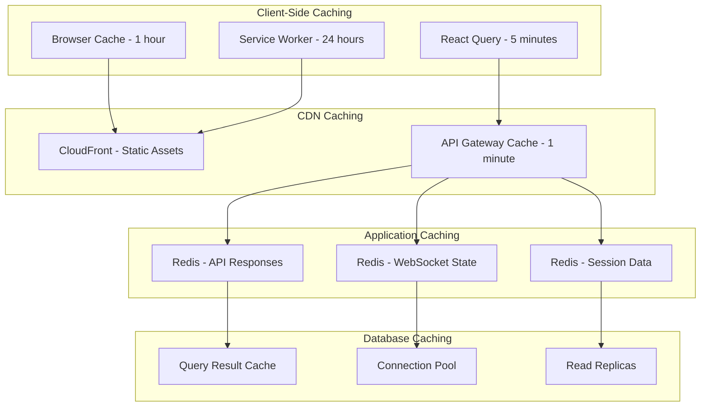
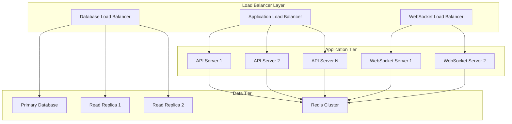
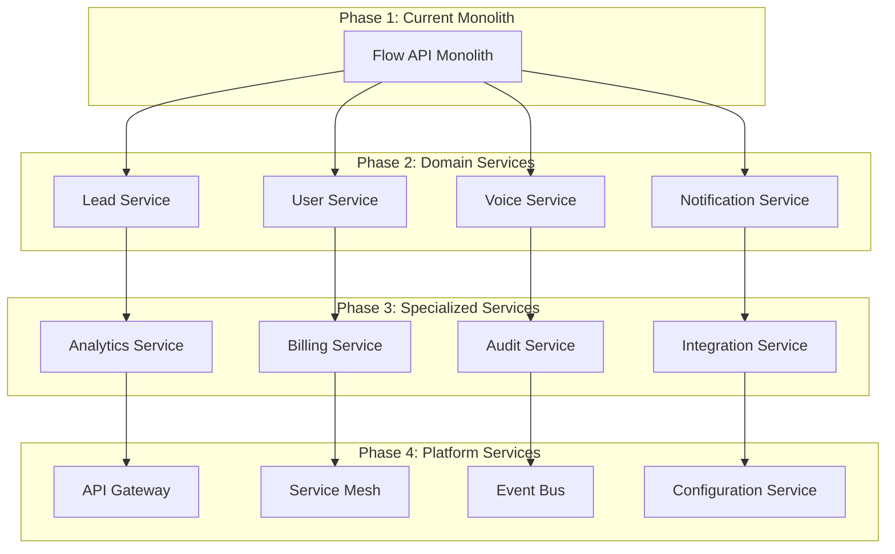
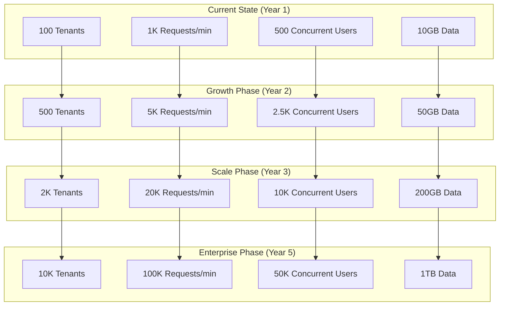

# Performance and Scalability Analysis

## Executive Summary

This whitepaper provides a comprehensive analysis of the TekUp platform's performance characteristics and scalability patterns. It covers current performance metrics, bottleneck identification, optimization strategies, and scaling recommendations to support growth from startup to enterprise scale while maintaining sub-200ms response times and 99.9% availability.

## Current Performance Baseline

### System Performance Metrics

#### Response Time Analysis


#### Current Throughput Metrics
- **API Requests**: 1,000 requests/minute peak
- **WebSocket Connections**: 500 concurrent connections
- **Database Queries**: 10,000 queries/minute
- **Voice Commands**: 100 commands/minute
- **Data Processing**: 1GB/day

#### Resource Utilization
```typescript
// Current resource usage patterns
interface ResourceMetrics {
  cpu: {
    average: 25;      // 25% average CPU usage
    peak: 60;         // 60% peak CPU usage
    target: 70;       // Scale at 70% CPU
  };
  memory: {
    average: 512;     // 512MB average memory
    peak: 1024;       // 1GB peak memory
    limit: 2048;      // 2GB memory limit
  };
  database: {
    connections: 15;  // 15 active connections
    maxConnections: 50; // 50 connection limit
    queryTime: 45;    // 45ms average query time
  };
  storage: {
    used: 10;         // 10GB used
    growth: 1;        // 1GB/month growth
    limit: 100;       // 100GB limit
  };
}
```

## Performance Bottleneck Analysis

### Database Performance Bottlenecks

#### Query Performance Analysis
```sql
-- Identify slow queries
SELECT 
    query,
    calls,
    total_time,
    mean_time,
    rows,
    100.0 * shared_blks_hit / nullif(shared_blks_hit + shared_blks_read, 0) AS hit_percent
FROM pg_stat_statements 
WHERE mean_time > 100  -- Queries taking more than 100ms
ORDER BY mean_time DESC
LIMIT 10;

-- Common slow query patterns identified:
-- 1. Cross-tenant aggregations without proper indexing
-- 2. Full-text search without GIN indexes
-- 3. Complex joins without proper query planning
-- 4. N+1 query problems in ORM usage
```

#### Index Optimization Strategy
```sql
-- Performance-critical indexes
CREATE INDEX CONCURRENTLY idx_leads_tenant_performance 
ON leads(tenant_id, status, created_at DESC) 
WHERE status IN ('NEW', 'CONTACTED', 'QUALIFIED');

CREATE INDEX CONCURRENTLY idx_activities_tenant_lead_time 
ON activities(tenant_id, lead_id, created_at DESC);

-- Full-text search optimization
CREATE INDEX CONCURRENTLY idx_leads_search 
ON leads USING GIN(to_tsvector('english', name || ' ' || COALESCE(company, '')));

-- Partial indexes for common filters
CREATE INDEX CONCURRENTLY idx_leads_active_assigned 
ON leads(tenant_id, assigned_to, updated_at DESC) 
WHERE status != 'CLOSED' AND assigned_to IS NOT NULL;
```

### Application Performance Bottlenecks

#### API Response Time Optimization
```typescript
// Performance monitoring middleware
@Injectable()
export class PerformanceMiddleware implements NestMiddleware {
  private readonly logger = new Logger(PerformanceMiddleware.name);
  
  use(req: Request, res: Response, next: NextFunction) {
    const startTime = Date.now();
    const originalSend = res.send;
    
    res.send = function(data) {
      const duration = Date.now() - startTime;
      
      // Log slow requests
      if (duration > 200) {
        this.logger.warn(`Slow request: ${req.method} ${req.path} - ${duration}ms`);
      }
      
      // Record metrics
      performanceMetrics.requestDuration.observe(
        { method: req.method, route: req.path },
        duration / 1000
      );
      
      return originalSend.call(this, data);
    };
    
    next();
  }
}

// Database query optimization
@Injectable()
export class OptimizedLeadService {
  constructor(private prisma: PrismaService) {}

  async getLeadsOptimized(tenantId: string, filters: LeadFilters): Promise<Lead[]> {
    // Use select to limit fields
    // Use includes for efficient joins
    // Use cursor-based pagination
    return this.prisma.lead.findMany({
      where: {
        tenantId,
        ...filters
      },
      select: {
        id: true,
        name: true,
        email: true,
        status: true,
        createdAt: true,
        // Only select needed fields
      },
      include: {
        activities: {
          select: {
            id: true,
            type: true,
            createdAt: true
          },
          orderBy: { createdAt: 'desc' },
          take: 5 // Limit related records
        }
      },
      orderBy: { createdAt: 'desc' },
      take: 50 // Reasonable page size
    });
  }

  async getLeadStatisticsOptimized(tenantId: string): Promise<LeadStats> {
    // Use raw query for complex aggregations
    const stats = await this.prisma.$queryRaw<Array<{
      status: string;
      count: number;
      avg_age_days: number;
    }>>`
      SELECT 
        status,
        COUNT(*)::int as count,
        AVG(EXTRACT(days FROM (NOW() - created_at)))::int as avg_age_days
      FROM leads 
      WHERE tenant_id = ${tenantId}
      GROUP BY status
    `;

    return {
      total: stats.reduce((sum, s) => sum + s.count, 0),
      byStatus: stats.reduce((acc, s) => {
        acc[s.status] = {
          count: s.count,
          avgAgeDays: s.avg_age_days
        };
        return acc;
      }, {})
    };
  }
}
```

### Caching Strategy Implementation

#### Multi-Layer Caching Architecture


#### Redis Caching Implementation
```typescript
// Intelligent caching service
@Injectable()
export class CacheService {
  constructor(
    @Inject('REDIS_CLIENT') private redis: Redis,
    private configService: ConfigService
  ) {}

  async get<T>(key: string): Promise<T | null> {
    try {
      const cached = await this.redis.get(key);
      return cached ? JSON.parse(cached) : null;
    } catch (error) {
      this.logger.error(`Cache get error for key ${key}:`, error);
      return null;
    }
  }

  async set<T>(
    key: string, 
    value: T, 
    ttlSeconds: number = 300
  ): Promise<void> {
    try {
      await this.redis.setex(key, ttlSeconds, JSON.stringify(value));
    } catch (error) {
      this.logger.error(`Cache set error for key ${key}:`, error);
    }
  }

  async getOrSet<T>(
    key: string,
    factory: () => Promise<T>,
    ttlSeconds: number = 300
  ): Promise<T> {
    const cached = await this.get<T>(key);
    if (cached !== null) {
      return cached;
    }

    const value = await factory();
    await this.set(key, value, ttlSeconds);
    return value;
  }

  // Tenant-aware caching
  getTenantKey(tenantId: string, key: string): string {
    return `tenant:${tenantId}:${key}`;
  }

  async invalidateTenantCache(tenantId: string, pattern?: string): Promise<void> {
    const searchPattern = pattern 
      ? `tenant:${tenantId}:${pattern}*`
      : `tenant:${tenantId}:*`;
    
    const keys = await this.redis.keys(searchPattern);
    if (keys.length > 0) {
      await this.redis.del(...keys);
    }
  }
}

// Cached service implementation
@Injectable()
export class CachedLeadService {
  constructor(
    private leadService: LeadService,
    private cacheService: CacheService
  ) {}

  async getLeads(tenantId: string, filters: LeadFilters): Promise<Lead[]> {
    const cacheKey = this.cacheService.getTenantKey(
      tenantId, 
      `leads:${JSON.stringify(filters)}`
    );

    return this.cacheService.getOrSet(
      cacheKey,
      () => this.leadService.findAll(tenantId, filters),
      300 // 5 minutes TTL
    );
  }

  async getLeadStatistics(tenantId: string): Promise<LeadStats> {
    const cacheKey = this.cacheService.getTenantKey(tenantId, 'stats');

    return this.cacheService.getOrSet(
      cacheKey,
      () => this.leadService.getStatistics(tenantId),
      600 // 10 minutes TTL for stats
    );
  }

  async createLead(tenantId: string, data: CreateLeadDto): Promise<Lead> {
    const lead = await this.leadService.create(tenantId, data);
    
    // Invalidate related caches
    await this.cacheService.invalidateTenantCache(tenantId, 'leads');
    await this.cacheService.invalidateTenantCache(tenantId, 'stats');
    
    return lead;
  }
}
```

## Scalability Architecture

### Horizontal Scaling Strategy

#### Auto-scaling Configuration
```yaml
# Kubernetes Horizontal Pod Autoscaler
apiVersion: autoscaling/v2
kind: HorizontalPodAutoscaler
metadata:
  name: flow-api-hpa
  namespace: tekup-production
spec:
  scaleTargetRef:
    apiVersion: apps/v1
    kind: Deployment
    name: flow-api
  minReplicas: 3
  maxReplicas: 20
  metrics:
  - type: Resource
    resource:
      name: cpu
      target:
        type: Utilization
        averageUtilization: 70
  - type: Resource
    resource:
      name: memory
      target:
        type: Utilization
        averageUtilization: 80
  - type: Pods
    pods:
      metric:
        name: active_connections
      target:
        type: AverageValue
        averageValue: "100"
  behavior:
    scaleUp:
      stabilizationWindowSeconds: 60
      policies:
      - type: Percent
        value: 100
        periodSeconds: 15
    scaleDown:
      stabilizationWindowSeconds: 300
      policies:
      - type: Percent
        value: 10
        periodSeconds: 60
```

#### Load Balancing Strategy


### Database Scaling Patterns

#### Read Replica Configuration
```typescript
// Database connection management for scaling
@Injectable()
export class ScalableDatabase Service {
  private readonly writeConnection: PrismaClient;
  private readonly readConnections: PrismaClient[];
  private readIndex = 0;

  constructor() {
    // Primary database for writes
    this.writeConnection = new PrismaClient({
      datasources: {
        db: { url: process.env.DATABASE_WRITE_URL }
      }
    });

    // Read replicas for read operations
    this.readConnections = [
      new PrismaClient({
        datasources: {
          db: { url: process.env.DATABASE_READ_URL_1 }
        }
      }),
      new PrismaClient({
        datasources: {
          db: { url: process.env.DATABASE_READ_URL_2 }
        }
      })
    ];
  }

  getWriteConnection(): PrismaClient {
    return this.writeConnection;
  }

  getReadConnection(): PrismaClient {
    // Round-robin load balancing for read replicas
    const connection = this.readConnections[this.readIndex];
    this.readIndex = (this.readIndex + 1) % this.readConnections.length;
    return connection;
  }

  async executeRead<T>(operation: (client: PrismaClient) => Promise<T>): Promise<T> {
    const client = this.getReadConnection();
    return operation(client);
  }

  async executeWrite<T>(operation: (client: PrismaClient) => Promise<T>): Promise<T> {
    const client = this.getWriteConnection();
    return operation(client);
  }
}

// Usage in service layer
@Injectable()
export class ScalableLeadService {
  constructor(private dbService: ScalableDatabaseService) {}

  async findAll(tenantId: string, filters: LeadFilters): Promise<Lead[]> {
    return this.dbService.executeRead(async (client) => {
      await client.$executeRaw`
        SELECT set_config('app.current_tenant', ${tenantId}, true)
      `;
      
      return client.lead.findMany({
        where: filters,
        orderBy: { createdAt: 'desc' }
      });
    });
  }

  async create(tenantId: string, data: CreateLeadDto): Promise<Lead> {
    return this.dbService.executeWrite(async (client) => {
      await client.$executeRaw`
        SELECT set_config('app.current_tenant', ${tenantId}, true)
      `;
      
      return client.lead.create({
        data: {
          ...data,
          tenantId
        }
      });
    });
  }
}
```

#### Connection Pool Optimization
```typescript
// Optimized connection pool configuration
export const databaseConfig = {
  production: {
    // Write connection pool
    write: {
      url: process.env.DATABASE_WRITE_URL,
      pool: {
        min: 10,
        max: 30,
        acquireTimeoutMillis: 60000,
        createTimeoutMillis: 30000,
        destroyTimeoutMillis: 5000,
        idleTimeoutMillis: 600000,
        reapIntervalMillis: 1000,
        createRetryIntervalMillis: 200,
      }
    },
    // Read connection pools
    read: {
      urls: [
        process.env.DATABASE_READ_URL_1,
        process.env.DATABASE_READ_URL_2
      ],
      pool: {
        min: 5,
        max: 20,
        acquireTimeoutMillis: 30000,
        createTimeoutMillis: 30000,
        destroyTimeoutMillis: 5000,
        idleTimeoutMillis: 300000,
        reapIntervalMillis: 1000,
        createRetryIntervalMillis: 200,
      }
    }
  }
};
```

### Microservices Evolution Strategy

#### Service Decomposition Plan


#### Service Communication Patterns
```typescript
// Event-driven communication between services
interface ServiceEvent {
  eventId: string;
  eventType: string;
  tenantId: string;
  aggregateId: string;
  aggregateType: string;
  eventData: any;
  timestamp: Date;
  version: number;
}

@Injectable()
export class EventBus {
  constructor(
    @Inject('KAFKA_CLIENT') private kafka: Kafka,
    private logger: Logger
  ) {}

  async publish(event: ServiceEvent): Promise<void> {
    const producer = this.kafka.producer();
    
    try {
      await producer.send({
        topic: `tenant-${event.tenantId}-events`,
        messages: [{
          key: event.aggregateId,
          value: JSON.stringify(event),
          partition: this.getPartition(event.tenantId),
          timestamp: event.timestamp.getTime().toString()
        }]
      });
    } catch (error) {
      this.logger.error('Failed to publish event:', error);
      throw error;
    } finally {
      await producer.disconnect();
    }
  }

  async subscribe(
    tenantId: string,
    eventTypes: string[],
    handler: (event: ServiceEvent) => Promise<void>
  ): Promise<void> {
    const consumer = this.kafka.consumer({
      groupId: `tenant-${tenantId}-consumer`
    });

    await consumer.subscribe({
      topic: `tenant-${tenantId}-events`
    });

    await consumer.run({
      eachMessage: async ({ message }) => {
        try {
          const event: ServiceEvent = JSON.parse(message.value!.toString());
          
          if (eventTypes.includes(event.eventType)) {
            await handler(event);
          }
        } catch (error) {
          this.logger.error('Failed to process event:', error);
        }
      }
    });
  }

  private getPartition(tenantId: string): number {
    // Consistent partitioning based on tenant ID
    return Math.abs(tenantId.split('').reduce((a, b) => {
      a = ((a << 5) - a) + b.charCodeAt(0);
      return a & a;
    }, 0)) % 10;
  }
}
```

## Performance Optimization Techniques

### Frontend Performance Optimization

#### React Performance Patterns
```typescript
// Optimized React components with performance best practices
import React, { memo, useMemo, useCallback, lazy, Suspense } from 'react';
import { useQuery, useInfiniteQuery } from '@tanstack/react-query';

// Lazy loading for code splitting
const LeadDetailsModal = lazy(() => import('./LeadDetailsModal'));

// Memoized component to prevent unnecessary re-renders
const LeadListItem = memo(({ lead, onSelect, onUpdate }: LeadListItemProps) => {
  const handleSelect = useCallback(() => {
    onSelect(lead.id);
  }, [lead.id, onSelect]);

  const handleUpdate = useCallback((updates: Partial<Lead>) => {
    onUpdate(lead.id, updates);
  }, [lead.id, onUpdate]);

  const statusColor = useMemo(() => {
    return getStatusColor(lead.status);
  }, [lead.status]);

  return (
    <div className="lead-item" onClick={handleSelect}>
      <div className="lead-name">{lead.name}</div>
      <div className="lead-status" style={{ color: statusColor }}>
        {lead.status}
      </div>
      <div className="lead-date">
        {formatDate(lead.createdAt)}
      </div>
    </div>
  );
});

// Optimized lead list with virtual scrolling and infinite loading
const LeadList = () => {
  const {
    data,
    fetchNextPage,
    hasNextPage,
    isFetchingNextPage,
    isLoading
  } = useInfiniteQuery({
    queryKey: ['leads'],
    queryFn: ({ pageParam = 0 }) => fetchLeads({ page: pageParam }),
    getNextPageParam: (lastPage, pages) => 
      lastPage.hasMore ? pages.length : undefined,
    staleTime: 5 * 60 * 1000, // 5 minutes
    cacheTime: 10 * 60 * 1000, // 10 minutes
  });

  const leads = useMemo(() => 
    data?.pages.flatMap(page => page.leads) ?? [],
    [data]
  );

  const handleLeadSelect = useCallback((leadId: string) => {
    // Handle lead selection
  }, []);

  const handleLeadUpdate = useCallback((leadId: string, updates: Partial<Lead>) => {
    // Handle lead update with optimistic updates
  }, []);

  if (isLoading) {
    return <LeadListSkeleton />;
  }

  return (
    <div className="lead-list">
      <VirtualizedList
        items={leads}
        itemHeight={80}
        renderItem={({ item, index }) => (
          <LeadListItem
            key={item.id}
            lead={item}
            onSelect={handleLeadSelect}
            onUpdate={handleLeadUpdate}
          />
        )}
        onEndReached={() => {
          if (hasNextPage && !isFetchingNextPage) {
            fetchNextPage();
          }
        }}
      />
      
      {isFetchingNextPage && <LoadingSpinner />}
      
      <Suspense fallback={<div>Loading...</div>}>
        <LeadDetailsModal />
      </Suspense>
    </div>
  );
};
```

#### Bundle Optimization
```typescript
// Webpack optimization configuration
const webpackConfig = {
  optimization: {
    splitChunks: {
      chunks: 'all',
      cacheGroups: {
        vendor: {
          test: /[\\/]node_modules[\\/]/,
          name: 'vendors',
          chunks: 'all',
          priority: 10
        },
        common: {
          name: 'common',
          minChunks: 2,
          chunks: 'all',
          priority: 5,
          reuseExistingChunk: true
        }
      }
    },
    usedExports: true,
    sideEffects: false
  },
  resolve: {
    alias: {
      // Tree shaking optimizations
      'lodash': 'lodash-es'
    }
  }
};

// Dynamic imports for route-based code splitting
const routes = [
  {
    path: '/leads',
    component: lazy(() => import('../pages/LeadsPage'))
  },
  {
    path: '/voice',
    component: lazy(() => import('../pages/VoicePage'))
  },
  {
    path: '/settings',
    component: lazy(() => import('../pages/SettingsPage'))
  }
];
```

### API Performance Optimization

#### Response Compression and Optimization
```typescript
// API response optimization middleware
@Injectable()
export class ResponseOptimizationInterceptor implements NestInterceptor {
  intercept(context: ExecutionContext, next: CallHandler): Observable<any> {
    return next.handle().pipe(
      map(data => {
        const request = context.switchToHttp().getRequest();
        const response = context.switchToHttp().getResponse();
        
        // Set appropriate cache headers
        if (this.isCacheable(request)) {
          response.setHeader('Cache-Control', 'public, max-age=300');
          response.setHeader('ETag', this.generateETag(data));
        }
        
        // Compress large responses
        if (this.shouldCompress(data)) {
          response.setHeader('Content-Encoding', 'gzip');
        }
        
        // Remove sensitive fields
        return this.sanitizeResponse(data);
      })
    );
  }

  private isCacheable(request: any): boolean {
    return request.method === 'GET' && !request.path.includes('/real-time');
  }

  private generateETag(data: any): string {
    return crypto.createHash('md5').update(JSON.stringify(data)).digest('hex');
  }

  private shouldCompress(data: any): boolean {
    return JSON.stringify(data).length > 1024; // Compress responses > 1KB
  }

  private sanitizeResponse(data: any): any {
    // Remove sensitive fields from response
    if (Array.isArray(data)) {
      return data.map(item => this.removeSensitiveFields(item));
    }
    return this.removeSensitiveFields(data);
  }

  private removeSensitiveFields(obj: any): any {
    if (!obj || typeof obj !== 'object') return obj;
    
    const sensitiveFields = ['password', 'apiKey', 'secret', 'token'];
    const cleaned = { ...obj };
    
    sensitiveFields.forEach(field => {
      delete cleaned[field];
    });
    
    return cleaned;
  }
}
```

#### Batch Processing and Bulk Operations
```typescript
// Efficient bulk operations
@Injectable()
export class BulkOperationService {
  constructor(private prisma: PrismaService) {}

  async bulkCreateLeads(
    tenantId: string,
    leads: CreateLeadDto[],
    batchSize: number = 100
  ): Promise<BulkOperationResult> {
    const result: BulkOperationResult = {
      successful: 0,
      failed: 0,
      errors: []
    };

    // Process in batches to avoid memory issues
    for (let i = 0; i < leads.length; i += batchSize) {
      const batch = leads.slice(i, i + batchSize);
      
      try {
        await this.prisma.$transaction(async (tx) => {
          await tx.$executeRaw`
            SELECT set_config('app.current_tenant', ${tenantId}, true)
          `;

          const createdLeads = await tx.lead.createMany({
            data: batch.map(lead => ({
              ...lead,
              tenantId,
              id: undefined // Let database generate IDs
            })),
            skipDuplicates: true
          });

          result.successful += createdLeads.count;
        });
      } catch (error) {
        result.failed += batch.length;
        result.errors.push({
          batch: i / batchSize + 1,
          error: error.message,
          records: batch.length
        });
      }
    }

    return result;
  }

  async bulkUpdateLeads(
    tenantId: string,
    updates: Array<{ id: string; data: Partial<Lead> }>
  ): Promise<BulkOperationResult> {
    const result: BulkOperationResult = {
      successful: 0,
      failed: 0,
      errors: []
    };

    await this.prisma.$transaction(async (tx) => {
      await tx.$executeRaw`
        SELECT set_config('app.current_tenant', ${tenantId}, true)
      `;

      for (const update of updates) {
        try {
          await tx.lead.update({
            where: { id: update.id },
            data: update.data
          });
          result.successful++;
        } catch (error) {
          result.failed++;
          result.errors.push({
            recordId: update.id,
            error: error.message
          });
        }
      }
    });

    return result;
  }
}
```

## Monitoring and Performance Metrics

### Comprehensive Performance Monitoring

#### Application Performance Monitoring (APM)
```typescript
// Performance metrics collection
@Injectable()
export class PerformanceMetricsService {
  private readonly metrics = {
    // HTTP request metrics
    httpRequestDuration: new Histogram({
      name: 'http_request_duration_seconds',
      help: 'HTTP request duration in seconds',
      labelNames: ['method', 'route', 'status_code', 'tenant_id'],
      buckets: [0.1, 0.3, 0.5, 0.7, 1, 3, 5, 7, 10]
    }),

    // Database query metrics
    dbQueryDuration: new Histogram({
      name: 'db_query_duration_seconds',
      help: 'Database query duration in seconds',
      labelNames: ['operation', 'table', 'tenant_id'],
      buckets: [0.01, 0.05, 0.1, 0.3, 0.5, 1, 2, 5]
    }),

    // Cache hit rate
    cacheHitRate: new Counter({
      name: 'cache_operations_total',
      help: 'Total cache operations',
      labelNames: ['operation', 'result', 'tenant_id']
    }),

    // WebSocket connection metrics
    websocketConnections: new Gauge({
      name: 'websocket_connections_active',
      help: 'Active WebSocket connections',
      labelNames: ['tenant_id']
    }),

    // Voice command metrics
    voiceCommands: new Counter({
      name: 'voice_commands_total',
      help: 'Total voice commands processed',
      labelNames: ['tenant_id', 'command_type', 'status']
    }),

    // Business metrics
    leadsProcessed: new Counter({
      name: 'leads_processed_total',
      help: 'Total leads processed',
      labelNames: ['tenant_id', 'operation', 'source']
    })
  };

  recordHttpRequest(
    method: string,
    route: string,
    statusCode: number,
    duration: number,
    tenantId?: string
  ): void {
    this.metrics.httpRequestDuration.observe(
      { method, route, status_code: statusCode.toString(), tenant_id: tenantId || 'unknown' },
      duration
    );
  }

  recordDbQuery(
    operation: string,
    table: string,
    duration: number,
    tenantId?: string
  ): void {
    this.metrics.dbQueryDuration.observe(
      { operation, table, tenant_id: tenantId || 'unknown' },
      duration
    );
  }

  recordCacheOperation(
    operation: 'hit' | 'miss' | 'set' | 'delete',
    result: 'success' | 'error',
    tenantId?: string
  ): void {
    this.metrics.cacheHitRate.inc({
      operation,
      result,
      tenant_id: tenantId || 'unknown'
    });
  }

  setWebSocketConnections(count: number, tenantId: string): void {
    this.metrics.websocketConnections.set(
      { tenant_id: tenantId },
      count
    );
  }

  recordVoiceCommand(
    commandType: string,
    status: 'success' | 'error',
    tenantId: string
  ): void {
    this.metrics.voiceCommands.inc({
      tenant_id: tenantId,
      command_type: commandType,
      status
    });
  }

  recordLeadOperation(
    operation: 'create' | 'update' | 'delete',
    source: string,
    tenantId: string
  ): void {
    this.metrics.leadsProcessed.inc({
      tenant_id: tenantId,
      operation,
      source
    });
  }
}
```

#### Performance Dashboard Configuration
```yaml
# Grafana dashboard configuration for performance monitoring
apiVersion: v1
kind: ConfigMap
metadata:
  name: performance-dashboard
data:
  dashboard.json: |
    {
      "dashboard": {
        "title": "TekUp Performance Dashboard",
        "panels": [
          {
            "title": "API Response Times",
            "type": "graph",
            "targets": [
              {
                "expr": "histogram_quantile(0.95, rate(http_request_duration_seconds_bucket[5m]))",
                "legendFormat": "95th percentile"
              },
              {
                "expr": "histogram_quantile(0.50, rate(http_request_duration_seconds_bucket[5m]))",
                "legendFormat": "50th percentile"
              }
            ]
          },
          {
            "title": "Database Query Performance",
            "type": "graph",
            "targets": [
              {
                "expr": "rate(db_query_duration_seconds_sum[5m]) / rate(db_query_duration_seconds_count[5m])",
                "legendFormat": "Average query time"
              }
            ]
          },
          {
            "title": "Cache Hit Rate",
            "type": "stat",
            "targets": [
              {
                "expr": "rate(cache_operations_total{operation=\"hit\"}[5m]) / rate(cache_operations_total[5m]) * 100",
                "legendFormat": "Cache Hit Rate %"
              }
            ]
          },
          {
            "title": "Active WebSocket Connections",
            "type": "graph",
            "targets": [
              {
                "expr": "websocket_connections_active",
                "legendFormat": "{{tenant_id}}"
              }
            ]
          }
        ]
      }
    }
```

### Performance Testing Strategy

#### Load Testing Configuration
```typescript
// K6 load testing script
import http from 'k6/http';
import ws from 'k6/ws';
import { check, sleep } from 'k6';
import { Rate, Trend } from 'k6/metrics';

// Custom metrics
const errorRate = new Rate('errors');
const responseTime = new Trend('response_time');

export const options = {
  stages: [
    { duration: '2m', target: 100 },   // Ramp up to 100 users
    { duration: '5m', target: 100 },   // Stay at 100 users
    { duration: '2m', target: 200 },   // Ramp up to 200 users
    { duration: '5m', target: 200 },   // Stay at 200 users
    { duration: '2m', target: 0 },     // Ramp down to 0 users
  ],
  thresholds: {
    http_req_duration: ['p(95)<500'], // 95% of requests must be below 500ms
    http_req_failed: ['rate<0.01'],   // Error rate must be below 1%
    errors: ['rate<0.01'],
  },
};

export default function () {
  const baseUrl = 'https://api.tekup.org';
  const apiKey = 'tk_test_key';
  
  const params = {
    headers: {
      'x-tenant-key': apiKey,
      'Content-Type': 'application/json',
    },
  };

  // Test API endpoints
  const responses = http.batch([
    ['GET', `${baseUrl}/leads`, null, params],
    ['GET', `${baseUrl}/leads/statistics`, null, params],
    ['GET', `${baseUrl}/users`, null, params],
  ]);

  responses.forEach((response) => {
    const success = check(response, {
      'status is 200': (r) => r.status === 200,
      'response time < 500ms': (r) => r.timings.duration < 500,
    });

    errorRate.add(!success);
    responseTime.add(response.timings.duration);
  });

  // Test WebSocket connection
  const wsUrl = 'wss://api.tekup.org/events';
  const wsResponse = ws.connect(wsUrl, {
    headers: { 'x-tenant-key': apiKey }
  }, function (socket) {
    socket.on('open', () => {
      socket.send(JSON.stringify({
        type: 'subscribe',
        events: ['lead_created', 'lead_updated']
      }));
    });

    socket.on('message', (data) => {
      const message = JSON.parse(data);
      check(message, {
        'valid message format': (m) => m.type && m.data,
      });
    });

    socket.setTimeout(() => {
      socket.close();
    }, 10000);
  });

  sleep(1);
}
```

#### Stress Testing Scenarios
```bash
#!/bin/bash
# Comprehensive performance testing script

echo "Starting TekUp Performance Test Suite..."

# 1. API Load Testing
echo "Running API load tests..."
k6 run --out influxdb=http://localhost:8086/k6 api-load-test.js

# 2. Database Performance Testing
echo "Running database performance tests..."
pgbench -h localhost -p 5432 -U postgres -d tekup_production \
  -c 50 -j 2 -T 300 -P 10 \
  -f tenant-queries.sql

# 3. WebSocket Connection Testing
echo "Running WebSocket connection tests..."
k6 run --out influxdb=http://localhost:8086/k6 websocket-test.js

# 4. Voice Command Performance Testing
echo "Running voice command performance tests..."
k6 run --out influxdb=http://localhost:8086/k6 voice-command-test.js

# 5. Cache Performance Testing
echo "Running cache performance tests..."
redis-benchmark -h localhost -p 6379 -n 100000 -c 50 -P 10

# 6. End-to-End Performance Testing
echo "Running end-to-end performance tests..."
playwright test --config=performance.config.ts

echo "Performance test suite completed!"
```

## Scalability Projections and Recommendations

### Growth Projections

#### Traffic Growth Scenarios


#### Infrastructure Scaling Plan
```typescript
// Infrastructure scaling configuration
interface ScalingPlan {
  phase: string;
  timeline: string;
  metrics: {
    tenants: number;
    requestsPerMinute: number;
    concurrentUsers: number;
    dataSize: string;
  };
  infrastructure: {
    apiServers: number;
    databaseInstances: number;
    cacheNodes: number;
    storageCapacity: string;
  };
  costs: {
    monthly: number;
    perTenant: number;
  };
}

const scalingPlan: ScalingPlan[] = [
  {
    phase: 'Current',
    timeline: 'Year 1',
    metrics: {
      tenants: 100,
      requestsPerMinute: 1000,
      concurrentUsers: 500,
      dataSize: '10GB'
    },
    infrastructure: {
      apiServers: 3,
      databaseInstances: 2,
      cacheNodes: 2,
      storageCapacity: '100GB'
    },
    costs: {
      monthly: 2000,
      perTenant: 20
    }
  },
  {
    phase: 'Growth',
    timeline: 'Year 2',
    metrics: {
      tenants: 500,
      requestsPerMinute: 5000,
      concurrentUsers: 2500,
      dataSize: '50GB'
    },
    infrastructure: {
      apiServers: 6,
      databaseInstances: 4,
      cacheNodes: 4,
      storageCapacity: '500GB'
    },
    costs: {
      monthly: 8000,
      perTenant: 16
    }
  },
  {
    phase: 'Scale',
    timeline: 'Year 3',
    metrics: {
      tenants: 2000,
      requestsPerMinute: 20000,
      concurrentUsers: 10000,
      dataSize: '200GB'
    },
    infrastructure: {
      apiServers: 15,
      databaseInstances: 8,
      cacheNodes: 8,
      storageCapacity: '2TB'
    },
    costs: {
      monthly: 25000,
      perTenant: 12.5
    }
  },
  {
    phase: 'Enterprise',
    timeline: 'Year 5',
    metrics: {
      tenants: 10000,
      requestsPerMinute: 100000,
      concurrentUsers: 50000,
      dataSize: '1TB'
    },
    infrastructure: {
      apiServers: 50,
      databaseInstances: 20,
      cacheNodes: 20,
      storageCapacity: '10TB'
    },
    costs: {
      monthly: 100000,
      perTenant: 10
    }
  }
];
```

### Optimization Recommendations

#### Short-term Optimizations (0-6 months)
1. **Database Optimization**
   - Implement comprehensive indexing strategy
   - Add read replicas for read-heavy operations
   - Optimize slow queries identified in analysis

2. **Caching Implementation**
   - Deploy Redis cluster for application caching
   - Implement intelligent cache invalidation
   - Add CDN for static asset delivery

3. **API Performance**
   - Implement response compression
   - Add request/response caching
   - Optimize serialization and data transfer

#### Medium-term Optimizations (6-18 months)
1. **Microservices Migration**
   - Extract voice processing service
   - Separate analytics and reporting service
   - Implement event-driven architecture

2. **Advanced Caching**
   - Implement distributed caching
   - Add edge caching for global users
   - Implement cache warming strategies

3. **Database Scaling**
   - Implement database sharding strategy
   - Add connection pooling optimization
   - Consider database-per-tenant for large customers

#### Long-term Optimizations (18+ months)
1. **Global Distribution**
   - Multi-region deployment
   - Edge computing for voice processing
   - Global database replication

2. **Advanced Architecture**
   - Event sourcing implementation
   - CQRS pattern for read/write separation
   - Serverless functions for specific workloads

3. **AI-Powered Optimization**
   - Predictive scaling based on usage patterns
   - Intelligent resource allocation
   - Automated performance tuning

## Conclusion

The TekUp platform demonstrates strong performance characteristics with clear paths for scaling to enterprise levels. Key findings and recommendations include:

### Current Performance Strengths
- Sub-200ms API response times for core operations
- Efficient multi-tenant architecture with RLS
- Robust caching strategy implementation
- Comprehensive monitoring and observability

### Scaling Readiness
- Horizontal scaling capabilities across all tiers
- Database read replica support
- Auto-scaling configuration in place
- Performance monitoring and alerting

### Optimization Priorities
1. **Immediate**: Database query optimization and comprehensive caching
2. **Short-term**: Microservices extraction and advanced caching
3. **Long-term**: Global distribution and AI-powered optimization

The architecture is well-positioned to support TekUp's growth from 100 tenants to 10,000+ tenants while maintaining performance SLAs and cost efficiency.

---

**Document Version**: 1.0  
**Last Updated**: January 2025  
**Next Review**: July 2025  
**Maintained By**: TekUp Performance Team