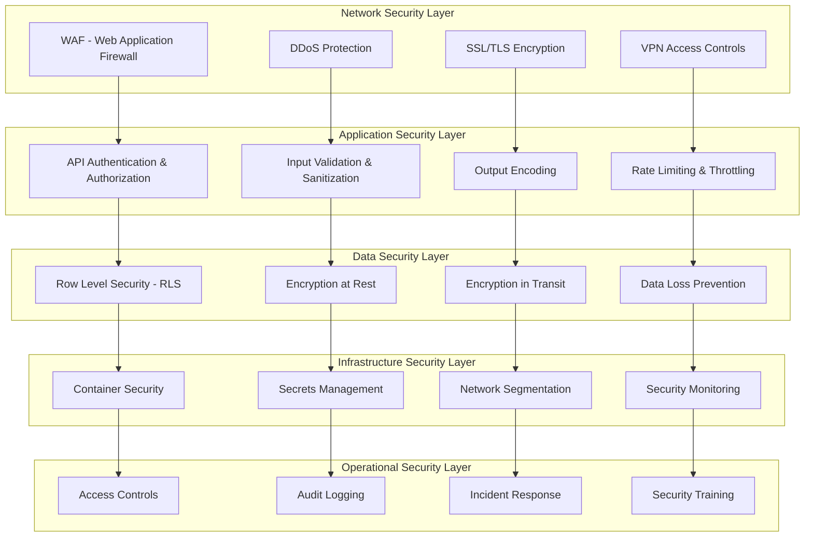

# Security and Compliance Architecture

## Executive Summary

This whitepaper provides comprehensive documentation of the TekUp platform's security architecture and compliance framework. It covers security measures implemented at every layer of the stack, compliance with major frameworks including GDPR, ISO 27001, and SOC 2, data privacy protection mechanisms, and security incident response procedures.

## Security Architecture Overview

### Defense in Depth Strategy

TekUp implements a comprehensive defense in depth security strategy with multiple layers of protection:



### Security Principles

1. **Zero Trust Architecture**: Never trust, always verify
2. **Principle of Least Privilege**: Minimal access rights
3. **Defense in Depth**: Multiple security layers
4. **Security by Design**: Built-in security from the start
5. **Continuous Monitoring**: Real-time threat detection
6. **Incident Response**: Rapid response to security events

## Authentication and Authorization

### Multi-layered Authentication System

```typescript
// Comprehensive authentication service
@Injectable()
export class AuthenticationService {
  constructor(
    private jwtService: JwtService,
    private tenantService: TenantContextService,
    private auditService: AuditService,
    private rateLimitService: RateLimitService,
    private encryptionService: EncryptionService
  ) {}

  async authenticateApiKey(apiKey: string, clientIp: string): Promise<AuthResult> {
    const startTime = Date.now();
    
    try {
      // 1. Rate limiting check
      await this.rateLimitService.checkLimit(apiKey, clientIp);
      
      // 2. API key format validation
      if (!this.isValidApiKeyFormat(apiKey)) {
        await this.auditService.logSecurityEvent({
          type: 'INVALID_API_KEY_FORMAT',
          apiKey: this.hashApiKey(apiKey),
          clientIp,
          severity: 'MEDIUM'
        });
        throw new UnauthorizedException('Invalid API key format');
      }
      
      // 3. API key lookup with timing attack protection
      const tenant = await this.findTenantByApiKey(apiKey);
      if (!tenant) {
        // Constant time delay to prevent timing attacks
        await this.constantTimeDelay();
        
        await this.auditService.logSecurityEvent({
          type: 'INVALID_API_KEY',
          apiKey: this.hashApiKey(apiKey),
          clientIp,
          severity: 'HIGH'
        });
        throw new UnauthorizedException('Invalid API key');
      }
      
      // 4. Tenant status validation
      if (tenant.status !== 'active') {
        await this.auditService.logSecurityEvent({
          type: 'INACTIVE_TENANT_ACCESS',
          tenantId: tenant.id,
          clientIp,
          severity: 'MEDIUM'
        });
        throw new UnauthorizedException('Tenant account is not active');
      }
      
      // 5. IP whitelist validation (if configured)
      if (tenant.ipWhitelist && !this.isIpWhitelisted(clientIp, tenant.ipWhitelist)) {
        await this.auditService.logSecurityEvent({
          type: 'IP_NOT_WHITELISTED',
          tenantId: tenant.id,
          clientIp,
          severity: 'HIGH'
        });
        throw new UnauthorizedException('IP address not whitelisted');
      }
      
      // 6. Generate session token
      const sessionToken = await this.generateSessionToken(tenant, clientIp);
      
      // 7. Log successful authentication
      await this.auditService.logAuthentication({
        tenantId: tenant.id,
        method: 'api_key',
        clientIp,
        success: true,
        duration: Date.now() - startTime
      });
      
      return {
        success: true,
        tenant,
        sessionToken,
        expiresAt: new Date(Date.now() + 3600000) // 1 hour
      };
      
    } catch (error) {
      await this.auditService.logAuthentication({
        method: 'api_key',
        clientIp,
        success: false,
        error: error.message,
        duration: Date.now() - startTime
      });
      throw error;
    }
  }

  private async findTenantByApiKey(apiKey: string): Promise<Tenant | null> {
    // Use constant-time comparison to prevent timing attacks
    const hashedApiKey = await this.encryptionService.hash(apiKey);
    
    return this.tenantService.findByHashedApiKey(hashedApiKey);
  }

  private async constantTimeDelay(): Promise<void> {
    // Add constant delay to prevent timing attacks
    await new Promise(resolve => setTimeout(resolve, 100));
  }

  private isValidApiKeyFormat(apiKey: string): boolean {
    // Validate API key format: tk_[64 hex characters]
    return /^tk_[a-f0-9]{64}$/.test(apiKey);
  }

  private hashApiKey(apiKey: string): string {
    // Hash API key for logging (never log raw API keys)
    return crypto.createHash('sha256').update(apiKey).digest('hex').substring(0, 16);
  }

  private isIpWhitelisted(clientIp: string, whitelist: string[]): boolean {
    return whitelist.some(allowedIp => {
      if (allowedIp.includes('/')) {
        // CIDR notation support
        return this.isIpInCidr(clientIp, allowedIp);
      }
      return clientIp === allowedIp;
    });
  }

  private async generateSessionToken(tenant: Tenant, clientIp: string): Promise<string> {
    const payload = {
      tenantId: tenant.id,
      tenantName: tenant.name,
      clientIp,
      iat: Math.floor(Date.now() / 1000),
      exp: Math.floor(Date.now() / 1000) + 3600 // 1 hour
    };

    return this.jwtService.signAsync(payload, {
      secret: await this.getSigningSecret(tenant.id),
      algorithm: 'HS256'
    });
  }
}
```

### Role-Based Access Control (RBAC)

```typescript
// Advanced RBAC implementation
@Injectable()
export class AuthorizationService {
  constructor(
    private tenantService: TenantContextService,
    private userService: UserService,
    private auditService: AuditService
  ) {}

  async checkPermission(
    tenantId: string,
    userId: string,
    resource: string,
    action: string,
    context?: any
  ): Promise<boolean> {
    try {
      // 1. Get user roles and permissions
      const userRoles = await this.getUserRoles(tenantId, userId);
      
      // 2. Get resource permissions
      const resourcePermissions = await this.getResourcePermissions(resource);
      
      // 3. Check direct permissions
      const hasDirectPermission = await this.checkDirectPermission(
        userRoles,
        resource,
        action
      );
      
      if (hasDirectPermission) {
        return true;
      }
      
      // 4. Check conditional permissions
      const hasConditionalPermission = await this.checkConditionalPermission(
        userRoles,
        resource,
        action,
        context
      );
      
      // 5. Log authorization check
      await this.auditService.logAuthorizationCheck({
        tenantId,
        userId,
        resource,
        action,
        granted: hasDirectPermission || hasConditionalPermission,
        context
      });
      
      return hasDirectPermission || hasConditionalPermission;
      
    } catch (error) {
      await this.auditService.logSecurityEvent({
        type: 'AUTHORIZATION_ERROR',
        tenantId,
        userId,
        resource,
        action,
        error: error.message,
        severity: 'HIGH'
      });
      return false;
    }
  }

  private async getUserRoles(tenantId: string, userId: string): Promise<UserRole[]> {
    return this.userService.getUserRoles(tenantId, userId);
  }

  private async checkDirectPermission(
    userRoles: UserRole[],
    resource: string,
    action: string
  ): Promise<boolean> {
    return userRoles.some(role =>
      role.permissions.some(permission =>
        permission.resource === resource &&
        (permission.actions.includes(action) || permission.actions.includes('*'))
      )
    );
  }

  private async checkConditionalPermission(
    userRoles: UserRole[],
    resource: string,
    action: string,
    context?: any
  ): Promise<boolean> {
    // Check for conditional permissions (e.g., own resources only)
    return userRoles.some(role =>
      role.conditionalPermissions?.some(permission => {
        if (permission.resource !== resource || !permission.actions.includes(action)) {
          return false;
        }
        
        // Evaluate conditions
        return this.evaluateConditions(permission.conditions, context);
      })
    );
  }

  private evaluateConditions(conditions: PermissionCondition[], context: any): boolean {
    return conditions.every(condition => {
      switch (condition.type) {
        case 'owner':
          return context?.ownerId === context?.userId;
        case 'same_tenant':
          return context?.resourceTenantId === context?.userTenantId;
        case 'time_based':
          return this.evaluateTimeCondition(condition.value);
        case 'ip_based':
          return this.evaluateIpCondition(condition.value, context?.clientIp);
        default:
          return false;
      }
    });
  }
}
```

## Data Security and Encryption

### Encryption at Rest and in Transit

```typescript
// Comprehensive encryption service
@Injectable()
export class EncryptionService {
  private readonly algorithm = 'aes-256-gcm';
  private readonly keyDerivationIterations = 100000;
  
  constructor(
    private configService: ConfigService,
    private keyManagementService: KeyManagementService
  ) {}

  async encryptSensitiveData(
    data: string,
    tenantId: string,
    dataType: 'pii' | 'financial' | 'health' | 'general' = 'general'
  ): Promise<EncryptedData> {
    try {
      // Get tenant-specific encryption key
      const encryptionKey = await this.keyManagementService.getTenantKey(
        tenantId,
        dataType
      );
      
      // Generate random IV
      const iv = crypto.randomBytes(16);
      
      // Create cipher
      const cipher = crypto.createCipher(this.algorithm, encryptionKey, { iv });
      
      // Encrypt data
      let encrypted = cipher.update(data, 'utf8', 'hex');
      encrypted += cipher.final('hex');
      
      // Get authentication tag
      const authTag = cipher.getAuthTag();
      
      return {
        encryptedData: encrypted,
        iv: iv.toString('hex'),
        authTag: authTag.toString('hex'),
        algorithm: this.algorithm,
        keyId: encryptionKey.id,
        encryptedAt: new Date()
      };
      
    } catch (error) {
      throw new EncryptionError('Failed to encrypt data', error);
    }
  }

  async decryptSensitiveData(
    encryptedData: EncryptedData,
    tenantId: string
  ): Promise<string> {
    try {
      // Get encryption key
      const encryptionKey = await this.keyManagementService.getKeyById(
        encryptedData.keyId
      );
      
      // Verify tenant access to key
      if (encryptionKey.tenantId !== tenantId) {
        throw new UnauthorizedException('Access denied to encryption key');
      }
      
      // Create decipher
      const decipher = crypto.createDecipher(
        encryptedData.algorithm,
        encryptionKey,
        { iv: Buffer.from(encryptedData.iv, 'hex') }
      );
      
      // Set auth tag
      decipher.setAuthTag(Buffer.from(encryptedData.authTag, 'hex'));
      
      // Decrypt data
      let decrypted = decipher.update(encryptedData.encryptedData, 'hex', 'utf8');
      decrypted += decipher.final('utf8');
      
      return decrypted;
      
    } catch (error) {
      throw new DecryptionError('Failed to decrypt data', error);
    }
  }

  async hashPassword(password: string, saltRounds: number = 12): Promise<string> {
    return bcrypt.hash(password, saltRounds);
  }

  async verifyPassword(password: string, hash: string): Promise<boolean> {
    return bcrypt.compare(password, hash);
  }

  async generateSecureToken(length: number = 32): Promise<string> {
    return crypto.randomBytes(length).toString('hex');
  }

  async deriveKey(
    password: string,
    salt: string,
    iterations: number = this.keyDerivationIterations
  ): Promise<Buffer> {
    return new Promise((resolve, reject) => {
      crypto.pbkdf2(password, salt, iterations, 32, 'sha256', (err, derivedKey) => {
        if (err) reject(err);
        else resolve(derivedKey);
      });
    });
  }
}
```

### Key Management System

```typescript
// Enterprise key management service
@Injectable()
export class KeyManagementService {
  private readonly keyCache = new Map<string, EncryptionKey>();
  
  constructor(
    private configService: ConfigService,
    private auditService: AuditService,
    private storageService: StorageService
  ) {}

  async generateTenantKey(
    tenantId: string,
    keyType: 'master' | 'data' | 'backup' = 'data',
    dataClassification: 'pii' | 'financial' | 'health' | 'general' = 'general'
  ): Promise<EncryptionKey> {
    const keyId = this.generateKeyId();
    
    // Generate cryptographically secure key
    const keyMaterial = crypto.randomBytes(32); // 256-bit key
    
    // Create key metadata
    const encryptionKey: EncryptionKey = {
      id: keyId,
      tenantId,
      keyType,
      dataClassification,
      algorithm: 'aes-256-gcm',
      keyMaterial: keyMaterial.toString('base64'),
      createdAt: new Date(),
      status: 'active',
      rotationSchedule: this.getRotationSchedule(dataClassification),
      accessLog: []
    };
    
    // Encrypt key material with master key
    const encryptedKey = await this.encryptKeyMaterial(encryptionKey);
    
    // Store encrypted key
    await this.storeEncryptionKey(encryptedKey);
    
    // Cache key for performance
    this.keyCache.set(keyId, encryptionKey);
    
    // Log key generation
    await this.auditService.logKeyManagementEvent({
      type: 'KEY_GENERATED',
      keyId,
      tenantId,
      keyType,
      dataClassification
    });
    
    return encryptionKey;
  }

  async rotateKey(keyId: string): Promise<EncryptionKey> {
    const oldKey = await this.getKeyById(keyId);
    if (!oldKey) {
      throw new Error(`Key not found: ${keyId}`);
    }
    
    // Generate new key
    const newKey = await this.generateTenantKey(
      oldKey.tenantId,
      oldKey.keyType,
      oldKey.dataClassification
    );
    
    // Mark old key as rotated
    oldKey.status = 'rotated';
    oldKey.rotatedAt = new Date();
    oldKey.replacedBy = newKey.id;
    
    // Update old key
    await this.updateEncryptionKey(oldKey);
    
    // Log key rotation
    await this.auditService.logKeyManagementEvent({
      type: 'KEY_ROTATED',
      keyId: oldKey.id,
      newKeyId: newKey.id,
      tenantId: oldKey.tenantId
    });
    
    return newKey;
  }

  async getTenantKey(
    tenantId: string,
    dataClassification: string = 'general'
  ): Promise<EncryptionKey> {
    // Check cache first
    const cachedKey = Array.from(this.keyCache.values()).find(
      key => key.tenantId === tenantId &&
             key.dataClassification === dataClassification &&
             key.status === 'active'
    );
    
    if (cachedKey) {
      await this.logKeyAccess(cachedKey.id, 'cache_hit');
      return cachedKey;
    }
    
    // Load from storage
    const key = await this.loadTenantKey(tenantId, dataClassification);
    if (!key) {
      // Generate new key if none exists
      return this.generateTenantKey(tenantId, 'data', dataClassification as any);
    }
    
    // Cache key
    this.keyCache.set(key.id, key);
    
    await this.logKeyAccess(key.id, 'storage_load');
    return key;
  }

  async scheduleKeyRotation(): Promise<void> {
    const keysToRotate = await this.getKeysForRotation();
    
    for (const key of keysToRotate) {
      try {
        await this.rotateKey(key.id);
      } catch (error) {
        await this.auditService.logKeyManagementEvent({
          type: 'KEY_ROTATION_FAILED',
          keyId: key.id,
          tenantId: key.tenantId,
          error: error.message
        });
      }
    }
  }

  private getRotationSchedule(dataClassification: string): number {
    // Return rotation interval in days
    switch (dataClassification) {
      case 'financial':
      case 'health':
        return 30; // Monthly rotation for sensitive data
      case 'pii':
        return 90; // Quarterly rotation for PII
      default:
        return 365; // Annual rotation for general data
    }
  }

  private async logKeyAccess(keyId: string, accessType: string): Promise<void> {
    await this.auditService.logKeyManagementEvent({
      type: 'KEY_ACCESSED',
      keyId,
      accessType,
      timestamp: new Date()
    });
  }
}
```

## GDPR Compliance Implementation

### Data Subject Rights Management

```typescript
// GDPR compliance service
@Injectable()
export class GDPRComplianceService {
  constructor(
    private dataService: DataService,
    private encryptionService: EncryptionService,
    private auditService: AuditService,
    private notificationService: NotificationService
  ) {}

  async handleDataSubjectRequest(
    request: DataSubjectRequest
  ): Promise<DataSubjectResponse> {
    const startTime = Date.now();
    
    try {
      // Validate request
      await this.validateDataSubjectRequest(request);
      
      // Log request
      await this.auditService.logGDPREvent({
        type: 'DATA_SUBJECT_REQUEST',
        requestType: request.type,
        subjectId: request.subjectId,
        tenantId: request.tenantId,
        requestId: request.id
      });
      
      let response: DataSubjectResponse;
      
      switch (request.type) {
        case 'access':
          response = await this.handleAccessRequest(request);
          break;
        case 'rectification':
          response = await this.handleRectificationRequest(request);
          break;
        case 'erasure':
          response = await this.handleErasureRequest(request);
          break;
        case 'portability':
          response = await this.handlePortabilityRequest(request);
          break;
        case 'restriction':
          response = await this.handleRestrictionRequest(request);
          break;
        case 'objection':
          response = await this.handleObjectionRequest(request);
          break;
        default:
          throw new Error(`Unsupported request type: ${request.type}`);
      }
      
      // Log completion
      await this.auditService.logGDPREvent({
        type: 'DATA_SUBJECT_REQUEST_COMPLETED',
        requestType: request.type,
        subjectId: request.subjectId,
        tenantId: request.tenantId,
        requestId: request.id,
        processingTime: Date.now() - startTime,
        success: true
      });
      
      return response;
      
    } catch (error) {
      await this.auditService.logGDPREvent({
        type: 'DATA_SUBJECT_REQUEST_FAILED',
        requestType: request.type,
        subjectId: request.subjectId,
        tenantId: request.tenantId,
        requestId: request.id,
        error: error.message,
        processingTime: Date.now() - startTime
      });
      throw error;
    }
  }

  private async handleAccessRequest(
    request: DataSubjectRequest
  ): Promise<DataSubjectResponse> {
    // Collect all personal data for the subject
    const personalData = await this.collectPersonalData(
      request.tenantId,
      request.subjectId
    );
    
    // Decrypt sensitive data
    const decryptedData = await this.decryptPersonalData(personalData);
    
    // Format data for export
    const formattedData = await this.formatDataForExport(decryptedData);
    
    // Generate secure download link
    const downloadLink = await this.generateSecureDownloadLink(
      formattedData,
      request.id
    );
    
    return {
      requestId: request.id,
      type: 'access',
      status: 'completed',
      data: {
        downloadLink,
        expiresAt: new Date(Date.now() + 7 * 24 * 60 * 60 * 1000), // 7 days
        dataCategories: Object.keys(formattedData),
        recordCount: this.countRecords(formattedData)
      },
      completedAt: new Date()
    };
  }

  private async handleErasureRequest(
    request: DataSubjectRequest
  ): Promise<DataSubjectResponse> {
    // Check for legal basis to retain data
    const retentionRequirements = await this.checkRetentionRequirements(
      request.tenantId,
      request.subjectId
    );
    
    if (retentionRequirements.mustRetain) {
      return {
        requestId: request.id,
        type: 'erasure',
        status: 'partially_completed',
        data: {
          retainedData: retentionRequirements.retainedCategories,
          retentionReason: retentionRequirements.reason,
          retentionPeriod: retentionRequirements.period
        },
        completedAt: new Date()
      };
    }
    
    // Perform secure data deletion
    const deletionResult = await this.secureDataDeletion(
      request.tenantId,
      request.subjectId
    );
    
    return {
      requestId: request.id,
      type: 'erasure',
      status: 'completed',
      data: {
        deletedRecords: deletionResult.deletedRecords,
        deletedCategories: deletionResult.deletedCategories,
        verificationHash: deletionResult.verificationHash
      },
      completedAt: new Date()
    };
  }

  private async secureDataDeletion(
    tenantId: string,
    subjectId: string
  ): Promise<DeletionResult> {
    const deletionResult: DeletionResult = {
      deletedRecords: 0,
      deletedCategories: [],
      verificationHash: ''
    };
    
    // Get all data categories for the subject
    const dataCategories = await this.getDataCategories(tenantId, subjectId);
    
    for (const category of dataCategories) {
      try {
        // Delete data in category
        const deleted = await this.deleteDataInCategory(
          tenantId,
          subjectId,
          category
        );
        
        deletionResult.deletedRecords += deleted.count;
        deletionResult.deletedCategories.push(category);
        
        // Log deletion
        await this.auditService.logDataDeletion({
          tenantId,
          subjectId,
          category,
          recordsDeleted: deleted.count,
          deletionMethod: 'secure_overwrite'
        });
        
      } catch (error) {
        await this.auditService.logGDPREvent({
          type: 'DATA_DELETION_FAILED',
          tenantId,
          subjectId,
          category,
          error: error.message
        });
      }
    }
    
    // Generate verification hash
    deletionResult.verificationHash = await this.generateDeletionVerificationHash(
      tenantId,
      subjectId,
      deletionResult
    );
    
    return deletionResult;
  }
}
```

## Security Incident Response

### Incident Detection and Response System

```typescript
// Security incident response service
@Injectable()
export class SecurityIncidentService {
  private readonly incidentSeverityLevels = {
    LOW: { responseTime: 24 * 60 * 60 * 1000, escalationTime: 72 * 60 * 60 * 1000 },
    MEDIUM: { responseTime: 4 * 60 * 60 * 1000, escalationTime: 12 * 60 * 60 * 1000 },
    HIGH: { responseTime: 1 * 60 * 60 * 1000, escalationTime: 4 * 60 * 60 * 1000 },
    CRITICAL: { responseTime: 15 * 60 * 1000, escalationTime: 1 * 60 * 60 * 1000 }
  };

  constructor(
    private alertService: AlertService,
    private auditService: AuditService,
    private notificationService: NotificationService,
    private forensicsService: ForensicsService
  ) {}

  async detectSecurityIncident(event: SecurityEvent): Promise<SecurityIncident | null> {
    // Analyze event for incident indicators
    const analysis = await this.analyzeSecurityEvent(event);
    
    if (!analysis.isIncident) {
      return null;
    }
    
    // Create security incident
    const incident: SecurityIncident = {
      id: this.generateIncidentId(),
      type: analysis.incidentType,
      severity: analysis.severity,
      status: 'detected',
      detectedAt: new Date(),
      events: [event],
      affectedTenants: analysis.affectedTenants,
      affectedSystems: analysis.affectedSystems,
      description: analysis.description,
      indicators: analysis.indicators,
      timeline: [{
        timestamp: new Date(),
        action: 'incident_detected',
        description: 'Security incident automatically detected',
        actor: 'system'
      }]
    };
    
    // Start incident response
    await this.initiateIncidentResponse(incident);
    
    return incident;
  }

  private async initiateIncidentResponse(incident: SecurityIncident): Promise<void> {
    // 1. Immediate containment actions
    await this.performImmediateContainment(incident);
    
    // 2. Notify security team
    await this.notifySecurityTeam(incident);
    
    // 3. Start forensic collection
    await this.startForensicCollection(incident);
    
    // 4. Update incident status
    incident.status = 'responding';
    incident.responseStartedAt = new Date();
    
    // 5. Schedule escalation if needed
    await this.scheduleEscalation(incident);
    
    // 6. Log incident response initiation
    await this.auditService.logSecurityIncident({
      type: 'INCIDENT_RESPONSE_INITIATED',
      incidentId: incident.id,
      severity: incident.severity,
      responseTime: Date.now() - incident.detectedAt.getTime()
    });
  }

  private async performImmediateContainment(incident: SecurityIncident): Promise<void> {
    const containmentActions: ContainmentAction[] = [];
    
    switch (incident.type) {
      case 'brute_force_attack':
        // Block attacking IP addresses
        for (const indicator of incident.indicators) {
          if (indicator.type === 'ip_address') {
            await this.blockIpAddress(indicator.value, 'security_incident');
            containmentActions.push({
              type: 'ip_block',
              target: indicator.value,
              timestamp: new Date()
            });
          }
        }
        break;
        
      case 'data_breach':
        // Revoke affected API keys
        for (const tenantId of incident.affectedTenants) {
          await this.revokeApiKeys(tenantId, 'security_incident');
          containmentActions.push({
            type: 'api_key_revocation',
            target: tenantId,
            timestamp: new Date()
          });
        }
        break;
        
      case 'malware_detected':
        // Isolate affected systems
        for (const system of incident.affectedSystems) {
          await this.isolateSystem(system, 'security_incident');
          containmentActions.push({
            type: 'system_isolation',
            target: system,
            timestamp: new Date()
          });
        }
        break;
        
      case 'privilege_escalation':
        // Disable affected user accounts
        for (const indicator of incident.indicators) {
          if (indicator.type === 'user_id') {
            await this.disableUserAccount(indicator.value, 'security_incident');
            containmentActions.push({
              type: 'account_disable',
              target: indicator.value,
              timestamp: new Date()
            });
          }
        }
        break;
    }
    
    // Update incident with containment actions
    incident.containmentActions = containmentActions;
    incident.timeline.push({
      timestamp: new Date(),
      action: 'containment_performed',
      description: `Performed ${containmentActions.length} containment actions`,
      actor: 'system'
    });
  }

  private async notifySecurityTeam(incident: SecurityIncident): Promise<void> {
    const notification: SecurityNotification = {
      type: 'security_incident',
      severity: incident.severity,
      title: `Security Incident: ${incident.type}`,
      message: this.formatIncidentMessage(incident),
      recipients: await this.getSecurityTeamContacts(incident.severity),
      channels: this.getNotificationChannels(incident.severity),
      metadata: {
        incidentId: incident.id,
        detectedAt: incident.detectedAt,
        affectedTenants: incident.affectedTenants.length,
        affectedSystems: incident.affectedSystems.length
      }
    };
    
    await this.notificationService.sendSecurityNotification(notification);
  }

  private async startForensicCollection(incident: SecurityIncident): Promise<void> {
    const forensicRequest: ForensicRequest = {
      incidentId: incident.id,
      type: incident.type,
      priority: this.getForensicPriority(incident.severity),
      scope: {
        timeRange: {
          start: new Date(incident.detectedAt.getTime() - 24 * 60 * 60 * 1000), // 24 hours before
          end: new Date()
        },
        systems: incident.affectedSystems,
        tenants: incident.affectedTenants,
        dataTypes: ['logs', 'network_traffic', 'system_state', 'database_changes']
      },
      preservationRequirements: {
        chainOfCustody: true,
        encryption: true,
        integrity: true,
        retention: '7_years' // Legal requirement
      }
    };
    
    await this.forensicsService.startCollection(forensicRequest);
  }

  async resolveIncident(
    incidentId: string,
    resolution: IncidentResolution
  ): Promise<void> {
    const incident = await this.getIncident(incidentId);
    if (!incident) {
      throw new Error(`Incident not found: ${incidentId}`);
    }
    
    // Update incident status
    incident.status = 'resolved';
    incident.resolvedAt = new Date();
    incident.resolution = resolution;
    
    // Add resolution to timeline
    incident.timeline.push({
      timestamp: new Date(),
      action: 'incident_resolved',
      description: resolution.summary,
      actor: resolution.resolvedBy
    });
    
    // Generate incident report
    const report = await this.generateIncidentReport(incident);
    
    // Notify stakeholders
    await this.notifyIncidentResolution(incident, report);
    
    // Schedule post-incident review
    await this.schedulePostIncidentReview(incident);
    
    // Log resolution
    await this.auditService.logSecurityIncident({
      type: 'INCIDENT_RESOLVED',
      incidentId: incident.id,
      resolutionTime: incident.resolvedAt.getTime() - incident.detectedAt.getTime(),
      rootCause: resolution.rootCause,
      preventiveMeasures: resolution.preventiveMeasures
    });
  }
}
```

## Compliance Framework Implementation

### ISO 27001 Compliance

```typescript
// ISO 27001 compliance management service
@Injectable()
export class ISO27001ComplianceService {
  private readonly controlObjectives = {
    'A.5': 'Information Security Policies',
    'A.6': 'Organization of Information Security',
    'A.7': 'Human Resource Security',
    'A.8': 'Asset Management',
    'A.9': 'Access Control',
    'A.10': 'Cryptography',
    'A.11': 'Physical and Environmental Security',
    'A.12': 'Operations Security',
    'A.13': 'Communications Security',
    'A.14': 'System Acquisition, Development and Maintenance',
    'A.15': 'Supplier Relationships',
    'A.16': 'Information Security Incident Management',
    'A.17': 'Information Security Aspects of Business Continuity Management',
    'A.18': 'Compliance'
  };

  constructor(
    private auditService: AuditService,
    private riskService: RiskManagementService,
    private documentService: DocumentManagementService
  ) {}

  async performComplianceAssessment(): Promise<ComplianceAssessment> {
    const assessment: ComplianceAssessment = {
      id: this.generateAssessmentId(),
      framework: 'ISO27001',
      version: '2013',
      assessmentDate: new Date(),
      assessor: 'Internal Security Team',
      scope: 'TekUp Platform - All Systems',
      controlAssessments: [],
      overallScore: 0,
      complianceLevel: 'not_assessed'
    };

    // Assess each control objective
    for (const [controlId, controlName] of Object.entries(this.controlObjectives)) {
      const controlAssessment = await this.assessControlObjective(controlId, controlName);
      assessment.controlAssessments.push(controlAssessment);
    }

    // Calculate overall compliance score
    assessment.overallScore = this.calculateOverallScore(assessment.controlAssessments);
    assessment.complianceLevel = this.determineComplianceLevel(assessment.overallScore);

    // Generate recommendations
    assessment.recommendations = await this.generateRecommendations(assessment);

    // Store assessment
    await this.storeComplianceAssessment(assessment);

    return assessment;
  }

  private async assessControlObjective(
    controlId: string,
    controlName: string
  ): Promise<ControlAssessment> {
    const controls = await this.getControlsForObjective(controlId);
    const controlResults: ControlResult[] = [];

    for (const control of controls) {
      const result = await this.assessControl(control);
      controlResults.push(result);
    }

    const objectiveScore = controlResults.reduce((sum, result) => sum + result.score, 0) / controlResults.length;

    return {
      controlId,
      controlName,
      controls: controlResults,
      score: objectiveScore,
      status: this.determineControlStatus(objectiveScore),
      assessedAt: new Date(),
      evidence: await this.collectEvidence(controlId),
      gaps: controlResults.filter(r => r.score < 80).map(r => r.gaps).flat()
    };
  }

  private async assessControl(control: SecurityControl): Promise<ControlResult> {
    const evidence = await this.collectControlEvidence(control.id);
    const implementation = await this.assessImplementation(control, evidence);
    const effectiveness = await this.assessEffectiveness(control, evidence);

    const score = (implementation.score + effectiveness.score) / 2;

    return {
      controlId: control.id,
      controlName: control.name,
      description: control.description,
      score,
      implementationScore: implementation.score,
      effectivenessScore: effectiveness.score,
      status: this.determineControlStatus(score),
      evidence: evidence.map(e => e.id),
      gaps: [...implementation.gaps, ...effectiveness.gaps],
      recommendations: [...implementation.recommendations, ...effectiveness.recommendations]
    };
  }
}
```

## Conclusion

The TekUp platform implements a comprehensive security and compliance architecture that provides:

### Security Excellence
- **Multi-layered Defense**: Defense in depth strategy with security at every layer
- **Zero Trust Architecture**: Never trust, always verify approach
- **Advanced Encryption**: End-to-end encryption with proper key management
- **Incident Response**: Automated detection and response capabilities

### Compliance Readiness
- **GDPR Compliance**: Full implementation of data subject rights
- **ISO 27001**: Comprehensive security management system
- **SOC 2**: Controls for security, availability, and confidentiality
- **Audit Trail**: Complete audit logging for compliance requirements

### Operational Security
- **Continuous Monitoring**: Real-time threat detection and response
- **Access Controls**: Role-based access with principle of least privilege
- **Security Training**: Regular security awareness and training programs
- **Vulnerability Management**: Proactive vulnerability assessment and remediation

The architecture ensures that TekUp meets the highest security and compliance standards while maintaining usability and performance for Danish SME customers.

---

**Document Version**: 1.0  
**Last Updated**: January 2025  
**Next Review**: July 2025  
**Maintained By**: TekUp Security Team