# TekUp System Architecture Overview

## Executive Summary

TekUp.org represents a comprehensive multi-tenant SaaS platform designed to serve Danish SMEs (5-50 employees, €500K-€5M revenue) with AI-powered IT support, security, and digital advisory services. The platform is architected as a living AI organism that can self-monitor, adapt, and optimize performance while maintaining strict security and compliance standards.

This whitepaper provides a comprehensive overview of the system architecture, design decisions, and implementation patterns that enable TekUp to deliver scalable, secure, and intelligent services across 25+ integrated applications.

## Architecture Philosophy

### Core Principles

1. **Multi-tenant by Design**: Every component is built with multi-tenancy as a first-class citizen, ensuring complete data isolation and customizable experiences per tenant.

2. **AI-First Architecture**: The platform is designed to leverage AI capabilities throughout the stack, from natural language processing to automated decision-making and optimization.

3. **Living Documentation**: The system maintains self-updating documentation that evolves with the codebase, ensuring accuracy and reducing maintenance overhead.

4. **Event-Driven Communication**: Applications communicate through standardized events and APIs, enabling loose coupling and independent scaling.

5. **Security by Default**: Security measures are embedded at every layer, from database-level Row Level Security (RLS) to API-level authentication and authorization.

## System Overview

### High-Level Architecture

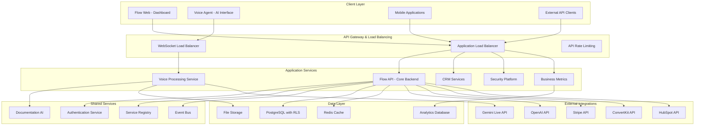

### Technology Stack

#### Backend Technologies
- **Framework**: NestJS with TypeScript for robust, scalable API development
- **Database**: PostgreSQL with Row Level Security (RLS) for multi-tenant data isolation
- **Caching**: Redis for session management, real-time data, and performance optimization
- **Authentication**: JWT-based authentication with API key support
- **Real-time Communication**: Socket.IO for WebSocket connections
- **API Documentation**: OpenAPI/Swagger with auto-generation

#### Frontend Technologies
- **Framework**: Next.js 15 with App Router for modern React applications
- **State Management**: Zustand for lightweight, scalable state management
- **Data Fetching**: TanStack Query for server state management
- **Styling**: Tailwind CSS for utility-first styling
- **UI Components**: Shared component library via `@tekup/ui`

#### Infrastructure & DevOps
- **Package Management**: pnpm with workspace support for monorepo management
- **Build System**: Nx for efficient build orchestration and caching
- **Containerization**: Docker with multi-stage builds
- **Orchestration**: Kubernetes for production deployment
- **Monitoring**: Prometheus + Grafana for metrics and alerting
- **CI/CD**: GitHub Actions with automated testing and deployment

## Core Applications Architecture

### Flow API - Central Backend Service

Flow API serves as the central nervous system of the TekUp platform, orchestrating all business logic, data management, and external integrations.

#### Key Responsibilities
- Multi-tenant data management with RLS enforcement
- RESTful API endpoints for all business operations
- WebSocket gateway for real-time communication
- Voice command processing and execution
- External service integration management
- Metrics collection and business intelligence
- Authentication and authorization services

#### Architecture Components

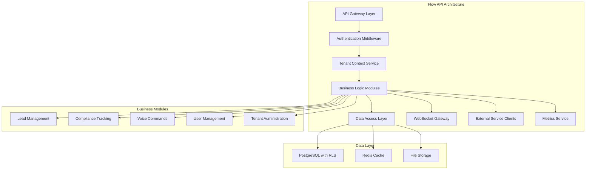

#### Multi-tenant Architecture Implementation

```typescript
// Tenant Context Service
@Injectable()
export class TenantContextService {
  async resolveTenant(apiKey: string): Promise<TenantContext> {
    const tenant = await this.tenantRepository.findByApiKey(apiKey);
    if (!tenant) {
      throw new UnauthorizedException('Invalid API key');
    }
    
    return {
      tenantId: tenant.id,
      name: tenant.name,
      features: tenant.enabledFeatures,
      limits: tenant.resourceLimits
    };
  }
  
  async enforceRLS(tenantId: string): Promise<void> {
    await this.databaseService.setRLSContext(tenantId);
  }
}

// RLS Policy Example
CREATE POLICY tenant_isolation ON leads
  FOR ALL TO authenticated
  USING (tenant_id = current_setting('app.current_tenant')::uuid);
```

### Flow Web - Primary Dashboard Interface

Flow Web provides the primary web interface for business users, offering comprehensive lead management, real-time updates, and tenant administration capabilities.

#### Key Features
- Responsive dashboard with real-time updates
- Lead management with status tracking
- Tenant switching and administration
- Voice command integration
- Mobile-optimized interface
- Progressive Web App capabilities

#### Architecture Pattern

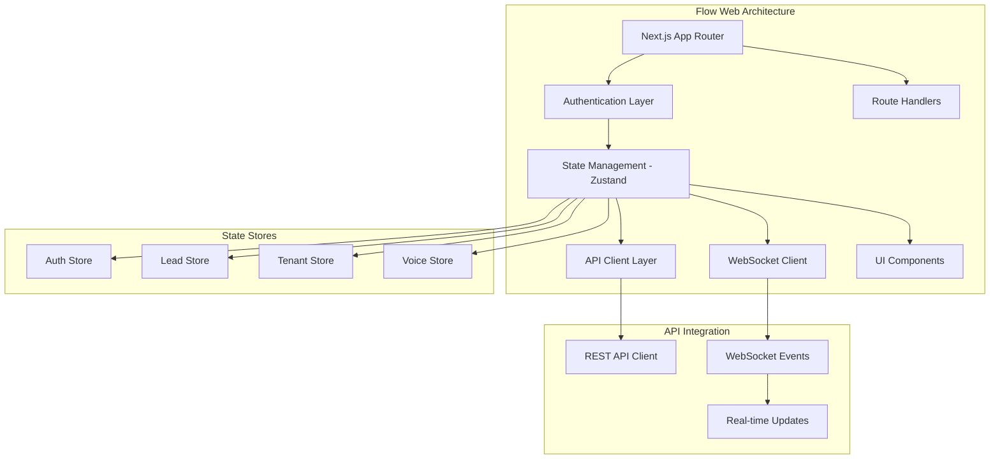

### Voice Agent - AI-Powered Voice Interface

The Voice Agent provides natural language voice interaction capabilities, enabling users to perform complex operations through Danish and English voice commands.

#### Core Capabilities
- Real-time voice processing via Gemini Live API
- Natural language understanding and command extraction
- Multi-language support (Danish/English)
- Tenant-aware voice operations
- WebSocket-based command execution
- Audio quality optimization

#### Voice Processing Pipeline

```mermaid
graph LR
    subgraph "Voice Input Processing"
        A[Microphone Input] --> B[Audio Preprocessing]
        B --> C[Gemini Live API]
        C --> D[Speech-to-Text]
        D --> E[Intent Recognition]
    end
    
    subgraph "Command Processing"
        F[Command Validation] --> G[Tenant Context]
        G --> H[Business Logic]
        H --> I[Database Operations]
        I --> J[Response Generation]
    end
    
    subgraph "Voice Output"
        K[Text-to-Speech] --> L[Audio Postprocessing]
        L --> M[Speaker Output]
    end
    
    E --> F
    J --> K
    
    style A fill:#e1f5fe
    style F fill:#f3e5f5
    style K fill:#e8f5e8
```

## Data Architecture

### Multi-tenant Data Model

The platform implements a comprehensive multi-tenant data architecture that ensures complete data isolation while maintaining performance and scalability.

#### Tenant Isolation Strategy

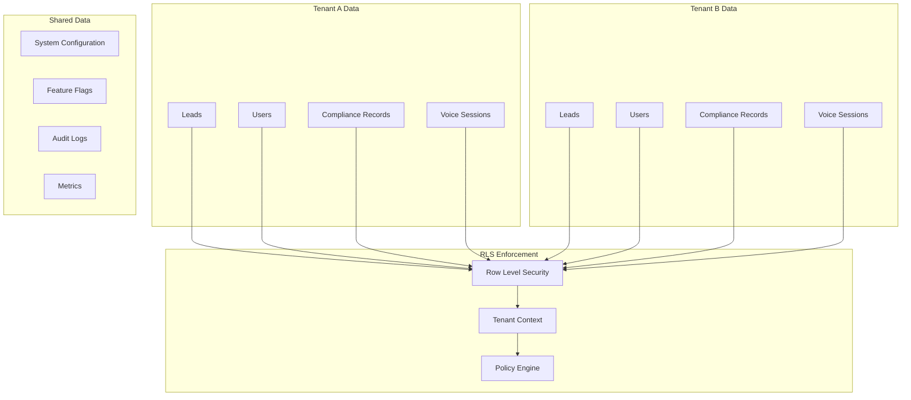

#### Database Schema Design

```sql
-- Core tenant table
CREATE TABLE tenants (
    id UUID PRIMARY KEY DEFAULT gen_random_uuid(),
    name VARCHAR(255) NOT NULL,
    api_key VARCHAR(255) UNIQUE NOT NULL,
    created_at TIMESTAMP DEFAULT NOW(),
    updated_at TIMESTAMP DEFAULT NOW(),
    enabled_features JSONB DEFAULT '{}',
    resource_limits JSONB DEFAULT '{}'
);

-- Example tenant-scoped table with RLS
CREATE TABLE leads (
    id UUID PRIMARY KEY DEFAULT gen_random_uuid(),
    tenant_id UUID NOT NULL REFERENCES tenants(id),
    name VARCHAR(255) NOT NULL,
    email VARCHAR(255),
    status VARCHAR(50) DEFAULT 'NEW',
    created_at TIMESTAMP DEFAULT NOW(),
    updated_at TIMESTAMP DEFAULT NOW()
);

-- Enable RLS
ALTER TABLE leads ENABLE ROW LEVEL SECURITY;

-- Create RLS policy
CREATE POLICY tenant_isolation ON leads
    FOR ALL TO authenticated
    USING (tenant_id = current_setting('app.current_tenant')::uuid);
```

### Caching Strategy

The platform implements a multi-layered caching strategy to optimize performance and reduce database load.

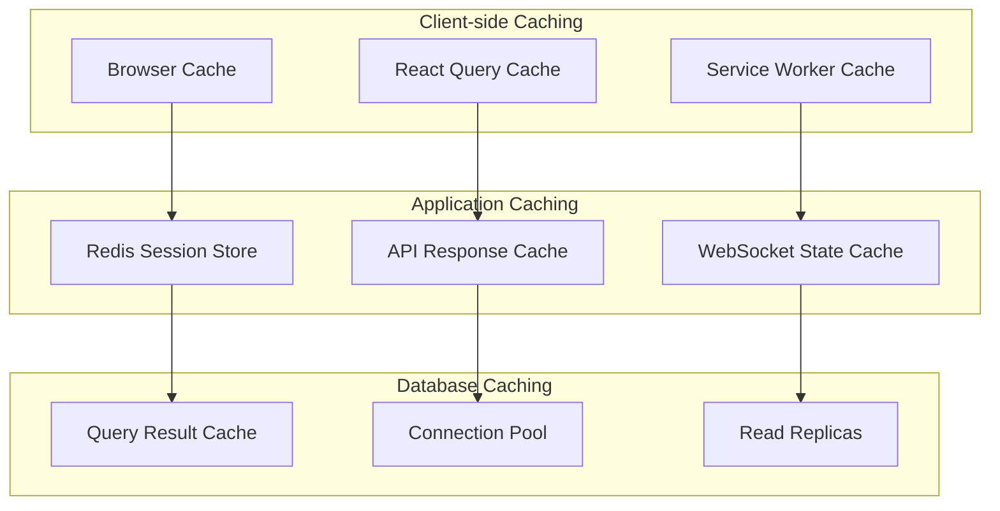

## Security Architecture

### Defense in Depth Strategy

TekUp implements a comprehensive security architecture based on defense in depth principles, with security measures at every layer of the stack.

#### Security Layers

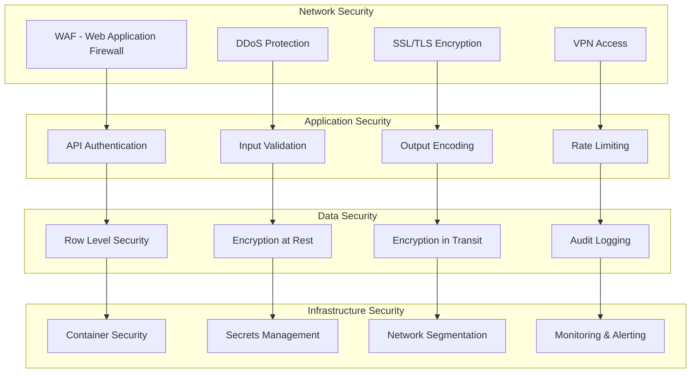

#### Authentication and Authorization

```typescript
// Multi-layered authentication system
@Injectable()
export class AuthenticationService {
  async validateApiKey(apiKey: string): Promise<TenantContext> {
    // 1. Validate API key format
    if (!this.isValidApiKeyFormat(apiKey)) {
      throw new UnauthorizedException('Invalid API key format');
    }
    
    // 2. Check rate limiting
    await this.rateLimitService.checkLimit(apiKey);
    
    // 3. Resolve tenant context
    const tenant = await this.tenantService.findByApiKey(apiKey);
    if (!tenant || !tenant.isActive) {
      throw new UnauthorizedException('Invalid or inactive tenant');
    }
    
    // 4. Set RLS context
    await this.databaseService.setRLSContext(tenant.id);
    
    // 5. Log authentication event
    await this.auditService.logAuthentication(tenant.id, 'api_key');
    
    return tenant;
  }
}
```

### Compliance Framework

The platform is designed to meet various compliance requirements including GDPR, ISO 27001, and SOC 2.

#### GDPR Compliance Implementation

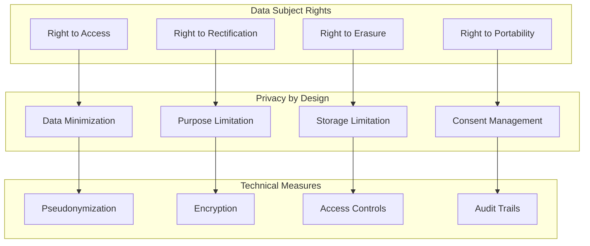

## Performance and Scalability

### Horizontal Scaling Architecture

The platform is designed for horizontal scaling across all components, enabling it to handle growing user bases and data volumes.

#### Scaling Strategy

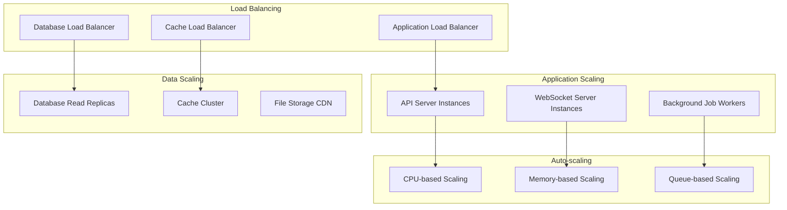

### Performance Optimization Techniques

#### Database Optimization
- **Indexing Strategy**: Comprehensive indexing on tenant_id and frequently queried columns
- **Query Optimization**: Optimized queries with proper JOIN strategies and LIMIT clauses
- **Connection Pooling**: Efficient connection management with pgBouncer
- **Read Replicas**: Separate read and write operations for better performance

#### Application Optimization
- **Caching**: Multi-layer caching strategy with Redis and application-level caching
- **Lazy Loading**: On-demand loading of resources and components
- **Code Splitting**: Dynamic imports and route-based code splitting
- **Asset Optimization**: Compressed assets, CDN delivery, and image optimization

#### Network Optimization
- **CDN Integration**: Global content delivery for static assets
- **Compression**: Gzip/Brotli compression for all text-based responses
- **HTTP/2**: Modern protocol support for multiplexed connections
- **WebSocket Optimization**: Efficient real-time communication protocols

## Monitoring and Observability

### Comprehensive Monitoring Stack

The platform implements comprehensive monitoring and observability to ensure system health, performance, and security.

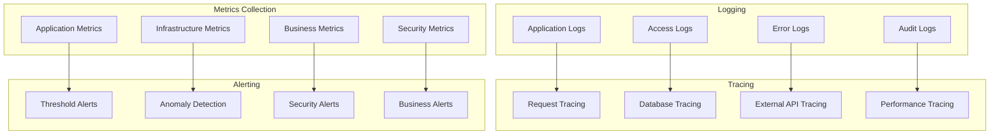

### Key Performance Indicators (KPIs)

#### Technical KPIs
- **Response Time**: API response times < 200ms for 95th percentile
- **Availability**: 99.9% uptime SLA
- **Error Rate**: < 0.1% error rate across all endpoints
- **Throughput**: Support for 10,000+ concurrent users

#### Business KPIs
- **Lead Conversion**: Track lead progression through sales funnel
- **Voice Command Success**: Voice command recognition and execution rates
- **User Engagement**: Daily/monthly active users and session duration
- **Tenant Growth**: New tenant acquisition and retention rates

## Deployment Architecture

### Container Orchestration

The platform uses Kubernetes for container orchestration, providing scalability, reliability, and efficient resource management.

```yaml
# Example Kubernetes deployment configuration
apiVersion: apps/v1
kind: Deployment
metadata:
  name: flow-api
  namespace: tekup-production
spec:
  replicas: 3
  selector:
    matchLabels:
      app: flow-api
  template:
    metadata:
      labels:
        app: flow-api
    spec:
      containers:
      - name: flow-api
        image: tekup/flow-api:latest
        ports:
        - containerPort: 4000
        env:
        - name: DATABASE_URL
          valueFrom:
            secretKeyRef:
              name: database-secret
              key: url
        - name: REDIS_URL
          valueFrom:
            secretKeyRef:
              name: redis-secret
              key: url
        resources:
          requests:
            memory: "256Mi"
            cpu: "250m"
          limits:
            memory: "512Mi"
            cpu: "500m"
        livenessProbe:
          httpGet:
            path: /health
            port: 4000
          initialDelaySeconds: 30
          periodSeconds: 10
        readinessProbe:
          httpGet:
            path: /ready
            port: 4000
          initialDelaySeconds: 5
          periodSeconds: 5
```

### Environment Management

The platform supports multiple environments with proper configuration management and deployment pipelines.

#### Environment Strategy
- **Development**: Local development with Docker Compose
- **Staging**: Kubernetes cluster with production-like configuration
- **Production**: High-availability Kubernetes cluster with auto-scaling

#### Configuration Management
```typescript
// Environment-specific configuration
export const config = {
  development: {
    database: {
      url: process.env.DATABASE_URL || 'postgresql://localhost:5432/tekup_dev',
      ssl: false,
      logging: true
    },
    redis: {
      url: process.env.REDIS_URL || 'redis://localhost:6379',
      retryAttempts: 3
    },
    external: {
      openai: {
        apiKey: process.env.OPENAI_API_KEY,
        baseUrl: 'https://api.openai.com/v1'
      }
    }
  },
  production: {
    database: {
      url: process.env.DATABASE_URL,
      ssl: true,
      logging: false,
      pool: {
        min: 5,
        max: 20
      }
    },
    redis: {
      url: process.env.REDIS_URL,
      retryAttempts: 5,
      cluster: true
    },
    external: {
      openai: {
        apiKey: process.env.OPENAI_API_KEY,
        baseUrl: 'https://api.openai.com/v1',
        timeout: 30000
      }
    }
  }
};
```

## Technology Decision Records (ADRs)

### ADR-001: Multi-tenant Architecture with RLS

**Status**: Accepted  
**Date**: 2024-01-15  
**Decision**: Implement multi-tenancy using PostgreSQL Row Level Security (RLS)

**Context**: Need to ensure complete data isolation between tenants while maintaining performance and simplifying application logic.

**Decision**: Use PostgreSQL RLS policies to enforce tenant isolation at the database level, combined with tenant context middleware in the application layer.

**Consequences**:
- **Positive**: Guaranteed data isolation, simplified application logic, better security
- **Negative**: PostgreSQL-specific implementation, potential performance overhead
- **Mitigation**: Comprehensive indexing strategy, connection pooling, read replicas

### ADR-002: NestJS for Backend Framework

**Status**: Accepted  
**Date**: 2024-01-20  
**Decision**: Use NestJS as the primary backend framework

**Context**: Need a robust, scalable backend framework with TypeScript support, dependency injection, and comprehensive ecosystem.

**Decision**: Adopt NestJS for all backend services due to its enterprise-grade features, TypeScript-first approach, and extensive ecosystem.

**Consequences**:
- **Positive**: Strong typing, dependency injection, modular architecture, extensive ecosystem
- **Negative**: Learning curve, opinionated structure
- **Mitigation**: Comprehensive documentation, training, and best practices

### ADR-003: Next.js for Frontend Applications

**Status**: Accepted  
**Date**: 2024-01-25  
**Decision**: Use Next.js with App Router for all frontend applications

**Context**: Need a modern React framework with server-side rendering, routing, and performance optimization capabilities.

**Decision**: Adopt Next.js 15 with App Router for all frontend applications to leverage modern React features and performance optimizations.

**Consequences**:
- **Positive**: Server-side rendering, automatic code splitting, excellent developer experience
- **Negative**: Framework lock-in, complexity for simple applications
- **Mitigation**: Shared component library, consistent patterns across applications

### ADR-004: Monorepo with pnpm Workspaces

**Status**: Accepted  
**Date**: 2024-02-01  
**Decision**: Use monorepo architecture with pnpm workspaces

**Context**: Need to manage multiple related applications and shared packages efficiently while maintaining consistency and reducing duplication.

**Decision**: Implement monorepo structure using pnpm workspaces with Nx for build orchestration.

**Consequences**:
- **Positive**: Code sharing, consistent dependencies, unified tooling
- **Negative**: Complexity, potential for tight coupling
- **Mitigation**: Clear boundaries between packages, proper dependency management

### ADR-005: WebSocket for Real-time Communication

**Status**: Accepted  
**Date**: 2024-02-10  
**Decision**: Use Socket.IO for WebSocket-based real-time communication

**Context**: Need real-time updates for dashboard, voice commands, and multi-user collaboration features.

**Decision**: Implement WebSocket communication using Socket.IO for reliable real-time features with fallback support.

**Consequences**:
- **Positive**: Real-time updates, reliable connection management, broad browser support
- **Negative**: Additional complexity, connection management overhead
- **Mitigation**: Connection pooling, proper error handling, graceful degradation

## Future Architecture Considerations

### Microservices Evolution

As the platform grows, consider evolving from the current modular monolith to a microservices architecture:

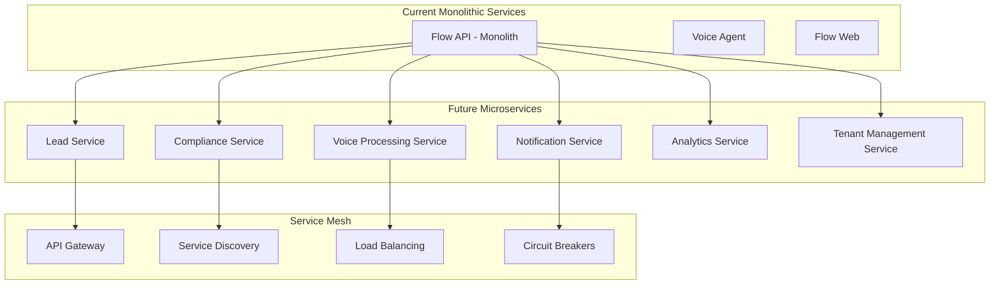

### Event-Driven Architecture

Implement comprehensive event-driven architecture for better decoupling and scalability:

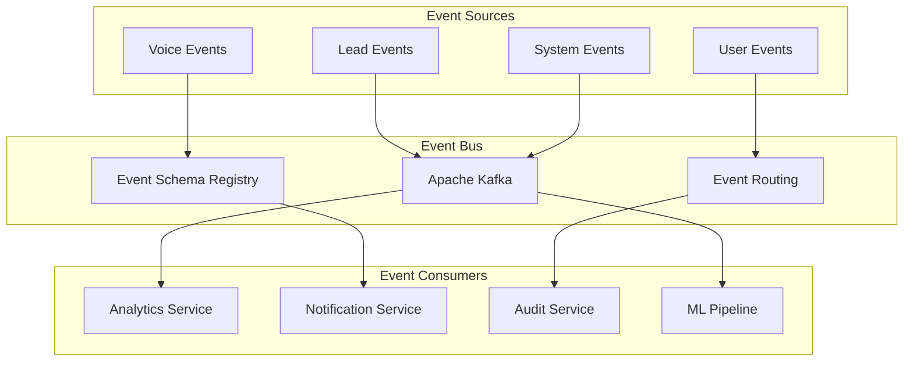

### AI/ML Platform Integration

Expand AI capabilities with dedicated ML platform:

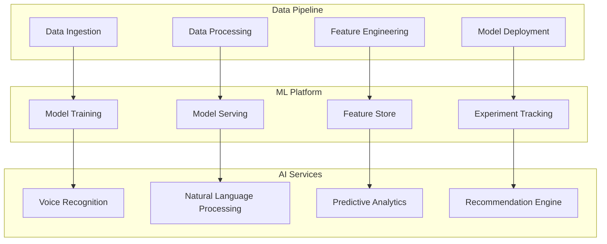

## Conclusion

The TekUp system architecture represents a comprehensive, scalable, and secure platform designed to serve Danish SMEs with AI-powered services. The architecture emphasizes multi-tenancy, security, performance, and maintainability while providing a foundation for future growth and evolution.

Key architectural strengths include:

1. **Robust Multi-tenancy**: Complete data isolation with RLS and tenant-aware services
2. **Comprehensive Security**: Defense in depth with security at every layer
3. **Scalable Design**: Horizontal scaling capabilities across all components
4. **Modern Technology Stack**: Leveraging best-in-class technologies and patterns
5. **Observability**: Comprehensive monitoring and alerting capabilities
6. **Future-Ready**: Architecture designed for evolution and growth

The platform is well-positioned to support TekUp's business objectives while maintaining the flexibility to adapt to changing requirements and scale with business growth.

---

**Document Version**: 1.0  
**Last Updated**: January 2025  
**Next Review**: July 2025  
**Maintained By**: TekUp Architecture Team