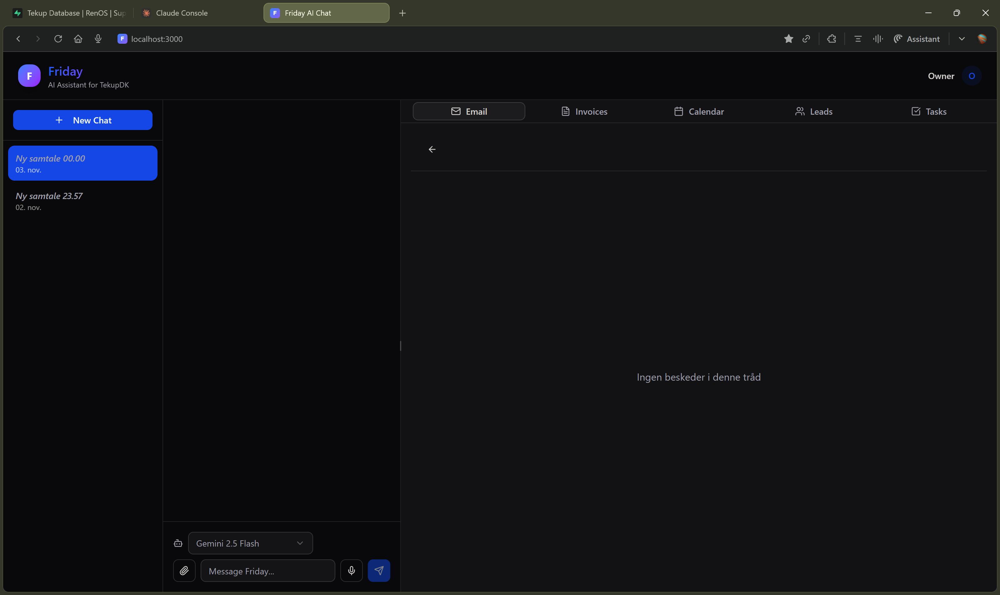

# Tasks Workspace

This folder groups scoped workstreams into small, trackable plans that don’t interfere with ongoing feature work (e.g., Codex Chat).

- Purpose: keep focus, reduce Problems noise, and make ownership/next steps explicit.
- Scope: docs only; no code changes are required to write/update plans.

## Areas

- Chat: `tasks/chat/PLAN.md`
- Docs lint (markdown): `tasks/docs-lint/PLAN.md`
- Database & migrations: `tasks/db/PLAN.md`
- Testing (Vitest/Playwright): `tasks/testing/PLAN.md`
- Environment & config: `tasks/env/PLAN.md`
- Logging & observability: `tasks/logging/PLAN.md`
- CI/CD & policy gates: `tasks/ci-cd/PLAN.md`
- Security (auth/cookies/ratelimits): `tasks/security/PLAN.md`
- Email pipeline & migrations: `tasks/email-pipeline/PLAN.md`
- Ops (backup/rollback/runbooks): `tasks/ops/PLAN.md`

## Conventions

- Keep plans short (1–2 pages max).
- Use checkboxes for acceptance criteria and status.
- Link to existing docs/code rather than duplicating.
- Prefer “safe-by-default” rollouts (feature flags, canaries).

## Status legend

- [ ] Not started
- [~] In progress
- [x] Done

