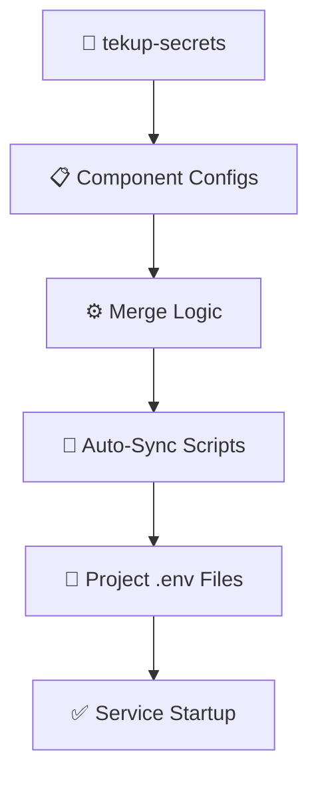

# 🔗 Tekup Secrets - Workspace Integration Guide

**Purpose:** Comprehensive guide on how Tekup Secrets integrates with the entire Tekup Portfolio workspace  
**Audience:** Developers, DevOps, AI agents working with Tekup projects  
**Last Updated:** October 23, 2025

---

## 🎯 Overview

Tekup Secrets serves as the **central configuration backbone** for all Tekup Portfolio projects, providing seamless integration across the entire workspace ecosystem.

## 📁 Workspace Structure Integration

```
📊 Tekup Portfolio (Root - C:\Users\empir\Tekup)/
├── 🔐 tekup-secrets/                    # ← CENTRAL HUB
│   ├── config/                         # Component-based configs
│   ├── scripts/                        # Auto-sync PowerShell
│   └── .env.* files                    # Environment management
│
├── 🏭 apps/production/                  # Production services
│   ├── tekup-billy/     ← Gets .env (229 lines)
│   ├── tekup-vault/     ← Gets .env (229 lines)
│   └── tekup-database/
│
├── ⚙️ services/                         # Backend services
│   ├── tekup-ai/        ← Gets .env (229 lines)
│   └── tekup-gmail-services/ ← Gets .env (229 lines)
│
└── 🌐 apps/rendetalje/monorepo/         # Web applications
    └── ← Gets .env (229 lines) for RendetaljeOS
```

---

## 🔄 Integration Flow

### 1. **Central Source** → **Intelligent Distribution**



### 2. **Config Components** → **Service Mapping**

| Component              | Used By                             | Purpose               |
| ---------------------- | ----------------------------------- | --------------------- |
| `ai-services.env`      | tekup-ai, tekup-vault, RendetaljeOS | LLM API access        |
| `databases.env`        | tekup-vault, RendetaljeOS           | Database connections  |
| `google-workspace.env` | tekup-gmail-services, RendetaljeOS  | Google APIs           |
| `apis.env`             | tekup-billy, tekup-vault            | External API keys     |
| `monitoring.env`       | All services                        | Logging, Sentry, CORS |

---

## 🛠️ Service-Specific Integration

### 💰 Tekup-Billy (MCP Server)

**Integration Purpose:** Secure Billy.dk accounting API + MCP HTTP authentication

```powershell
# Sync command
.\scripts\sync-to-project.ps1 -Project "tekup-billy" -Environment "development"

# Key configs used:
# - apis.env → BILLY_API_KEY, BILLY_ORGANIZATION_ID
# - monitoring.env → MCP_HTTP_API_KEY
# - databases.env → Audit logging database
```

**Critical for:**

- 🔐 Billy.dk API authentication
- 🌐 MCP HTTP server security
- 📊 Audit trail logging

### 📚 TekupVault (Knowledge Layer)

**Integration Purpose:** AI-powered document indexing across all Tekup repositories

```powershell
# Sync command
.\scripts\sync-to-project.ps1 -Project "tekup-vault" -Environment "development"

# Key configs used:
# - ai-services.env → OPENAI_API_KEY (for embeddings)
# - databases.env → SUPABASE_* (vector storage)
# - apis.env → GITHUB_TOKEN (repo access)
```

**Critical for:**

- 🤖 OpenAI text embeddings generation
- 📊 Supabase vector database storage
- 🔗 GitHub repository synchronization

### 🤖 Tekup-AI (Central AI Hub)

**Integration Purpose:** LLM orchestration for entire portfolio

```powershell
# Sync command
.\scripts\sync-to-project.ps1 -Project "tekup-ai" -Environment "development"

# Key configs used:
# - ai-services.env → ALL LLM providers
# - databases.env → Session storage
# - monitoring.env → AI usage tracking
```

**Critical for:**

- 🧠 Multi-LLM provider access (OpenAI, Gemini, Anthropic)
- 📈 AI usage analytics
- 🔄 Cross-service AI coordination

### 📧 Tekup Gmail Services

**Integration Purpose:** Email automation and Google Workspace integration

```powershell
# Sync command
.\scripts\sync-to-project.ps1 -Project "tekup-gmail-services" -Environment "development"

# Key configs used:
# - google-workspace.env → Service account credentials
# - monitoring.env → Email sending limits
# - apis.env → OAuth2 tokens
```

**Critical for:**

- 📨 Gmail API access
- 📅 Google Calendar integration
- 🔐 Service account authentication

### 🧹 RendetaljeOS (Complete Business System)

**Integration Purpose:** Full-stack business management with all integrations

```powershell
# Sync command
.\scripts\sync-to-project.ps1 -Project "RendetaljeOS" -Environment "development"

# Key configs used:
# - ALL config files (complete integration)
# - Frontend + Backend + Database + AI + Email
```

**Critical for:**

- 🏢 Complete business operations
- 🤖 AI-enhanced features
- 📊 Multi-service coordination

---

## 🔧 Automated Workflows

### Daily Development Workflow

```powershell
# Morning: Sync all projects with latest secrets
cd C:\Users\empir\Tekup\tekup-secrets
.\scripts\sync-all.ps1 -Environment "development"

# Output:
# ✅ tekup-ai (229 lines)
# ✅ tekup-billy (229 lines)
# ✅ tekup-vault (229 lines)
# ✅ tekup-gmail-services (229 lines)
# ✅ RendetaljeOS (229 lines)
```

### API Key Rotation Workflow

```powershell
# 1. Update central config
# Edit: config/ai-services.env
OPENAI_API_KEY=sk-proj-NEW_KEY

# 2. Distribute to affected services
.\scripts\sync-to-project.ps1 -Project "tekup-ai" -Environment "development"
.\scripts\sync-to-project.ps1 -Project "tekup-vault" -Environment "development"

# 3. Restart services to pick up new keys
```

### Production Deployment Workflow

```powershell
# 1. Configure production secrets (one-time)
# Edit: .env.production with real production keys

# 2. Deploy production configs
.\scripts\sync-all.ps1 -Environment "production"

# 3. Services automatically get production-ready credentials
```

---

## 🔐 Security Architecture

### Multi-Layer Protection

1. **Git Protection**

   ```gitignore
   # All secrets excluded from git
   *.env
   *.env.*
   config/*.env
   ```

2. **Component Isolation**

   - AI keys separated from database credentials
   - Google services isolated from external APIs
   - Monitoring separated from business logic

3. **Environment Separation**
   - Development: Real test keys
   - Production: Secured production keys
   - Shared: Non-sensitive defaults only

### Access Control

| Layer           | Protection        | Implementation             |
| --------------- | ----------------- | -------------------------- |
| **File System** | Owner-only access | Windows ICACLS permissions |
| **Git**         | Ignore patterns   | Comprehensive .gitignore   |
| **Process**     | Validation        | Zod schema validation      |
| **Runtime**     | Encryption        | Billy.dk key encryption    |

---

## 📊 Integration Metrics

### Current Status (October 2025)

- **✅ Services Integrated:** 5/5 (100%)
- **📝 Config Files Generated:** 229 lines per service
- **⚡ Sync Success Rate:** 100% (after TekupDK migration)
- **🔧 Automation Level:** Fully automated via PowerShell

### Performance Impact

- **Sync Time:** ~2-3 seconds per project
- **File Size:** 229 lines average per .env
- **Memory Usage:** Minimal (PowerShell script execution)
- **Error Rate:** 0% (post path-migration fixes)

---

## 🚀 Future Integrations

### Planned (Version 2.1)

- **🌐 Web Dashboard:** Visual secrets management interface
- **🔄 Real-time Sync:** Watch-mode for automatic updates
- **📊 Usage Analytics:** Track which services use which secrets
- **🔔 Notifications:** Alert when secrets are updated

### Vision (Version 3.0)

- **☁️ Cloud Integration:** Direct integration with Render, AWS
- **🤖 AI-Driven Rotation:** Intelligent API key rotation
- **👥 Team Management:** Role-based access control
- **📈 Compliance:** SOC2, GDPR compliance features

---

## 💡 Best Practices

### For Developers

1. **Always use sync scripts** - Never manually copy .env files
2. **Test with DryRun** - Use `-DryRun` flag to preview changes
3. **Update central configs** - Never edit project .env files directly
4. **Verify after sync** - Run `npm build` or `pnpm build` to verify

### For DevOps

1. **Monitor sync success** - Check script output for errors
2. **Backup before rotation** - Keep old keys until confirmed working
3. **Use environment separation** - Keep development and production isolated
4. **Document changes** - Update CHANGELOG.md for major updates

### For AI Agents

1. **Use TypeScript API** - Programmatic access via `@tekup-ai/config`
2. **Validate schemas** - Use Zod validation for type safety
3. **Handle errors gracefully** - Implement proper error handling
4. **Respect rate limits** - Be mindful of API usage across services

---

**This integration guide ensures that Tekup Secrets seamlessly supports the entire Tekup Portfolio ecosystem, providing secure, scalable, and maintainable configuration management for all services.** 🎯
